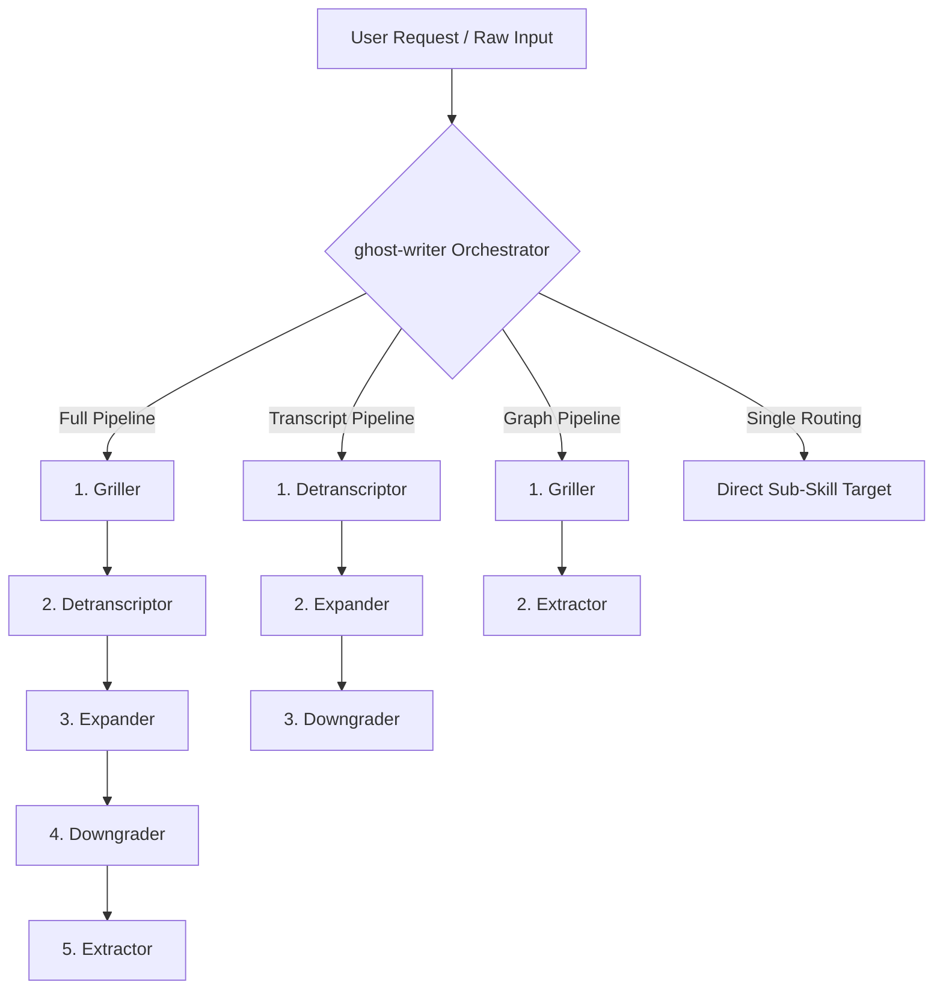

# Ghost Writer Master Orchestrator

## Overview

The `ghost-writer` master skill orchestrates and coordinates the specialized sub-skills in the Ghost Writer ecosystem. It manages the complete lifecycle of text processing—from initial idea grilling and raw transcript detranscription to factual expansion, structural downgrading/de-bloating, and semantic knowledge graph extraction.

---

## Ecosystem Sub-Skills Registry

| Skill Name | Core Responsibility | Input Format | Primary Output |
| :--- | :--- | :--- | :--- |
| [`ghost-writer-griller`](file:///home/stangler/gamer_d/Fausto%20Stangler/Documentos/Python/PES/.agents/skills/ghost-writer-griller/SKILL.md) | Socratic interactive interview to extract deep intent, stress-test assumptions, and fill conceptual gaps. | Raw idea / User prompt | Clarified concept + Semantic Graph |
| [`ghost-writer-detranscriptor`](file:///home/stangler/gamer_d/Fausto%20Stangler/Documentos/Python/PES/.agents/skills/ghost-writer-detranscriptor/SKILL.md) | Purges speech noise, oralities, hesitations, and 1st-person dialogue from raw transcripts; fact-checks names/dates. | Raw audio transcript / notes | Structured Markdown (`<config_file>`) |
| [`ghost-writer-expander`](file:///home/stangler/gamer_d/Fausto%20Stangler/Documentos/Python/PES/.agents/skills/ghost-writer-expander/SKILL.md) | Two-pass Socratic and historical audit to enrich text with real-world statistics, historical context, and persuasive journalistic tone. | Draft text / Article | Factually expanded Markdown (`<config_file>`) |
| [`ghost-writer-downgrader`](file:///home/stangler/gamer_d/Fausto%20Stangler/Documentos/Python/PES/.agents/skills/ghost-writer-downgrader/SKILL.md) | De-bloats text, removes substrate-independent micro-details, and delegates secondary/biographical details to numbered footnotes. | Dense / Overwritten text | Streamlined Markdown + Footnotes (`<config_file>`) |
| [`ghost-writer-extractor`](file:///home/stangler/gamer_d/Fausto%20Stangler/Documentos/Python/PES/.agents/skills/ghost-writer-extractor/SKILL.md) | Extracts semantic knowledge graph constructs (NER, Concepts, Timelines, Triples, Processes, Causal Logic) into natural language sentences. | Cleaned article / Text | Standardized Semantic Graph |
| [`ghost-writer-style`](file:///home/stangler/gamer_d/Fausto%20Stangler/Documentos/Python/PES/.agents/skills/ghost-writer-style/SKILL.md) | **Cross-cutting dependency.** Centralized authorial style guide defining the baroque-naturalist prose identity. Not a pipeline stage. | N/A (reference) | Style directives for all prose-producing stages |

---

## Orchestration Pipelines & Execution Modes

`ghost-writer` evaluates the user's intent and executes one of the following orchestration modes:



### 1. Full Pre-configured Pipeline (5-Stage Master Flow)
**Sequence**: `ghost-writer-griller` $\rightarrow$ `ghost-writer-detranscriptor` $\rightarrow$ `ghost-writer-expander` $\rightarrow$ `ghost-writer-downgrader` $\rightarrow$ `ghost-writer-extractor`

- **Use Case**: Transforming an unrefined concept or raw lecture recording into a fully researched, factual, polished journalistic article with explanatory footnotes and a final semantic knowledge graph.
- **Stage Details**:
  1. **Griller**: Interactively interviews the user to establish core intent, key entities, and background assumptions.
  2. **Detranscriptor**: Standardizes speech text, removes oralities, enforces imperso-journalistic tone, and corrects phonetic distortions.
  3. **Expander**: Runs internal 3-pass Socratic & Historical audit, adding confirmed web-verified statistics, dates, and precursor context.
  4. **Downgrader**: Cleans up text obesity, maintaining narrative spine while delegating secondary digressions into numbered footnotes.
  5. **Extractor**: Converts the final article into a 6-dimension semantic knowledge graph (NER, Concepts, Timelines, Triples, Processes, Argumentative Logic).

---

### 2. Transcript-to-Article Pipeline
**Sequence**: `ghost-writer-detranscriptor` $\rightarrow$ `ghost-writer-expander` $\rightarrow$ `ghost-writer-downgrader`

- **Use Case**: When the user already provides a raw speech transcript or audio text file and wants a finished, expanded article without the interactive grilling phase.

---

### 3. Concept-to-Graph Pipeline
**Sequence**: `ghost-writer-griller` $\rightarrow$ `ghost-writer-extractor`

- **Use Case**: When the goal is to extract domain knowledge and map semantic graphs directly from user intent without publishing a full journalistic article.

---

### 4. Direct Sub-Skill Routing
- **Use Case**: When the user explicitly requests a single isolated task (e.g., "just de-bloat this text" $\rightarrow$ `ghost-writer-downgrader`; "extract knowledge graph from this file" $\rightarrow$ `ghost-writer-extractor`).

---

## Inter-Skill Data Contracts & Anti-Corruption Layer (ACL)

When chaining sub-skills in multi-stage pipelines, `ghost-writer` enforces the following data transfer rules:

1. **Tag Unwrapping (ACL)**:
   - Sub-skills `detranscriptor`, `expander`, and `downgrader` output their results wrapped inside `<config_file> ... </config_file>` XML tags.
   - When passing output from Stage $N$ to Stage $N+1$, `ghost-writer` MUST extract the clean inner text from between `<config_file>` and `</config_file>`, discarding wrapper tags and any whitespace outside the payload.
2. **Footnote Preservation**:
   - `expander` and `downgrader` populate numbered footnotes at the end of the text payload. `ghost-writer` ensures that footnote indices and text anchors remain intact across pipeline transitions.
3. **No Conversational Pollution**:
   - `ghost-writer` suppresses conversational intro/outro text between intermediate pipeline stages, delivering a single clean response or artifact output upon pipeline completion.
4. **Authorial Style Consistency**:
   - All prose-producing stages (`detranscriptor`, `expander`, `downgrader`, `griller`) MUST apply the `ghost-writer-style` reference guide. The style guide defines the author's baroque-naturalist prose identity and overrides any generic journalistic or academic tone directives.
   - The `extractor` (which outputs structured semantic data) references the style guide only for coined-concept recognition.
   - Latin coinages in each new text must be **original creations** — existing terms across the ecosystem are illustrative examples of the pattern only.

---

## File Storage & Workspace Structure

All generated outputs, intermediate pipeline stage files, final polished articles, and extracted semantic knowledge graphs MUST be persisted locally under individualized folders for each text/article:

```
playground/ghost-writer/<article_slug>/
├── 01_griller_brief.md         # (Optional) Initial Socratic interview output / brief
├── 02_detranscribed.md         # Cleaned detranscription output
├── 03_expanded.md              # Factually expanded text with web-verified data
├── 04_final_article.md         # De-bloated final article with footnotes
└── 05_semantic_graph.md        # Consolidated knowledge graph extraction
```

### Storage Protocol Rules:
1. **Target Directory Base**: Always root article outputs inside `playground/ghost-writer/`.
2. **Individualized Article Folder (`<article_slug>`)**: Create a dedicated subfolder using a clean kebab-case name derived from the topic/title (e.g., `playground/ghost-writer/bandido-estacionario/` or `playground/ghost-writer/singularitas/`).
3. **Stage Persistence**: Save intermediate and final outputs into their respective files within the article directory at each stage of execution so progress is tracked and auditably stored.

---

## Operational Execution Protocol

1. **Analyze Request**: Determine whether the user needs a full 5-stage pipeline, a specialized sub-pipeline, or a single sub-skill execution.
2. **Load Authorial Style Guide**: Read `ghost-writer-style/references/style-guide.md` and pass its directives as context to all prose-producing pipeline stages.
3. **Initialize Workspace**: Create `playground/ghost-writer/<article_slug>/` for the target topic.
4. **Execute Stage 1**: Invoke the target initial skill with the user's input and style guide context.
5. **Apply ACL Transformation**: Strip XML wrappers and validate text payloads between steps.
6. **Propagate & Persist Payload**: Sequentially execute remaining pipeline stages, writing each stage's output file into `playground/ghost-writer/<article_slug>/`.
7. **Final Output Delivery**: Present the final output (article, expanded text, footnotes, and/or semantic knowledge graph) in clean Markdown and confirm the file paths saved in `playground/ghost-writer/<article_slug>/`.

