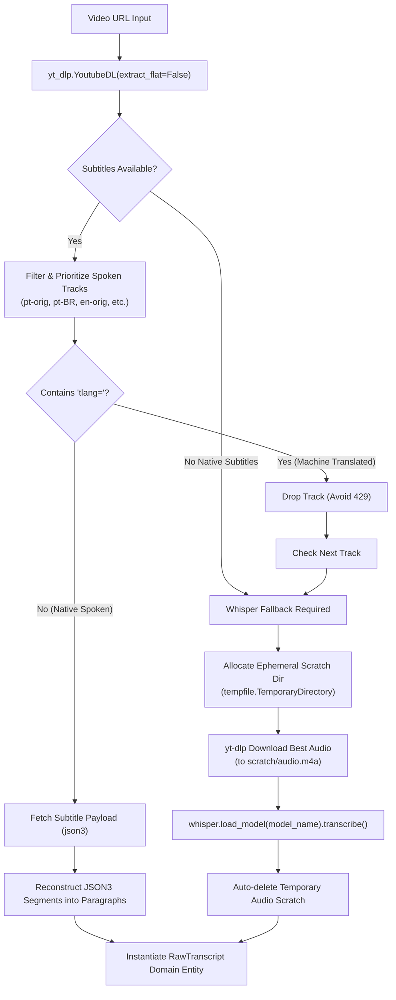

# ADR-004: Native Media Ingestion & Legacy ISB.AI Decommissioning

**Status:** APPROVED  
**Date:** 2026-09-11  
**Decision Makers:** Lead Architect (Fausto Stangler), Systems Architect (Doctor Stangler Committee)  
**Governing Method:** Doctor Stangler Architecture Method (Clean/Hexagonal DDD Modular Monolith)  
**Glossary Reference:** [`docs/GLOSSARY.md`](../GLOSSARY.md)  
**Predecessor Documents:** [`ADR-001`](ADR-001-cresmo-modular-monolith-strangling.md), [`ADR-003`](ADR-003-pes-production-architecture.md), [`DISCO-001`](../legacy_discovery/DISCO-001-cresmo-ecosystem-archaeology.md)

---

## 1. Context & Problem Statement

During the initial strangulation of the legacy procedural pipeline ([`ADR-001`](ADR-001-cresmo-modular-monolith-strangling.md)), an Anti-Corruption Layer ([`LegacyIsbIngestionAdapter`](file:///home/stangler/gamer_d/Fausto%20Stangler/Documentos/Python/PES/src/cresmo/infrastructure/adapters/legacy_isb_ingestion_adapter.py)) was erected to encapsulate the ancestral codebase in `playground/isb.ai/`. This allowed rapid progress on the clean domain core and 6-stage synthesis pipeline without being blocked by media ingestion rewrites.

However, `playground/isb.ai/` remains a significant technical debt anchor and stability hazard:
1. **Dynamic Runtime Pollution:** The legacy adapter relies on `sys.path.insert(0, ...)` and dynamic module imports (`import sync_channels`, `import downloader`), creating race conditions and module resolution side effects.
2. **Ungoverned File System Artifacts:** Legacy scripts write auxiliary files (`isb_brain.csv`, cookies, `.ogg`/`.m4a` intermediate audio files) directly into working or vault directories without deterministic cleanup when exceptions or cancellations occur.
3. **Fragile Subtitle Extraction:** Subtitle logic in `downloader.py` mixes CLI parsing, XML parsing, and YouTube scraping without type hints, proper resource management, or isolation.
4. **Maintenance Overhead:** Keeping `playground/isb.ai` in `pyproject.toml` extraPaths violates the self-containment invariant of the Hexagonal Modular Monolith.

To achieve production autonomy (Etapa II / Trilha 4), the modular monolith must possess a native, robust, and self-contained ingestion adapter, allowing the complete decommissioning and archival of `playground/isb.ai/`.

---

## 2. Decision

We will implement **`NativeMediaIngestionAdapter`** directly in `src/cresmo/infrastructure/adapters/native_media_ingestion_adapter.py` adhering strictly to `MediaIngestionPort`, wire it as the primary adapter in the Composition Root ([`composition.py`](file:///home/stangler/gamer_d/Fausto%20Stangler/Documentos/Python/PES/src/cresmo/presentation/composition.py)), and decommission `playground/isb.ai/` from active dependencies because:

1. **Pure Python Library Integration:** Direct use of `yt_dlp.YoutubeDL` and `whisper` via their official Python APIs eliminates `sys.path` tampering and external shell execution hazards.
2. **Deterministic RAII Temp Scratch Storage:** Local audio extraction for Whisper fallback will use context-managed temporary directories (`tempfile.TemporaryDirectory`), guaranteeing immediate deletion of intermediate media files upon completion or failure (preserving storage and preventing leakage).
3. **Rigorous Native Subtitle Prioritization (HTTP 429 Mitigation):** The adapter directly scans subtitle tracks in metadata, prioritizing native spoken audio (`pt-orig`, `pt-BR`, `en-orig`), parsing `json3`/`srv3` tracks into clean paragraph prose, and strictly rejecting machine-translated `tlang=` tracks that trigger YouTube rate-limiting.
4. **Hexagonal Port Invariance:** The application and domain layers require **zero modifications**; `MediaIngestionPort` contracts (`discover_channel_feed`, `ingest_single_video`, `ingest_channels_and_playlists`) are fulfilled natively.

---

## 3. Architecture & Technical Invariants

### 3.1 Subtitle Extraction Pipeline

### 3.2 Ephemeral Scratch & Concurrency Isolation
- Audio downloads for Whisper fallback are written strictly to isolated, randomized directories (`/tmp/cresmo_ingest_*/`).
- Using Python's context manager pattern ensures that even in cases of `KeyboardInterrupt`, out-of-memory errors, or network crashes, temporary files are wiped from disk.

### 3.3 Error Mapping & Translation
All `yt_dlp.utils.DownloadError`, `urllib.error.HTTPError`, and socket timeouts must be intercepted and translated at the adapter boundary into the canonical domain exception taxonomy:
- `yt_dlp.utils.DownloadError` containing "429" or "Too Many Requests" $\longrightarrow$ `RateLimitExceededError`.
- Network drops, connection resets, DNS failures $\longrightarrow$ `IngestionNetworkError`.
- Malformed data or corrupt audio files $\longrightarrow$ `CresmoInfrastructureError`.

---

## 4. Consequences & Trade-offs

### Positive
- **Architectural Autonomy:** `src/cresmo` becomes 100% self-contained with no runtime links to `playground/`.
- **Zero Disk Leakage:** Ephemeral temporary directory scoping prevents leftover `.ogg`, `.m4a`, or partial files from accumulating on disk.
- **Concurrence & Thread-Safety:** Eliminating `sys.path.insert` and global variables makes channel synchronization and worker execution fully re-entrant and thread-safe.
- **Type Safety & Maintainability:** The entire ingestion adapter is written under `mypy --strict` with comprehensive docstrings and explicit type hints.

### Negative / Challenges
- Unit testing requires robust mocking of `yt_dlp.YoutubeDL` and `whisper.load_model` to remain hermetic without making live network calls or loading multi-gigabyte neural network weights during test runs.

---

## 5. Alternatives Considered

| Alternative | Pros | Cons | Verdict |
|---|---|---|---|
| **A. Indefinite ACL wrapping `playground/isb.ai`** | No new ingestion code needed right now. | Retains `sys.path` tampering, global state leaks, unmanaged audio files on disk, and fragile legacy baggage. | **Rejected** |
| **B. Subprocess CLI Invocation (`yt-dlp` & `whisper` CLI)** | Simple process boundary isolation. | Slower process spawning overhead; requires parsing stdout/stderr text; difficult error classification; relies on OS PATH installation. | **Rejected** |
| **C. Native Python Ingestion with Ephemeral Scratch (Selected)** | Pure in-memory and context-managed execution; robust error translation; fully typed; eliminates legacy dependencies. | Requires mocking `yt_dlp` and `whisper` classes in unit tests. | **Accepted** |

---

## 6. Decommissioning & Archival Plan for `playground/isb.ai`

1. **Step 1:** Implement `NativeMediaIngestionAdapter` and verify 100% contract equivalence with `MediaIngestionPort`.
2. **Step 2:** Update Composition Root (`composition.py`) to wire `NativeMediaIngestionAdapter`.
3. **Step 3:** Remove `LegacyIsbIngestionAdapter` and its corresponding test suite.
4. **Step 4:** Remove `playground/isb.ai` from `pyproject.toml` `extraPaths` and pytest paths.
5. **Step 5:** Safely archive `playground/isb.ai/` or mark as read-only legacy reference.
