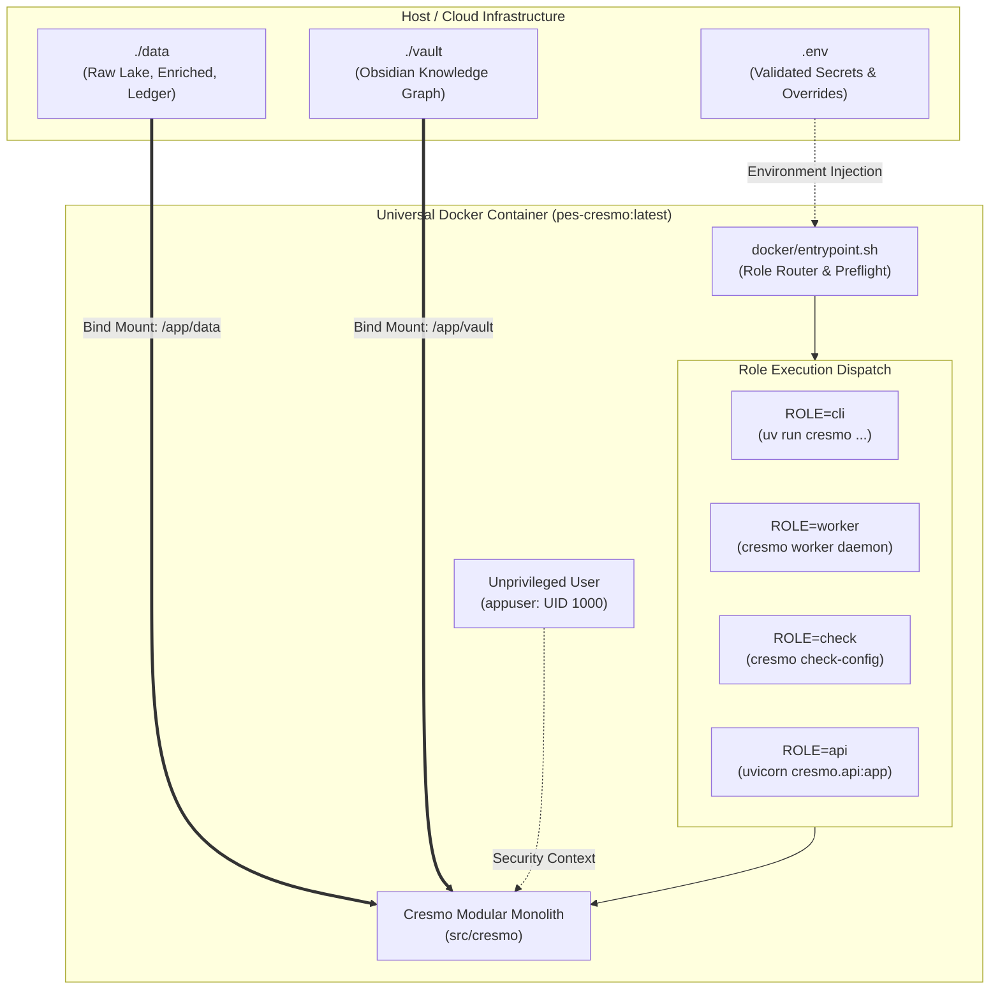

# ADR-005: Multi-Role 12-Factor Container Architecture & Deployment Model

**Status:** APPROVED  
**Date:** 2026-09-12  
**Decision Makers:** Lead Architect (Fausto Stangler), Systems Architect (Doctor Stangler Committee)  
**Governing Method:** Doctor Stangler Architecture Method (Clean/Hexagonal DDD Modular Monolith, 12-Factor App)  
**Glossary Reference:** [`docs/GLOSSARY.md`](../GLOSSARY.md)  
**Predecessor Documents:** [`ADR-001`](ADR-001-cresmo-modular-monolith-strangling.md), [`ADR-002`](ADR-002-cresmo-presentation-cli.md), [`ADR-003`](ADR-003-pes-production-architecture.md), [`ADR-004`](ADR-004-native-media-ingestion-decommissioning.md)  
**Specification:** [`docs/specs/SPEC-006-container-execution-and-cicd-pipeline.md`](../specs/SPEC-006-container-execution-and-cicd-pipeline.md)

---

## 1. Context & Problem Statement

With the successful completion of the native media ingestion engine ([`ADR-004`](ADR-004-native-media-ingestion-decommissioning.md)), staging channel validation ([`SPEC-005`](../specs/SPEC-005-operational-staging-validation.md)), and graph deduplication engine (Stage 7), Cresmo operates as an autonomous, self-contained Hexagonal Modular Monolith.

However, execution currently relies on the host machine's Python environment and local file paths. To achieve production readiness (Etapa IV / Trilha 5), the system must adhere to modern cloud-native, reproducible deployment standards:
1. **Host Environment Coupling:** Divergent system libraries (such as `ffmpeg` versions, SSL certificates, or system-level Python patches) create runtime drift between developer workstations, CI runners, and deployment environments.
2. **Multiple Operational Roles:** The platform requires different execution modes:
   - Interactive or scheduled CLI commands (`cresmo sync`, `cresmo dedupe`, `cresmo check-config`).
   - Continuous background worker processes (asynchronous media crawling and ingestion).
   - Future HTTP/REST API endpoints (presentation BFF).
   Building separate images for each role violates the Single Source of Truth (SSOT) requirement and increases maintenance overhead.
3. **Decoupled Storage Semantics:** Persistent state (Obsidian Second Brain Knowledge Graph, raw media lake, SQLite idempotency ledger) must be treated as attached backing resources (12-Factor Factor IV), strictly decoupled from the immutable application container image.
4. **Security & Least Privilege:** Running containerized workloads as `root` is unacceptable in production environments.

---

## 2. Decision

We adopt a **Multi-Role 12-Factor Container Architecture** utilizing a single multi-stage Dockerfile, Astral's `uv` package manager, and a role-based router entrypoint:

1. **Single Source of Truth (SSOT) Multi-Stage Image:**
   A single Dockerfile (`Dockerfile`) based on `python:3.13-slim-bookworm` builds the universal image (`pes-cresmo:latest`). All operational roles (`cli`, `worker`, `api`) are manifested from this exact same immutable build artifact by altering the execution role at runtime.
2. **Lightning-Fast Dependency Management with `uv`:**
   Dependencies are installed using `ghcr.io/astral-sh/uv:latest` copied into the build stage, leveraging `uv sync --frozen --no-dev` for deterministic, sub-second layer resolution and minimal container footprint.
3. **Least Privilege Security Standard (Non-Root User):**
   The application executes exclusively as an unprivileged system user (`appuser`, UID 1000, GID 1000). File permissions across workspace and cache directories are explicitly scoped.
4. **Decoupled Medallion Storage Mounts:**
   Container storage adheres to the Medallion Architecture:
   - `/app/data`: Attached volume for Bronze (raw transcripts/audio) and Silver (enriched compendiums) data lakes, plus the SQLite WAL ledger (`cresmo_ledger.db`).
   - `/app/vault`: Attached volume for Gold tier Obsidian Second Brain Knowledge Graph (`concepts/`, `entities/`, `events/`, `processes/`, `MOCs/`, `_index.json`).
5. **Dynamic Role Router Entrypoint (`docker/entrypoint.sh`):**
   An idempotent shell entrypoint script inspects `$ROLE` or passed CLI arguments, routing to the appropriate execution context (`cresmo <args>`, background worker daemon, or API server) while enforcing fail-fast preflight validation.
6. **Unified Infrastructure as Code (IaC):**
   A declarative `docker-compose.yml` models local and staging deployments, and a GitHub Actions workflow (`.github/workflows/ci.yml`) enforces the quality gate (Ruff, Mypy, Pytest) and container build verification on every commit.

---

## 3. 12-Factor App Alignment Matrix

| 12-Factor Principle | Cresmo Implementation | Architectural Guarantee |
| :--- | :--- | :--- |
| **I. Codebase** | Single git repository tracking the Modular Monolith. | Zero codebase divergence across deployment targets. |
| **II. Dependencies** | Declared in `pyproject.toml`, pinned in `uv.lock`, bundled via `uv sync`. | 100% deterministic builds without relying on implicit host packages. |
| **III. Config** | Validated via `CresmoSettings` (Pydantic Settings V2) from env vars. | Strict fail-fast configuration without hardcoded constants. |
| **IV. Backing Services** | `data/` and `vault/` attached via Docker bind mounts or persistent volumes. | Storage can be swapped or migrated without altering application code. |
| **VI. Processes** | Share-nothing processes; audio conversions use ephemeral temp scratch dirs. | Process crashes do not corrupt disk; zero local state coupling. |
| **VII. Port Binding** | Presentation BFF / API exports HTTP via Uvicorn on `$PORT`. | Self-contained web serving without external web server wrapping. |
| **VIII. Concurrency** | Workloads scale out via multiple container instances (CLI or worker). | Horizontal scalability across discrete worker tasks. |
| **IX. Disposability** | Fast startup (<500ms) with `uv` virtualenv; SIGTERM handling. | Graceful shutdown during container eviction or deployments. |
| **X. Dev/Prod Parity** | The exact same Docker image runs on dev, CI, and staging. | Sub-zero Change Failure Rate caused by environment divergence. |

---

## 4. Architecture & Component Interaction

---

## 5. Consequences & Trade-offs

### Positive
- **Deterministic Portability:** Eliminates "works on my machine" issues across Linux, macOS, and container orchestrators (Kubernetes / Cloud Run).
- **Security Compliance:** Non-root execution with least privilege satisfies enterprise DevSecOps standards.
- **Unified Deployment Model:** A single Dockerfile and image tag simplifies container registry management, caching, and CI/CD pipelines.
- **Obsidian Graph Preservation:** Decoupling `/app/data` from `/app/vault` guarantees that raw media and SQLite ledgers never pollute the user's Obsidian graph view.

### Negative / Trade-offs
- **Image Size Overhead:** Installing `ffmpeg` and audio libraries adds ~180MB to the base Debian Slim layer (mitigated by multi-stage builds and package cleanup).
- **Volume Permission Alignment:** Host bind mounts on Linux require UID 1000 alignment to avoid permission conflicts when creating notes from inside the container.
