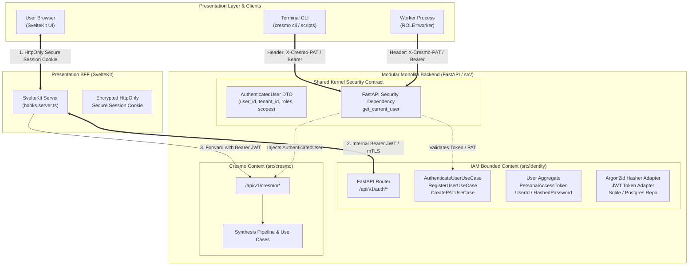

# ADR-018: Identity and Access Management (IAM) Bounded Context and SvelteKit BFF Authentication Pattern

**Status:** PROPOSED  
**Date:** 2026-09-21  
**Decision Makers:** Lead Architect (Fausto Stangler), Systems Architect (Doctor Stangler Committee)  
**Governing Method:** Doctor Stangler Architecture Method (Clean/Hexagonal DDD Modular Monolith, 12-Factor App, ADR-First)  
**Glossary Reference:** [`docs/GLOSSARY.md`](../GLOSSARY.md)  
**Related ADRs:** [`ADR-001`](ADR-001-cresmo-modular-monolith-strangling.md), [`ADR-003`](ADR-003-pes-production-architecture.md), [`ADR-005`](ADR-005-multi-role-12factor-container-architecture.md), [`ADR-014`](ADR-014-active-preflight-probes-and-fail-fast-observability.md)

---

## 1. Context & Architectural Forces

The PES workspace hosts the **Cresmo Knowledge Synthesis** engine ([`ADR-001`](ADR-001-cresmo-modular-monolith-strangling.md)), designed as an autonomous Hexagonal Modular Monolith deployed via a single 12-Factor multi-role container ([`ADR-005`](ADR-005-multi-role-12factor-container-architecture.md)) supporting `cli`, `worker`, and `api` roles.

As Cresmo evolves from a single-tenant local pipeline to an interactive web platform (Presentation BFF in SvelteKit with a FastAPI backend) and distributed worker nodes, a robust, sovereign user account and authentication architecture is required.

### 1.1 Architectural Drivers & Security Invariants

1. **Domain Isolation & Polysemy of "User" (DDD Invariant):**
   - In DDD, the concept of "User" has completely different semantics across contexts:
     - In **IAM**: A User is an identity security principal possessing credentials (`HashedPassword`), security roles, sessions, and multi-factor authentication devices.
     - In **Cresmo**: A User is merely an author, tenant, or vault operator (`UserId`, `TenantId`) who initiates synthesis runs or owns Obsidian vaults.
   - Violating this boundary by placing user credentials, password resets, or JWT issuance inside `src/cresmo/` would corrupt Cresmo's core domain and produce high coupling.
2. **Defending Against Infostealers and Token Theft (AppSec 2026):**
   - The *Cloudflare Threat Report 2026* and OWASP guidelines identify token exfiltration via browser infostealers (e.g. LummaC2) and XSS as a critical vulnerability.
   - Storing raw JWT access or refresh tokens in browser `localStorage` or `sessionStorage` is forbidden.
3. **Multi-Role Interaction (Web vs. Terminal CLI vs. Daemon Worker):**
   - Humans interact with the web UI (requiring session cookies and SSO/password authentication).
   - Automated CLI commands (`cresmo sync`, `cresmo dedupe`) and containerized workers (`ROLE=worker`) execute without browser sessions, requiring machine-to-machine (M2M) authentication via cryptographically secure Personal Access Tokens (PAT) or service keys.
4. **KISS & Self-Contained Zero-Lock-In Deployment:**
   - External IAM appliances (e.g. Keycloak, Auth0, Okta) introduce heavy deployment overhead or commercial vendor lock-in. The system must run smoothly in local standalone mode with SQLite WAL and seamlessly scale to PostgreSQL (CloudNativePG in Kubernetes) without code rewrites.

---

## 2. Decision

We establish an independent **Identity & Access Management (IAM) Bounded Context** located in `src/identity/` and implement the **Backend-for-Frontend (BFF) Pattern** with SvelteKit and FastAPI.



### 2.1 Architectural Components & Responsibilities

1. **Independent IAM Bounded Context (`src/identity/`):**
   - **Domain Layer (`src/identity/domain/`):** Encapsulates `User`, `PersonalAccessToken`, and `UserSession` entities, alongside `UserId`, `Email`, `HashedPassword`, `Role`, and `Scope` value objects.
   - **Application Layer (`src/identity/application/`):** Declares ports (`UserRepositoryPort`, `PasswordHasherPort`, `TokenServicePort`, `PersonalAccessTokenRepositoryPort`) and use cases (`RegisterUserUseCase`, `AuthenticateUserUseCase`, `CreatePersonalAccessTokenUseCase`, `ValidateTokenUseCase`, `ValidatePersonalAccessTokenUseCase`).
   - **Infrastructure Layer (`src/identity/infrastructure/`):** Implements ports using standard-of-the-art libraries:
     - `Argon2PasswordHasherAdapter`: Uses `argon2-cffi` (RFC 9106, OWASP recommended password hashing algorithm).
     - `JwtTokenServiceAdapter`: Emits and verifies short-lived RS256/EdDSA/HS256 tokens using `cryptography` / `pyjwt`.
     - `SqliteUserRepositoryAdapter`: Persistent storage with SQLite WAL mode (`PRAGMA journal_mode=WAL;`), ready for CloudNativePG PostgreSQL.
   - **Presentation Layer (`src/identity/presentation/`):** Exposes FastAPI routes (`/api/v1/auth/register`, `/api/v1/auth/login`, `/api/v1/auth/refresh`, `/api/v1/auth/tokens`, `/api/v1/auth/me`).

2. **Presentation BFF Pattern (SvelteKit):**
   - SvelteKit serves as the secure gateway for web browsers.
   - The browser exchanges credentials with SvelteKit via server-side form actions (`+page.server.ts`).
   - SvelteKit communicates server-to-server with the FastAPI backend, retrieves the short-lived access token and refresh token, and sets an **encrypted, `HttpOnly`, `Secure`, `SameSite=Strict` cookie** on the user agent.
   - Subsequent browser calls hit SvelteKit's `hooks.server.ts`, which extracts the session, attaches the bearer token, and proxies requests to FastAPI. Tokens are never exposed to browser-side JavaScript, eliminating XSS token exfiltration.

3. **Dual Authentication Gate for CLI and Workers (PAT Support):**
   - For terminal operators and automated background workers, the IAM context provides **Personal Access Tokens (PAT)** formatted as `cresmo_pat_<random_base64url>`.
   - The database stores only the SHA-256 hash of the token with associated `user_id`, `scopes`, and optional expiration dates.
   - FastAPI's `get_current_user` dependency transparently accepts either `Authorization: Bearer <jwt>` or `X-Cresmo-PAT: cresmo_pat_<token>`.

4. **Zero-Coupling Contract with Cresmo (Shared Kernel DTO):**
   - Cresmo use cases receive an immutable `AuthenticatedUser` value object:
     ```python
     @dataclass(frozen=True)
     class AuthenticatedUser:
         user_id: str
         tenant_id: str
         roles: FrozenSet[str]
         scopes: FrozenSet[str]
     ```
   - Cresmo has zero compile-time or runtime dependencies on `src/identity/infrastructure/` or database models.

---

## 3. Cryptographic & Security Invariants

1. **Password Hashing:** Strict enforcement of **Argon2id** (`time_cost=3`, `memory_cost=65536 KiB`, `parallelism=4`). MD5, SHA-1, plain SHA-256, and raw bcrypt are strictly disallowed.
2. **Token Lifecycles:**
   - Access Tokens: Short lifespan (**15 minutes**).
   - Refresh Tokens: Opaque random 32-byte strings with **7-day lifespan**, stored hashed in the database, with automatic rotation upon use.
   - Personal Access Tokens (PAT): Configurable expiry (default 90 days or indefinite for service accounts), revokable immediately by ID.
3. **Configuration Governance:**
   - All cryptographic keys, token expiration limits, and password parameters are encapsulated in `IdentitySettings` via `pydantic-settings`, adhering to 12-Factor configuration principles and fail-fast preflight validation.

---

## 4. Consequences & Impact

### Positive
- **Hermetic Domain Boundaries:** Cresmo's *Knowledge Synthesis* core remains 100% focused on transcription, expansion, and Obsidian Second Brain graph logic.
- **Maximum Web Security:** The SvelteKit BFF pattern ensures tokens never touch browser storage, mitigating XSS and session hijacking.
- **Seamless CLI & Worker DX:** Developers and scripts authenticate natively via scoped PATs without needing browser redirects.
- **12-Factor & Modular Monolith Purity:** Runs within the existing single Docker container (`ROLE=api`), fully testable in-memory with zero required third-party auth daemons.

### Negative / Trade-offs
- Requires maintaining two authentication mechanisms (short-lived JWT for web/BFF, and hashed PAT for CLI/Worker).
- Password reset, email verification, and MFA flows require future implementation within the IAM context.

---

## 5. Alternatives Considered

### Alternative A: Embedding User & Password Fields into `src/cresmo/domain/entities.py`
- **Why Rejected:** Violates Single Responsibility and DDD Bounded Context principles. Corrupts the *Knowledge Synthesis* ubiquitous language with authentication technical debt.

### Alternative B: External Identity Provider (Keycloak / Ory Kratos / Auth0)
- **Why Rejected:** Keycloak requires 1GB+ RAM and a separate JVM container, violating the KISS principle and the lightweight portable container mandate of PES. Auth0 introduces external cloud lock-in and latency.

### Alternative C: Single Page Application (SPA) Storing Tokens in `localStorage`
- **Why Rejected:** Flagged as high-risk by OWASP and 2026 AppSec standards due to infostealer malware and XSS vulnerabilities.
