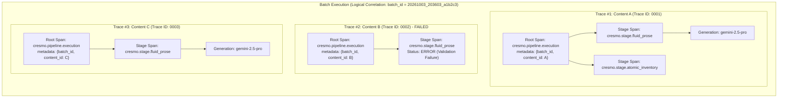

# ADR-035: Atomic Work-Item Traces & SOTA-KISS Batch Correlation

| Field       | Value                                                              |
|-------------|--------------------------------------------------------------------|
| **Status**  | ACCEPTED                                                           |
| **Date**    | 2026-10-03                                                         |
| **Authors** | Lead Architect (Fausto Stangler), Systems Architect (Doctor Stangler Committee) |
| **Scope**   | Cross-Cutting Telemetry & Observability — Domain, Application, Infrastructure, Presentation |
| **Relates** | ADR-016, ADR-021, ADR-023, ADR-025, ADR-027                       |

---

## 1. Context & Architectural Motivation

In Cresmo's multi-stage cognitive synthesis pipeline, operations frequently execute over batches of source documents (transcripts, video lecture feeds, local Markdown files). A recurring dilemma in batch execution telemetry is establishing the appropriate granularity boundary for distributed tracing:

* *Should the entire batch run of N files be encapsulated within a single monolithic trace?*
* *Or should each processed file (content item) demarcate an independent, atomic distributed trace?*

Earlier iterations and simplistic CLI wrappers tended towards wrapping the batch execution loop into a single encompassing trace. This ADR codifies the definitive architectural standard: **The Mega-Trace Monolith is an anti-pattern**. In Cresmo, **1 Trace = 1 Work Item (processed content item / file)**, with batch correlation achieved through a lightweight, SOTA-KISS correlation key (`batch_id`) in Root Span metadata.

---

## 2. The Anti-Pattern: The "Mega-Trace Monolith"

A **Mega-Trace Monolith** occurs when an orchestrator or batch worker opens a single OpenTelemetry root span at the inception of a multi-item batch job and runs all sequential item transformations as child spans of that single trace.

While seemingly intuitive for visualizing an entire batch execution in a single timeline, this pattern introduces severe structural liabilities in production:

1. **Catastrophic Failure Conflation:** A single malformed transcript out of 100 items marks the entire trace as `Status: ERROR`, poisoning system SLIs/SLOs.
2. **FinOps Invisibility:** Cost, token consumption, and duration are aggregated at the batch level, making per-document unit economics impossible to audit.
3. **Evaluation Collapse:** Automated evaluations and LLM-as-a-judge scores cannot be bound to discrete cognitive outputs.
4. **Collector Rejection:** The trace span count rapidly exceeds APM and OpenTelemetry Collector limits, causing dropped spans or OOM crashes.

---

## 3. Decision: 1 Trace = 1 Work Item

We establish as an architectural invariant that **every processed work item (video lecture, transcript file, or document source) represents a dedicated, independent OpenTelemetry and Langfuse Trace**.

```
+---------------------------------------------------------------------------------------+
|                                 SOTA-KISS TRACE BOUNDARY                              |
+---------------------------------------------------------------------------------------+
| 1 Source Transcript / Content Item  === 1 Canonical Trace                             |
| Root Span Operation                 === cresmo.pipeline.execution                     |
| Pipeline Session Identifier         === session_id ({channel_id}:{content_id})        |
| Child Spans                         === cresmo.stage.{stage_name} (Fluid, Gap, MOC)   |
| Leaf Spans                          === LLM Generations & Infrastructure Adapters     |
+---------------------------------------------------------------------------------------+
```

### The Four Fundamental Pillars

This decision is anchored by four foundational engineering pillars:

### Pillar 1: Blast Radius & SLO Isolation (SRE / Golden Signals)
* In SRE and DORA metrics, Golden Signals require accurate Error Rates ($E_{rate} = \frac{\text{Failed Requests}}{\text{Total Requests}}$).
* If 100 files are processed in a batch and file 47 throws a validation or parsing error:
  * Under **Mega-Trace**, 1 out of 1 trace failed $\rightarrow$ **100% Error Rate** (False Alarm, degraded SLO, tripped PagerDuty alerts).
  * Under **Atomic Traces**, 1 out of 100 traces failed $\rightarrow$ **1% Error Rate** (Accurate telemetry reflecting 99% operational success).
* Fault isolation ensures that fatal exceptions recorded on a trace (`span.record_exception(e)`) isolate blast radius strictly to the failed work item.

### Pillar 2: FinOps & Token Cost Attribution (GenAI Observability)
* In GenAI platforms (Langfuse, Arize Phoenix, Helicone), token consumption (prompt tokens, completion tokens, cached tokens) and financial cost ($ USD) aggregate at the **Trace boundary**.
* Atomic traces provide instantaneous answers to crucial business questions:
  * *What is the P50, P95, and P99 dollar cost per video lecture?*
  * *Which specific video ingested 80% of our daily LLM quota due to runaway context length?*
  * *What is the unit cost of Stage 1 (Fluid Prose) vs Stage 3 (Atomic Batch) for this content?*

### Pillar 3: Qualitative Evaluations & Evals (LLM-as-a-Judge)
* Systematic quality assurance in Cresmo requires automated evaluators (ADR-029, ADR-030) testing for hallucination, epistemic density, stylistic adherence, and causal structure.
* Quality scores and human feedback (thumbs up/down, metric sliders) bind natively to a `trace_id` or `observation_id`.
* Atomic work-item traces permit individual scoring and automated regression detection per document, rather than diluting scores across an entire batch.

### Pillar 4: Collector Quotas & Infrastructure Resilience
* OpenTelemetry Collectors, Jaeger, Grafana Tempo, and SaaS telemetry endpoints enforce strict payload invariants:
  * Maximum span limits per trace (typically 1,000 to 5,000 spans).
  * Maximum batch payload limits (typically 4MB).
* A multi-stage pipeline running 8 stages across 100 files, with each stage generating multiple LLM calls, chunk retries, and filesystem I/O spans, easily exceeds 15,000 spans.
* Atomic traces ensure span counts per trace remain lean ($< 100$ spans), guaranteeing zero packet drops, zero payload truncation, and lightning-fast APM UI rendering.

---

## 4. Batch Correlation Strategy: SOTA-KISS `batch_id`

While traces remain strictly atomic, operators require the ability to inspect and query all traces belonging to a specific batch execution (e.g. *"Show all transcripts processed in the 20:00 CLI run"*).

### The Overengineering Trap: OpenTelemetry `SpanLink`
The official OpenTelemetry specification suggests using `SpanLink` (Trace Links) to connect independent item traces to a parent batch coordinator span. However:
1. It introduces complex context propagation ceremony across asynchronous loops.
2. GenAI APMs (including Langfuse) do not offer first-class UI grouping or filtering based on span links.
3. It violates the KISS (Keep It Simple, Stupid) principle for single-node modular monolith execution.

### The SOTA-KISS Solution: `batch_id` via Root Span Metadata
Instead of distributed span linking, every batch execution generates a single correlation key adhering to the canonical naming convention:

$$\mathbf{batch\_id} = \mathbf{YYYYMMDD\_HHMMSS\_[UUID6]}$$

* **Timestamp Prefix (`YYYYMMDD_HHMMSS`):** Guarantees natural chronological sorting in log aggregation tools (Grafana Loki) and file system outputs.
* **Short UUID Suffix (`uuid4().hex[:6]`):** Guarantees global uniqueness and collision resistance during concurrent or automated worker executions.
* **Example:** `20261003_203603_a1b2c3`

```python
import uuid
from datetime import datetime, timezone

def generate_batch_id() -> str:
    """Generate canonical SOTA-KISS batch correlation identifier."""
    now_str = datetime.now(timezone.utc).strftime("%Y%m%d_%H%M%S")
    short_uuid = uuid.uuid4().hex[:6]
    return f"{now_str}_{short_uuid}"
```

### Propagation Protocol
1. **Entrypoint Generation:** The Presentation/CLI layer or background worker generates `batch_id` once at the loop inception.
2. **Metadata Injection:** When invoking `PipelineCoordinator.run_session`, `batch_id` is included in the `root_metadata` dictionary:
   ```python
   root_metadata = {
       "batch_id": batch_id,
       "channel_id": str(channel.id) if channel.id else "",
       "content_id": content.id.value,
       "content_title": content.title,
   }
   ```
3. **OpenTelemetry & Langfuse Tagging:**
   * In [opentelemetry_adapter.py](file:///home/stangler/gamer_d/Fausto%20Stangler/Documentos/Python/PES/src/cresmo/infrastructure/adapters/opentelemetry_adapter.py), `batch_id` is set as an OpenTelemetry span attribute (`cresmo.batch_id`) and propagated to Langfuse tags (`tags=[f"batch:{batch_id}", ...]`).
4. **Single-Click Queryability:**
   * **In Langfuse:** Filter by `tag = batch:20261003_203603_a1b2c3` to display all item traces, aggregated cost, and token usage for the run.
   * **In Grafana Loki:** Filter by `{app="cresmo"} | json | batch_id="20261003_203603_a1b2c3"`.

---

## 5. Canonical Span Hierarchy Diagram



---

## 6. Consequences & Trade-offs

### Positive
1. **Mathematical Accuracy of SLIs/SLOs:** Failure of an individual record does not artificially inflate service error rates.
2. **Precision FinOps:** Exact dollar cost and token volume calculated and reported per content asset.
3. **KISS Observability:** Zero complex OTel `SpanLink` wiring; filtering by `batch_id` tag provides instantaneous batch aggregation across all monitoring tools.
4. **Resilient APM Performance:** Avoids monster payloads, eliminating UI lag and trace collector buffer overruns.

### Negative & Mitigations
- **Lack of a Single Visual Waterfall for the Whole Batch:** Operators cannot view all 50 files on a single giant waterfall timeline.
  * *Mitigation:* Langfuse Traces table and Grafana dashboards group traces by `tag = batch:{batch_id}`, providing high-level tabular metrics and one-click drilldown into individual traces.

---

## 7. Implementation Checklist

- [x] Document ADR-035 in `/docs/adr/`.
- [ ] Ensure Presentation CLI / Worker layer generates `batch_id` formatted as `YYYYMMDD_HHMMSS_<uuid[:6]>`.
- [ ] Validate `PipelineCoordinator.run_session` receives and injects `batch_id` into `root_metadata`.
- [ ] Verify `OpenTelemetryAdapter.start_pipeline_session` promotes `batch_id` to span attributes (`cresmo.batch_id`) and Langfuse tags (`batch:{batch_id}`).
- [ ] Add unit and regression tests asserting trace independence and `batch_id` presence across batch iterations.
