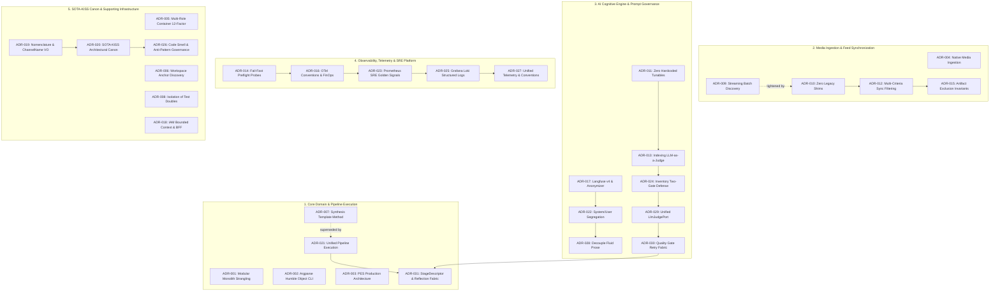

# Architectural Decision Records (ADR) — Master Catalog

**Governing Architecture:** Doctor Stangler Architecture Method (Clean/Hexagonal DDD Modular Monolith, 12-Factor App, SOTA-KISS)  
**Glossary Reference:** [`docs/GLOSSARY.md`](../GLOSSARY.md)  
**Canon State:** All ADRs listed in this catalog are **ACCEPTED**.  

---

## 1. Architectural Precedence Principle (*Lex Posterior Derogat Priori*)

In this repository, architectural decisions evolve continuously through test-driven refactoring and domain refinement:

> [!IMPORTANT]
> **Precedence Invariant:** All ADRs are officially **ACCEPTED**. In the event of any semantic ambiguity, interface drift, or operational conflict between decisions, **more recent ADRs supersede and override older ADRs**.
> 
> When refactoring code or evaluating compliance, the specifications established in higher-numbered ADRs take definitive precedence over earlier formulations.

---

## 2. Master ADR Inventory

| ID | Date | Title | Bounded Context / Domain | Status | Lineage & Precedence Notes |
| :--- | :--- | :--- | :--- | :---: | :--- |
| [**ADR-001**](ADR-001-cresmo-modular-monolith-strangling.md) | 2026-09-10 | Strangling Cresmo into Hexagonal Modular Monolith with Media Ingestion ACL and Vault Port | Cresmo Core | `ACCEPTED` | Foundational strangling architecture. Refined by ADR-019/020. |
| [**ADR-002**](ADR-002-cresmo-presentation-cli.md) | 2026-09-10 | Cresmo Production CLI Entrypoint and Presentation Layer Orchestration | Presentation / CLI | `ACCEPTED` | Established Argparse Humble Object CLI entrypoint and presentation layer dependency composition. |
| [**ADR-003**](ADR-003-pes-production-architecture.md) | 2026-09-11 | PES Production Architecture — Consolidated 13-Chapter Synthesis | Architecture Canon | `ACCEPTED` | Comprehensive 13-chapter baseline. Subsequent ADRs detail specific chapters. |
| [**ADR-004**](ADR-004-native-media-ingestion-decommissioning.md) | 2026-09-11 | Native Media Ingestion & Legacy ISB.AI Decommissioning | Ingestion ACL | `ACCEPTED` | Decommissioned external dependencies; introduced native audio ingestion. |
| [**ADR-005**](ADR-005-multi-role-12factor-container-architecture.md) | 2026-09-12 | Multi-Role 12-Factor Container Architecture & Deployment Model | Platform / DevOps | `ACCEPTED` | Single Dockerfile multi-role dispatch (`api`, `worker`, `cli`) with PID 1 `tini`. |
| [**ADR-006**](ADR-006-resilient-workspace-root-discovery.md) | 2026-09-14 | Resilient Workspace Root Discovery via Anchor Markers | Shared Kernel / Infra | `ACCEPTED` | Deterministic root anchor markers (`pyproject.toml`, `.git`, `src/`). |
| [**ADR-007**](ADR-007-pipeline-template-method-dry.md) | 2026-09-14 | Template Method and DRY Unification in Cognitive Synthesis Pipeline | Application / Pipeline | `ACCEPTED` | Downstream synthesis template method. **Partially overridden by ADR-021**. |
| [**ADR-008**](ADR-008-isolation-of-test-doubles.md) | 2026-09-14 | Isolation of Test Doubles to `tests/doubles/` and Production Code Purity | Testing & Quality | `ACCEPTED` | Zero mock/fake leakage into `src/`. Production code purity invariant. |
| [**ADR-009**](ADR-009-streaming-batch-source-discovery-producer-consumer.md) | 2026-09-17 | Streaming Batch Source Discovery via Producer-Consumer Pattern | Ingestion / Feed Sync | `ACCEPTED` | Memory-efficient streaming iterator discovery over monolithic directory scans. |
| [**ADR-010**](ADR-010-zero-legacy-shims-and-streaming-first-unification.md) | 2026-09-17 | Zero Legacy Shims and Streaming-First Unification Principle | Architecture Canon | `ACCEPTED` | **Overrides ADR-009 shims**. Mandates complete deletion of transitional adapters. |
| [**ADR-011**](ADR-011-zero-hardcoded-tunables-and-unified-inference-observability.md) | 2026-09-17 | Zero Hardcoded Tunables, Self-Healing Output Validation, and Unified Inference Observability | Cognitive / SRE | `ACCEPTED` | Establishes self-healing loops and parameterization via settings. |
| [**ADR-012**](ADR-012-multi-criteria-sync-filtering-and-alphabetical-feed-ordering.md) | 2026-09-17 | Multi-Criteria Synchronization Filtering and Alphabetical Feed Ordering | Ingestion / Feed Sync | `ACCEPTED` | Deterministic alphabetical channel queue ordering and multi-criteria filters. |
| [**ADR-013**](ADR-013-iterative-llm-as-a-judge-indexing-loops.md) | 2026-09-18 | Iterative LLM-as-a-Judge Indexing Loops for Principal Concepts and Proportionate Synthesis Paragraphs | Cognitive / Indexing | `ACCEPTED` | Two-pass distillation and iterative LLM-as-a-judge for catalog indexing. |
| [**ADR-014**](ADR-014-active-preflight-probes-and-fail-fast-observability.md) | 2026-09-19 | Active Preflight Probes and Fail-Fast Observability Architecture | Observability / SRE | `ACCEPTED` | Sub-10ms fail-fast preflight diagnostics before any I/O execution. |
| [**ADR-015**](ADR-015-artifact-segregation-and-exclusion-invariants.md) | 2026-09-20 | Invariant Exclusion of System Artifacts and Indices from Batch Processing Pipeline | Ingestion / Storage | `ACCEPTED` | Strict exclusion filters for metadata artifacts (`_index.json`, `_channel.md`). |
| [**ADR-016**](ADR-016-full-opentelemetry-conventions-session-replays-and-channel-governance.md) | 2026-09-21 | Full OpenTelemetry Semantic Conventions, Unified Session Replays, and Channel FinOps Governance | Observability / FinOps | `ACCEPTED` | Standardized trace spans, session replays, and channel-level FinOps attribution. |
| [**ADR-017**](ADR-017-langfuse-v4-prompt-management-and-anonymizer-governance.md) | 2026-09-21 | Langfuse v4 Observations-First Telemetry, Resilient Prompt Management, and Anonymizer Governance | Cognitive / Security | `ACCEPTED` | Langfuse v4 prompt registry with local JSON fallback and PII anonymization. |
| [**ADR-018**](ADR-018-identity-and-access-management-bounded-context-and-sveltekit-bff.md) | 2026-09-21 | Identity and Access Management (IAM) Bounded Context and SvelteKit BFF Authentication Pattern | IAM / BFF Presentation | `ACCEPTED` | Independent IAM context and SvelteKit Backend-for-Frontend session pattern. |
| [**ADR-019**](ADR-019-sota-kiss-nomenclature-and-channel-name-value-object.md) | 2026-09-24 | SOTA-KISS Nomenclature Alignment, Port Role Suffixes, and ChannelName Domain Value Object | DDD Tático / Canon | `ACCEPTED` | Port/Adapter role suffixes and `ChannelName` domain Value Object. |
| [**ADR-020**](ADR-020-sota-kiss-engineering-canon-and-concurrency-topology.md) | 2026-09-24 | SOTA-KISS Architectural Canon — Concurrency Topology, Zero Primitive Obsession, Contract Integrity, and Boundary ACLs | Architecture Canon | `ACCEPTED` | Four SOTA-KISS pillars governing concurrency, contracts, VO typing, and ACLs. |
| [**ADR-021**](ADR-021-unified-pipeline-execution-template-method-and-telemetry.md) | 2026-09-25 | Unified Pipeline Execution — SOTA-KISS Template Method, Single Root Span Telemetry, and Symmetrical Dispatchers | Application / Pipeline | `ACCEPTED` | **Overrides ADR-007**. Hoists template method to root span execution. Refined by ADR-028 & ADR-031. |
| [**ADR-022**](ADR-022-universal-system-instruction-user-prompt-segregation.md) | 2026-09-25 | Universal System Instruction and User Prompt Segregation across Knowledge Synthesis Use Cases | Cognitive / Prompts | `ACCEPTED` | Universal segregation between immutable system rules and dynamic user input. |
| [**ADR-023**](ADR-023-prometheus-sre-golden-signals-and-dora-metrics-platform.md) | 2026-09-26 | Prometheus SRE Golden Signals and DORA Metrics Platform | Observability / SRE | `ACCEPTED` | Standardized Prometheus metrics port, Golden Signals, and DORA tracking. |
| [**ADR-024**](ADR-024-iterative-llm-as-a-judge-atomic-inventory-discovery.md) | 2026-09-27 | Iterative LLM-as-a-Judge and Deterministic Guardrails for Atomic Inventory Discovery | Cognitive / Guardrails | `ACCEPTED` | Two-Gate Defense (Deterministic Fail-Fast + LLM Judge) for atomic inventory. |
| [**ADR-025**](ADR-025-grafana-loki-structured-log-aggregation.md) | 2026-09-29 | Grafana Loki Structured Log Aggregation for Cresmo Pipeline | Observability / SRE | `ACCEPTED` | Completes the observability triad with JSON structured logs and trace correlation. |
| [**ADR-026**](ADR-026-clean-code-anti-patterns-and-code-smell-governance.md) | 2026-09-29 | SOTA-KISS Code Smell & Anti-Pattern Governance — Clean Code Hygiene, Zero Magic Numbers, and Cross-Platform Reliability | Architecture Canon | `ACCEPTED` | Codifies 8 hygiene standards: PEP 8 import topography, zero magic literals/status codes, anti-swallowing & chaining, OS-agnostic paths/telemetry, bounded modularity & cyclomatic limits, zero production asserts, parameter bundling, and dead code elimination. |
| [**ADR-027**](ADR-027-unified-telemetry-vocabulary-and-langfuse-conventions.md) | 2026-09-30 | SOTA-KISS Unified Telemetry Vocabulary & Langfuse Semantic Conventions | Observability / Telemetry | `ACCEPTED` | Establishes single-video session replay (`{channel_id}:{video_id}`), `ChannelTenantId`, and polymorphic `UserIdentity`. Refines ADR-016. |
| [**ADR-028**](ADR-028-decoupling-fluid-prose-and-socratic-gap-filling.md) | 2026-10-01 | Decoupling Fluid Prose Detranscription and Socratic Gap Filling for Pre-Indexing Linguistic Normalization | Cognitive / Synthesis | `ACCEPTED` | Decouples orality purge from epistemic expansion; establishes `FluidTranscript` domain aggregate prior to indexing. Overrides ADR-021 execution sequence. |
| [**ADR-029**](ADR-029-unified-quality-judge-port-and-evaluator-adapters.md) | 2026-10-01 | Unified LlmJudgePort, Decision-Model Evaluators, and Resilient Multi-Provider Adapters with Langfuse Telemetry | Cognitive / Evaluation | `ACCEPTED` | Unifies scattered judges under `LlmJudgePort`; introduces Gemini, Ollama, TypeSafe, and Langfuse decorator adapters. |
| [**ADR-030**](ADR-030-stage-quality-gate-and-evaluator-retry-fabric.md) | 2026-10-01 | Stage Quality Gate & Evaluator Closed-Loop Retry Fabric | Application / Quality | `ACCEPTED` | Eliminates evaluator orchestration duplication in coordinator; introduces `PipelineStageRunner.run_evaluated_stage` retry loop. |
| [**ADR-031**](ADR-031-standardized-stage-descriptor-and-closed-loop-refinement.md) | 2026-10-01 | Standardized StageDescriptor, SourceTranscript, CandidateText, and Closed-Loop Reflection Quality Fabric | Application / Pipeline | `ACCEPTED` | Universal `StageDescriptor` template, complete elimination of `RawTranscript` in favor of `SourceTranscript`, `CandidateText` VO, `CritiqueSynthesizerPort` reflection loop, and 4-step fail-fast quarantine. |
| [**ADR-032**](ADR-032-composite-channel-and-content-value-objects.md) | 2026-10-02 | Composite Channel and Content Value Objects and Context Simplification | DDD Tático / Value Objects | `ACCEPTED` | Merges fragmented channel and content attributes into composite `Channel` and `Content` VOs; simplifies `PipelineExecutionContext` to 4 pillars (`session`, `user`, `channel`, `content`). |
| [**ADR-033**](ADR-033-composite-value-objects-identity-parity-and-tenant-simplification.md) | 2026-10-02 | Composite Value Objects with Identity VOs, Parity, and Tenant Simplification | DDD Tático / Anti-Patterns | `ACCEPTED` | Bans *Primitive Obsession Obsession & Class Explosion* and *Primitive Obsession Reversa*. Establishes Intentional Asymmetric Hybrid Composition, renames `PipelineSessionId.channel_id`, removes `video_id`, and decommissions `ChannelTenantId` with zero backward compatibility. |

---

## 3. Thematic Clusters & Bounded Contexts

---

## 4. Key Precedence & Overwrite Mappings

When navigating the architecture, apply these documented precedence relationships:

### 4.1 Pipeline Orchestration (ADR-021 overrides ADR-007)
- **ADR-007** originally scoped the Template Method to downstream synthesis (`_synthesize_transcript`), which left raw transcript indexing (`index_raw`) duplicated inside individual ingestion methods and outside the telemetry session span.
- **ADR-021** hoists the Template Method to `CresmoPipeline.execute(...)` as a single root telemetry span (`cresmo.pipeline.execution`), enforcing an early idempotency guard and unified LLM-as-a-judge nesting.
- **Precedence Rule:** Implementations must strictly follow **ADR-021**.

### 4.2 Legacy Elimination (ADR-010 overrides ADR-009 Backward Compatibility)
- **ADR-009** introduced streaming batch source discovery but preserved backward compatibility shims for transitional scripts.
- **ADR-010** established the zero-legacy-shims invariant, demanding immediate removal of transitional adapters in favor of pure streaming interfaces.
- **Precedence Rule:** No transitional compatibility shims are permitted in the codebase.

### 4.3 SOTA-KISS Canon & Zero Primitive Obsession (ADR-020 & ADR-019 refine ADR-001 & ADR-003)
- **ADR-019** codified strict port naming suffixes (`*Port`, `*Adapter`) and replaced raw strings with the `ChannelName` domain Value Object.
- **ADR-020** established the four universal SOTA-KISS pillars (Concurrency topology, Zero primitive obsession, Contract integrity, Boundary ACLs).
- **Precedence Rule:** All domain interactions must encapsulate business concepts in Value Objects; raw strings/integers for domain identities are prohibited.

### 4.4 Cognitive Guardrails (ADR-024 & ADR-013 formalize ADR-011)
- **ADR-011** defined the self-healing principle without hardcoded retries.
- **ADR-013** applied this to raw transcript indexing (`IndexRawTranscriptsUseCase`).
- **ADR-024** formalized the **Two-Gate Defense Pattern** (Gate 1: Zero-token deterministic JSON/regex validation; Gate 2: LLM-as-a-judge at `temperature=0.0`) for holistic candidate discovery (`DiscoverAtomicInventoryUseCase`).
- **Precedence Rule:** Cognitive use cases must implement deterministic Gate 1 pre-validation before invoking LLM judges.

### 4.5 Triad of Observability (ADR-016, ADR-017, ADR-023, ADR-025, ADR-027)
- **ADR-016** governs distributed traces, OpenTelemetry semantic conventions, and FinOps token attribution.
- **ADR-017** governs Langfuse observations, prompt versioning with TTL caching, and local fallback.
- **ADR-023** governs system reliability via Prometheus Golden Signals (Latency, Traffic, Errors, Saturation) and DORA delivery metrics.
- **ADR-025** integrates Grafana Loki for structured JSON log aggregation and trace correlation.
- **ADR-027** standardizes single-video session replay keys (`{channel_id}:{video_id}`), `ChannelTenantId` as cost center, and polymorphic `UserIdentity`.
- **Precedence Rule:** Observability is multi-tiered: Prometheus handles operational health/SRE; OpenTelemetry, Loki, and Langfuse handle distributed traces, logs, and LLM quality/cost.

### 4.6 Clean Code Hygiene & Code Smell Governance (ADR-026 extends ADR-020)
- **ADR-020** codified the core architectural pillars (concurrency topology, zero primitive obsession, contract integrity).
- **ADR-026** extends this canon to tactical implementation hygiene: bans interleaved imports, magic timeouts, silent error swallowing, hardcoded OS-specific memory multipliers, and monolithic god files (>500 lines).
- **Precedence Rule:** All new and refactored modules must strictly comply with the hygiene standards codified in ADR-026.

### 4.7 Pre-Indexing Linguistic Normalization (ADR-028 refines ADR-021)
- **ADR-021** placed catalog indexing (`raw_indexing`) before downstream synthesis, operating directly on spoken verbatim text.
- **ADR-028** decouples `fluid_prose` detranscription from epistemic gap filling and positions it before indexing as Stage 1, producing the `FluidTranscript` domain aggregate and ensuring clean, normalized prose enters catalog distillation.
- **Precedence Rule:** Pipeline execution must execute `transform_fluid_prose` as Stage 1 prior to catalog indexing.

### 4.8 Unified Quality Evaluation & Stage Descriptor Fabric (ADR-029, ADR-030, ADR-031 extend ADR-020, ADR-021, ADR-024)
- **ADR-029** consolidates all scattered judge logic under the isolated `LlmJudgePort` with multi-provider adapters (`GeminiJudgeAdapter`, `OllamaJudgeAdapter`, `TypeSafeJudgeAdapter`, `LangfuseJudgeDecorator`).
- **ADR-030** eliminates repetitive judge orchestration by introducing `PipelineStageRunner.run_evaluated_stage` with configurable retry thresholds.
- **ADR-031** establishes the universal `StageDescriptor` architecture, completes the total elimination of `RawTranscript` in favor of `SourceTranscript`, introduces `CandidateText`, integrates `CritiqueSynthesizerPort` for closed-loop reflection, and enforces the 4-step fail-fast quarantine protocol (`StageQuarantinedError`).
### 4.9 Intentional Asymmetric Value Object Composition (ADR-033 refines ADR-019, ADR-027, ADR-032)
- **ADR-033** outlaws both *Primitive Obsession Obsession & Class Explosion* (single-field wrapper VOs around every primitive attribute) and *Primitive Obsession Reversa* (flattening strong identity VOs into raw strings).
- Establishes **Composite Value Objects with Identity VOs (Composição Híbrida Assimétrica Intencional)**: identity attributes retain strong VOs (`ChannelId`, `ContentId`), while contextual attributes (`name`, `category`, `url`, `title`, `publication_date`) are self-validated primitive fields inside composite VOs (`Channel`, `Content`).
- Renames `PipelineSessionId.channel_token` to `channel_id`, removes `video_id`, and completely decommissions `ChannelTenantId` in favor of `Channel.tenant_key`.
- **Precedence Rule:** All new domain models must employ intentional asymmetric composition with zero backward compatibility.

---

## 5. Architectural Governance Rules

1. **ADR-First Invariant:** No functional or infrastructural production code is written without an approved ADR and corresponding specification (`docs/specs/SPEC-*.md`).
2. **Ubiquitous Language Synchronization:** All technical terms and domain aggregates declared in an ADR must be indexed in [`docs/GLOSSARY.md`](../GLOSSARY.md).
3. **Hermetic Test Double Policy:** In accordance with [ADR-008](ADR-008-isolation-of-test-doubles.md), test fakes, stubs, and doubles reside exclusively in `tests/doubles/` and are never packaged into production modules.
4. **Modifying Existing Decisions:** When an architectural direction shifts, create a new ADR detailing the motivation and explicitly note the preceding ADR being superseded or refined.
