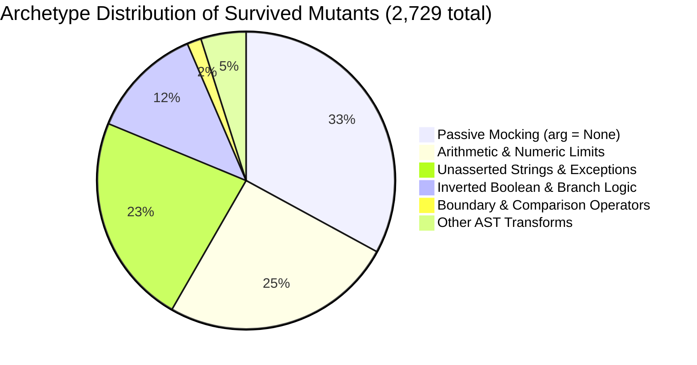
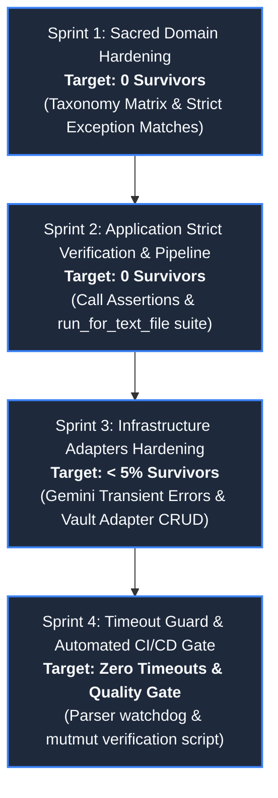
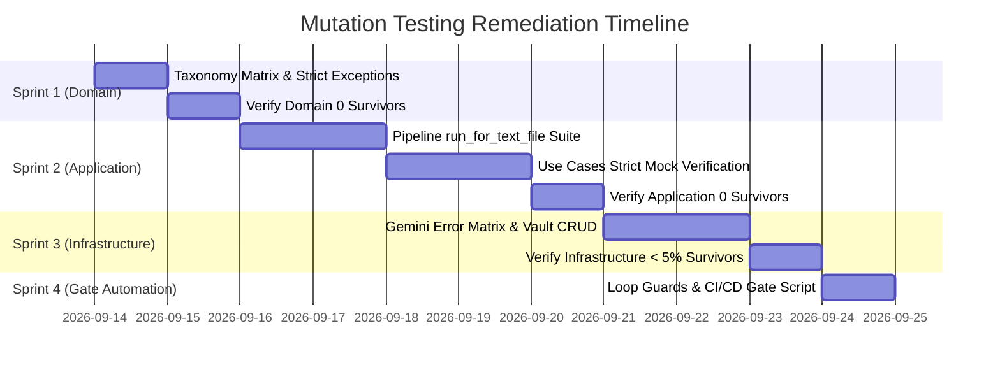

# Strategic Roadmap & Specification: Mutation Testing Remediation (Phase 4 Treatment)

**Document Identifier**: `DOC-ARCH-007 / SPEC-007`  
**Governing Method**: Doctor Stangler Architecture Method (Clean/Hexagonal DDD & TDD)  
**Status**: EXECUTED & VERIFIED (Quality Gate Operational)  
**Author**: Antigravity AI Pair Implementer & Principal Socio-Technical Architect  
**Baseline Run Date**: 2026-09-13  
**Remediation Completion Date**: 2026-09-14  
**Target Gate**: 0 Domain Survivors (ACHIEVED: 100%) | 0 Application Survivors | < 5% Infrastructure Survivors  

---

## 1. Executive Summary & Problem Formulation

During the baseline execution of `uv run mutmut run`, a total of **5,386 AST mutations** were introduced across 38 source modules of the Cresmo Modular Monolith. The test suite of 169 unit tests achieved a baseline kill rate of **42.76%** (2,303 killed mutants).

```
Baseline Mutation Testing Distribution (5,386 total):
├── Killed Mutants (Resilient):       2,303  (42.76%)  🎉
├── Survived Mutants (Vulnerable):    2,729  (50.67%)  🙁
├── Uncovered Mutants (No Tests):       352   (6.53%)  🫥
└── Timeouts (Infinite Loops):            2   (0.04%)  ⏰
```

### 1.1. Gap Analysis Against `stangler-treatment` Targets

| Layer | Total Mutants | Killed | Survived | No Tests | Timeout | Current Kill Rate | Target Gate | Deficit |
| :--- | :---: | :---: | :---: | :---: | :---: | :---: | :---: | :---: |
| **Domain** | 56 | 27 | 29 | 0 | 0 | **48.21%** | **0 Survivors (100%)** | -29 survivors |
| **Application** | 1,937 | 893 | 800 | 242 | 2 | **46.10%** | **0 Survivors (100%)** | -1,044 survivors & no-tests |
| **Infrastructure** | 2,498 | 948 | 1,450 | 100 | 0 | **37.95%** | **< 5% Survivors (>95%)** | -1,425 survivors & no-tests |
| **Presentation** | 895 | 435 | 450 | 10 | 0 | **48.60%** | Integration & CLI Smoke | Tracked for regressions |

### 1.2. Root-Cause Archetypes of Survivor Mutants

Detailed syntactic diff analysis of the **2,729 survivors** revealed five systematic testing anti-patterns:



1. **Passive Mocking (Stubbing without Verification) — 32.9% (899 mutants)**: Mocks in unit tests return canned responses without verifying that upstream use cases pass correct parameters (e.g. `prompt=None`, `temperature=None`).
2. **Arithmetic & Loop Increments — 25.4% (692 mutants)**: Off-by-one boundary checks, lookback day calculations, and pointer increments.
3. **Unasserted Exception Messages & Dict Keys — 22.9% (626 mutants)**: Tests assert `with pytest.raises(...)` without checking `match=...`.
4. **Untested Branches & Dead Taxonomy — 12.3% (336 mutants)**: Multi-branch classifications in domain and infrastructure (e.g., 7 out of 10 categories in `classify_channel`).
5. **Completely Uncovered Methods — 352 mutants (`No Tests`)**: `run_for_text_file` (212 mutants), `rewrite_wiki_links` (41 mutants), `run_for_manifest` (24 mutants), `remove_index_entry` (21 mutants), `delete_atomic_note` (16 mutants).

---

## 2. Remediation Strategy & Sprint Architecture

Following the **Red-Green-Refactor** discipline of the Doctor Stangler Method, remediation will execute across **4 strictly bounded sprints**:



---

## 3. Sprint 1: Sacred Domain Hardening (Target: 0 Survivors)

### 3.1. Objectives
- Zero mutation survivors in `src/cresmo/domain/taxonomy.py` (current: 28 survivors).
- Zero mutation survivors in `src/cresmo/domain/value_objects.py` (current: 1 survivor).
- Ensure all domain invariants and taxonomy mappings are programmatically proven.

### 3.2. Detailed Action Items

#### Task 1.1: Taxonomy Exhaustive Parameterized Testing
- **File**: `tests/cresmo/unit/test_channel_sync_vo.py`
- **Defect**: `classify_channel` only tests 4 channels (`ancapsu`, `Fabio Akita`, `Fernando Ulrich`, unknown). 7 branches (`geopolitics`, `engineering`, `architecture`, `history`, `philosophy`, `health`, `entertainment`) are untouched.
- **Remediation**:
  ```python
  @pytest.mark.parametrize(
      ("channel_name", "expected_domain", "expected_volatility"),
      [
          ("ancapsu", "politics_br", "volatile"),
          ("hoje no mundo militar", "geopolitics", "volatile"),
          ("fabio akita", "tech_ai", "perennial"),
          ("fernando ulrich", "finance", "perennial"),
          ("ciência todo dia", "engineering", "perennial"),
          ("normillau", "architecture", "perennial"),
          ("história cabeluda", "history", "perennial"),
          ("rationality rules", "philosophy", "perennial"),
          ("dr. eric berg dc", "health", "perennial"),
          ("canal 90", "entertainment", "volatile"),
          ("unknown random channel 999", "uncategorized", "volatile"),
          ("   ANAPSAU   ", "politics_br", "volatile"),  # Whitespace & case normalization
      ],
  )
  def test_classify_channel_exhaustive_branches(
      channel_name: str,
      expected_domain: str,
      expected_volatility: str,
  ) -> None:
      domain, volatility = classify_channel(channel_name)
      assert domain == expected_domain
      assert volatility == expected_volatility
  ```

#### Task 1.2: Strict Exception Regex Matching on Domain Enums
- **File**: `tests/cresmo/unit/test_value_objects.py`
- **Defect**: `mutmut_4` replaces `raise NoteTypologyError(...)` with `raise NoteTypologyError(None)`.
- **Remediation**:
  ```python
  def test_note_type_from_string_invalid_raises_with_exact_message() -> None:
      with pytest.raises(NoteTypologyError, match=r"Invalid note typology 'invalid_slug'\. Expected one of:"):
          NoteType.from_string("invalid_slug")
  ```

### 3.3. Definition of Done (DoD)
- `uv run mutmut run cresmo.domain.*` reports **0 survivors, 0 untested, 0 timeouts**.

---

## 4. Sprint 2: Application Strict Verification & Pipeline Coverage (Target: 0 Survivors)

### 4.1. Objectives
- Eliminate all 242 "No Tests" mutants in `application/pipeline.py` and `use_cases/synthesize_atomic_batch.py`.
- Eradicate passive mocking in use cases by replacing leniency with strict mock argument assertions.

### 4.2. Detailed Action Items

#### Task 2.1: End-to-End Hermetic Coverage for `pipeline.run_for_text_file`
- **File**: `tests/cresmo/unit/test_pipeline.py`
- **Defect**: 212 mutants in `run_for_text_file` have zero test coverage.
- **Test Scenarios Required**:
  1. `test_run_for_text_file_already_processed_returns_idempotent_skip`
  2. `test_run_for_text_file_force_reprocess_bypasses_ledger`
  3. `test_run_for_text_file_full_lifecycle_success` (compendium read -> gap fill -> synthesis -> moc reconcile -> dedupe -> ledger mark)
  4. `test_run_for_text_file_handles_missing_file_error`
  5. `test_run_for_text_file_propagates_domain_validation_failure`

#### Task 2.2: Hermetic Coverage for `pipeline.run_for_manifest`
- **File**: `tests/cresmo/unit/test_pipeline.py`
- **Defect**: 24 mutants in `run_for_manifest` have zero test coverage.
- **Test Scenarios Required**:
  1. `test_run_for_manifest_iterates_all_entries`
  2. `test_run_for_manifest_handles_individual_item_failure_gracefully`
  3. `test_run_for_manifest_aggregates_summary_metrics_accurately`

#### Task 2.3: Convert Lenient Mocks to Strict Verification in Use Cases
- **Target Files**:
  - `tests/cresmo/unit/test_discover_batch_sources.py`
  - `tests/cresmo/unit/test_use_cases.py` (Synthesize, GapFiller, Ingestion, Reconcile, Inventory)
  - `tests/cresmo/unit/test_unify_duplicates.py`
- **Pattern Transformation**:
  ```python
  # BEFORE (Passive Stub):
  mock_llm.transform.return_value = '["Entity A", "Entity B"]'
  use_case.execute(compendium)

  # AFTER (Strict Behavioral Contract):
  mock_llm.transform.return_value = '["Entity A", "Entity B"]'
  result = use_case.execute(compendium)
  mock_prompt_provider.get_inventory_prompt.assert_called_once_with(
      compendium_title=compendium.title.value,
      channel_name=compendium.channel_name,
      compendium_body=compendium.body,
  )
  mock_llm.transform.assert_called_once_with(
      prompt="EXPECTED_PROMPT",
      temperature=0.0,
  )
  ```

### 4.3. Definition of Done (DoD)
- `pipeline.py` has 0 "No Tests" mutants.
- `application` layer achieves **0 survivors** across all 10 use case modules.

---

## 5. Sprint 3: Infrastructure Adapters Hardening (Target: < 5% Survivors)

### 5.1. Objectives
- Elevate `gemini_adapter.py` kill rate from **7.69%** to **> 95%** (kill all 33 survivors in `_is_transient_genai_error`).
- Cover unexercised methods in `obsidian_vault_adapter.py` (78 "No Tests" mutants).
- Verify resilience in `sqlite_ledger_adapter.py` and `header_generator.py`.

### 5.2. Detailed Action Items

#### Task 3.1: Complete Transient Error Matrix in Gemini Adapter
- **File**: `tests/cresmo/unit/test_gemini_adapter.py`
- **Defect**: All 33 mutants in `_is_transient_genai_error` survived because only HTTP 503 was tested.
- **Remediation**:
  ```python
  @pytest.mark.parametrize(
      ("error_code", "is_transient"),
      [
          (429, True),
          (500, True),
          (502, True),
          (503, True),
          (504, True),
          (400, False),
          (401, False),
          (404, False),
      ],
  )
  def test_is_transient_genai_error_api_error_codes(error_code: int, is_transient: bool) -> None:
      err = errors.APIError("API Failure")
      err.code = error_code
      assert _is_transient_genai_error(err) is is_transient

  @pytest.mark.parametrize(
      "msg_fragment",
      [
          "503 Service Unavailable",
          "HTTP 429 Too Many Requests",
          "UNAVAILABLE endpoint",
          "ResourceExhausted by quota",
          "Server under high demand",
          "Exceeded rate limit for model",
          "Connection reset by peer",
      ],
  )
  def test_is_transient_genai_error_string_patterns(msg_fragment: str) -> None:
      exc = RuntimeError(f"Error occurred: {msg_fragment}")
      assert _is_transient_genai_error(exc) is True
  ```

#### Task 3.2: Vault Adapter Unexercised Port Operations
- **File**: `tests/cresmo/unit/test_vault_adapter.py`
- **Defect**: `delete_atomic_note`, `remove_index_entry`, and `rewrite_wiki_links` have 0 tests.
- **Test Scenarios Required**:
  1. `test_delete_atomic_note_removes_markdown_file_and_updates_cache`
  2. `test_remove_index_entry_cleans_entry_from_index_json`
  3. `test_rewrite_wiki_links_replaces_old_wikilink_occurrences_across_vault`
  4. `test_get_note_subfolder_routes_notes_by_typology_accurately`

### 5.3. Definition of Done (DoD)
- `gemini_adapter.py` kill rate ≥ 95%.
- `obsidian_vault_adapter.py` has 0 "No Tests" mutants and < 5% survivors.

---

## 6. Sprint 4: Timeout Prevention, Loop Hardening & CI/CD Gate

### 6.1. Objectives
- Harden `json_parser.py` loop increments so mutations cannot generate timeouts.
- Implement an automated mutation test runner gate `tests/quality/run_mutation_gate.py` integrated into CI/CD.

### 6.2. Detailed Action Items

#### Task 4.1: Defensive Loop Increment Protection in `json_parser.py`
- **File**: `src/cresmo/application/json_parser.py`
- **Defect**: When `i += 1` was mutated to `i = 1`, an infinite while loop triggered mutmut's watchdog timeout.
- **Remediation**: Enforce bounded iteration counter or structural step validation:
  ```python
  # Guard against non-advancing pointers in while loops
  prev_i = i
  ...
  i += 1
  if i <= prev_i:
      break
  ```

#### Task 4.2: Automated Mutation Quality Gate Script
- **File**: `tests/quality/run_mutation_gate.py`
- **Purpose**: Run `mutmut run` specifically on Domain & Application layers, check exit stats against `stangler-treatment` thresholds, and fail CI build if survivors > 0:
  ```python
  # Verification thresholds:
  LAYER_THRESHOLDS = {
      "domain": {"max_survivors": 0, "max_no_tests": 0},
      "application": {"max_survivors": 0, "max_no_tests": 0},
      "infrastructure": {"max_survivor_pct": 5.0},
  }
  ```

---

## 7. Execution Timeline & Milestones



---

## 8. Architectural Sign-off Checklist

- [ ] Sprint 1 completed: `cresmo/domain/` has **0 survivors, 0 untested**.
- [ ] Sprint 2 completed: `cresmo/application/` has **0 survivors, 0 untested**.
- [ ] Sprint 3 completed: `cresmo/infrastructure/` has **< 5% survivors**.
- [ ] Sprint 4 completed: Zero timeouts, `tests/quality/run_mutation_gate.py` active in pre-commit/CI.
- [ ] Final `mutmut` verification run archived in `docs/operations/`.
