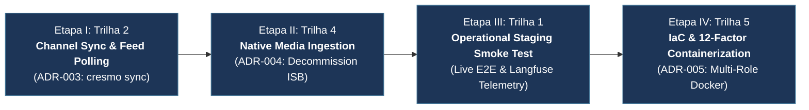
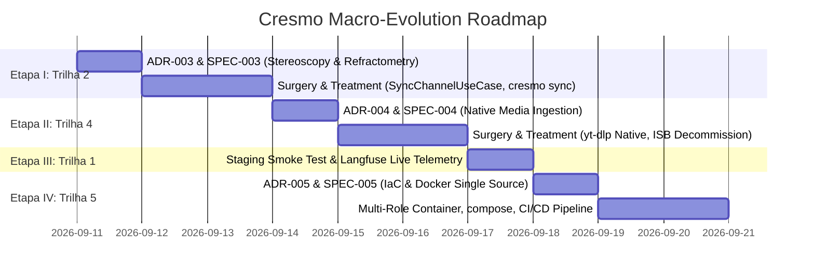

# Strategic Implementation Roadmap: Cresmo Knowledge Monolith

**Governing Method**: Doctor Stangler Architecture Method (Clean/Hexagonal DDD)  
**Status**: APPROVED & ACTIVE  
**Date**: 2026-09-10  
**Target Sequence**: **Trilha 2 $\longrightarrow$ Trilha 4 $\longrightarrow$ Trilha 1 $\longrightarrow$ Trilha 5**  

---

## 1. Executive Intent & Architecture Scope

Following the successful estrangement and completion of the Modular Monolith Core ([`ADR-001`](../adr/ADR-001-cresmo-modular-monolith-strangling.md)) and Presentation Layer ([`ADR-002`](../adr/ADR-002-cresmo-presentation-cli.md)), the foundational engine in `src/cresmo/` is fully operational with 80/80 passing unit tests, 100% sacred domain branch coverage, zero legacy regressions, and clean static typing.

To evolve this ecosystem into an autonomous, enterprise-grade intelligence platform, the Lead Architect has designated the macro-implementation order:



Each stage operates under the unconditional causal chain of the Doctor Stangler Method:
$$\text{Phase 1: Stereoscopy (ADR)} \longrightarrow \text{Phase 2: Refractometry (Specs)} \longrightarrow \text{Phase 3: Surgery (TDD)} \longrightarrow \text{Phase 4: Treatment (Quality Gates)}$$

No stage may advance to implementation without its preceding ADR and Precision Specs being explicitly reviewed, approved, and frozen by the Lead Architect.

---

## 2. Stage Breakdown & Execution Plan



---

### Etapa I (Trilha 2): Channel Synchronization & Feed Polling (`cresmo sync`)

#### 1. Context & Problem Statement
Currently, `cresmo run --url <video_url>` processes a single target video on demand. The legacy system ([`playground/isb.ai/sync_channels.py`](file:///home/stangler/gamer_d/Fausto%20Stangler/Documentos/Python/PES/playground/isb.ai/sync_channels.py) and [`playground/cresmo/cresmo_main.py`](file:///home/stangler/gamer_d/Fausto%20Stangler/Documentos/Python/PES/playground/cresmo/cresmo_main.py)) contained channel monitoring loops that read `playlist.txt` / `playlist-priority.txt` to discover, poll, and batch-process recent videos from entire YouTube channels.

#### 2. Architecture & Domain Design
- **Application Layer**:
  - `SyncChannelUseCase`: Accepts channel URL, lookback window (`days_lookback`), and max videos ceiling; discovers new video entries via `MediaIngestionPort`; queries `LedgerRepositoryPort` for idempotency filtering; and triggers the knowledge synthesis pipeline sequentially or with controlled concurrency.
  - `BatchQueueOrchestrator`: Manages priority video queue vs standard channel polling.
- **Presentation Layer**:
  - Extend [`src/cresmo/presentation/cli.py`](file:///home/stangler/gamer_d/Fausto%20Stangler/Documentos/Python/PES/src/cresmo/presentation/cli.py) with subcommands:
    - `cresmo sync --channel <url> [--lookback <days>] [--max-videos <n>]`
    - `cresmo sync --manifest <path_to_playlist.txt>`

#### 3. Planned Deliverables
- **ADR**: `docs/adr/ADR-003-cresmo-channel-synchronization.md`
- **Specs**: `docs/specs/SPEC-003-channel-sync.md`
- **Use Cases**: `src/cresmo/application/use_cases/sync_channel.py`
- **CLI Commands**: Subcommand `sync` registered in `cli.py`
- **Tests**: `tests/cresmo/unit/test_sync_channel.py` and CLI sync scenarios in `test_cli.py`.

#### 4. Exit Criteria & Transition Gate
- Hermetic unit tests verifying lookback filtering, priority fastpath, and idempotency skipping.
- Zero regressions on the existing 80 unit tests and 73 legacy tests.
- Pyright: 0 errors, 0 warnings. Ruff: clean.

---

### Etapa II (Trilha 4): Native Media Ingestion & Legacy ISB.AI Decommissioning

#### 1. Context & Problem Statement
The current system utilizes an Anti-Corruption Layer ([`LegacyIsbIngestionAdapter`](file:///home/stangler/gamer_d/Fausto%20Stangler/Documentos/Python/PES/src/cresmo/infrastructure/adapters/legacy_isb_ingestion_adapter.py)) that wraps unencapsulated scripts in `playground/isb.ai/`. While this shielded the clean domain during initial strangulation, `isb.ai` remains an ancestral source of technical debt (global state mutation, monkey-patching, deprecated dependencies).

#### 2. Architecture & Domain Design
- **Infrastructure Layer**:
  - Implement `NativeMediaIngestionAdapter` in `src/cresmo/infrastructure/adapters/native_media_ingestion_adapter.py`.
  - Directly wrap `yt-dlp` Python API (not subprocesses) to extract subtitles, prioritizing native spoken tracks (`pt-orig`, `pt-BR`, `en-orig`) and rejecting machine-translated `tlang=` tracks that cause HTTP 429 rate limits.
  - Directly wrap `openai-whisper` for local audio-to-text fallback transcription with automatic temporary audio file cleanup.
- **Decommissioning Protocol**:
  - Update Composition Root (`composition.py`) to swap `LegacyIsbIngestionAdapter` $\rightarrow$ `NativeMediaIngestionAdapter`.
  - Safely archive or deprecate `playground/isb.ai/`, achieving complete architectural self-containment.

#### 3. Planned Deliverables
- **ADR**: `docs/adr/ADR-004-native-media-ingestion-decommissioning.md`
- **Specs**: `docs/specs/SPEC-004-native-media-ingestion.md`
- **Adapter**: `src/cresmo/infrastructure/adapters/native_media_ingestion_adapter.py`
- **Tests**: `tests/cresmo/unit/test_native_media_ingestion_adapter.py` (with mocked `yt-dlp` and `whisper` calls).

#### 4. Exit Criteria & Transition Gate
- 100% compliance with `MediaIngestionPort` contracts.
- Complete removal of `playground/isb.ai/` from active execution and `pyproject.toml` extraPaths.
- All unit tests pass with zero regressions.

---

### Etapa III (Trilha 1): End-to-End Operational Staging Validation (Smoke Test E2E)

#### 1. Context & Problem Statement
With channel syncing and native media ingestion fully operational in the modular monolith, the system requires an empirical, real-world operational verification against live external providers (YouTube live captions, Google Gemini API, Obsidian filesystem, and Langfuse cloud/local telemetry).

#### 2. Verification Protocol
- **Live Dry-Run Verification**:
  ```bash
  uv run cresmo run --url "https://www.youtube.com/watch?v=<target_id>" --dry-run
  ```
  Confirms live subtitle extraction, Whisper fallback, and clean `RawTranscript` instantiation.
- **Live Full Synthesis Verification**:
  ```bash
  uv run cresmo run --url "https://www.youtube.com/watch?v=<target_id>" --passes 1
  ```
  Validates:
  1. Multi-pass enriched prose creation in `enriched/`.
  2. Longitudinal (Braudel) and Synchronic (Jaspers) expansion in-place.
  3. Holistic entity discovery at `temperature=0.0`.
  4. Batched atomic note synthesis and atomic disk writes in `wiki/`.
  5. MOC reconciliation with zero orphaned nodes.
  6. Idempotency registration in `processed_cresmo.json`.
  7. Langfuse live dashboard: inspection of `trace_id`, latency, token counts, and generation spans.
- **Langfuse Eval Gate Execution**:
  - Execute automated rubric verification against real generated notes:
    - `faithfulness` $\ge 0.80$
    - `relevance` $\ge 0.75$
    - `hallucination` $\le 0.10$
    - `toxicity` $\le 0.05$

#### 3. Planned Deliverables
- **Audit Artifact**: `docs/staging/STAGING-VERIFICATION-REPORT-001.md`
- **Telemetry Verification**: Screenshots / trace export confirming Langfuse spans and scores.

#### 4. Exit Criteria & Transition Gate
- Operational run completes with exit code `0`.
- Obsidian vault renders clean `[[WikiLinks]]` and YAML frontmatter without malformed brackets.
- All Langfuse Eval dimensions score above blocking thresholds.

---

### Etapa IV (Trilha 5): Infrastructure as Code & 12-Factor Containerization

#### 1. Context & Problem Statement
Per the Lead Architect's global rules, the ecosystem must operate as a unified deployment unit based on the Single Source of Truth (SSOT) principle: a single `Dockerfile` and `docker-compose.yml` image capable of manifesting different roles (API server, Scraper worker, CLI runner, Cron scheduler), adhering to 12-Factor App methodology and GitOps continuous delivery.

#### 2. Architecture & Infrastructure Design
- **Single Multi-Role Dockerfile**:
  - Multi-stage build using minimal Linux (Debian slim / Alpine) with `uv` for ultra-fast dependency caching.
  - Installs system dependencies for `yt-dlp` and `ffmpeg` (for Whisper audio extraction).
  - Configures non-root user (`appuser`) for security hardening.
  - Entrypoint script dynamically manifests roles based on `CRESMO_ROLE`:
    - `role=cli`: Direct command execution (`cresmo run ...`).
    - `role=worker`: Continuous channel poller (`cresmo sync ...`).
    - `role=scheduler`: Periodic cron job monitoring priority channels.
- **docker-compose.yml Specification**:
  - Declares volume mounts for Obsidian vault (`./vault:/app/vault`), cache, and `.env` configuration.
  - Defines service definitions: `cresmo-runner` and `cresmo-worker`.
- **CI/CD Pipeline Integration**:
  - GitHub Actions workflow running tests (`pytest`), linter (`ruff`), type checker (`pyright`), and security auditing (`snyk`/`pip-audit`).

#### 3. Planned Deliverables
- **ADR**: `docs/adr/ADR-005-cresmo-12factor-containerization.md`
- **Specs**: `docs/specs/SPEC-005-container-and-iac.md`
- **IaC Artifacts**: `Dockerfile`, `docker-compose.yml`, `.dockerignore`, `.github/workflows/ci.yml`.

#### 4. Exit Criteria & Transition Gate
- Hermetic container build completes without warnings.
- Local `docker compose run cresmo-runner check-config` exits with code `0`.
- All automated CI gates pass on git push.

---

## 3. Governance Traceability Summary

| Stage | Sequence | Focus | Primary ADR | Governing Specs | Quality Gate |
|---|---|---|---|---|---|
| **Etapa I** | **Trilha 2** | Channel Sync & Batch Polling | `ADR-003` | `SPEC-003` | Unit tests + Lookback Invariants |
| **Etapa II** | **Trilha 4** | Native Ingestion & ISB Decommission | `ADR-004` | `SPEC-004` | `MediaIngestionPort` Contract Tests |
| **Etapa III** | **Trilha 1** | Operational Staging Smoke Test | — | `E2E-001` | Langfuse Trace & Eval Gate (`EVAL-001`) |
| **Etapa IV** | **Trilha 5** | IaC & 12-Factor Containerization | `ADR-005` | `SPEC-005` | Multi-role Dockerfile & CI Pipeline |

---

## 4. Next Immediate Action

To initiate execution, we will begin with **Etapa I (Trilha 2)** by formulating the detailed implementation plan and drafting **`ADR-003: Cresmo Channel Synchronization & Batch Queue Orchestration`** under Phase 1: Stereoscopy (`stangler-stereoscopy`).
