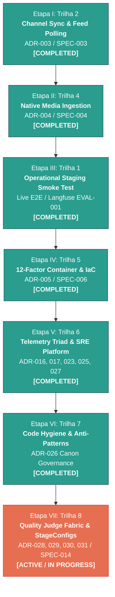

# Strategic Implementation Roadmap: Cresmo Knowledge Monolith

**Governing Method**: Doctor Stangler Architecture Method (Clean/Hexagonal DDD)  
**Status**: ACTIVE TRACK 8 IN PROGRESS  
**Date**: 2026-10-02  
**Completed Sequence**: **Trilha 2 (Done) $\longrightarrow$ Trilha 4 (Done) $\longrightarrow$ Trilha 1 (Done) $\longrightarrow$ Trilha 5 (Done) $\longrightarrow$ Trilha 6 (Done) $\longrightarrow$ Trilha 7 (Done)**  
**Current Active Track**: **Trilha 8 (Standardized StageConfig Closed-Loop Refinement — ADR-031 / SPEC-014)**  

---

## 1. Executive Intent & Architecture Scope

Following the foundational strangling of the Modular Monolith Core ([`ADR-001`](../adr/ADR-001-cresmo-modular-monolith-strangling.md)), Presentation Layer ([`ADR-002`](../adr/ADR-002-cresmo-presentation-cli.md)), and comprehensive 13-chapter PES Production Architecture ([`ADR-003`](../adr/ADR-003-pes-production-architecture.md)), the ecosystem has systematically progressed across successive architectural tracks under the Doctor Stangler Method:

$$\text{Phase 1: Stereoscopy (ADR)} \longrightarrow \text{Phase 2: Refractometry (Specs)} \longrightarrow \text{Phase 3: Surgery (TDD)} \longrightarrow \text{Phase 4: Treatment (Quality Gates)}$$

```mermaid
flowchart TD
    T2["Etapa I: Trilha 2<br><b>Channel Sync & Feed Polling</b><br>ADR-003 / SPEC-003<br><b>[COMPLETED]</b>"] --> 
    T4["Etapa II: Trilha 4<br><b>Native Media Ingestion</b><br>ADR-004 / SPEC-004<br><b>[COMPLETED]</b>"] --> 
    T1["Etapa III: Trilha 1<br><b>Operational Staging Smoke Test</b><br>Live E2E / Langfuse EVAL-001<br><b>[COMPLETED]</b>"] --> 
    T5["Etapa IV: Trilha 5<br><b>12-Factor Container & IaC</b><br>ADR-005 / SPEC-006<br><b>[COMPLETED]</b>"] -->
    T6["Etapa V: Trilha 6<br><b>Telemetry Triad & SRE Platform</b><br>ADR-016, 017, 023, 025, 027<br><b>[COMPLETED]</b>"] -->
    T7["Etapa VI: Trilha 7<br><b>Code Hygiene & Anti-Patterns</b><br>ADR-026 Canon Governance<br><b>[COMPLETED]</b>"] -->
    T8["Etapa VII: Trilha 8<br><b>Quality Judge Fabric & StageConfigs</b><br>ADR-028, 029, 030, 031 / SPEC-014<br><b>[ACTIVE / IN PROGRESS]</b>"]

    classDef done fill:#2a9d8f,stroke:#264653,color:#fff;
    classDef active fill:#e76f51,stroke:#d62828,color:#fff;
    class T2,T4,T1,T5,T6,T7 done;
    class T8 active;
```

---

## 2. Stage Breakdown & Execution Status

### Etapa I (Trilha 2): Channel Synchronization & Feed Polling (`cresmo sync`) — `STATUS: COMPLETED`
- **Delivered**: `SyncChannelUseCase`, alphabetical feed ordering, multi-criteria filtering (`SyncFilterCriteria`), SQLite WAL idempotency checking, and CLI `cresmo sync`.
- **Governing**: [`ADR-003`](../adr/ADR-003-pes-production-architecture.md), [`ADR-012`](../adr/ADR-012-multi-criteria-sync-filtering-and-alphabetical-feed-ordering.md), [`SPEC-003`](../specs/SPEC-003-channel-sync.md).

### Etapa II (Trilha 4): Native Media Ingestion & Legacy ISB.AI Decommissioning — `STATUS: COMPLETED`
- **Delivered**: `NativeMediaIngestionAdapter` wrapping `yt-dlp` and `whisper`, automatic scratch storage cleanup, and complete decommissioning of legacy `playground/isb.ai/`.
- **Governing**: [`ADR-004`](../adr/ADR-004-native-media-ingestion-decommissioning.md), [`SPEC-004`](../specs/SPEC-004-native-media-ingestion.md).

### Etapa III (Trilha 1): End-to-End Operational Staging Validation — `STATUS: COMPLETED`
- **Delivered**: Staging verification report, Langfuse live session trace confirmation, EVAL-001 rubric validation, and zero-defect vault reconciliation.
- **Governing**: [`STAGING-VERIFICATION-REPORT-001`](../staging/STAGING-VERIFICATION-REPORT-001.md), [`EVAL-001`](../specs/EVAL-001-cresmo-synthesis.md).

### Etapa IV (Trilha 5): Infrastructure as Code & 12-Factor Containerization — `STATUS: COMPLETED`
- **Delivered**: Single multi-role Dockerfile (`api`, `worker`, `cli`), `docker-compose.yml`, rootless security hardening, and GitHub Actions CI matrix.
- **Governing**: [`ADR-005`](../adr/ADR-005-multi-role-12factor-container-architecture.md), [`SPEC-006`](../specs/SPEC-006-container-execution-and-cicd-pipeline.md).

### Etapa V (Trilha 6): Telemetry Triad & SRE Platform — `STATUS: COMPLETED`
- **Delivered**:
  1. OpenTelemetry semantic conventions, single-video session replay (`{channel_id}:{video_id}`), and FinOps token attribution ([`ADR-016`](../adr/ADR-016-full-opentelemetry-conventions-session-replays-and-channel-governance.md), [`ADR-027`](../adr/ADR-027-unified-telemetry-vocabulary-and-langfuse-conventions.md)).
  2. Langfuse v4 prompt registry with local JSON fallback and PII anonymization ([`ADR-017`](../adr/ADR-017-langfuse-v4-prompt-management-and-anonymizer-governance.md)).
  3. Prometheus SRE Golden Signals (`cresmo_pipeline_stage_duration_seconds`, error counters, saturation gauges) and DORA metrics platform ([`ADR-023`](../adr/ADR-023-prometheus-sre-golden-signals-and-dora-metrics-platform.md), [`SPEC-008`](../specs/SPEC-008-metrics-port-and-prometheus-sre-dora.md)).
  4. Grafana Loki structured JSON log aggregation and trace correlation ([`ADR-025`](../adr/ADR-025-grafana-loki-structured-log-aggregation.md)).

### Etapa VI (Trilha 7): SOTA-KISS Code Hygiene & Anti-Pattern Governance — `STATUS: COMPLETED`
- **Delivered**: Codified 8 hygiene standards: PEP 8 import topography, zero magic literals/status codes, anti-swallowing and chaining, OS-agnostic paths/telemetry, bounded modularity, zero production asserts, parameter bundling, and dead code elimination. Modularized god files (`ports.py` $\rightarrow$ `ports/`, `value_objects.py` $\rightarrow$ `value_objects/`, `pipeline.py` $\rightarrow$ `pipeline/`).
- **Governing**: [`ADR-026`](../adr/ADR-026-clean-code-anti-patterns-and-code-smell-governance.md).

### Etapa VII (Trilha 8): Quality Judge Fabric & StageConfig Closed-Loop Refinement — `STATUS: ACTIVE / IN PROGRESS`
- **Sub-Track Milestones**:
  - **Milestone 8.1 (Fluid Prose Decoupling)**: Decouple orality purge from epistemic expansion; introduce `FluidTranscript` aggregate and position `transform_fluid_prose` as Stage 1 prior to catalog indexing ([`ADR-028`](../adr/ADR-028-decoupling-fluid-prose-and-socratic-gap-filling.md), [`SPEC-011`](../specs/SPEC-011-fluid-prose-detranscription-and-gap-filler-decoupling.md)) — `COMPLETED`.
  - **Milestone 8.2 (Unified LlmJudgePort)**: Unify scattered judge logic under `LlmJudgePort` with multi-provider adapters (`GeminiJudgeAdapter`, `OllamaJudgeAdapter`, `TypeSafeJudgeAdapter`, `LangfuseJudgeDecorator`) ([`ADR-029`](../adr/ADR-029-unified-quality-judge-port-and-evaluator-adapters.md), [`SPEC-012`](../specs/SPEC-012-quality-judge-evaluators-and-adapters.md)) — `COMPLETED`.
  - **Milestone 8.3 (Quality Gate Retry Fabric)**: Introduce `PipelineStageRunner.run_evaluated_stage` to eliminate coordinator boilerplate ([`ADR-030`](../adr/ADR-030-stage-quality-gate-and-evaluator-retry-fabric.md), [`SPEC-013`](../specs/SPEC-013-stage-quality-gate-and-evaluator-fabric.md)) — `COMPLETED`.
  - **Milestone 8.4 (StageConfig & Closed-Loop Reflection)**: Universal `StageConfig`, full elimination of `RawTranscript` in favor of `SourceTranscript`, `CandidateText` VO, `CritiqueSynthesizerPort` reflection retry loops, and 4-step fail-fast quarantine protocol with Stage 1 (`fluid_prose`) reference implementation ([`ADR-031`](../adr/ADR-031-standardized-stage-descriptor-and-closed-loop-refinement.md), [`SPEC-014`](../specs/SPEC-014-stage-descriptor-and-closed-loop-reflection.md)) — `COMPLETED`.
  - **Milestone 8.5 (Downstream Stage Refactoring & StageRegistry Enrollment)**: Sequentially refactor quarantined downstream stages (Stage 2: `raw_indexing`, Stage 3: `gap_filler`, Stage 4: `long_expander`, Stage 5: `wide_expander`, Stage 6: `atomic_inventory`, Stage 7: `atomic_batch`, Stage 8: `reconcile_mocs`) to register their declarative `StageDefinition` in `StageRegistry` and execute via `stage_runner.execute_stage(...)` — `ACTIVE`.

---

## 3. Governance Traceability Summary

| Stage | Sequence | Focus | Primary ADR | Governing Specs | Status | Quality Gate |
|---|---|---|---|---|:---:|---|
| **Etapa I** | **Trilha 2** | Channel Sync & Batch Polling | `ADR-003`, `ADR-012` | `SPEC-003` | `COMPLETED` | Unit tests + Lookback Invariants |
| **Etapa II** | **Trilha 4** | Native Ingestion & ISB Decommission | `ADR-004` | `SPEC-004` | `COMPLETED` | `MediaIngestionPort` Contract Tests |
| **Etapa III** | **Trilha 1** | Operational Staging Smoke Test | — | `EVAL-001` | `COMPLETED` | Langfuse Trace & Eval Gate (`EVAL-001`) |
| **Etapa IV** | **Trilha 5** | IaC & 12-Factor Containerization | `ADR-005` | `SPEC-006` | `COMPLETED` | Multi-role Dockerfile & CI Pipeline |
| **Etapa V** | **Trilha 6** | Telemetry Triad & SRE Platform | `ADR-016`, `ADR-023`, `ADR-025`, `ADR-027` | `SPEC-008`, `SPEC-010` | `COMPLETED` | Prometheus Golden Signals & Loki Logs |
| **Etapa VI** | **Trilha 7** | Clean Code Hygiene & Anti-Patterns | `ADR-026` | Architecture Canon | `COMPLETED` | Ruff clean, zero god files, strict typing |
| **Etapa VII** | **Trilha 8** | Quality Judge Fabric & StageConfigs | `ADR-028`, `ADR-029`, `ADR-030`, `ADR-031` | `SPEC-011`–`SPEC-014` | `ACTIVE` | Hermetic TDD, closed-loop reflection, quarantine |

---

## 4. Next Immediate Action

Under **Etapa VII (Trilha 8: Milestone 8.5)**, proceed with the sequential refactoring and registration of quarantined downstream stages:
1. **Stage 2 (`raw_indexing`)**: Register `StageDefinition` in `StageRegistry`, define `CandidateText` extraction for catalog summaries and principal concepts, and wire into `coordinator.py`.
2. **Stage 3 (`gap_filler`)**: Re-enable Socratic multi-pass epistemic expansion using `FluidTranscript` as input.
3. **Stages 4–8 (`long_expander`, `wide_expander`, `atomic_inventory`, `atomic_batch`, `reconcile_mocs`)**: Complete transition to declarative `StageConfig` execution.
