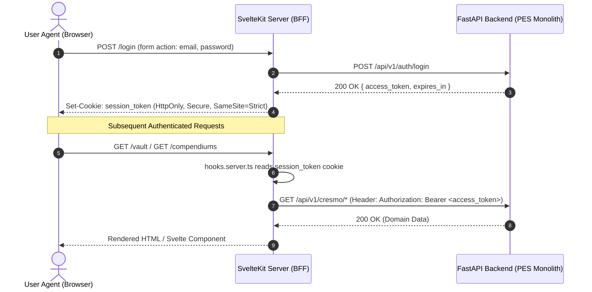

# SvelteKit Presentation BFF Integration Guide

This guide documents the **Backend-for-Frontend (BFF)** pattern integrating a **SvelteKit** web application with the **PES Modular Monolith FastAPI Backend**, adhering to [ADR-018](../adr/ADR-018-identity-and-access-management-bounded-context-and-sveltekit-bff.md) and [SPEC-007](../specs/SPEC-007-identity-and-access-management-bounded-context.md).

---

## 1. Architectural Model & Threat Defense

In accordance with OWASP Top 10 and the *Cloudflare Threat Report 2026*, browser storage (`localStorage` and `sessionStorage`) must never store raw JWTs or sensitive credentials to protect against infostealer malware (e.g. LummaC2) and Cross-Site Scripting (XSS).



---

## 2. SvelteKit Implementation (`hooks.server.ts`)

In your SvelteKit project root, configure `src/hooks.server.ts` to intercept requests and populate `event.locals`:

```typescript
import type { Handle } from '@sveltejs/kit';

const FASTAPI_BASE_URL = process.env.FASTAPI_BASE_URL || 'http://localhost:8000';

export const handle: Handle = async ({ event, resolve }) => {
    // 1. Read HttpOnly session cookie
    const token = event.cookies.get('pes_session_token');

    if (token) {
        try {
            // 2. Validate token against backend /me endpoint
            const res = await event.fetch(`${FASTAPI_BASE_URL}/auth/me`, {
                headers: {
                    Authorization: `Bearer ${token}`
                }
            });

            if (res.ok) {
                const user = await res.json();
                event.locals.user = user;
                event.locals.token = token;
            } else {
                // Token expired or revoked: clear cookie
                event.cookies.delete('pes_session_token', { path: '/' });
                event.locals.user = null;
                event.locals.token = null;
            }
        } catch (err) {
            console.error('Failed to authenticate session with FastAPI backend:', err);
            event.locals.user = null;
            event.locals.token = null;
        }
    } else {
        event.locals.user = null;
        event.locals.token = null;
    }

    return resolve(event);
};
```

---

## 3. Login Server Action (`src/routes/login/+page.server.ts`)

```typescript
import { fail, redirect } from '@sveltejs/kit';
import type { Actions } from './$types';

const FASTAPI_BASE_URL = process.env.FASTAPI_BASE_URL || 'http://localhost:8000';

export const actions: Actions = {
    default: async ({ request, cookies, fetch }) => {
        const data = await request.formData();
        const email = data.get('email');
        const password = data.get('password');

        if (!email || !password) {
            return fail(400, { message: 'Email and password are required.' });
        }

        const res = await fetch(`${FASTAPI_BASE_URL}/auth/login`, {
            method: 'POST',
            headers: { 'Content-Type': 'application/json' },
            body: JSON.stringify({ email, password })
        });

        if (!res.ok) {
            const err = await res.json().catch(() => ({ detail: 'Login failed.' }));
            return fail(res.status, { message: err.detail || 'Invalid credentials.' });
        }

        const { access_token, expires_in } = await res.json();

        // Set HttpOnly, Secure, SameSite=Strict cookie
        cookies.set('pes_session_token', access_token, {
            path: '/',
            httpOnly: true,
            secure: process.env.NODE_ENV === 'production',
            sameSite: 'strict',
            maxAge: expires_in || 900 // 15 minutes
        });

        throw redirect(303, '/dashboard');
    }
};
```

---

## 4. Logout Server Action (`src/routes/logout/+page.server.ts`)

```typescript
import { redirect } from '@sveltejs/kit';
import type { Actions } from './$types';

export const actions: Actions = {
    default: async ({ cookies }) => {
        cookies.delete('pes_session_token', { path: '/' });
        throw redirect(303, '/login');
    }
};
```

---

## 5. Proxying Cresmo API Calls with Bearer Token

Inside any SvelteKit load function (`+page.server.ts`), forward requests to the FastAPI backend using `event.locals.token`:

```typescript
import { error } from '@sveltejs/kit';
import type { PageServerLoad } from './$types';

const FASTAPI_BASE_URL = process.env.FASTAPI_BASE_URL || 'http://localhost:8000';

export const load: PageServerLoad = async ({ locals, fetch }) => {
    if (!locals.user || !locals.token) {
        throw error(401, 'Unauthorized');
    }

    const res = await fetch(`${FASTAPI_BASE_URL}/api/v1/cresmo/notes`, {
        headers: {
            Authorization: `Bearer ${locals.token}`
        }
    });

    if (!res.ok) {
        throw error(res.status, 'Failed to fetch Cresmo notes');
    }

    const notes = await res.json();
    return { user: locals.user, notes };
};
```
