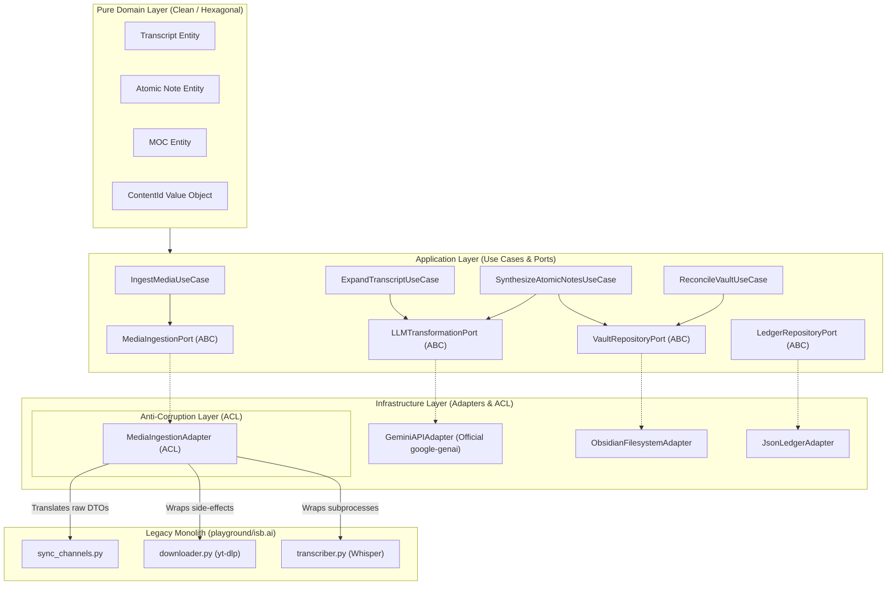

# DISCO-001: Cresmo & ISB.ai Ecosystem Legacy Archaeology & Reverse Engineering

**Date**: 2026-09-10  
**Phase**: Phase 0 — Angiography (Code Archaeology)  
**Author**: Doctor Stangler Committee (Angiographer)  
**Status**: APPROVED / FROZEN INPUT FOR PHASE 1  
**Target Systems**: `playground/cresmo/`, `playground/isb.ai/`, `PES` workspace root  

---

## 1. Executive Summary & Context

The PES workspace currently hosts an active, sophisticated knowledge ingestion, detranscription, expansion, and synthesis ecosystem primarily embodied in `playground/cresmo/` and its predecessor `playground/isb.ai/`.

While significant tactical modernization has already taken place (such as the centralized `CresmoConfig` via `pydantic-settings`, the `GeminiAPIAdapter` implementing `LLMTransformationPort`, and 73 passing unit/integration tests), the codebase exhibits the hallmarks of an organic prototype transitioning into a production platform:
1. **Direct Coupling to Legacy Core (`isb.ai`)**: `cresmo_ingestion.py` and `cresmo_pipeline.py` perform runtime `sys.path.insert(0, ...)` injection to import unencapsulated modules (`sync_channels.py`, `downloader.py`, `helper.py`) from `playground/isb.ai/`.
2. **Procedural GOD-Modules**: Core execution resides in massive procedural files (`cresmo_pipeline.py` with 2,017 lines; `cresmo_shared.py` with 1,040 lines; `isb.ai/sync_channels.py` with 902 lines).
3. **Dual Execution Runtime**: Pipeline stages support two completely different execution models simultaneously:
   - Modern Hexagonal Port/Adapter calls (`LLMTransformationPort` via official `google-genai` SDK).
   - Legacy IDE Subagent RPC (`agentapi` binary, gRPC endpoint `127.0.0.1:41667`, session history scraping, and trajectory polling in `~/.gemini/antigravity-ide/brain/`).
4. **Filesystem as Database (Implicit Storage Contracts)**: State persistence and inter-stage data handover rely strictly on disk files (`raw/`, `enriched/`, `wiki/`, `master/`, `processed_cresmo.json`, `brain.csv`), intermingling business logic with direct `Path.write_text()` and `Path.read_text()` operations.

---

## 2. Legacy Boundary Identification

### 2.1 Inventory of Analyzed Codebases

```
PES/
├── playground/
│   ├── cresmo/                      # [ACTIVE CORE] Cresmo Knowledge Ecosystem
│   │   ├── cresmo_config.py         # SSOT Pydantic-Settings (4-category config)
│   │   ├── cresmo_llm.py            # Hexagonal LLM Transformation Port & Gemini Adapter
│   │   ├── cresmo_pipeline.py       # Master Pipeline Stages 2->6 (2,017 LOC)
│   │   ├── cresmo_shared.py         # Shared utility functions, agentapi RPC, classifiers (1,040 LOC)
│   │   ├── cresmo_ingestion.py      # Stage 1 Ingestion wrapper (imports isb.ai)
│   │   ├── cresmo_main.py           # Unified CLI Entrypoint (sync / process / full)
│   │   ├── cresmo_geminiweb.py      # Web automation / browser integration fallback
│   │   ├── index_raw_transcripts.py # Local Ollama indexing & ETA logging
│   │   ├── concat_master.py         # Markdown aggregator (500k words chunking)
│   │   ├── convert_yaml_structure.py# Data migration: Old tags -> new top-level YAML
│   │   ├── fix_bracket_nodes.py     # Data repair: Strip [[ ]] from titles/filenames
│   │   ├── fix_yaml_tags.py         # Data repair: Clean malformed YAML tag lists
│   │   ├── export_cookies.py        # Browser cookie extractor for yt-dlp
│   │   └── tests/                   # 73 passing unit & integration tests
│   │
│   ├── isb.ai/                      # [LEGACY UPSTREAM] Intelligent Second Brain v1
│   │   ├── sync_channels.py         # YouTube channel monitor & multithreaded downloader (902 LOC)
│   │   ├── downloader.py            # yt-dlp wrapper, JSON3 subtitle parser, audio fallback (585 LOC)
│   │   ├── helper.py                # Regex sanitizers, YAML header parsers, HTTP fetchers
│   │   ├── transcriber.py           # Whisper local audio transcription
│   │   ├── ollama_processor.py      # Local Ollama synthesis into Obsidian notes
│   │   ├── stage2.py                # Legacy stage 2 expander
│   │   ├── detranscribe_linear.py   # Linear detranscription script
│   │   ├── brain.csv                # 21MB monolithic index CSV
│   │   └── channel_cache.json       # 28MB raw channel metadata cache
```

### 2.2 System Control & Authorship
- **Internal vs External**: Both `cresmo` and `isb.ai` are internal, first-party codebases under full repository control.
- **Upstream / Downstream**: `isb.ai` is the ancestral monolith from which `cresmo` branched out to implement atomic notes, MOC reconciliation, and Braudelian/Jaspers expansion.

---

## 3. Business Rules Extracted from Code

### 3.1 Stage 1: Raw Media & Transcript Ingestion (`cresmo_ingestion.py` + `isb.ai`)
1. **Dual Seed Ingestion**: Ingestion accepts two sources:
   - Channel/Playlist URLs manifest (`playlist.txt`).
   - Standalone priority video URLs (`playlist-priority.txt`).
2. **Priority Video Fastpath**: Priority videos are processed ahead of standard channels. If `sync_missing_priority_video` finds a requested priority entry missing from `raw/`, it immediately triggers an on-demand download of that single video.
3. **Native Subtitles Prioritization (429 Mitigation)**: `downloader.py` strictly prioritizes native spoken captions (`pt-orig`, `pt-BR`, `en-orig`) and filters out on-the-fly machine-translated subtitles containing `tlang=`, which trigger YouTube HTTP 429 rate-limiting.
4. **Whisper Fallback**: If no subtitles exist, audio is extracted as OGG/m4a, transcribed using `openai-whisper` (default model `base`), and deleted post-transcription unless `keep_audio=True`.
5. **Idempotency**: Existing `.txt` files in `raw/` matching `*-{video_id}.txt` prevent re-downloading.

### 3.2 Stage 2: Socratic Gap-Filling & Fluid Prose Expansion (`cresmo_gap_filler`)
1. **Target Directory Isolation**: All expanded transcripts are saved exclusively to `playground/cresmo/enriched/[Channel_Name]/[Video_ID].md`. Output is strictly forbidden from writing back to `raw/`.
2. **Multi-Pass Progressive Enrichment**: Default 3 sequential passes (`stage2_passes=3`):
   - **Pass 1**: Converts raw spoken transcript into dense, continuous prose, purging oralities, colloquialisms, hesitations, first-person speech, bullet points, and tables. Appends a mandatory `## Informações Complementares` section.
   - **Passes 2+**: Audits previous pass for epistemic gaps, adds verified historical/scientific context, figures, and structural metaphors.
3. **Validation Invariants**: File must exceed `min_valid_output_bytes` (300 bytes) and contain the `## Informações Complementares` section to be considered valid.

### 3.3 Stage 2.5: Deep Longitudinal & Synchronic Expansion (`cresmo_expander`)
1. **Sequential Dual Expansion**:
   - **Step 1 (cresmo-long-expander)**: Grounded in Fernand Braudel's *longue durée*. Deconstructs historical causation across 3 tiers (first-order determinants, second-order structures, third-order opportunities) and plural temporalities (structural permanence across centuries/millennia vs conjunctural cycles).
   - **Step 2 (cresmo-wide-expander)**: Grounded in Karl Jaspers' Axial Time (*Achsenzeit*). Evaluates synchronic connectivity across global networks and civilizational parallelisms/analogies without direct contact.
2. **In-Place Compendium Growth**: Both sub-stages expand the Markdown file in-place within `enriched/`.

### 3.4 Stage 3: Two-Phase Batched Atomic Note Synthesis (`cresmo_notes`)
1. **Phase 1 — Holistic Inventory Discovery**:
   - Scans the entire enriched compendium at `temperature=0.0`.
   - Discovers an exhaustive list of all distinct conceptual entities (`concept`, `entity`, `event`, `process`).
   - Normalizes titles (strips `[[` and `]]`, removes invalid filename characters).
   - Writes the inventory checkpoint immediately to `enriched/[Channel]/[Video_ID].json`.
2. **Phase 2 — Batched Synthesis**:
   - Partitions pending entities into small batches (`atomic_batch_size <= 5`, default 5) to prevent context exhaustion and hallucination.
   - Generates structured note objects matching `AtomicNoteModel`:
     - Frontmatter attributes: `type`, `content`, `domain`, `cluster`, `source`, `aliases`.
     - `definition` (epistemic, contextual analysis).
     - `direct_relations` (list of bidirectional `[[WikiLinks]]`).
     - `causal_matrix` (`cause`, `effect`, `epistemic_attribution`).
     - `cross_context` (`precursors`, `lateral_events`, `aftermath`).
   - Persists incrementally to disk after *every* batch, enabling uninterrupted resumption.

### 3.5 Stage 4: Vault Proliferation & Note Indexing (`parse_and_proliferate_notes`)
1. **Frontmatter Standardization**: Converts raw note dictionaries to standard Obsidian YAML frontmatter (with normalized tags, top-level keys, aliases list).
2. **Folder Typology Placement**: Notes are written to `wiki/<note_type>/[Exact Title].md` where `note_type` is clamped to `entity`, `concept`, `event`, or `process`.
3. **Master Index Reconciliation**: Updates `wiki/_index.json` with note metadata, aliases, and file locations to allow O(1) tiered lookup.

### 3.6 Stage 5 & 6: Aggregation & MOC Reconciliation
1. **Master Compendiums (`concat_master.py`)**: Concatenates channel transcripts into `master/[Channel].md`, automatically splitting at 500,000 words (`[Channel]-1.md`, `[Channel]-2.md`).
2. **MOC Integration (`cresmo_moc_manager`)**: Groups atomic notes into Maps of Content (`wiki/MOCs/MOC_*.md`), eliminating orphaned notes and ensuring bi-directional linkage.
3. **Audit Ledger**: Appends completed video IDs to `processed_cresmo.json`.

---

## 4. Implicit Contracts & Data Formats

### 4.1 Raw Transcript File Format (`raw/[Channel]/[Video_ID].txt`)
```yaml
---
video_id: dQw4w9WgXcQ
channel_name: Example Channel
channel_id: UC_x5XG1OV2P6uZZ5FSM9Ttw
upload_date: 2026-09-01
video_title: "Title of the Video"
video_url: https://www.youtube.com/watch?v=dQw4w9WgXcQ
category: politics_br
---
Raw spoken transcript body text starts here...
```

### 4.2 Enriched Compendium Format (`enriched/[Channel]/[Video_ID].md`)
```markdown
# [Sanitized Title]

Continuous, dense prose without bullet lists, tables, or speech oralities...

## Informações Complementares

Factual data, historical context, references, and epistemic expansions...
```

### 4.3 Atomic Note Intermediate JSON (`enriched/[Channel]/[Video_ID].json`)
```json
{
  "video_id": "dQw4w9WgXcQ",
  "channel_name": "Example Channel",
  "inventory": [
    {"title": "Concept Name", "type": "concept"}
  ],
  "notes": [
    {
      "title": "Concept Name",
      "type": "concept",
      "content": ["cresmo", "politics_br"],
      "domain": "Domain Name",
      "cluster": "Cluster Name",
      "source": "Example Channel - dQw4w9WgXcQ",
      "aliases": ["Alternative Name"],
      "definition": "Dense contextual definition...",
      "direct_relations": ["[[Related Concept A]]", "[[Related Concept B]]"],
      "causal_matrix": {
        "cause": "Underlying premise",
        "effect": "Observable impact",
        "epistemic_attribution": "Authoritative origin"
      },
      "cross_context": {
        "precursors": "Historical precursors",
        "lateral_events": "Synchronous occurrences",
        "aftermath": "Long-term consequences"
      }
    }
  ]
}
```

### 4.4 Final Atomic Note Markdown (`wiki/<note_type>/[Exact Title].md`)
```markdown
---
type: concept
content:
  - cresmo
  - politics_br
domain: Political Theory
cluster: Institutional Dynamics
source: Example Channel - dQw4w9WgXcQ
aliases: ["Alternative Name"]
---

# [[Exact Title]]

## Definição & Análise Contextual
Dense contextual definition...

## Conexões & Relações Diretas
- [[Related Concept A]]
- [[Related Concept B]]

## Matriz Causal
- **Causa/Premissa**: Underlying premise
- **Efeito/Impacto**: Observable impact
- **Atribuição Epistêmica**: Authoritative origin

## Redes de Conexão (Cross-Context)
- **Precursores**: Historical precursors
- **Eventos Laterais**: Synchronous occurrences
- **Desdobramentos**: Long-term consequences
```

---

## 5. Schema & Format Transitions (Technical Debt Analysis)

1. **YAML Frontmatter Evolution**:
   - *Legacy*: Embedded tags in `tags: [type/concept, domain/politics, cluster/brazil]`.
   - *Transitional*: Scripts `convert_yaml_structure.py` and `fix_yaml_tags.py` were written to rewrite notes into explicit keys (`type: concept`, `domain: politics`, `cluster: brazil`).
   - *Current*: `AtomicNoteModel.to_markdown()` writes explicit keys directly.
2. **Title Bracket Sanitization**:
   - *Legacy*: Notes frequently had titles like `[[My Note Title]].md` or `# [[My Note Title]]`.
   - *Transitional*: Script `fix_bracket_nodes.py` was introduced to sanitize brackets from filesystem stems and H1 headers.
   - *Current*: `AtomicNoteModel` validator strips brackets during JSON parsing.
3. **Single-Shot vs Batched Synthesis**:
   - *Legacy*: A single massive prompt generated all atomic notes in one LLM call, frequently truncating output or omitting entities.
   - *Current*: Two-phase inventory discovery + batched synthesis (`batch_size=5`).

---

## 6. Anti-Corruption Layer (ACL) & Strangling Strategy

To decouple clean domain code from legacy code and transition to the **Doctor Stangler Modular Monolith Architecture**, the following Anti-Corruption Layers (ACL) are mandatory:



### 6.1 Media Ingestion ACL (`MediaIngestionPort`)
- **Problem**: `cresmo_ingestion.py` directly executes `sys.path.insert(0, str(ISB_DIR))` and mutates global state like `downloader.RATE_LIMIT_LOG_FILE`.
- **ACL Strategy**: 
  - Define `MediaIngestionPort(ABC)` in `application/ports.py` with pure domain signatures: `ingest_channel(channel_url, lookback_days) -> list[RawMediaDTO]` and `ingest_video(video_url) -> RawMediaDTO`.
  - Implement `LegacyISBMediaIngestionAdapter` in `infrastructure/adapters/`. The adapter isolates all `sys.path` tampering, translates legacy dictionaries into strongly-typed Pydantic DTOs, and captures stdout/exceptions safely.
  - The Domain and Application layers never import or reference `isb.ai`.

### 6.2 Vault Persistence ACL (`VaultRepositoryPort`)
- **Problem**: File writes and directory traversals (`wiki/`, `enriched/`, `_index.json`) are hardcoded directly into pipeline orchestration functions with inline `Path.write_text()`.
- **ACL Strategy**:
  - Define `VaultRepositoryPort(ABC)` with contracts: `save_atomic_note(note: AtomicNote) -> None`, `get_note_by_title(title: NoteTitle) -> AtomicNote | None`, `update_index(entries: list[IndexEntry]) -> None`.
  - Implement `ObsidianVaultAdapter` in `infrastructure/adapters/`. Handles file paths, atomic writes (`.tmp` file rename), frontmatter serialization, and bracket stripping.

### 6.3 Separation of Procedural Pipeline into Dedicated Use Cases
- Break down `cresmo_pipeline.py` (2,017 LOC) into cohesive Application Use Cases:
  - `ExpandFluidProseUseCase` (Stage 2)
  - `LongitudinalSynchronicExpansionUseCase` (Stage 2.5)
  - `DiscoverAtomicInventoryUseCase` (Stage 3a)
  - `SynthesizeAtomicBatchUseCase` (Stage 3b)
  - `ProliferateVaultNotesUseCase` (Stage 4)
  - `ReconcileMOCsUseCase` (Stage 6)

---

## 7. Conclusions & Next Steps for Stereoscopy (Phase 1)

1. **Cognitive Isolation Verified**: The business rules, implicit contracts, and schema constraints of both `cresmo` and `isb.ai` have been mapped and documented. Legacy code must not be copied directly; it serves as behavioral specification.
2. **Readiness for ADR**: The exact boundaries, Value Objects (`ContentId`, `NoteTitle`, `NoteType`, `CausalMatrix`), Entities (`AtomicNote`, `Transcript`, `Compendium`), and Ports (`MediaIngestionPort`, `LLMTransformationPort`, `VaultRepositoryPort`) are now clear.
3. **Phase 1 Action**: Transition to **Phase 1: Stereoscopy (`stangler-stereoscopy`)** to draft the formal Architectural Decision Record (`docs/adr/ADR-001-modular-monolith-cresmo-strangling.md`), linking to this frozen discovery document.
