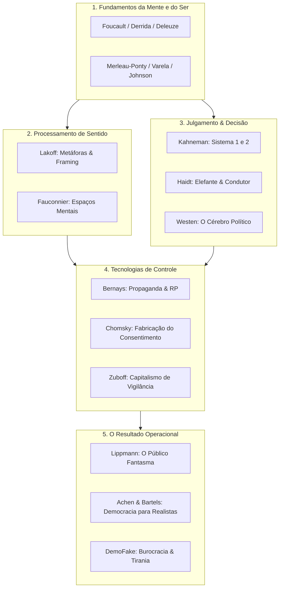

# Classificação Contextual e Categorização Temática da Bibliografia

> **Objetivo:** Organizar, categorizar e classificar por ordem de relevância conceitual (*Tiers*) a lista completa de obras sobre teoria política, engenharia do consentimento, linguística cognitiva, psicologia moral, arquitetura de escolha e filosofia continental.
> 
> **Critério de Tiering:**
> - **Tier 1 (Obras Fundacionais / Leitura Obrigatória):** Clássicos e marcos conceituais que definem a estrutura teórica do campo e fundamentam a compreensão da engrenagem política, cognitiva e midiática.
> - **Tier 2 (Obras de Aprofundamento / Aplicação Sistêmica):** Obras de alto rigor acadêmico e forte valor explicativo que expandem, desdobram e operacionalizam os pilares do Tier 1.
> - **Tier 3 (Obras Instrumentais / Estudos Específicos e Guias Práticos):** Aplicações técnicas, manuais operacionais de comunicação, análises de nicho ou manifestações práticas do ecossistema.

---

## 1. Teoria Democrática, Comportamento Eleitoral & Desmistificação do Votante Racional

Esta categoria reúne as obras que desmontam o mito do "eleitor racional e informado", analisando como a democracia opera na prática através da competição de elites, identitarismo de grupo e atalhos cognitivos.

### Tier 1 (Fundacionais)
- [**Public Opinion**, *Walter Lippmann* (**Opinião Pública**)](https://www.amazon.com.br/s?k=Opini%C3%A3o+P%C3%BAblica+Walter+Lippmann) — O marco inicial da crítica ao espectador democrático; demonstra como o público reage a "pseudo-ambientes" simplificados construídos pelos meios de comunicação.
- [**The Phantom Public**, *Walter Lippmann* (**O Público Fantasma**)](https://www.amazon.com.br/s?k=O+P%C3%BAblico+Fantasma+Walter+Lippmann) — Apresenta o cidadão comum como incapaz de governar, atuando apenas como espectador desinformado acionado em momentos de crise.
- [**Democracy for Realists**, *Christopher H. Achen & Larry M. Bartels* (**Democracia para Realistas**)](https://www.amazon.com.br/s?k=Democracia+para+Realistas+Christopher+H.+Achen+%26+Larry+M.+Bartels) — Provoca uma revolução na ciência política moderna ao provar empiricamente que o voto expressa lealdade a identidades sociais, e não escolhas ideológico-programáticas.
- [**Democracia Fake: A tirania contemporânea estrangula a liberdade utilizando a própria burocracia legal** (**Democracia Fake**)](https://www.amazon.com.br/s?k=Democracia+Fake) — Obra tese do ecossistema; estabelece o diagnóstico das democracias liberais cooptadas por estamentos burocráticos sob fachada de legalidade.
- [**An Economic Theory of Democracy**, *Anthony Downs* (**Uma Teoria Econômica da Democracia**)](https://www.amazon.com.br/s?k=Uma+Teoria+Econ%C3%B4mica+da+Democracia+Anthony+Downs) — Formula o modelo de escolha racional e a "ignorância racional" do eleitorado, onde o custo de se informar supera o benefício de um único voto.
- [**Capitalism, Socialism and Democracy**, *Joseph Schumpeter* (**Capitalismo, Socialismo e Democracia**)](https://www.amazon.com.br/s?k=Capitalismo%2C+Socialismo+e+Democracia+Joseph+Schumpeter) — Redefine a democracia não como o "governo do povo", mas como um arranjo institucional para a competição de elites pelo voto.
- [**The Nature of Belief Systems in Mass Publics**, *Philip E. Converse* (**A Natureza dos Sistemas de Crença no Público de Massa**)](https://www.amazon.com.br/s?k=A+Natureza+dos+Sistemas+de+Cren%C3%A7a+no+P%C3%BAblico+de+Massa+Philip+E.+Converse) — Estudo seminal que revelou que a grande maioria do eleitorado carece de ideologia coerente e adota opiniões desconexas.
- [**The Myth of the Rational Voter**, *Bryan Caplan* (**O Mito do Votante Racional**)](https://www.amazon.com.br/s?k=O+Mito+do+Votante+Racional+Bryan+Caplan) — Demonstra que os eleitores não são apenas ignorantes, mas ativamente irracionais, apoiando más políticas devido a vieses ideológicos de custo zero individual.
- [**The Public and Its Problems**, *John Dewey* (**O Público e Seus Problemas**)](https://www.amazon.com.br/s?k=O+P%C3%BAblico+e+Seus+Problemas+John+Dewey) — O contraponto clássico a Lippmann sobre a formação do público e os desafios da democracia participativa diante da complexidade moderna.

### Tier 2 (Aprofundamento)
- [**Neither Liberal nor Conservative**, *Donald R. Kinder & Nathan P. Kalmoe* (**Nem Liberal Nem Conservador**)](https://www.amazon.com.br/s?k=Nem+Liberal+Nem+Conservador+Donald+R.+Kinder+%26+Nathan+P.+Kalmoe) — Confirma empiricamente a inocência ideológica da maioria do público americano.
- [**The Rational Public**, *Benjamin I. Page & Robert Y. Shapiro* (**O Público Racional**)](https://www.amazon.com.br/s?k=O+P%C3%BAblico+Racional+Benjamin+I.+Page+%26+Robert+Y.+Shapiro) — Argumenta que, apesar da ignorância individual, as preferências coletivas agregadas demonstram estabilidade e racionalidade.
- [**Why Voters Choose Bad Leaders** (**Por Que os Eleitores Escolhem Maus Líderes**)](https://www.amazon.com.br/s?k=Por+Que+os+Eleitores+Escolhem+Maus+L%C3%ADderes) — Análise dos erros sistemáticos de avaliação retrospectiva do eleitorado, que pune ou recompensa líderes por eventos aleatórios e memórias recentes.
- [**Identity Crisis**, *John Sides, Michael Tesler, Lynn Vavreck* (**Crise de Identidade**)](https://www.amazon.com.br/s?k=Crise+de+Identidade+John+Sides%2C+Michael+Tesler%2C+Lynn+Vavreck) — Exame empírico do papel decisivo da polarização de identidade racial e cultural em eleições recentes.

### Tier 3 (Instrumental)
- [**Invaluable Citizens** (**Cidadãos Inestimáveis**)](https://www.amazon.com.br/s?k=Cidad%C3%A3os+Inestim%C3%A1veis) — Análise da identidade de grupo como motor primário da participação e engajamento político dos indivíduos.
- [**Unspoken** (**Não Dito: O Protesto Silencioso**)](https://www.amazon.com.br/s?k=N%C3%A3o+Dito%3A+O+Protesto+Silencioso) — O papel do protesto silencioso e da resistência passiva na capacitação da participação cidadã.
- [**Triggered** (**Gatilhos: Ressentimento Cultural na Política**)](https://www.amazon.com.br/s?k=Gatilhos%3A+Ressentimento+Cultural+na+Pol%C3%ADtica) — Estudo da transformação do ressentimento cultural e da sensação de ultraje em ferramenta de mobilização partidária.

---

## 2. Engenharia do Consentimento, Relações Públicas & Manipulação de Mídia

Analisa as tecnologias e metodologias de moldagem da opinião pública, controle da informação, propaganda de massa, relações públicas e capitalismo de vigilância.

### Tier 1 (Fundacionais)
- [**Propaganda**, *Edward Bernays* (**Propaganda**)](https://www.amazon.com.br/s?k=Propaganda+Edward+Bernays) — O manual fundador das relações públicas e da manipulação consciente do comportamento e das opiniões das massas.
- [**The Engineering of Consent**, *Edward Bernays* (**A Engenharia do Consentimento**)](https://www.amazon.com.br/s?k=A+Engenharia+do+Consentimento+Edward+Bernays) — Consolida a aplicação de métodos científicos da psicologia e psicanálise para garantir a aprovação de agendas públicas e corporativas.
- [**Crystallizing Public Opinion**, *Edward Bernays* (**Cristalizando a Opinião Pública**)](https://www.amazon.com.br/s?k=Cristalizando+a+Opini%C3%A3o+P%C3%BAblica+Edward+Bernays) — Define o papel do consultor de Relações Públicas como o arquiteto que alinha o interesse privado à psicologia coletiva.
- [**Manufacturing Consent: The Political Economy of the Mass Media**, *Noam Chomsky & Edward S. Herman* (**A Fabricação do Consentimento**)](https://www.amazon.com.br/s?k=A+Fabrica%C3%A7%C3%A3o+do+Consentimento+Noam+Chomsky+%26+Edward+S.+Herman) — Apresenta o Modelo de Propaganda e os cinco filtros midiáticos que moldam a notícia.
- [**The Age of Surveillance Capitalism**, *Shoshana Zuboff* (**A Era do Capitalismo de Vigilância**)](https://www.amazon.com.br/s?k=A+Era+do+Capitalismo+de+Vigil%C3%A2ncia+Shoshana+Zuboff) — Análise monumental da transição da propaganda tradicional para a modificação comportamental automatizada via dados em grande escala.
- [**On Television**, *Pierre Bourdieu* (**Sobre a Televisão**)](https://www.amazon.com.br/s?k=Sobre+a+Televis%C3%A3o+Pierre+Bourdieu) — Crítica sociológica sobre como a lógica televisiva impõe o imediatismo, a busca por sensacionalismo e a degradação do debate intelectual.

### Tier 2 (Aprofundamento)
- [**Setting the Agenda**, *Maxwell McCombs* (**Agendando a Pauta / Agenda-Setting**)](https://www.amazon.com.br/s?k=Agendando+a+Pauta+%2F+Agenda-Setting+Maxwell+McCombs) — Fundamenta a Teoria do Agendamento: a mídia não diz às pessoas o que pensar, mas sobre o que pensar.
- [**The Filter Bubble**, *Eli Pariser* (**O Filtro Bolha**)](https://www.amazon.com.br/s?k=O+Filtro+Bolha+Eli+Pariser) — Examina como os algoritmos de personalização criam ecossistemas de informação isolados que amplificam vieses de confirmação.
- [**Spin Doctoring** (**Spin Doctoring: A Manipulação das Notícias**)](https://www.amazon.com.br/s?k=Spin+Doctoring%3A+A+Manipula%C3%A7%C3%A3o+das+Not%C3%ADcias) — Investigação dos bastidores do gerenciamento de crises e manipulação jornalística por assessores políticos.
- [**Spin: How Politics Has the Media on a Leash** (**Spin: Como a Política Coleira a Mídia**)](https://www.amazon.com.br/s?k=Spin%3A+Como+a+Pol%C3%ADtica+Coleira+a+M%C3%ADdia) — Estrategistas de comunicação manipulam os veículos de imprensa para controlar as pautas políticas.
- [**Political Public Relations** (**Relações Públicas Políticas**)](https://www.amazon.com.br/s?k=Rela%C3%A7%C3%B5es+P%C3%BAblicas+Pol%C3%ADticas) — O ecossistema institucional contemporâneo de gestão de imagem de governos e partidos.
- [**The Packaging of the Politician** (**A Embalagem do Político**)](https://www.amazon.com.br/s?k=A+Embalagem+do+Pol%C3%ADtico) — A transformação do líder político em produto publicitário com posicionamento de marca.
- [**Flat Earth News**, *Nick Davies* (**Notícias da Terra Plana**)](https://www.amazon.com.br/s?k=Not%C3%ADcias+da+Terra+Plana+Nick+Davies) — Revelação das pressões econômicas que reduziram o jornalismo ao "churnalismo" de agências sem checagem de fatos.
- [**The Father of Spin**, *Larry Tye* (**O Pai do Spin**)](https://www.amazon.com.br/s?k=O+Pai+do+Spin+Larry+Tye) — Biografia crítica de Edward Bernays e o nascimento da indústria do convencimento.
- [**Toxic Sludge Is Good for You!**, *John Stauber & Sheldon Rampton* (**Lama Tóxica É Boa para Você!**)](https://www.amazon.com.br/s?k=Lama+T%C3%B3xica+%C3%89+Boa+para+Voc%C3%AA%21+John+Stauber+%26+Sheldon+Rampton) — Denúncia de como a indústria de RP utiliza institutos de fachada e cientistas de aluguel para desinformar.
- [**Captains of Consciousness**, *Stuart Ewen* (**Capitães da Consciência**)](https://www.amazon.com.br/s?k=Capit%C3%A3es+da+Consci%C3%AAncia+Stuart+Ewen) — Análise histórica do surgimento da publicidade corporativa como ferramenta de controle social e disciplina do trabalho.
- [**Mass Communication Theory**, *Denis McQuail* (**Teoria da Comunicação de Massa**)](https://www.amazon.com.br/s?k=Teoria+da+Comunica%C3%A7%C3%A3o+de+Massa+Denis+McQuail) — Mapeamento estruturado das teorias de impacto e mediação da comunicação de massa na cultura.
- [**The Liberty of the Press** (**A Liberdade de Imprensa**)](https://www.amazon.com.br/s?k=A+Liberdade+de+Imprensa) — Fundamentação filosófico-jurídica do papel da imprensa livre no combate ao dogmatismo.

### Tier 3 (Instrumental)
- [**No Logo**, *Naomi Klein* (**Sem Logo: A Tirania das Marcas**)](https://www.amazon.com.br/s?k=Sem+Logo%3A+A+Tirania+das+Marcas+Naomi+Klein) — Crítica à expansão das supermarcas globais e à mercantilização do espaço público.
- [**The Semiotics of Press Cartoons** (**A Semiótica dos Cartuns de Imprensa**)](https://www.amazon.com.br/s?k=A+Semi%C3%B3tica+dos+Cartuns+de+Imprensa) — Análise semiótica da condensação ideológica em cartuns e charges jornalísticas.

---

## 3. Linguística Cognitiva, Metáforas Conceituais & Framing Político

Analisa como os enquadramentos conceituais (*frames*) e a linguagem figurativa estruturam diretamente a cognição humano-política.

### Tier 1 (Fundacionais)
- [**Don't Think of an Elephant!**, *George Lakoff* (**Não Pense em Um Elefante!**)](https://www.amazon.com.br/s?k=N%C3%A3o+Pense+em+Um+Elefante%21+George+Lakoff) — O guia essencial sobre *framing*; demonstra que refutar o enquadramento do adversário aciona e reforça exatamente a estrutura mental dele.
- [**Metaphors We Live By**, *George Lakoff & Mark Johnson* (**Metáforas da Vida Cotidiana / Metáforas Pelas Quais Vivemos**)](https://www.amazon.com.br/s?k=Met%C3%A1foras+da+Vida+Cotidiana+%2F+Met%C3%A1foras+Pelas+Quais+Vivemos+George+Lakoff+%26+Mark+Johnson) — A obra fundacional da linguística cognitiva; estabelece que a metáfora não é mero recurso estilístico, mas o próprio tecido do pensamento consciente e inconsciente.
- [**Moral Politics**, *George Lakoff* (**Política Moral**)](https://www.amazon.com.br/s?k=Pol%C3%ADtica+Moral+George+Lakoff) — Aplica a linguística cognitiva à política, demonstrando como as ideologias Conservadora (Pai Rigoroso) e Progressista (Nurturant Parent) derivam de modelos mentais de família.
- [**Women, Fire, and Dangerous Things**, *George Lakoff* (**Mulheres, Fogo e Coisas Perigosas**)](https://www.amazon.com.br/s?k=Mulheres%2C+Fogo+e+Coisas+Perigosas+George+Lakoff) — Estudo monumental sobre categorização mental, protótipos e a mente corporificada.
- [**Philosophy in the Flesh**, *George Lakoff & Mark Johnson* (**Filosofia na Carne**)](https://www.amazon.com.br/s?k=Filosofia+na+Carne+George+Lakoff+%26+Mark+Johnson) — A desconstrução da tradição filosófica ocidental à luz da mente enativa e corporificada.
- [**The Way We Think**, *Gilles Fauconnier & Mark Turner* (**A Forma Como Pensamos**)](https://www.amazon.com.br/s?k=A+Forma+Como+Pensamos+Gilles+Fauconnier+%26+Mark+Turner) — Formula a Teoria da Mesclagem Conceitual (*Conceptual Blending*), explicando como a mente combina cenários para criar novos sentidos.
- [**Mental Spaces**, *Gilles Fauconnier* (**Espaços Mentais**)](https://www.amazon.com.br/s?k=Espa%C3%A7os+Mentais+Gilles+Fauconnier) — Introduz a teoria dos Espaços Mentais na construção contínua do significado durante o discurso.

### Tier 2 (Aprofundamento)
- [**Words That Work**, *Frank Luntz* (**Palavras que Funcionam**)](https://www.amazon.com.br/s?k=Palavras+que+Funcionam+Frank+Luntz) — A perspectiva do mestre de *framing* republicano; demonstra empiricamente que "não é o que você diz, é o que as pessoas ouvem".
- [**Surfacing the Mind** (**Emergindo a Mente**)](https://www.amazon.com.br/s?k=Emergindo+a+Mente) — Exploração das manifestações superficiais da linguagem enquanto janelas para a cognição profunda.
- [**Metaphor and Thought**, *Andrew Ortony, ed.* (**Metáfora e Pensamento**)](https://www.amazon.com.br/s?k=Met%C3%A1fora+e+Pensamento+Andrew+Ortony%2C+ed.) — Coletânea clássica interdisciplinar sobre a centralidade do pensamento metafórico.
- [**Reading Minds**, *Mark Turner* (**Lendo Mentes**)](https://www.amazon.com.br/s?k=Lendo+Mentes+Mark+Turner) — A interseção da ciência cognitiva com a crítica literária e textual.
- [**Poetic Thought in Psychology and Anthropology** (**Pensamento Poético na Psicologia e Antropologia**)](https://www.amazon.com.br/s?k=Pensamento+Po%C3%A9tico+na+Psicologia+e+Antropologia) — Investigação sobre como o pensamento poético e figurativo molda culturas e identidades humanas.

---

## 4. Filosofia da Mente, Mente Enativa & Embodied Cognition

O substrato biológico e corporificado do pensamento humano, rejeitando o dualismo mente-corpo e o modelo puramente computacionalista sem ancoragem perceptivo-motora.

### Tier 1 (Fundacionais)
- [**The Body in the Mind**, *Mark Johnson* (**O Corpo na Mente**)](https://www.amazon.com.br/s?k=O+Corpo+na+Mente+Mark+Johnson) — Demonstra como os esquemas de imagem (*image schemas*) nascidos da experiência física infantil formam a base da razão e da abstração.
- [**The Embodied Mind**, *Francisco Varela, Evan Thompson, Eleanor Rosch* (**A Mente Corporificada**)](https://www.amazon.com.br/s?k=A+Mente+Corporificada+Francisco+Varela%2C+Evan+Thompson%2C+Eleanor+Rosch) — A obra fundacional do enativismo; integra fenomenologia, ciência cognitiva e cognição corporificada.
- [**Principles of Categorization**, *Eleanor Rosch* (**Princípios de Categorização**)](https://www.amazon.com.br/s?k=Princ%C3%ADpios+de+Categoriza%C3%A7%C3%A3o+Eleanor+Rosch) — Estabelece a Teoria dos Protótipos, demonstrando que as categorias humanas não possuem fronteiras rígidas, mas gradações em torno de exemplares típicos.
- [**Syntactic Structures**, *Noam Chomsky* (**Estruturas Sintáticas**)](https://www.amazon.com.br/s?k=Estruturas+Sint%C3%A1ticas+Noam+Chomsky) — A revolução gerativa; introduz a gramática transformacional e a faculdade inata da linguagem.
- [**The Language of Thought**, *Jerry Fodor* (**A Linguagem do Pensamento**)](https://www.amazon.com.br/s?k=A+Linguagem+do+Pensamento+Jerry+Fodor) — Formula a hipótese do "Linguajar da Mente" (*Mentalese*) e a arquitetura representacional.
- [**The Modularity of Mind**, *Jerry Fodor* (**A Modularidade da Mente**)](https://www.amazon.com.br/s?k=A+Modularidade+da+Mente+Jerry+Fodor) — Estabelece a tese dos módulos cognitivos inatos, rápidos e encapsulados informacionalmente.
- [**Phénoménologie de la perception**, *Maurice Merleau-Ponty* (**Fenomenologia da Percepção**)](https://www.amazon.com.br/s?k=Fenomenologia+da+Percep%C3%A7%C3%A3o+Maurice+Merleau-Ponty) — A obra-prima fenomenológica que coloca o corpo próprio (*corps propre*) como o ancoradouro primário da consciência no mundo.

### Tier 2 (Aprofundamento)
- [**Action in Perception**, *Alva Noë* (**Ação na Percepção**)](https://www.amazon.com.br/s?k=A%C3%A7%C3%A3o+na+Percep%C3%A7%C3%A3o+Alva+No%C3%AB) — A abordagem enativa da visão; perceber é agir e dominar dependências sensório-motoras.
- [**Radical Embodied Cognitive Science**, *Anthony Chemero* (**Ciência Cognitiva Corporificada Radical**)](https://www.amazon.com.br/s?k=Ci%C3%AAncia+Cognitiva+Corporificada+Radical+Anthony+Chemero) — A versão radical do enativismo que dispensa representações mentais internas em favor da dinâmica organismo-ambiente.
- [**Supersizing the Mind**, *Andy Clark* (**Expandindo a Mente / Mente Estendida**)](https://www.amazon.com.br/s?k=Expandindo+a+Mente+%2F+Mente+Estendida+Andy+Clark) — Defesa da tese da Mente Estendida (*Extended Mind*): ferramentas externas e o ambiente constituem o próprio processamento cognitivo.
- [**Cognitive Grammar** / **Foundations of Cognitive Grammar**, *Ronald Langacker* (**Gramática Cognitiva / Fundamentos da Gramática Cognitiva**)](https://www.amazon.com.br/s?k=Gram%C3%A1tica+Cognitiva+%2F+Fundamentos+da+Gram%C3%A1tica+Cognitiva+Ronald+Langacker) — A gramática como mapeamento simbólico direto do significado e da conceitualização.
- [**Cognitive Linguistics**, *Vyvyan Evans, Melanie Green* (**Linguística Cognitiva**)](https://www.amazon.com.br/s?k=Lingu%C3%ADstica+Cognitiva+Vyvyan+Evans%2C+Melanie+Green) — Manual abrangente sobre a linguística baseada no uso e na cognição geral.
- [**The Conceptual Mind**, *Eric Margolis & Stephen Laurence* (**A Mente Conceitual**)](https://www.amazon.com.br/s?k=A+Mente+Conceitual+Eric+Margolis+%26+Stephen+Laurence) — Compêndio avançado sobre a natureza dos conceitos na filosofia e psicologia.
- [**The Meaning of the Body**, *Mark Johnson* (**O Significado do Corpo**)](https://www.amazon.com.br/s?k=O+Significado+do+Corpo+Mark+Johnson) — Aprofunda os fundamentos corporais e pré-linguísticos do significado, arte e estética.
- [**The Literary Mind**, *Mark Turner* (**A Mente Literária**)](https://www.amazon.com.br/s?k=A+Mente+Liter%C3%A1ria+Mark+Turner) — Defende que o raciocínio narrativo e a parábola antecedem e sustentam a própria linguagem humana.
- [**Cognitive Semiotics** (**Semiótica Cognitiva**)](https://www.amazon.com.br/s?k=Semi%C3%B3tica+Cognitiva) — A integração formal entre o estudo dos signos e os processos mentais da cognição humana.
- [**Mappings in Thought and Language**, *Gilles Fauconnier* (**Mapeamentos no Pensamento e na Linguagem**)](https://www.amazon.com.br/s?k=Mapeamentos+no+Pensamento+e+na+Linguagem+Gilles+Fauconnier) — Mapeamento detalhado das projeções cruzadas de domínios mentais.

### Tier 3 (Instrumental)
- [**Clear Thinking Through Linguistics** (**Pensamento Claro Através da Linguística**)](https://www.amazon.com.br/s?k=Pensamento+Claro+Atrav%C3%A9s+da+Lingu%C3%ADstica) — Guia introdutório para identificar estruturas de pensamento através da análise da sintaxe e da semântica cotidiana.

---

## 5. Psicologia Moral, Neurociência Política & Psicologia de Massas

Investiga os mecanismos subconscientes, biológicos, morais e emocionais que governam o comportamento individual e grupal.

### Tier 1 (Fundacionais)
- [**Thinking, Fast and Slow**, *Daniel Kahneman* (**Rápido e Lento: Duas Formas de Pensar**)](https://www.amazon.com.br/s?k=R%C3%A1pido+e+Lento%3A+Duas+Formas+de+Pensar+Daniel+Kahneman) — A bíblia da economia comportamental; mapeia os Sistemas 1 (intuitivo, rápido, emocional) e 2 (deliberativo, lento, lógico).
- [**The Righteous Mind**, *Jonathan Haidt* (**A Mente Justa: Por Que Pessoas Boas são Divididas por Política e Religião**)](https://www.amazon.com.br/s?k=A+Mente+Justa%3A+Por+Que+Pessoas+Boas+s%C3%A3o+Divididas+por+Pol%C3%ADtica+e+Religi%C3%A3o+Jonathan+Haidt) — Apresenta a Teoria das Fundações Morais e a metáfora do "Elefante e o Condutor": a intuição moral decide primeiro, a razão apenas justifica a posteriori.
- [**The Political Brain**, *Drew Westen* (**O Cérebro Político**)](https://www.amazon.com.br/s?k=O+C%C3%A9rebro+Pol%C3%ADtico+Drew+Westen) — Demonstra experimentalmente que cérebros de eleitores reagem a estímulos partidários via redes emocionais e dopaminérgicas, anulando a lógica formal.
- [**Moral Tribes**, *Joshua Greene* (**Tribos Morais**)](https://www.amazon.com.br/s?k=Tribos+Morais+Joshua+Greene) — Analisa o conflito moral entre "nós" e "eles" e propõe a razão utilitarista pragmática como modo manual para a cooperação global.
- [**The Blank Slate**, *Steven Pinker* (**O Tábula Rasa: A Negação Contemporânea da Natureza Humana**)](https://www.amazon.com.br/s?k=O+T%C3%A1bula+Rasa%3A+A+Nega%C3%A7%C3%A3o+Contempor%C3%A2nea+da+Natureza+Humana+Steven+Pinker) — Combate os mitos do "tábula rasa", do "bom selvagem" e do "fantasma na máquina", defendendo a natureza biológica da mente humana.
- [**The Crowd: A Study of the Popular Mind**, *Gustave Le Bon* (**A Psicologia das Multidões**)](https://www.amazon.com.br/s?k=A+Psicologia+das+Multid%C3%B5es+Gustave+Le+Bon) — O clássico pioneiro da psicologia das multidões; mostra como o indivíduo perde a personalidade e a racionalidade ao fundir-se na massa.
- [**The Mass Psychology of Fascism**, *Wilhelm Reich* (**Psicologia de Massas do Fascismo**)](https://www.amazon.com.br/s?k=Psicologia+de+Massas+do+Fascismo+Wilhelm+Reich) — Análise psicanalítica do autoritarismo e da repressão das pulsões como terreno fértil para a submissão fascista.

### Tier 2 (Aprofundamento)
- [**Predictably Irrational**, *Dan Ariely* (**Previsivelmente Irracional**)](https://www.amazon.com.br/s?k=Previsivelmente+Irracional+Dan+Ariely) — Mapeia sistematicamente como os desvios da racionalidade humana seguem padrões previsíveis e exploráveis.
- [**Predisposed: How Political Affiliations Shape Our Brains**, *John R. Hibbing et al.* (**Predispostos: Como as Afilições Políticas Moldam Nossos Cérebros**)](https://www.amazon.com.br/s?k=Predispostos%3A+Como+as+Afili%C3%A7%C3%B5es+Pol%C3%ADticas+Moldam+Nossos+C%C3%A9rebros+John+R.+Hibbing+et+al.) — Prova empírica de que inclinações conservadoras ou liberais possuem forte correlação biológica e genético-fisiológica.
- [**PoliHeuristics**, *Alex Mintz* (**Poliheurística: Tomada de Decisão na Política Externa**)](https://www.amazon.com.br/s?k=Poliheur%C3%ADstica%3A+Tomada+de+Decis%C3%A3o+na+Pol%C3%ADtica+Externa+Alex+Mintz) — Teoria Heurística da Decisão Política: tomada de decisão em duas etapas (primeiro eliminação de opções inviáveis politicamente, depois avaliação racional).
- [**The Political Brain**, *Matt Qvortrup* (**O Cérebro Político**)](https://www.amazon.com.br/s?k=O+C%C3%A9rebro+Pol%C3%ADtico+Matt+Qvortrup) — Aprofundamento neurocientífico sobre os circuitos biológicos da tomada de decisão política.
- [**The Happiness Hypothesis**, *Jonathan Haidt* (**A Hipótese da Felicidade**)](https://www.amazon.com.br/s?k=A+Hip%C3%B3tese+da+Felicidade+Jonathan+Haidt) — A metáfora do elefante e do condutor aplicada ao bem-estar e às tradições de sabedoria antiga.
- [**Moral Thinking**, *R.M. Hare* (**Pensamento Moral**)](https://www.amazon.com.br/s?k=Pensamento+Moral+R.M.+Hare) — A distinção entre os níveis intuitivo e crítico do pensamento ético.
- [**The Expanding Circle**, *Peter Singer* (**O Círculo em Expansão: Ética e Sociobiologia**)](https://www.amazon.com.br/s?k=O+C%C3%ADrculo+em+Expans%C3%A3o%3A+%C3%89tica+e+Sociobiologia+Peter+Singer) — A explicação evolucionista da expansão progressiva da empatia moral da tribo para a humanidade.

---

## 6. Arquitetura de Escolha, Neuromarketing & Persuasão Subliminar

Técnicas de modificação de comportamento, gatilhos mentais, neuromarketing e engenharia de hábitos.

### Tier 1 (Fundacionais)
- [**Influence: The Psychology of Persuasion**, *Robert B. Cialdini* (**As Armas da Persuasão**)](https://www.amazon.com.br/s?k=As+Armas+da+Persuas%C3%A3o+Robert+B.+Cialdini) — A obra definitiva sobre persuasão; detalha os 6 princípios universais (Reciprocidade, Compromisso/Coerência, Prova Social, Afeição, Autoridade, Escassez).
- [**Influence: Science and Practice**, *Robert B. Cialdini* (**Influência: Ciência e Prática**)](https://www.amazon.com.br/s?k=Influ%C3%AAncia%3A+Ci%C3%AAncia+e+Pr%C3%A1tica+Robert+B.+Cialdini) — A versão acadêmica e rigorosamente fundamentada da teoria de Cialdini.
- [**Pre-Suasion**, *Robert B. Cialdini* (**Pré-suasão: A Influência Começa Antes da Primeira Palavra**)](https://www.amazon.com.br/s?k=Pr%C3%A9-suas%C3%A3o%3A+A+Influ%C3%AAncia+Come%C3%A7a+Antes+da+Primeira+Palavra+Robert+B.+Cialdini) — Revela que o elemento decisivo na persuasão não é a mensagem em si, mas a preparação da atenção do receptor momentos antes do estímulo.
- [**Nudge: Improving Decisions About Health, Wealth, and Happiness**, *Richard H. Thaler & Cass R. Sunstein* (**Nudge: O Empurrão para a Escolha Certa**)](https://www.amazon.com.br/s?k=Nudge%3A+O+Empurr%C3%A3o+para+a+Escolha+Certa+Richard+H.+Thaler+%26+Cass+R.+Sunstein) — O manifesto da Arquitetura de Escolhas e do Paternalismo Libertário.
- [**The Hidden Persuaders**, *Vance Packard* (**Os Persuasores Ocultos**)](https://www.amazon.com.br/s?k=Os+Persuasores+Ocultos+Vance+Packard) — A denúncia clássica sobre a utilização de pesquisas motivacionais e psicanalíticas pelo marketing para manipular desejos ocultos.

### Tier 2 (Aprofundamento)
- [**Win Bigly: Persuasion in a World Where Facts Don't Matter**, *Scott Adams* (**Vencer de Lavada: Persuasão num Mundo Onde Fatos Não Importam**)](https://www.amazon.com.br/s?k=Vencer+de+Lavada%3A+Persuas%C3%A3o+num+Mundo+Onde+Fatos+N%C3%A3o+Importam+Scott+Adams) — Análise prática e sem filtros da "persuasão de nível mestre" e manipulação de filtros mentais.
- [**Brandwashed**, *Martin Lindstrom* (**Brandwashed: Truques do Marketing que as Empresas Usam para Manipular Nossa Mente**)](https://www.amazon.com.br/s?k=Brandwashed%3A+Truques+do+Marketing+que+as+Empresas+Usam+para+Manipular+Nossa+Mente+Martin+Lindstrom) — Revelação dos experimentos subconscientes e truques do marketing corporativo para viciar consumidores.
- [**Buyology**, *Martin Lindstrom* (**A Lógica do Consumo / A Ciência do Consumo**)](https://www.amazon.com.br/s?k=A+L%C3%B3gica+do+Consumo+%2F+A+Ci%C3%AAncia+do+Consumo+Martin+Lindstrom) — Experimentos de neuroimagem (fMRI) revelando o papel do inconsciente, da culpa e das neurônios-espelho nas compras.
- [**Hooked: How to Build Habit-Forming Products**, *Nir Eyal* (**Hooked: Como Criar Produtos Formadores de Hábitos**)](https://www.amazon.com.br/s?k=Hooked%3A+Como+Criar+Produtos+Formadores+de+H%C3%A1bitos+Nir+Eyal) — O modelo operacional de engajamento contínuo (Gatilho, Ação, Recompensa Variável, Investimento).
- [**Contagious: Why Things Catch On**, *Jonah Berger* (**Contágio: Por Que as Coisas Pegam**)](https://www.amazon.com.br/s?k=Cont%C3%A1gio%3A+Por+Que+as+Coisas+Pegam+Jonah+Berger) — A ciência por trás da viralidade e contágio social (Moeda Social, Gatilhos, Emoção, Público, Valor Prático, Histórias).

### Tier 3 (Instrumental)
- [**Subliminal Seduction**, *Wilson Bryan Key* (**Sedução Subliminar**)](https://www.amazon.com.br/s?k=Sedu%C3%A7%C3%A3o+Subliminar+Wilson+Bryan+Key) — Análise das inserções subliminares em anúncios visuais de mídia impressa e áudio.

---

## 7. Comunicação Estratégica, Retórica Prática & Mudança Comportamental

Manuais práticos de oratória, comunicação interpessoal, narrativas de alto impacto e negociação.

### Tier 1 (Fundacionais)
- [**Made to Stick**, *Chip Heath & Dan Heath* (**Ideias que Colam**)](https://www.amazon.com.br/s?k=Ideias+que+Colam+Chip+Heath+%26+Dan+Heath) — O modelo SUCCESS (Simplicidade, Inesperado, Concreto, Credível, Emocional, Histórias) para criar ideias colantes e inesquecíveis.
- [**How to Win Friends and Influence People**, *Dale Carnegie* (**Como Fazer Amigos e Influenciar Pessoas**)](https://www.amazon.com.br/s?k=Como+Fazer+Amigos+e+Influenciar+Pessoas+Dale+Carnegie) — O clássico atemporal da inteligência interpessoal, empatia e validação do interlocutor.

### Tier 2 (Aprofundamento)
- [**Switch: How to Change Things When Change Is Hard**, *Chip Heath & Dan Heath* (**Switch: Como Mudar as Coisas Quando a Mudança É Difícil**)](https://www.amazon.com.br/s?k=Switch%3A+Como+Mudar+as+Coisas+Quando+a+Mudan%C3%A7a+%C3%89+Dif%C3%ADcil+Chip+Heath+%26+Dan+Heath) — Estrutura de mudança comportamental (Dirigir o Condutor, Motivar o Elefante, Moldar o Caminho).
- [**Crucial Conversations**, *Kerry Patterson et al.* (**Conversas Decisivas**)](https://www.amazon.com.br/s?k=Conversas+Decisivas+Kerry+Patterson+et+al.) — Técnicas para gerenciar conversas de alta intensidade emocional e alto risco preservando a segurança psicológica.

### Tier 3 (Instrumental)
- [**Talk Like TED**, *Carmine Gallo* (**Fale Como no TED**)](https://www.amazon.com.br/s?k=Fale+Como+no+TED+Carmine+Gallo) — Análise das técnicas das apresentações públicas mais assistidas do mundo.
- [**On Speaking Well**, *Peggy Noonan* (**Sobre Falar Bem**)](https://www.amazon.com.br/s?k=Sobre+Falar+Bem+Peggy+Noonan) — As diretrizes de uma das maiores *speechwriters* políticas para discursos públicos influentes.
- [**The Art of the Deal**, *Donald J. Trump & Tony Schwartz* (**A Arte da Negociação**)](https://www.amazon.com.br/s?k=A+Arte+da+Negocia%C3%A7%C3%A3o+Donald+J.+Trump+%26+Tony+Schwartz) — A perspectiva transacional sobre alavancagem, projeção de força e negociação ostensiva.
- [**The Ultimate Sales Machine**, *Chet Holmes* (**A Máquina de Vendas Definitiva**)](https://www.amazon.com.br/s?k=A+M%C3%A1quina+de+Vendas+Definitiva+Chet+Holmes) — Disciplina comercial e estratégias de vendas focadas na execução contínua.
- [**You Said It!** (**Você Que Disse!**) / **Speak Like a Pro** (**Fale Como um Profissional**) / **The Quick and Easy Way to Effective Speaking** (**O Caminho Rápido e Fácil para uma Oratória Eficaz**) / **Simply Said** (**Simplesmente Dito**)](https://www.amazon.com.br/s?k=Voc%C3%AA+Que+Disse%21%2A%2A%29+%2F+%2A%2ASpeak+Like+a+Pro%2A%2A+%28%2A%2AFale+Como+um+Profissional%2A%2A%29+%2F+%2A%2AThe+Quick+and+Easy+Way+to+Effective+Speaking%2A%2A+%28%2A%2AO+Caminho+R%C3%A1pido+e+F%C3%A1cil+para+uma+Orat%C3%B3ria+Eficaz%2A%2A%29+%2F+%2A%2ASimply+Said%2A%2A+%28%2A%2ASimplesmente+Dito) — Manuais de treinamento de voz, presença de palco e comunicação corporativa sem fricção.
- [**A Theory of Architecture**, *Nikos A. Salingaros* (**Uma Teoria da Arquitetura**)](https://www.amazon.com.br/s?k=Uma+Teoria+da+Arquitetura+Nikos+A.+Salingaros) — Estudo dos padrões geométricos estruturais da mente refletidos na arquitetura espacial.

---

## 8. Filosofia Continental, Teoria Crítica & Epistemologia do Discurso

Fundamentação filosófica da desconstrução do sujeito, arqueologia dos saberes e estruturas de dominação ideológico-linguística.

### Tier 1 (Fundacionais)
- [**The Social Construction of Reality**, *Peter L. Berger & Thomas Luckmann* (**A Construção Social da Realidade**)](https://www.amazon.com.br/s?k=A+Constru%C3%A7%C3%A3o+Social+da+Realidade+Peter+L.+Berger+%26+Thomas+Luckmann) — A obra central da sociologia do conhecimento; a realidade objetiva é construída socialmente por interações humanas.
- [**Discourse on the Origin and Basis of Inequality Among Men**, *Jean-Jacques Rousseau* (**Discurso sobre a Origem e os Fundamentos da Desigualdade entre os Homens**)](https://www.amazon.com.br/s?k=Discurso+sobre+a+Origem+e+os+Fundamentos+da+Desigualdade+entre+os+Homens+Jean-Jacques+Rousseau) — A crítica seminal sobre como a propriedade privada e as instituições criaram a desigualdade social.
- [**Difference and Repetition**, *Gilles Deleuze* (**Diferença e Repetição**)](https://www.amazon.com.br/s?k=Diferen%C3%A7a+e+Repeti%C3%A7%C3%A3o+Gilles+Deleuze) — A revolução ontológica que coloca a diferença pura como anterior e constitutiva da própria identidade.
- [**The Order of Things**, *Michel Foucault* (**As Palavras e as Coisas**)](https://www.amazon.com.br/s?k=As+Palavras+e+as+Coisas+Michel+Foucault) — A arqueologia das ciências humanas e a mutação das *epistemes* históricas ocidentais.
- [**The Archaeology of Knowledge**, *Michel Foucault* (**A Arqueologia do Saber**)](https://www.amazon.com.br/s?k=A+Arqueologia+do+Saber+Michel+Foucault) — A metodologia rigorosa para análise das formações discursivas e regras anônimas do saber.
- [**Of Grammatology**, *Jacques Derrida* (**Gramatologia**)](https://www.amazon.com.br/s?k=Gramatologia+Jacques+Derrida) — A desconstrução do logocentrismo ocidental e a primazia da escritura (*écriture*).
- [**Writing and Difference**, *Jacques Derrida* (**A Escritura e a Diferença**)](https://www.amazon.com.br/s?k=A+Escritura+e+a+Diferen%C3%A7a+Jacques+Derrida) — Ensaios fundamentais de desconstrução da metafísica da presença na linguagem.
- [**Anti-Oedipus**, *Gilles Deleuze & Félix Guattari* (**O Anti-Édipo**)](https://www.amazon.com.br/s?k=O+Anti-%C3%89dipo+Gilles+Deleuze+%26+F%C3%A9lix+Guattari) — O capitalismo e a esquizofrenia; o desejo como máquina produtiva social reprimida.
- [**Being and Event**, *Alain Badiou* (**O Ser e o Evento**)](https://www.amazon.com.br/s?k=O+Ser+e+o+Evento+Alain+Badiou) — A ontologia matemática e a irrupção do Acontecimento (*Événement*) como origem da verdade.
- [**Meditations on First Philosophy**, *René Descartes* (**Meditações Sobre a Filosofia Primeira**)](https://www.amazon.com.br/s?k=Medita%C3%A7%C3%B5es+Sobre+a+Filosofia+Primeira+Ren%C3%A9+Descartes) — A dúvida metódica e o surgimento do sujeito pensante cartesiano.

### Tier 2 (Aprofundamento)
- [**The Logic of Sense**, *Gilles Deleuze* (**A Lógica do Sentido**)](https://www.amazon.com.br/s?k=A+L%C3%B3gica+do+Sentido+Gilles+Deleuze) — A investigação sobre a produção do sentido a partir do acontecimento e da superfície.
- [**The Ticklish Subject**, *Slavoj Žižek* (**O Sujeito Incômodo**)](https://www.amazon.com.br/s?k=O+Sujeito+Inc%C3%B4modo+Slavoj+%C5%BDi%C5%BEek) — A defesa psicanalítica lacaniana do sujeito político antagônico contra o pós-modernismo.

---

## Síntese Visual da Arquitetura do Conhecimento

