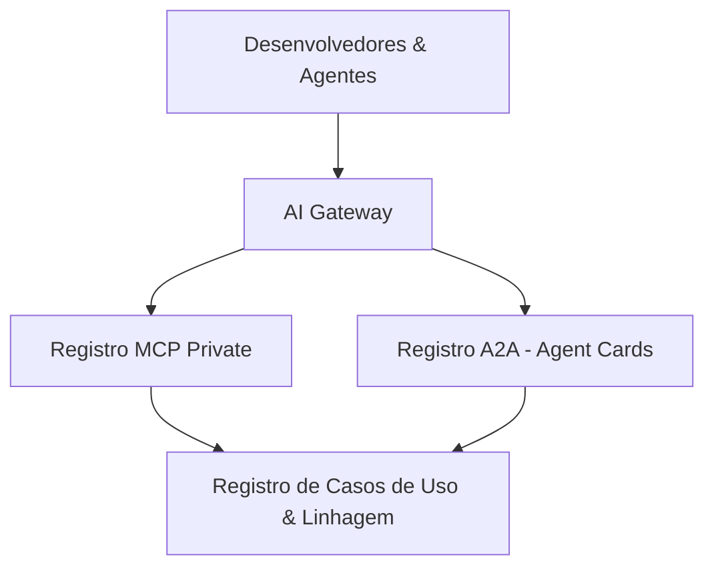

<config_file>
# Governança e Registros Centrais para Servidores MCP e Agentes A2A em Escala Empresarial

O avanço acelerado da inteligência artificial generativa em grandes corporações impulsiona a proliferação descentralizada de ferramentas baseadas no **Model Context Protocol** (MCP) e de arquiteturas de comunicação **Agent-to-Agent** (A2A). Na ausência de um modelo de controle padronizado, equipes distribuídas tendem a implementar conexões redundantes, estratégias de segurança isoladas e infraestruturas fragmentadas, gerando gargalos de governança e débito técnico.

Para solucionar esses desafios, a **Amplifon** — líder global em soluções de cuidados auditivos com atuação em 26 países — em colaboração com a consultoria técnica **Quantyca**, desenvolveu uma arquitetura de registro e governança corporativa no âmbito do **Programa Amplify**. A iniciativa estabeleceu um ecossistema unificado composto por um _AI Gateway_ central e três registros integrados: o **Registro MCP**, o **Registro A2A** e o **Registro de Casos de Uso**.

## 1. O Programa Amplify e o Modelo Operacional de IA

Lançado em janeiro de 2025, o Programa Amplify foi estruturado para definir diretrizes globais e acelerar a adoção responsável de IA em toda a organização. A governança do programa apoia-se em dois pilares operacionais estratégicos:

- **Torre de Controle**: Grupo executivo responsável pela definição de diretrizes de segurança, aspectos jurídicos, padrões tecnológicos e seleção de casos de uso prioritários de alto valor.
- **Comitê de Execução**: Célula responsável pela descentralização e implementação das soluções nos diferentes mercados nacionais e divisões corporativas.

A execução técnica do programa distribui-se em três eixos de atuação:

1. **Governança**: Garantia de conformidade regulatória, alinhamento com a legislação de IA e visibilidade dos ativos tecnológicos em uso.
2. **Plataforma**: Fornecimento de infraestrutura certificada, rotas de integração e padrões de desenvolvimento escaláveis.
3. **Fábrica de IA**: Equipes de desenvolvimento focadas na entrega contínua de soluções reutilizáveis e adaptáveis aos contextos locais.

## 2. A Arquitetura de Registros Centrais e o AI Gateway

Para viabilizar o controle financeiro, a rastreabilidade e a operacionalidade dos modelos em produção, a arquitetura técnica foi dividida em componentes especializados de acesso e catalogação.

### O AI Gateway
Funciona como o ponto de entrada único para o consumo de Modelos de Linguagem de Grande Porte (LLMs). O gateway centraliza a autenticação dos desenvolvedores via _Entra ID_, impõe limites orçamentários por projeto (semanais ou mensais) e encaminha registros de auditoria e métricas de consumo para ferramentas corporativas de monitoramento.

### O Registro MCP (Model Context Protocol)
Estende a especificação de código aberto mantida pela comunidade para criar um catálogo privado de ferramentas corporativas da Amplifon. O registro indexa tanto servidores internos customizados quanto servidores públicos previamente auditados e certificados. Cada servidor cadastrado é enriquecido com metadados estruturados que incluem:

- **Propriedade e Responsabilidade**: Identificação clara da equipe ou projeto proprietário.
- **Ambiente de Execução**: Mapeamento do estagiamento (_Desenvolvimento_, _Homologação_ ou _Produção_).
- **Modelo de Autenticação**: Mecanismos de segurança necessários para consumo.
- **Atribuição de Custos**: Conexão com os orçamentos definidos no _AI Gateway_.
- **Vínculo com Casos de Uso**: Mapeamento de dependências para análise de impacto e auditoria.

### O Registro A2A (Agent-to-Agent)
Utiliza o padrão _Agent Card_ para catalogar a identidade, os pontos de extremidade (_endpoints_), as capacidades e os requisitos de autenticação dos agentes de IA em operação. A integração com pipelines de _CI/CD_ garante que, ao ser implantado em produção, o agente publique automaticamente seu _Agent Card_ no registro, viabilizando a autodescoberta dinâmica por outros sistemas.

### O Registro de Casos de Uso
Conecta as informações dos registros MCP e A2A para gerar a linhagem completa dos ativos de informação. O painel unificado permite que gestores e auditores identifiquem exatamente quais modelos, ferramentas e agentes sustentam determinada solução de negócio, facilitando planos de contingência caso um modelo subjacente seja descontinuado ou sofra interrupções.

| Componente | Função Principal | Padrão Utilizado | Benefício Operacional |
| :--- | :--- | :--- | :--- |
| **AI Gateway** | Ponto de acesso unificado aos LLMs | Autenticação _Entra ID_ | Controle orçamentário e auditoria centralizada |
| **Registro MCP** | Catálogo corporativo de ferramentas | Especificação Open MCP | Reutilização de integrações e análise de impacto |
| **Registro A2A** | Catálogo de agentes autônomos | Padrão _Agent Card_ | Descoberta dinâmica de serviços e interoperabilidade |
| **Registro de Casos de Uso** | Mapeamento de linhagem e ativos | Grafo de dependências | Governança regulatória e continuidade de negócios |

## 3. Ciclo de Desenvolvimento e Implantação Automatizada

Para acelerar a entrega de novos casos de uso sem comprometer as exigências de governança, foram disponibilizados repositórios de modelo (_template repositories_) no GitHub para servidores MCP e agentes A2A.

Os modelos pré-configurados fornecem estruturas padronizadas que incluem contêineres _Docker_, frameworks de API rápida em _Python_, integração nativa com o _AI Gateway_ para rastreamento de custos e suporte à plataforma de observabilidade _Langfuse_ para avaliação contínua de desempenho.

A esteira de integração e entrega contínua (_CI/CD_) automatiza o processo de publicação: ao criar uma tag de versão no repositório, o pipeline compila e envia a imagem do contêiner para o repositório de artefatos da empresa e registra automaticamente os metadados e o _Agent Card_ no proxy do catálogo central. Esse fluxo garante que todo o ambiente corporativo permaneça atualizado e auditável sem intervenção manual.

## Notas Informativas e Glossário

O projeto idealizado pela Amplifon em parceria com a Quantyca demonstra a evolução da engenharia de IA corporativa, migrando de iniciativas isoladas para um ecossistema padronizado de microsserviços de agentes.

### Principais Entidades e Conceitos

- **Sonny Merla**: Gerente Global de Ciência de Dados e IA da Amplifon, responsável pela visão estratégica do programa Amplify.
- **Mauro Luchetti**: Gerente do Centro de Excelência em IA da Quantyca, especialista em arquitetura de dados e engenharia de soluções de IA.
- **Mattia Redaelli**: Engenheiro de IA da Quantyca, responsável pelo desenvolvimento técnico da plataforma de registro e esteiras de automação.
- **Model Context Protocol (MCP)**: Padrão aberto de comunicação projetado para conectar modelos de linguagem a sistemas de arquivos, bancos de dados e ferramentas externas de forma segura.
- **Agent-to-Agent (A2A)**: Protocolo de comunicação desenhado para permitir a colaboração e a troca de informações diretas entre agentes de IA autônomos.
- **Agent Card**: Documento em formato JSON que especifica os metadados, permissões, capacidades e interfaces de um agente de IA.

## Lacunas e Expansão do Conhecimento

A implementação de registros corporativos para agentes abre caminho para a automação avançada baseada em mercado interno de serviços de IA. O aprimoramento contínuo dessas plataformas prevê a inclusão de mecanismos de negociação automática de tarefas entre agentes, verificação formal de contratos de segurança e políticas dinâmicas de alocação de carga em clusters Kubernetes multirregião.
</config_file>
