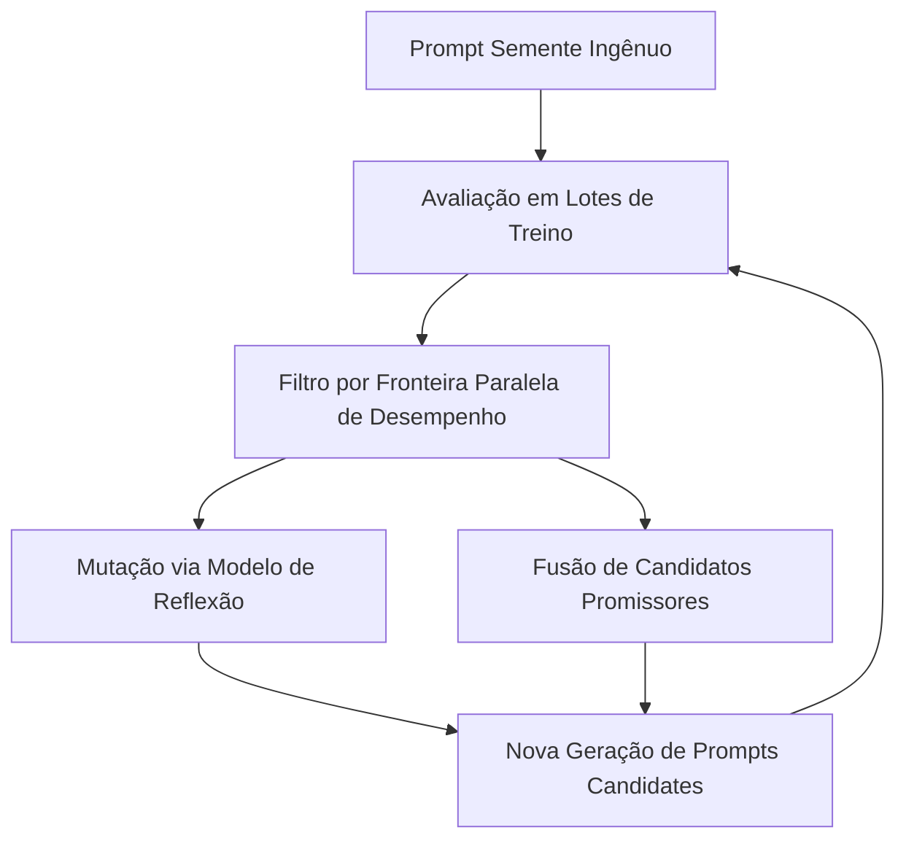

<config_file>
# Calibração e Otimização de Avaliadores LLM-as-a-Judge com o Algoritmo GEPA

A implementação de avaliadores automatizados baseados em Modelos de Linguagem como Juízes (*LLM-as-a-Judge*) tornou-se prática padrão no monitoramento de sistemas de inteligência artificial generativa. No entanto, avaliadores descalibrados e desalinhados com o julgamento humano representam um risco superior à ausência de métricas, uma vez que fornecem falsa confiança operacional enquanto falham em capturar desalinhamentos e alucinações em produção.

Para resolver esse gargalo de confiabilidade, **Mahmoud Mabrouk** — cofundador e CEO da **Agenta AI** — apresentou uma metodologia sistemática baseada na curadoria de anotações humanas e no algoritmo de otimização de prompts **GEPA** (*Genetic Evaluation and Prompt Adaptation*). O processo transforma prompts ingênuos de avaliação em juízes calibrados, acelerando tanto a validação offline durante o desenvolvimento quanto o monitoramento online em tempo de execução.

## 1. O Papel da Calibração e o Ciclo de Desenvolvimento de IA

A velocidade de iteração no ciclo de vida de uma aplicação de IA é diretamente limitada pela velocidade da sua etapa de avaliação. O fluxo tradicional de validação divide-se em três níveis de eficiência e maturidade:

- **Anotação Humana Manual**: Garante alta precisão e alinhamento com as diretrizes de negócio, porém introduz um gargalo temporal crítico que inviabiliza iterações diárias.
- **LLM-as-a-Judge Ingênuo**: Oferece execução rápida em pipelines de integração contínua, mas sem calibração prévia produz um sinal ruidoso e sem correlação estatística com o feedback de especialistas.
- **LLM-as-a-Judge Calibrado**: Alinha as saídas do modelo aos rótulos e justificativas humanas, criando um loop virtuoso de otimização automatizada (*flywheel* de dados) a partir dos rastros (*traces*) de produção.

## 2. A Metodologia de Quatro Etapas e a Curadoria de Dados

A construção de um avaliador confiável exige o abandono de métricas genéricas — como "taxa global de alucinação" ou notas flutuantes de 1 a 5 — em favor de classificações binárias específicas baseadas no contexto de negócio.

### Etapas do Fluxo de Trabalho

1. **Definição de Métricas Específicas de Domínio**: Identificação dos eixos reais de falha a partir da análise de erros conduzida por especialistas no assunto. Em um sistema de suporte aéreo (baseado no benchmark **TauBench**), as falhas dividem-se em adesão às políticas corporativas, estilo de resposta, clareza na entrega de informações e execução correta de chamadas de ferramentas (*tool calls*).
2. **Anotação Humana e Extração do Raciocínio**: Coleta de dados contendo não apenas o rótulo final (*em conformidade* ou *não conformidade*), mas a justificativa explícita da violação. A presença da justificativa é indispensável para alimentar o módulo de reflexão do otimizador.
3. **Otimização do Juiz via Algoritmo GEPA**: Execução iterativa de mutação e fusão de prompts para evoluir a instrução do avaliador.
4. **Validação Cruzada em Conjunto de Testes**: Avaliação da precisão, revocação e remoção de vieses no conjunto de validação reservado.

| Métrica Avaliada | Tipo de Saída | Justificativa Obrigatória | Impacto no Aprendizado |
| :--- | :--- | :--- | :--- |
| **Adesão às Políticas** | Binária (*Verdadeiro/Falso*) | Sim (Identificação da norma violada) | Permite ao otimizador derivar regras implícitas |
| **Execução de Ferramentas** | Binária (*Verdadeiro/Falso*) | Sim (Parâmetro incorreto ou ausente) | Facilita a identificação de chamadas inválidas |
| **Pontuações Numéricas (1-5)** | Descartada | Não | Induz ruído e reduz concordância entre anotadores |

## 3. Arquitetura do Algoritmo GEPA e Estratégias de Reflexão

O **GEPA** opera como um algoritmo genético adaptativo que utiliza a própria inteligência de um LLM para propor alterações estruturais no prompt candidato. O ciclo de otimização desdobra-se em três mecanismos principais:

### Mutação Direta e Modelo de Reflexão
Ao identificar uma falha na avaliação de um rastro, o módulo de reflexão analisa a entrada, a resposta gerada, o parecer do juiz e a justificativa do anotador humano. O modelo de reflexão sintetiza uma nova regra de política e atualiza o prompt do candidato.

### Fusão de Candidatos (*Crossover*)
Instruções promissoras geradas em ramificações distintas são combinadas, consolidando diferentes aspectos das políticas de negócio em uma única rubrica de avaliação.

### Fronteira Paralela de Desempenho (*Pareto Frontier*)
Diferente das abordagens ingênuas que filtram candidatos apenas pela pontuação média global, o GEPA preserva a diversidade selecionando os melhores candidatos para cada caso de teste individual. Isso garante que soluções especializadas em cenários raros não sejam descartadas precocemente antes da fase de fusão.

## 4. Resultados Experimentais e Boas Práticas de Engenharia

Durante os experimentos com a base de dados **TauBench** (composta por 599 trajetórias do agente de suporte de companhia aérea), a aplicação do GEPA demonstrou a importância de restrições iniciais e escolha de arquiteturas:

- **Prompt Semente Neutro**: Inicializar o juiz com a premissa padrão de conformidade (assumindo conformidade a menos que haja evidência explícita em contrário) evita que vieses aleatórios do modelo paralisem a otimização nos primeiros ciclos.
- **Modelos de Reflexão Avançados**: A utilização de modelos de maior capacidade (como **Gemini** ou **GPT-4o**) na etapa de reflexão é essencial para a extração de regras complexas, enquanto modelos menores podem ser empregados na inferência do juiz para redução de custos operacionais.
- **Otimização sem Acesso Direto à Política**: Prompts sementes que não continham a política completa colada em texto bruto obtiveram desempenho superior durante a otimização, pois permitiram ao algoritmo explorar o espaço de busca sem ficar preso a mínimos locais rígidos.

Os resultados no conjunto de validação indicaram aumento da precisão global de 61% para 74%, com eliminação do viés de resposta passiva e elevação da precisão da fronteira de desempenho para 100% no conjunto de treinamento.

## Notas Informativas e Glossário

A plataforma open-source **Agenta AI** fornece o instrumental necessário para a gestão de prompts, rastreamento de execuções (*tracing*) e execução de workflows de anotação e otimização automatizada.

### Principais Entidades e Conceitos

- **Mahmoud Mabrouk**: Pesquisador em aprendizado de máquina, PhD em biologia computacional e cofundador/CEO da Agenta AI.
- **GEPA (Genetic Evaluation and Prompt Adaptation)**: Algoritmo e biblioteca open-source voltados para a otimização automática de prompts e cadeias de execução em LLMs.
- **Agenta AI**: Plataforma open-source de LLMOps projetada para gerenciamento do ciclo de vida, observabilidade e avaliação de aplicações baseadas em modelos de linguagem.
- **TauBench**: Benchmark desenvolvido para avaliar agentes de inteligência artificial em ambientes corporativos complexos e cenários reais de atendimento ao cliente.
- **Hamel Husain**: Engenheiro e consultor de IA, autor de guias de referência sobre análise de erros e curadoria de dados para avaliação de LLMs.

## Lacunas e Expansão do Conhecimento

A evolução dos avaliadores automatizados direciona-se para a integração de técnicas de destilação de modelos e otimização contínua diretamente em pipelines de produção. O avanço dessas metodologias reduz a dependência de chamadas a APIs proprietárias de alto custo, permitindo que modelos locais menores sejam calibrados para atuar como juízes especializados com latência reduzida e alta correlação com anotadores humanos.
</config_file>
