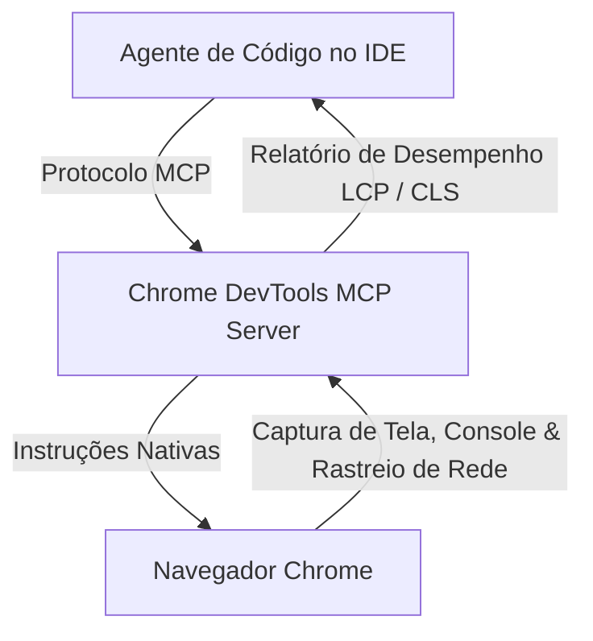

<config_file>
# A Simbiose Entre IA e a Web: Agentes de Código, Web AI APIs e Web MCP

A relação entre o desenvolvimento web e a inteligência artificial evoluiu de uma simples utilização de ferramentas assistidas para uma integração simbiótica profunda. Em 2026, os navegadores incorporam servidores de protocolo de contexto, os ambientes de desenvolvimento depuram aplicações em tempo real via IA, e as especificações da web adaptam-se para servir tanto usuários humanos quanto agentes autônomos.

Em apresentação conjunta na conferência AIE Europe, **Yohan Lasorsa** (_Developer Advocate_ na Microsoft e Google Developer Expert em Angular) e **Olivier Leplus** (_Developer Advocate_ na AWS e Google Developer Expert em Web) demonstraram como a IA passou a residir nativamente no ecossistema web, desde o ciclo de escrita de código até a execução local no navegador.

## 1. Agentes de Código e Habilidades Personalizadas (Agent Skills)

A eficácia dos agentes de programação modernos depende diretamente do nível de especialização e do contexto fornecido ao modelo. A adoção de **Agent Skills** — plugins leves declarados em formato Markdown baseados em especificações abertas — permite que o agente adquira conhecimento específico sobre tarefas de desenvolvimento sem inflar o contexto permanente.

O fluxo de trabalho orientado a habilidades possibilita a criação de rotinas automatizadas e repetíveis:

- **Integração com CLIs**: A habilidade lê requisições no GitHub (issues), executa testes de regressão com a CLI do _Playwright_ e gera vídeos curtos das novas funcionalidades.
- **Notificação e Testes Remotos**: Através de conectores customizados (como envio via Telegram ou Slack), a habilidade levanta um túnel local na máquina de desenvolvimento e envia o link direto ao smartphone do desenvolvedor para validação imediata em dispositivos móveis.
- **Governança por Arquivos de Regra**: O arquivo estandardizado `agents.md` passa a ditar os critérios de aceitação e as restrições que o agente deve respeitar antes de encerrar uma tarefa no repositório.

## 2. Controle de Navegador via Chrome DevTools MCP e Depuração Nativa

A integração entre agentes de código e o navegador foi simplificada através do **Chrome DevTools MCP**, um servidor baseado no _Model Context Protocol_ que expõe as ferramentas do desenvolvedor para os agentes de IA.

Por meio desse servidor, o agente consegue abrir páginas, preencher formulários, inspecionar solicitações de rede, capturar telas e executar auditorias do _Lighthouse_. Em análises de desempenho sob restrições de rede (simulação de 3G ou 2G), o agente identifica automaticamente ativos não otimizados — como imagens desproporcionais — e sugere ajustes de _preload_ ou redução de CSS.

Além disso, as próprias ferramentas de desenvolvedor do navegador incorporam recursos nativos de IA. Erros de bloqueio por **CORS** ou falhas de requisição HTTP 400 no console exibem assistentes integrados que diagnosticam a causa raiz. No inspetor de CSS, o desenvolvedor pode solicitar alterações visuais em linguagem natural e aplicar os ajustes diretamente de volta aos arquivos do código-fonte via integração com o espaço de trabalho.

## 3. Web AI APIs: Execução de Modelos Locais no Navegador (On-Device)

Uma das transformações mais expressivas na arquitetura frontend é o surgimento das **Web AI APIs**, padronizadas sob a supervisão do **W3C**. Essas interfaces oferecem acesso a modelos de linguagem multimodais executados localmente no dispositivo do usuário (on-device), sem a necessidade de chamadas de API externas ou custos por tokens de nuvem.

| API Web AI | Funcionalidade Principal | Parâmetros de Configuração |
| :--- | :--- | :--- |
| **Summarizer API** | Resumo automatizado de textos e avaliações | Tipos: _TLDR_, _keypoints_, _teaser_, _headline_ |
| **Proofreader API** | Correção ortográfica e gramatical contextual | Retorna posições de índice e sugestões de substituição |
| **Prompt API** | Execução de prompts multimodais locais | Suporta entrada de texto, áudio e imagem com esquema JSON rígido |

A execução ocorre de forma transparente: o navegador realiza o download do modelo (com tamanho aproximado de 4 GB na primeira execução) e o mantém em cache compartilhado para todas as aplicações web autorizadas.

## 4. Preparando a Web para Agentes: LLMs.txt e Web MCP

Com o aumento do tráfego gerado por agentes autônomos, as aplicações web precisam ser projetadas tanto para o consumo humano quanto para a navegação por máquinas.

### Padronização via LLMs.txt
Análogo ao arquivo `robots.txt` e ao `sitemap.xml`, a proposta do `LLMs.txt` fornece um mapa estruturado em Markdown com links diretos para a documentação e recursos do site. A variante `LLM-full.txt` consolida toda a documentação e exemplos de código em um único arquivo, evitando que agentes utilizem informações obsoletas de seus dados de treinamento antigos ao gerar código para versões recentes de frameworks como Angular ou React.

### Exposição de Interfaces via Web MCP
O **Web MCP** representa a evolução das aplicações interativas para agentes. Em vez de forçar um agente a simular cliques em coordenadas visuais da tela para adicionar produtos ao carrinho ou preencher cadastros, a aplicação registra suas funções diretamente no objeto `navigator` da página.

A especificação permite também converter formulários HTML convencionais em ferramentas MCP de forma declarativa, adicionando atributos como `tool-name` e `tool-auto-submit`. O navegador do usuário passa a atuar como um agente capaz de interpretar a estrutura da página e executar transações de forma direta e segura.

## Notas Informativas e Glossário

A demonstração técnica dos palestrantes evidenciou como a simbiose entre agentes locais e APIs de navegador transforma o ecossistema frontend em um ambiente híbrido humano-agente.

### Principais Entidades e Conceitos

- **Olivier Leplus**: Engenheiro e _Developer Advocate_ na AWS, especialista em tecnologias web e Google Developer Expert.
- **Yohan Lasorsa**: Engenheiro e _Developer Advocate_ na Microsoft, especialista no ecossistema Angular e Google Developer Expert.
- **Web MCP**: Proposta de especificação que permite a páginas web exporem ferramentas e ações estruturadas diretamente para clientes e navegadores baseados em IA.
- **LLMs.txt**: Padrão de arquivo de texto estruturado que fornece documentação atualizada e organizada para agentes de linguagem.
- **W3C Web AI APIs**: Conjunto de APIs de navegador padronizadas para execução de tarefas de linguagem natural e visão computacional diretamente no hardware do cliente.

## Lacunas e Expansão do Conhecimento

A consolidação de modelos locais em navegadores e do protocolo Web MCP levanta questões relevantes sobre a governança de privacidade, gerenciamento de memória em dispositivos com recursos limitados e segurança contra injeções de contexto em formulários declarativos. A evolução dessas normas busca harmonizar o desempenho computacional das máquinas locais com a proteção contra rastreamento não autorizado de dados do usuário.
</config_file>
