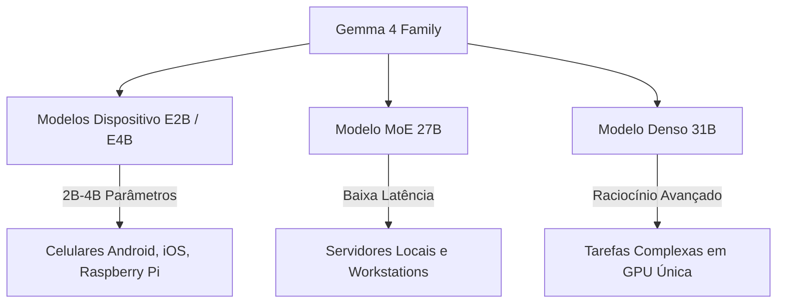

<config_file>
# O Futuro dos Agentes de Código, Modelos On-Device e o Ecossistema MCP: Destaques do Segundo Dia da AIE Europe 2026

O segundo dia da conferência **AI Engineer Europe 2026** consolidou a transição da inteligência artificial de meras demonstrações conceituais para a implantação em produção de agentes autônomos e modelos de alta eficiência executados localmente. Com abertura conduzida por **Tejas Kumar**, o evento reuniu lideranças da **Google DeepMind**, **Anthropic**, **Cursor**, **Linear** e **Hugging Face** para debater a evolução da família **Gemma 4**, os avanços do **Model Context Protocol** (MCP), a eliminação do débito técnico gerado por código de IA e o papel do design orientado a domínio.

---

## 1. Google DeepMind e Gemma 4: Modelos Multimodais On-Device

**Omar Sanseviero** (Google DeepMind) apresentou o lançamento oficial da família de modelos abertos **Gemma 4**, projetada para rodar com alta eficiência desde dispositivos móveis e minicomputadores até GPUs de consumo individual.



### Arquitetura E2B (Embedded Layer Embeddings)
Os modelos menores (como o Gemma E2B) utilizam uma nova arquitetura que armazena incorporações por camada (*per-layer embeddings*) como tabelas de consulta em memória estática ou disco. Essa abordagem elimina multiplicações de matrizes pesadas na GPU, permitindo que modelos de 4 bilhões de parâmetros rodem com apenas 2 GB de pegada na GPU e utilizem a CPU para o restante do processamento.

### Principais Características da Família Gemma 4

- **Licenciamento Apache 2.0**: Transição para uma licença de código aberto irrestrita comercialmente.
- **Multimodalidade Nativa**: Capacidade de processamento de texto, visão computacional, áudio e tradução direta de fala no próprio dispositivo.
- **Suporte a 140+ Idiomas**: Tokenizador herdado da família Gemini, otimizado para línguas de poucos recursos digitais e ajuste fino (*fine-tuning*) regional.
- **Variantes Especializadas**: Lançamento do **ShieldGemma** (para filtragem de conteúdo e segurança) e do **MedGemma** (para interpretação médica e radiológica).

---

## 2. Anthropic e o Futuro do MCP: Descoberta Progressiva e Chamadas Programáticas

**David Soria Parra** (Membro da Equipe Técnica na Anthropic e criador do MCP) detalhou a evolução do **Model Context Protocol** e as diretrizes para superar o gargalo de contexto em arquiteturas de agentes.

### Descoberta Progressiva de Ferramentas (Progressive Discovery)
O envio de centenas de definições de ferramentas em cada requisição gera inchaço na janela de contexto (*context bloat*) e eleva custos. A prática recomendada consiste em adiar o carregamento e expor apenas uma ferramenta de busca. O agente consulta o catálogo sob demanda, carregando unicamente as definições necessárias para a tarefa atual.

### Chamada Programática de Ferramentas (Code Mode)
Em vez de encadear chamadas sequenciais de ferramentas via JSON — onde cada passo exige ciclos de inferência adicionais —, o modelo deve gerar scripts executáveis (em ambiente isolado V8, Lua ou Python) que orquestram múltiplas chamadas MCP internamente, reduzindo substancialmente a latência e o consumo de tokens.

```mermaid
sequence-diagram
    autonumber
    Agente->>MCP Client: Consulta catálogo de ferramentas
    MCP Client-->>Agente: Retorna definições sob demanda
    Agente->>V8 Sandbox: Envia script de execução combinada
    V8 Sandbox->>Servidores MCP: Executa chamadas paralelas
    V8 Sandbox-->>Agente: Retorna resultado final estruturado
```

### Evolução da Especificação MCP
As próximas atualizações do protocolo incluem a introdução do transporte HTTP sem estado (*stateless transport protocol*), autenticação simplificada entre aplicações corporativas e a descoberta automática de servidores MCP via rotas padrão em domínios web.

---

## 3. Arquitetura de Agentes, Ferramentas de Código e Gestão de Débito Técnico

As sessões técnicas do segundo dia focaram na otimização da engenharia de código executada por agentes:

### Cursor e a Substituição de Código por Skills
**David Gomes** (Cursor) demonstrou como a substituição de mais de 15.000 linhas de código imperativo por regras declarativas em formato Markdown (*Agent Skills*) e uso de *Git Worktrees* permitiu criar fluxos de trabalho autônomos mais leves, isolados e fáceis de manter.

### Pi Agent e a Prevenção contra "Slop" Técnico
**Mario Zechner** (criador do Pi Agent) alertou para os perigos da acumulação descontrolada de código gerado por IA sem supervisão estrutural. A solução exige manter a execução determinística, priorizando arquivos de contexto concisos e validação contínua.

### Linear e a Filosofia de Tolerância Zero a Bugs
Em conversa entre **Tuomas Artman** (Linear) e **Gergely Orosz** (*The Pragmatic Engineer*), destacou-se que o uso intensivo de IA não deve substituir o rigor de design e a política de "zero bugs". A automação deve servir para eliminar tarefas repetitivas, mantendo a responsabilidade do produto sob o julgamento humano.

---

## Tabela Comparativa de Abordagens de Integração de Agentes

| Abordagem | Mecanismo de Integração | Vantagem Principal | Caso de Uso Ideal |
| :--- | :--- | :--- | :--- |
| **Agent Skills** | Arquivos Markdown declarativos | Leveza, fácil distribuição e baixo contexto | Adicionar conhecimento específico de ferramentas/CLIs |
| **MCP Servidor** | Protocolo estruturado bidirecional | Semântica rica, autorização e abstração de plataforma | Conectar sistemas corporativos, bancos de dados e APIs |
| **CLI / Computer Use** | Execução de comandos em shell/sandbox | Flexibilidade absoluta e compatibilidade com ferramentas existentes | Agentes de codificação locais e manipulação de arquivos |

---

## Notas Informativas e Glossário

O evento AIE Europe 2026 reafirmou o papel da Europa como centro gerador de projetos de código aberto fundamentais para o avanço global da inteligência artificial.

### Principais Entidades e Conceitos

- **Tejas Kumar**: Mestre de cerimônias do segundo dia da AI Engineer Europe 2026.
- **Omar Sanseviero**: Líder de relações com desenvolvedores na Google DeepMind, responsável pelas iniciativas da família Gemma.
- **David Soria Parra**: Engenheiro da Anthropic e criador do Model Context Protocol (MCP).
- **Mario Zechner**: Desenvolvedor e criador do Pi Agent, voltado para automação de código minimalista.
- **Tuomas Artman**: Cofundador e CTO da Linear, responsável pela arquitetura da plataforma de gestão de projetos.
- **E2B (Embedded Layer Embeddings)**: Técnica de arquitetura de redes neurais que desloca tabelas de incorporação para memórias secundárias, viabilizando execução de modelos de linguagem em hardware modesto.

---

## Lacunas e Expansão do Conhecimento

A massificação de agentes autônomos de código e a execução local de modelos de linguagem em dispositivos móveis abrem novas fronteiras na segurança cibernética. O isolamento de processos (*sandboxing*), a validação de permissões por chamadas e o controle rigoroso sobre a injeção indesejada de prompts em bases de código públicas constituem as áreas prioritárias de pesquisa e desenvolvimento para as próximas gerações de ferramentas de IA.
</config_file>
