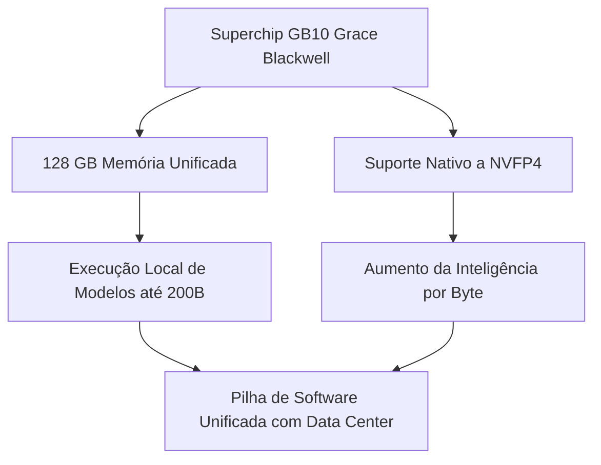

<config_file>
# Desempenho Prático e Benchmarking de LLMs Locais na Arquitetura NVIDIA DGX Spark

A migração do processamento de Modelos de Linguagem de Grande Porte (_LLMs_) da infraestrutura de nuvem para estações de trabalho locais exige uma redefinição na estratégia de engenharia de software e hardware. Em apresentação técnica realizada no evento AI Engineer Europe, **Mozhgan Kabiri Chimeh** (Gerente de Relações com Desenvolvedores na **NVIDIA**) apresentou dados empíricos de benchmark sobre a execução de modelos de código aberto (de 1,5 a 14 bilhões de parâmetros) no sistema **NVIDIA DGX Spark**.

Ao analisar os compromissos operacionais entre vazão (_throughput_) e latência, o estudo demonstrou a viabilidade de prototipar e servir modelos locais de alta inteligência com a mesma pilha de software utilizada em data centers corporativos, mitigando custos imprevistos e garantindo residência determinística de dados sensíveis.

## 1. A Arquitetura Hardware/Software do NVIDIA DGX Spark

O avanço na complexidade das aplicações de IA impõe gargalos recorrentes aos sistemas tradicionais de desenvolvimento: limitações severas de VRAM e incompatibilidade entre pilhas de software de desktop e de nuvem.

O **NVIDIA DGX Spark** foi projetado para atuar como uma unidade autônoma de desenvolvimento local. A infraestrutura combina a CPU e a GPU no superchip **GB10 Grace Blackwell**, sustentado por uma arquitetura de memória unificada.



### Principais Especificações Técnicas

- **Memória Unificada de 128 GB**: Permite o carregamento e o ajuste fino local de modelos de até 200 bilhões de parâmetros, eliminando a dependência imediata de clusters em nuvem.
- **Suporte a NVFP4**: Quantização em ponto flutuante de 4 bits otimizada para a arquitetura Blackwell, reduzindo a pegada de memória sem degradar a coerência do modelo.
- **Paridade de Pilha de Software**: Compatibilidade direta com contêineres e motores de inferência (como **vLLM** e **TensorRT-LLM**) usados nos data centers de produção.

## 2. Metodologia de Benchmark Automatizado e Métricas de Latência

Para garantir a reprodutibilidade dos testes, foi desenvolvida uma esteira automatizada de avaliação. As execuções seguiram um protocolo de isolamento em ambiente **Docker**, incluindo três execuções prévias de aquecimento (*warm-up*) e telemetria da GPU registrada a cada 1 segundo.

### Métricas Fundamentais

1. **Vazão (Throughput)**: Medida em tokens de conclusão gerados por segundo (tokens/s).
2. **Tempo até o Primeiro Token (TTFT - Time-to-First-Token)**: Métrica decisiva para a percepção de fluidez pelo usuário final, capturada via resposta de streaming na função `stream_once` do servidor vLLM.

```mermaid
sequence-diagram
    autonumber
    Cliente->>vLLM Server: Envia Prompt de Teste
    vLLM Server-->>Cliente: Gera 1º Token (Registro de TTFT)
    vLLM Server-->>Cliente: Stream de Tokens Contínuos (Vazão tokens/s)
    Cliente->>Orquestrador: Registra Mídia e Telemetria da GPU
```

## 3. Análise Comparativa de Desempenho e Impacto do Formato NVFP4

Os experimentos executados no DGX Spark revelaram a disparidade entre a capacidade total de memória e a largura de banda efetiva. Embora os 128 GB permitam alocar modelos volumosos, o gargalo operacional reside na velocidade de movimentação de dados entre os registradores e a memória.

| Modelo Avaliado | Precisão / Quantização | Vazão (_Throughput_) | Desempenho de TTFT vs. Base |
| :--- | :--- | :--- | :--- |
| **Instruct 1.5B** | Padrão (FP16/BF16) | 61,73 tokens/s | Ultra-rápido (Referência inicial) |
| **Instruct 14B Base** | Sem Quantização | 8,40 tokens/s | Latência elevada (Gargalo de banda) |
| **Instruct 14B NVFP4** | Otimização NVFP4 4-bit | 20,19 tokens/s | **3,4x mais rápido no primeiro token** |

O modelo **14B NVFP4** destacou-se como o ponto ideal de engenharia (*sweet spot*): mesmo sendo aproximadamente dez vezes maior que a variante de 1,5B, manteve uma vazão superior a 20 tokens por segundo — velocidade superior à capacidade média de leitura humana —, enquanto reduziu o tempo de emissão do primeiro token em 3,4 vezes em comparação ao modelo base não quantizado.

## 4. Recomendações de Arquitetura e Decisão de Infraestrutura

A utilização de estações de trabalho locais como o DGX Spark é recomendada nos seguintes cenários corporativos:

- **Prototipagem Rápida e Redução de Custos**: Permite iterar continuamente sem custos de inferência flutuantes ou filas de agendamento em clusters compartilhados.
- **Residência de Dados e Privacidade**: Garantia de que dados regulados (como informações médicas, financeiras ou propriedade intelectual) não saiam do ambiente físico da empresa.
- **Desenvolvimento Híbrido**: Otimização local das aplicações utilizando a mesma pilha de código que, posteriormente, será implantada na nuvem ou no data center.

## Notas Informativas e Glossário

O ecossistema de soluções locais da NVIDIA busca conectar a rotina de desenvolvimento individual ao ambiente de produção em escala.

### Principais Entidades e Conceitos

- **Mozhgan Kabiri Chimeh**: Doutora em ciência da computação e gerente de relações com desenvolvedores na NVIDIA, especialista em computação de alto desempenho e aceleração de IA.
- **NVIDIA DGX Spark**: Estação de trabalho pessoal projetada para desenvolvimento, teste e inferência local de modelos de inteligência artificial generativa.
- **vLLM**: Motor de inferência open-source de alta performance projetado para otimizar o atendimento de requisições de LLMs via gerenciamento eficiente de memória (PagedAttention).
- **NVFP4**: Formato de quantização em ponto flutuante de 4 bits introduzido na arquitetura NVIDIA Blackwell para maximizar a densidade computacional e a eficiência de transferência de dados.
- **TTFT (Time-to-First-Token)**: Intervalo de tempo entre o envio da requisição pelo usuário e a recepção do primeiro caractere/token gerado pelo modelo.

## Lacunas e Expansão do Conhecimento

A consolidação de modelos locais em arquiteturas com memória unificada exige atenção contínua às técnicas de quantização e ao gerenciamento de dissipação térmica. A evolução das pilhas de software prevê a integração nativa de algoritmos de compilação dinâmica e otimização de grafo de computação diretamente nos contêineres de desenvolvimento, aproximando ainda mais o desempenho das estações de trabalho locais dos grandes supercomputadores de data center.
</config_file>
