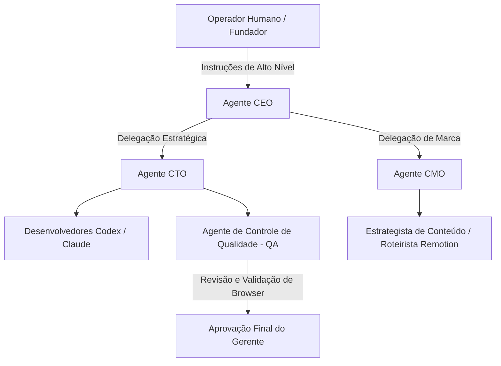

<config_file>
# Paperclip: O Plano de Controle Humano de Código Aberto para Força de Trabalho de IA

A automação corporativa por meio de inteligência artificial evoluiu de simples assistentes individuais para a criação de empresas operadas com intervenção humana mínima (*zero-human companies*). No entanto, o gerenciamento de múltiplos agentes autônomos sem supervisão estruturada resulta frequentemente em desalinhamento de marca, execuções incompletas e perda de governança.

Para resolver esse problema de orquestração, o fundador anônimo **Dotta** apresentou o **Paperclip**, uma plataforma de código aberto projetada para atuar como o plano de controle humano (*human control plane*) da força de trabalho sintética. O sistema permite criar organogramas corporativos compostos por agentes de IA, definir políticas de marca, gerenciar habilidades (*skills*) e orquestrar fluxos de trabalho complexos de negócios.

## 1. Conceito e Arquitetura do Organograma de Agentes

O Paperclip não se limita a ser uma ferramenta de geração de código; trata-se de um sistema de gestão empresarialagnóstico de fornecedor (*vendor-agnostic*), capaz de integrar modelos e executores de diferentes laboratórios (como **Gemini**, **Claude Code**, **Codex**, **OpenClaw**, **Pi** ou modelos abertos via **OpenRouter**).

### O Papel do CEO e a Delegação em Cascata

- **Orquestração Hierárquica**: O usuário humano interage diretamente com o agente nomeado como CEO. Este é responsável por desdobrar metas genéricas em planos de ação estruturados, contratar novos agentes especialistas e atribuir recursos.
- **Gerenciamento Integrado de Habilidades**: O CEO possui a capacidade de identificar e instalar habilidades a partir de repositórios centrais (como o `skills.sh`), integrando bibliotecas como o **Remotion** para criação de vídeos orientados a código em React.
- **Independência de Provedores**: Agentes de alta inteligência (modelos de fronteira) podem ser alocados para funções executivas ou de revisão crítica, enquanto tarefas de rotina são delegadas a modelos mais econômicos (como Qwen 3.6 Plus via OpenRouter) para otimização de custos de inferência.

## 2. Garantia de Qualidade, Rotinas e Confiabilidade

Para evitar que agentes falhem silenciosamente ou entreguem produtos fora dos padrões corporativos, o Paperclip estabelece fluxos de trabalho com papéis bem delimitados de revisão e aprovação:

### Fluxo de Controle de Qualidade (QA)
A conclusão de uma tarefa de desenvolvimento ou marketing aciona automaticamente um agente de QA equipado com habilidades de navegação autônoma. O agente executa os testes em um navegador real, inspeciona a interface e envia o feedback ao programador ou criador antes da aprovação final.

### Separação entre Revisor e Aprovador
O papel do revisor técnico ajusta o código e os artefatos com o executor principal. Contudo, a aprovação definitiva para incorporação ao repositório ou publicação de mídia fica restrita ao agente gerente ou ao próprio usuário humano.

### Automação de Rotinas Recorrentes
Diferente de pastas isoladas de prompts, o Paperclip permite cadastrar rotinas periódicas ou disparadas por eventos (como compilação de notas de lançamento no Discord via **Greptile**, análise de favoritos do Twitter ou triagem de *pull requests*). As rotinas utilizam variáveis de modelo e habilidades integradas.

| Funcionalidade | Abordagem Tradicional de Agentes | Abordagem Paperclip Control Plane |
| :--- | :--- | :--- |
| **Estrutura de Equipe** | Abas isoladas em IDEs ou chat | Organograma completo com hierarquia e papéis |
| **Integração de Modelos** | Preso a um único provedor/IDE | Agnóstico (Gemini, Claude, Codex, OpenRouter) |
| **Controle de Qualidade** | Validação manual pelo usuário | Agente de QA automatizado com teste em navegador |
| **Controle Financeiro** | Sem visibilidade de custos | Tetos orçamentários por agente e por projeto |

## 3. Aprendizado Organizacional e Meta-Agentes

Uma das inovações do Paperclip reside na capacidade de transformar o feedback contínuo do usuário em regras permanentes de atuação:

- **Evolução de Habilidades Específicas**: Quando o usuário corrige iterativamente a cadência de corte de um vídeo (por exemplo, ajustando a transição de 6 para 2 segundos), essas preferências são compiladas em uma nova habilidade proprietária da empresa, incorporando o guia de marca (*brand guide*) e o estilo visual.
- **Atuação de Meta-Agentes**: A plataforma permite instituir papéis de governança interna, como o **Consultor de Habilidades** (*Skill Advisor*). Este agente monitora o desempenho dos demais funcionários sintéticos, identifica subutilização de ferramentas e itera sobre as instruções dos prompts para corrigir comportamentos desalinhados.

## Notas Informativas e Glossário

Lançado em março de 2026, o Paperclip alcançou rápida adesão na comunidade de código aberto, ultrapassando a marca de 50.000 estrelas no GitHub em poucas semanas de projeto.

### Principais Entidades e Conceitos

- **Dotta**: Criador anônimo do Paperclip e desenvolvedor de ecossistemas de inteligência artificial.
- **Paperclip**: Plataforma open-source de orquestração corporativa e plano de controle humano para agentes de IA.
- **Remotion**: Framework de código aberto que permite a geração programática de vídeos utilizando React e código web.
- **Greptile**: Ferramenta de inteligência artificial voltada para revisão automatizada de código e análise contextual de repositórios.
- **OpenRouter**: Serviço de roteamento de modelos que unifica o acesso a múltiplos LLMs proprietários e de código aberto com gerenciamento de limites de taxa e custos.

## Lacunas e Expansão do Conhecimento

O roteiro de desenvolvimento do Paperclip prevê a expansão da plataforma para ambientes de execução distribuídos na nuvem, integração nativa com contêineres e *sandboxes* isoladas (como E2B e Dev.exe), introdução de chat direto com o CEO, modo de maximização de autonomia para tarefas de longa duração e suporte nativo a múltiplos usuários humanos em uma mesma organização.
</config_file>
