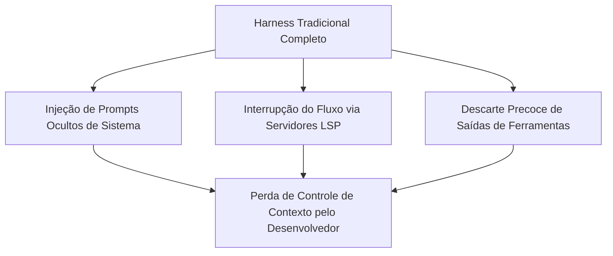
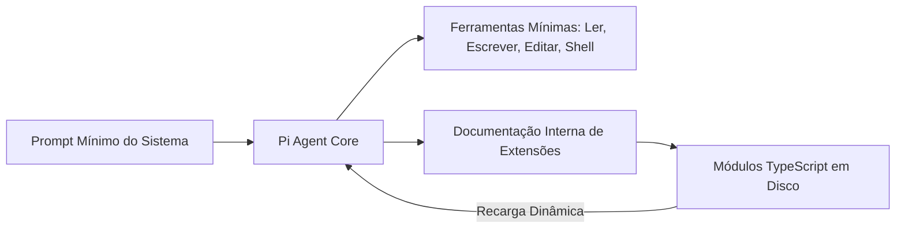

<config_file>
# Arquitetura de Agentes Mínimos e a Mitigação do Débito Técnico na Era do Código Sintético

A proliferação de agentes autônomos de programação transformou o ecossistema de desenvolvimento de software, introduzindo tanto ganhos imediatos de velocidade quanto riscos estruturais de degradação da qualidade das bases de código. Em apresentação na conferência AI Engineer Europe, **Mario Zechner** (desenvolvedor de jogos e criador do **Pi Agent**) analisou as deficiências das ferramentas tradicionais de infraestrutura de agentes (_agent harnesses_), a arquitetura do motor Pi e a necessidade de governança humana estrita contra o avanço do código de baixa qualidade (*slop* técnico).

## 1. As Limitações dos Motores de Agentes Tradicionais

A experiência com ferramentas pioneiras de agentes de código (como o **Cloud Code** ou o **Open Code**) evidencia gargalos recorrentes resultantes do inchaço de recursos e da gestão ineficiente de contexto:

- **Perda de Sobrania sobre o Contexto**: Ferramentas comerciais frequentemente injetam avisos de sistema (*system reminders*) e definições instáveis de ferramentas no meio da janela de contexto do modelo, induzindo desalinhamentos e interrompendo o raciocínio.
- **Interrupção Prematura por Servidores LSP**: A consulta imediata a servidores de linguagem (*Language Server Protocol*) a cada edição de linha introduz alertas de erro intermediários que confundem o modelo antes que a refatoração completa seja concluída.
- **Sobrecarga de Hooks Processuais**: A extensão dessas ferramentas por meio de *hooks* rasos dispara novos processos do sistema operacional a cada evento, gerando latência e instabilidade.

### A Lição do Benchmark Terminal

Estudos baseados no **Terminal Bench** — um dos testes de avaliação de agentes de programação de maior precisão — demonstraram que a abordagem minimalista apresenta desempenho superior. Um motor simples, limitado a enviar comandos de teclado a uma sessão do *tmux* e ler o retorno do terminal, supera frequentemente *harnesses* complexos carregados com dezenas de ferramentas auxiliares.

## 2. A Arquitetura do Pi Agent: Extensibilidade e Automodificação

Para devolver o controle da janela de contexto ao desenvolvedor, Mario Zechner projetou o **Pi Agent**, um motor de execução minimalista estruturado em quatro componentes essenciais:

1. **Abstração de Provedores de IA**: Camada de comunicação universal entre diferentes LLMs.
2. **Núcleo de Execução (*Agent Core*)**: Um laço de repetição (*while loop*) simples focado estritamente na chamada e retorno de ferramentas.
3. **Interface TUI Dedicada**: Estrutura visual leve para terminal sem oscilações de renderização.
4. **Ferramentas Básicas Reduzidas**: Suporte nativo restrito a apenas quatro operações fundamentais: ler arquivos, escrever arquivos, editar trechos e executar comandos de shell.

### Automodificação via Módulos TypeScript

Em vez de criar mercados fechados de plugins, o Pi permite que o próprio agente crie e modifique suas extensões em código **TypeScript** armazenado em disco. O agente consulta a documentação interna da API de extensão, escreve o código necessário (como integração com salas de bate-papo entre agentes, suporte a ferramentas MCP ou inspeção de código) e recarrega os módulos dinamicamente em tempo de execução sem reiniciar a sessão.

## 3. O Fenômeno do "Slop" Técnico e o Ouroboros de Avaliação

O uso descontrolado de agentes sem revisão humana contínua gera um ciclo degradante na engenharia de software, caracterizado pela acumulação de débito técnico invisível e abstrações desnecessárias.

| Dimensão da Engenharia | Desenvolvimento Tradicional Humano | Desenvolvimento por Agentes sem Governança |
| :--- | :--- | :--- |
| **Arquitetura de Código** | Decisões globais com limitação de escopo | Decisões locais isoladas e duplicação de abstrações |
| **Tratamento de Erros** | Correção de causa raiz impulsionada pelo desconforto | Adição de camadas defensivas e reparos superficiais |
| **Testes de Regressão** | Cobertura focada em cenários críticos reais | Testes sintéticos gerados pelo próprio agente que mascaram falhas |
| **Gargalo de Manutenção** | Limitação pela velocidade de escrita humana | **Incapacidade humana de ler e revisar o volume gerado** |

### O Loop Falso da Avaliação Automática (Ouroboros)
Confiar em agentes secundários para avaliar e corrigir o código produzido por agentes primários cria um ciclo fechado (*Ouroboros*). Como os modelos foram treinados no acervo público da internet — composto majoritariamente por código medíocre e padrões legados —, o agente de avaliação tende a aceitar soluções complexas e ineficientes que parecem corretas superficialmente, mas que colapsam sob carga real de produção.

## 4. Diretrizes Práticas para Engenharia de IA Sustentável

Para integrar agentes de forma eficiente sem comprometer a manutenibilidade dos sistemas, recomendam-se as seguintes práticas:

- **Delimitação Estrita de Escopo**: Atribuir aos agentes apenas tarefas modulares onde todo o contexto necessário possa ser contido na janela de trabalho sem depender de buscas complexas.
- **Validação Crítica Obrigatória**: Ler e revisar cada linha de código em módulos estratégicos. O código não crítico (como scripts auxiliares) pode ter maior autonomia, mas o núcleo da aplicação exige atrito e compreensão humana.
- **Automação de Tarefas Repetitivas**: Utilizar agentes para geração de casos de teste reprodutíveis a partir de relatórios de erros de usuários, refatorações mecânicas e tarefas burocráticas de infraestrutura.
- **Prática do Descarte e Disciplina**: Recusar a adição de funcionalidades desnecessárias apenas porque o agente é capaz de implementá-las rapidamente. A clareza arquitetural mantida na mente do desenvolvedor continua sendo o ativo mais valioso de um projeto.

## Notas Informativas e Glossário

O Pi Agent foi integrado como o motor de execução nativo do projeto open-source **OpenClaw**, expandindo seu uso em ecossistemas de automação distribuída.

### Principais Entidades e Conceitos

- **Mario Zechner**: Engenheiro de software, criador do framework de jogos *libGDX*, do motor *Pi Agent* e contribuidor do ecossistema open-source.
- **Pi Agent**: Motor de agente de código aberto caracterizado por um núcleo minimalista, zero inchaço de contexto e capacidade de automodificação via TypeScript.
- **Slop Técnico**: Termo que descreve o acúmulo de código de baixa qualidade, redundante e excessivamente complexo gerado automaticamente por modelos de linguagem sem supervisão arquitetural.
- **Terminal Bench**: Benchmark de avaliação de desempenho para agentes de programação focado na execução de comandos nativos de terminal.
- **Language Server Protocol (LSP)**: Protocolo padronizado que conecta editores de código a ferramentas de análise estática, autocompletar e verificação de erros sintáticos.

## Lacunas e Expansão do Conhecimento

A evolução da engenharia de software na era da inteligência artificial exige o desenvolvimento de novas métricas de auditabilidade e verificabilidade de código sintético. A investigação contínua aponta para a combinação de análise estática formal, testes de mutação e refatoração assistida por humanos como o único caminho viável para evitar a paralisia de manutenção em grandes bases de código corporativas.
</config_file>
