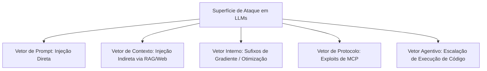
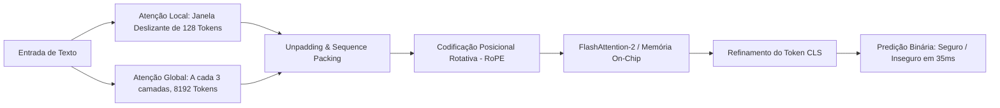
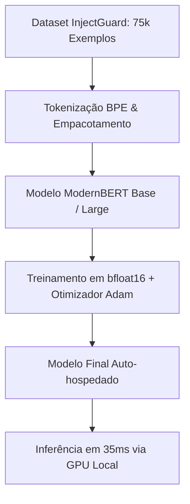

<config_file>
# Proteção de LLMs a Baixo Custo: Construção de Camadas Defensivas Auto-hospedadas com ModernBERT

A segurança de aplicações baseadas em modelos de linguagem generativos (*LLMs*) deixou de ser um desafio teórico para se tornar um requisito operacional crítico. Em palestra ministrada na conferência AI Engineer, o especialista em engenharia de IA **Diego Carpentero** detalhou a vulnerabilidade estrutural dos modelos generativos contra ataques sofisticados e apresentou uma solução de alta eficiência: o ajuste fino do **ModernBERT**, um modelo discriminador do tipo *encoder-only* capaz de atuar como camada de defesa (*guardrails*) auto-hospedada com latência de apenas 35 milissegundos e custo inferior a um dólar.

## 1. A Superfície de Ataque dos Sistemas Generativos

Os ataques a sistemas baseados em LLM evoluíram da simples tentativa de extração de instruções de sistema (*prompt injection*) para vetores complexos que exploram a falta de limites entre controle e dados:

- **Injeção Direta de Prompt**: Ocorre quando entradas maliciosas fornecidas pelo usuário sobrepõem as diretrizes do sistema. Como os LLMs concatenam o aviso do sistema (*system prompt*) e o texto do usuário na mesma janela de contexto, o modelo não possui distinção nativa entre instruções de controle e dados de entrada.
- **Injeção Indireta de Contexto**: Instruções maliciosas são ocultadas em fontes externas (como páginas da Wikipédia, e-mails ou metadados de sites) que a aplicação busca durante a execução. O conteúdo recuperado pode anular o processo decisório do modelo.
- **Ataques a Internos do Modelo (*Greedy Coordinate Gradient*)**: Uso de otimização matemática para encontrar tokens sem sentido aparente ao final da entrada. Esses sufixos alteram a distribuição de probabilidade da saída, forçando o modelo a ultrapassar suas travas de alinhamento probabilístico.
- **Envenenamento de RAG (*Poison RAG*)**: A alteração de uma fração mínima de documentos em uma base de conhecimento (por exemplo, 5 em 8 milhões) é suficiente para garantir a recuperação prioritária de respostas manipuladas.
- **Exploits em Protocolos MCP (*Model Context Protocol*)**: Assimetria entre a descrição resumida exibida ao usuário humano e a instrução completa enviada ao LLM. Chamadas aparentemente inofensivas podem incluir instruções ocultas para exfiltração de chaves privadas.
- **Escalação Agentiva e Cadeia de Suprimentos**: Manipulação de agentes com permissões autônomas para baixar, compilar e executar pacotes maliciosos ou binários no ambiente de execução.

## 2. A Lacuna de Confiança Zero e os Limites da Moderação Tradicional

A arquitetura tradicional de LLMs viola o princípio de *Zero Trust* ("nunca confie, sempre verifique"), pois trata entradas e controles no mesmo plano de dados. As estratégias defensivas usuais apresentam limitações graves:

1. **Alinhamento do Modelo (RLHF)**: Constitui apenas uma preferência probabilística, não uma restrição computacional rígida.
2. **Revisão Humana**: Sujeita ao efeito iceberg, onde a interface simplificada apresentada ao operador esconde os parâmetros reais executados em segundo plano.
3. **Abordagem LLM-as-a-Judge**: Utilizar outro modelo generativo grande para validar saídas adiciona segundos de latência e eleva drasticamente os custos operacionais de inferência.

## 3. Arquitetura do ModernBERT como Discriminador Defensivo

Os modelos *encoder-only* superam as abordagens generativas na tarefa de classificação por aplicarem atenção bidirecional em uma única passagem direta. O **ModernBERT** introduz otimizações estruturais que resolvem os gargalos dos modelos BERT tradicionais:

### Principais Inovações Arquiteturais do ModernBERT

- **Atenção Alternada**: Alterna duas camadas de atenção local (janela deslizante de 128 tokens) com uma camada de atenção global (até 8.128 tokens). Isso permite capturar padrões locais (sufixos ruidosos) e globais (documentos de contexto longo) reduzindo o uso de memória em 70%.
- **Unpadding e Sequence Packing**: Elimina o processamento inútil de tokens de preenchimento (*padding*), concatenando sequências reais até atingir o limite de 8.192 tokens por lote. Esse processo evita o desperdício de até 50% da capacidade computacional em TPUs e GPUs.
- **Codificação Posicional Rotativa (RoPE)**: Aplica rotação geométrica às projeções de consulta e chave em vez de somar vetores de posição estáticos aos embeddings. Isso preserva a semântica pura dos tokens e expande a janela de contexto sem degradação.
- **FlashAttention-2 e Eficiência de Memória**: Otimização do cálculo de atenção diretamente na memória *on-chip* (SRAM) da GPU, contornando o gargalo de largura de banda da memória principal (VRAM) e alcançando tempos de resposta de 35 a 40 milissegundos.

## 4. Pipeline Prático de Fine-Tuning e Resultados

A implementação da camada de proteção utiliza o conjunto de dados **InjectGuard** (composto por 75.000 exemplos rotulados de vetores de ataque) para ajustar a cabeça de classificação do ModernBERT.

### Diretrizes de Treinamento

1. **Escolha de Precisão**: O uso do formato de ponto flutuante **bfloat16** reduz a ocupação de memória durante o ajuste fino em cerca de 40%, permitindo lotes maiores.
2. **Seleção de Cabeça de Predição**: O token especial **CLS** atua como condensador do significado semântico ao passar por 22 camadas (versão Base) ou 28 camadas (versão Large). Para textos extensos, o agrupamento por média (*mean pooling*) pode ser utilizado como alternativa.
3. **Métricas de Desempenho**: O modelo ModernBERT Large ajustado atinge 85% de precisão na detecção de ataques inéditos em benchmarks de segurança, operando com latência determinística entre 35 e 40 ms.

## Notas Informativas e Glossário

A aplicação de modelos discriminadores especializados permite estabelecer barreiras de segurança eficientes e de baixo custo antes que as requisições atinjam a camada generativa principal.

### Principais Entidades e Conceitos

- **Diego Carpentero**: Engenheiro de IA, empreendedor de tecnologia e especialista certificado NVIDIA (NCP-GENL).
- **ModernBERT**: Evolução arquitetural do modelo BERT desenvolvida para suportar janelas de contexto extensas (8.192 tokens) com eficiência de memória avançada.
- **InjectGuard**: Conjunto de dados aberto contendo dezenas de milhares de exemplos de injeções de prompt e exploits de segurança em IA.
- **FlashAttention**: Algoritmo que reordena as operações de autoatenção para utilizar a memória SRAM de alto desempenho da GPU, evitando transferências redundantes com a VRAM.
- **RoPE (Rotary Position Embedding)**: Mecanismo de codificação posicional que altera o ângulo dos vetores no espaço vetorial de acordo com a posição relativa do token.

## Lacunas e Expansão do Conhecimento

Enquanto as camadas defensivas baseadas em codificadores resolvem os problemas de latência e custo para vetores conhecidos, os atacantes continuam desenvolvendo métodos de evasão baseados em obfuscação sintática avançada e esteganografia em múltiplos idiomas. A expansão contínua da camada de segurança exige pipelines de retreinamento contínuo e monitoramento ativo de telemetria em tempo real.
</config_file>
