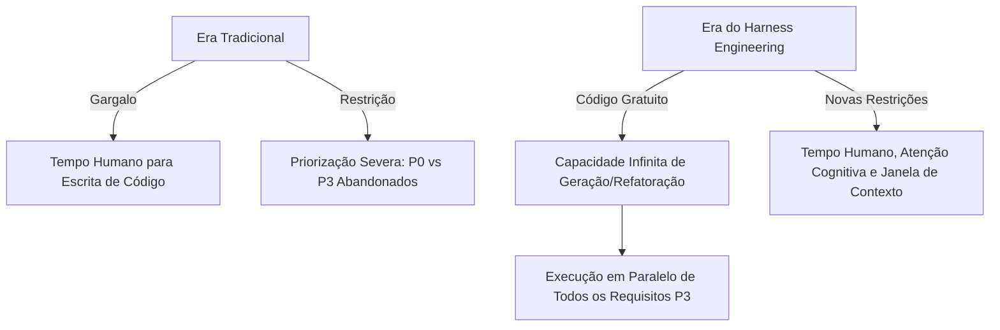
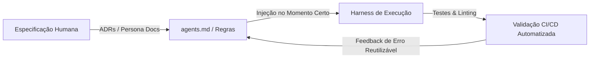
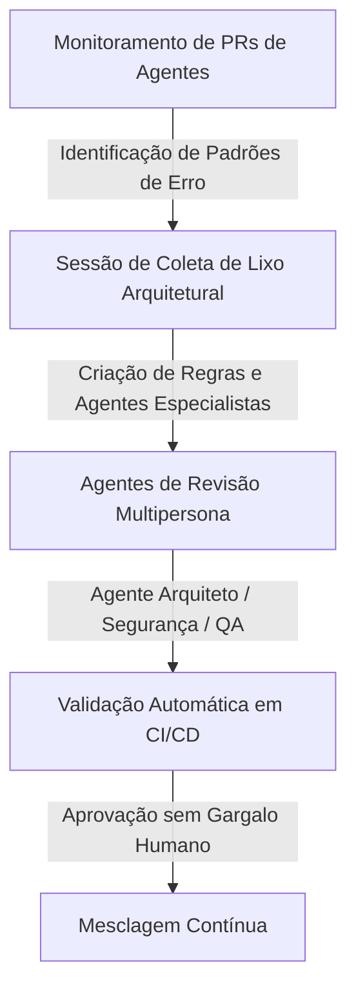

<config_file>
# Harness Engineering: A Mudança de Paradigma na Construção de Software com Agentes Autônomos

A transição da programação tradicional para o desenvolvimento assistido por agentes autônomos alterou fundamentalmente o recurso escasso na engenharia de software. Em palestra e sabatina promovidas na conferência AI Engineer, **Ryan Lopopolo** (membro da equipe técnica da OpenAI) apresentou o conceito de **Harness Engineering** — um modelo operacional em que engenheiros humanos atuam como diretores estratégicos enquanto múltiplos agentes de IA executam a totalidade do ciclo de implementação e manutenção de código.

## 1. O Paradigma do Código Gratuito e Abundante

Historicamente, o tempo e a capacidade cognitiva dos programadores humanos representavam o principal gargalo no desenvolvimento de produtos tecnológicos. A maturidade dos modelos generativos avançados (como o **GPT-5.2** e os motores **Codex**) estabeleceu uma equivalência funcional entre a capacidade de escrita de código dos modelos e a de engenheiros humanos experientes.

Nesse novo cenário:
- **Gratuidade da Produção e Refatoração**: O código tornou-se um bem abundante. O custo de gerar novas funcionalidades, refatorar bibliotecas inteiras ou traduzir interfaces locais para múltiplos idiomas foi reduzido drasticamente, dependendo unicamente da capacidade de inferência e do orçamento de tokens.
- **Eliminação de Projetos Pendentes**: Migrações arquiteturais complexas ou tarefas secundárias (nível P3), que costumavam ser postergadas indefinidamente devido a limitações de tempo humano, agora podem ser resolvidas em paralelo ao disparar múltiplos agentes simultaneamente.

## 2. A Tríade de Recursos Escassos na Era da IA

Em um ambiente onde a geração de sintaxe é gratuita, a engenharia de software redireciona seu foco para a otimização de três recursos verdadeiramente escassos:

1. **Tempo Humano**: A atenção dos desenvolvedores deve ser preservada para a definição de arquitetura, especificação de requisitos não-funcionais e avaliação de impacto nos negócios.
2. **Atenção do Modelo**: A capacidade do modelo de manter foco contínuo ao longo de sequências longas de raciocínio exige a eliminação de ruídos e instruções contraditórias.
3. **Janela de Contexto**: A quantidade de tokens alocada ao agente em cada chamada deve ser gerida de forma cirúrgica para evitar sobrecarga ou alucinações.

## 3. Arquitetura e Princípios de Harness Engineering

A função do *Harness Engineering* é construir infraestruturas nativas dentro da base de código que orientem os agentes a tomar decisões alinhadas às expectativas do projeto sem a necessidade de intervenção síncrona humana.

### 3.1 Transmissão Diferida de Instruções (_Progressive Disclosure_)
Carregar todas as regras de uma base de código no *system prompt* inicial degrada o desempenho do agente. A abordagem correta adota a **divulgação progressiva de contexto**:
- O agente recebe inicialmente apenas os requisitos da tarefa funcional.
- Durante a etapa de verificação ou compilação, o sistema injeta instruções de estilo ou restrições não-funcionais (como componentização sem estado ou limites de concorrência), permitindo que o agente adapte a solução em etapas.

### 3.2 Transformação de Linters e Testes em Prompts Reutilizáveis
Erros sintáticos, falhas de *lint* ou violações de arquitetura não devem interromper o fluxo com mensagens genéricas. Os testes e ferramentas de verificação estática devem ser configurados como *prompts* explicativos:
- Em vez de um erro genérico de tipo, o ambiente deve emitir uma mensagem instrutiva indicando a função correta da biblioteca e o padrão arquitetural esperado.
- A criação de testes que limitam a extensão dos arquivos (por exemplo, no máximo 350 linhas) força o agente a modularizar o repositório nativamente.

### 3.3 Padronização Extrema do Repositório
A uniformidade das estruturas de código reduz a quantidade de atenção que o modelo precisa alocar para prever os próximos tokens. O uso de padrões idênticos para gerenciamento de estado, chamadas de rede resilientes (com *timeouts* e *retries* obrigatórios) e tratamento de erros eleva a taxa de sucesso dos agentes em qualquer subárvore do repositório.

## 4. Governança, Revisões Multipersona e Coleta de Lixo Arquitetural

Para sustentar um fluxo contínuo de solicitações de alteração (*pull requests*) geradas por agentes sem paralisar a equipe em revisões manuais, adota-se um ciclo de governança automatizado:

### O Rito da Coleta de Lixo Arquitetural
As equipes reservam sessões periódicas (por exemplo, semanais) para catalogar todas as falhas ou retrabalhos observados durante as revisões de código dos agentes. A partir desse diagnóstico, os engenheiros não corrigem o código manualmente, mas sim a documentação e os scripts de validação no repositório.

### Agentes de Revisão Especializados por Persona
Em vez de depender de uma única revisão geral, o pipeline de integração contínua (CI) aciona agentes de revisão especializados baseados em documentações de personas:
- **Agente de Segurança**: Valida a inexistência de exposições e verifica a resiliência de rede.
- **Agente de Arquitetura**: Garante o isolamento de pacotes e a ausência de dependências circulares.
- **Agente de Qualidade (QA)**: Exige que cada nova funcionalidade inclua planos de controle de qualidade e mídias comprobatórias de teste de interface antes da mesclagem.

## 5. Sabatina e Respostas a Questões Práticas (Q&A)

Em discussão moderada por Vibhu Sapra, foram aprofundados os detalhes operacionais do modelo de trabalho na OpenAI:

- **Evolução dos Repositórios em Grande Escala**: A transição de pacotes monolíticos para monorepositórios com centenas de pacotes fortemente delimitados (ex.: 750 pacotes em workspace pnpm) impede que o agente modifique partes indevidas do sistema e garante contornos claros de API pública/privada.
- **O Papel dos Modos de Planejamento**: O uso de planos detalhados deve ser restrito aos momentos em que o desenvolvedor humano deseja revisar e aprovar explicitamente cada diretriz antes da execução. Executar planos extensos sem validação humana pode gastar contextos valiosos em premissas incorretas.
- **Código como Artefato Compilado**: A base de código deixa de ser um monumento intangível e passa a ser tratada como um artefato temporário de compilação. O valor real reside nas especificações, nas diretrizes de contexto e nos harnesses de teste que orientam o compilador estocástico (o LLM).

## Notas Informativas e Glossário

O conceito de Harness Engineering estabelece que a interface principal entre engenheiros e máquinas migrou da digitação de código para o projeto de ambientes de restrição e validação.

### Principais Entidades e Conceitos

- **Ryan Lopopolo**: Membro da equipe técnica da OpenAI, pioneiro no desenvolvimento de fluxos de trabalho baseados 100% em agentes autônomos.
- **Harness Engineering**: Disciplina de engenharia focada no projeto de arquiteturas, ferramentas locais, testes e documentação para direcionar o comportamento de agentes de IA.
- **Bilionário Simbólico (_Token Billionaire_)**: Termo informal para desenvolvedores ou equipes que consomem bilhões de tokens de inferência para automatizar integralmente a construção de software.
- **Divulgação Progressiva de Contexto**: Técnica de gerenciamento de prompts que introduz restrições e instruções ao agente em fases específicas da tarefa, evitando a saturação da janela de contexto.
- **Zod / ESLint**: Ferramentas de validação de esquemas e análise estática de código utilizadas no ecossistema JavaScript/TypeScript para reforçar invariantes arquiteturais.

## Lacunas e Expansão do Conhecimento

À medida que os agentes assumem a totalidade da escrita e refatoração de código, novos desafios emergem na fase de pós-implantação. A expansão da engenharia de suporte exige que os agentes passem a monitorar logs de produção em tempo real, gerenciar alertas de telemetria e interagir diretamente com artefatos compilados em ambientes de homologação sem necessidade de acionamento humano síncrono.
</config_file>
