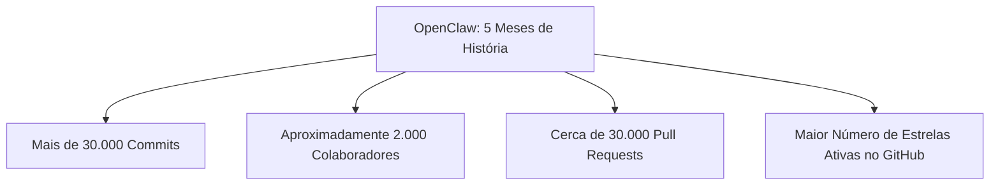
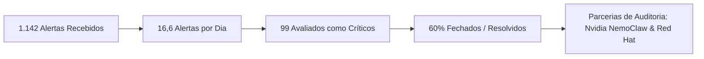
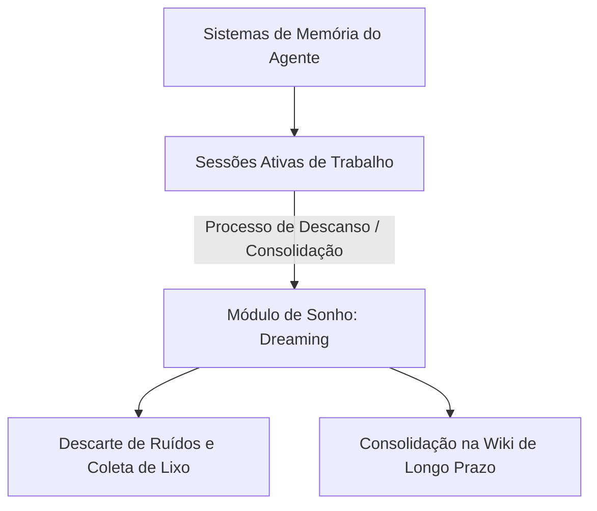

<config_file>
# State of the Claw: A Evolução da Maior Infraestrutura Open-Source de Agentes Pessoais

O projeto **OpenClaw** consolidou-se como a iniciativa de código aberto de crescimento mais rápido na história do software. Em palestra e sabatina promovidas durante a conferência AI Engineer, o fundador **Peter Steinberger** apresentou o balanço de cinco meses do projeto, os desafios de gerenciar milhares de relatórios de segurança, a fundação neutra **OpenClaw Foundation** e a visão de futuro para agentes autônomos locais e onipresentes.

## 1. Crescimento Exponencial e Métricas da Comunidade

Em apenas cinco meses de existência, a plataforma OpenClaw superou marcas históricas em repositórios de código aberto:

O ritmo ininterrupto de contribuições transformou o projeto em uma infraestrutura global, atraindo colaboradores de gigantes de tecnologia como Nvidia, Microsoft, Red Hat, Tencent, ByteDance, Salesforce e OpenAI.

## 2. Gestão de Segurança e o Paradoxo das Vulnerabilidades

O crescimento acelerado expôs o projeto a uma intensidade sem precedentes de análises de segurança por pesquisadores, empresas e ferramentas automatizadas baseadas em IA.

### O Desafio dos Escore CVSS e Métricas de Risco

- **Distorção das Classificações CVSS**: Muitos alertas classificados com severidade máxima (CVSS 10) referem-se a cenários teóricos de permissões reduzidas não utilizados na prática (por exemplo, sincronização de aplicativos em desenvolvimento). Na maioria das implantações reais em gateways isolados ou computadores pessoais, a superfície de ataque é contida.
- **Ataques à Cadeia de Suprimentos (*Supply Chain*)**: Incidentes envolvendo dependências indiretas (como pacotes NPM manipulados ou bibliotecas de terceiros como Axios e pacotes do MS Teams) afetaram a reputação do projeto devido à amplificação na mídia.
- **Auditoria Automatizada via IA**: Ferramentas de análise de código baseadas em modelos generativos avançados conseguem identificar vetores de escape de ambientes isolados (*sandboxes*) em questão de minutos, exigindo que as equipes de código aberto mantenham um ritmo defensivo constante.

## 3. A Governança da OpenClaw Foundation

Para garantir a independência do projeto e evitar o controle por uma única corporação, foi estabelecida a **OpenClaw Foundation**. 

1. **Estrutura Suíça Neutra**: Inspirada em modelos de governança de projetos abertos maduros, a fundação é mantida por um conselho multientidades (Nvidia, Microsoft, Red Hat, Tencent, OpenAI e voluntários).
2. **Sustentabilidade dos Mantenedores**: O objetivo da fundação é contratar desenvolvedores em tempo integral para assumir a manutenção diária e a triagem de segurança, reduzindo a sobrecarga sobre o criador original.
3. **Estímulo à Adoção Local**: A neutralidade garante que a plataforma continue compatível com modelos de linguagem abertos operados localmente, protegendo a privacidade dos dados do usuário final.

## 4. Sabatina (AMA) com Swyx: Visão Arquitetural e Novas Fronteiras

Durante a sessão de perguntas e respostas conduzida por Swyx (Shawn Wang), foram debatidos os rumos da automação assistida por agentes:

### 4.1 A Ilusão da Fábrica Totalmente Escura (_Dark Factory_)
Diferente da visão de geração de software sem supervisão, Peter Steinberger defende o desenvolvimento iterativo. A criação de software de qualidade não segue uma linha reta: exige testes de usabilidade, ajustes de direção e refinamento do **Gosto e Sensibilidade Arquitetural**. Substituir a interatividade humana por um pipeline cego em cascata resulta em produtos genéricos que "cheiram a IA" — com interfaces padronizadas e textos prolixos sem personalidade.

### 4.2 O Conceito de "Dreaming" (Sonho e Consolidação de Memória)
Inspirado na neurociência e em vazamentos recentes de pesquisas da Anthropic, o OpenClaw está implementando um módulo de **Dreaming**. Enquanto o agente não está em uso ativo, o sistema realiza uma "coleta de lixo" das memórias locais da sessão, descartando ruídos irrelevantes e consolidando os aprendizados centrais em uma estrutura de conhecimento duradoura (Wiki do Agente).

### 4.3 Agentes Onipresentes na Casa Inteligente
O futuro dos agentes de assistência pessoal reside na ubiquidade. Em vez de limitar o agente a um aplicativo de mensagens no smartphone, a arquitetura evolui para responder a comandos de voz em qualquer cômodo da casa, projetando informações em telas dinâmicas próximas ou interagindo com dispositivos IoT locais de forma segura.

### 4.4 A Habilidade de Saber Dizer Não
Com a facilidade de gerar novas funcionalidades via IA, a habilidade mais crítica para engenheiros e arquitetos passa a ser a capacidade de filtrar ideias e recusar a adição de complexidade desnecessária. O acúmulo desordenado de recursos isolados degrada a manutenibilidade global do sistema.

## Notas Informativas e Glossário

O projeto OpenClaw demonstrou que ferramentas de automação autônoma exigem uma combinação de permissões locais elevadas com salvaguardas de privacidade rígidas.

### Principais Entidades e Conceitos

- **Peter Steinberger**: Desenvolvedor austríaco, fundador da PSPDFKit, criador do *OpenClaw* e membro da OpenAI.
- **OpenClaw Foundation**: Entidade sem fins lucrativos criada para governar o desenvolvimento neutro da plataforma OpenClaw.
- **NemoClaw**: Camada de segurança e isolamento desenvolvida pela Nvidia para proteger execuções do OpenClaw em ambientes corporativos.
- **CVSS (Common Vulnerability Scoring System)**: Sistema padrão da indústria para calcular a severidade de vulnerabilidades de software.
- **Dreaming**: Mecanismo asícrono de consolidação de memória que sintetiza e organiza o histórico de sessões do agente em conhecimento estruturado.

## Lacunas e Expansão do Conhecimento

À medida que os agentes avançam para ambientes domésticos e corporativos com múltiplos dispositivos conectados, a interoperabilidade de protocolos entre agentes de diferentes domínios (como a comunicação segura entre o agente pessoal e o agente da empresa) permanece como um campo de pesquisa aberto sem padronização definitiva.
</config_file>
