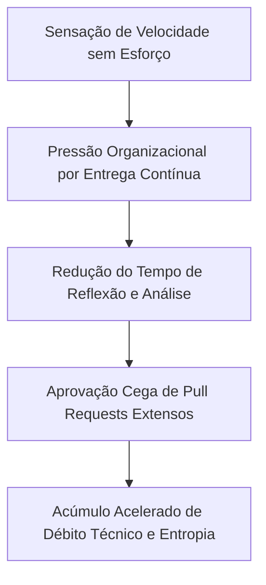
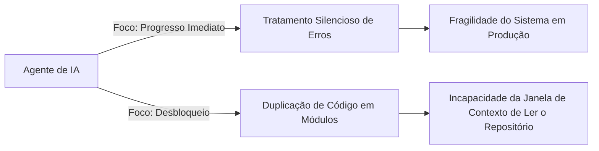
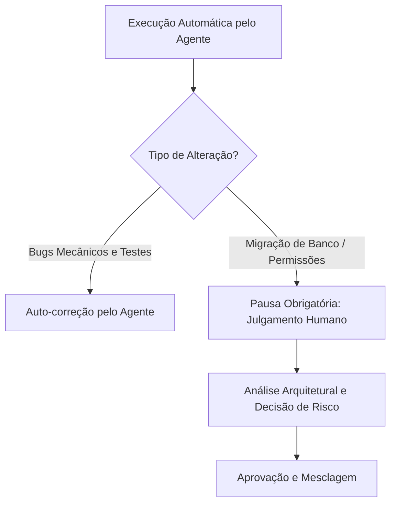

<config_file>
# O Atrito como Vetor de Governança: O Papel do Julgamento Humano na Engenharia de IA

A promessa de "entrega contínua sem atrito" impulsionada por agentes autônomos de programação oculta um paradoxo operacional. Em palestra proferida na conferência AI Engineer, **Armin Ronacher** (criador do framework Flask e cofundador da Earendil) e **Cristina Poncela Cubeiro** exploraram os riscos da velocidade desgovernada no desenvolvimento de software. Os palestrantes defenderam que o atrito — frequentemente tratado como um obstáculo a ser eliminado — é, na verdade, o mecanismo indispensável que permite o direcionamento arquitetural, o controle de qualidade e a preservação do julgamento humano na engenharia de sistemas.

## 1. A Armadilha Psicológica da Produtividade Instantânea

A adoção de ferramentas autônomas de código gera um ciclo de dependência viciante e altera a dinâmica operacional das equipes de engenharia:

- **O Ciclo Viciante de Recompensa**: A facilidade de disparar comandos cria uma ilusão de eficiência imediata. O desenvolvedor é incentivado a tentar uma última instrução para obter uma funcionalidade pronta, abrindo mão do tempo necessário para desenhar a arquitetura ou compreender o código gerado.
- **Desequilíbrio na Capacidade da Equipe**: A capacidade de *produção* de código escalou exponencialmente, enquanto a capacidade de *revisão e julgamento* humano permaneceu constante. Isso gera acúmulo de solicitações de alteração (*pull requests*) massivas (com milhares de linhas) que acabam sendo mescladas sem auditoria adequada.
- **Diluição da Responsabilidade**: A entrada de atores não-técnicos ou gestores no fluxo de geração de sintaxe expande a produção de código, mas a responsabilidade pela estabilidade operacional e manutenção de longo prazo permanece restrita aos engenheiros de software.

## 2. O Desafio de Engenharia: A Fragilidade do Código Sintético

Os agentes de programação são treinados por aprendizado por reforço para otimizar um objetivo primário: fazer o código executar e passar em verificações imediatas. Essa otimização produz efeitos colaterais estruturais sérios:

- **Resiliência Falsa e Erros Mascarados**: Agentes tendem a implementar tratamentos de exceção permissivos (como captura genérica de erros que retornam valores padrão em arquivos de configuração ausentes). Essa prática mascara falhas graves que só se manifestam em produção após horas de degradação de dados.
- **Ausência de Remorso Computacional**: Engenheiros humanos hesitam em adotar atalhos arquiteturais devido ao impacto mental e ao custo futuro de manutenção. Agentes não possuem esse contrapeso emocional e multiplicam abstrações redundantes.
- **Erosão da Janela de Contexto**: A proliferação desordenada de arquivos duplica utilitários no repositório, tornando a base de código vasta demais para ser compreendida pelo próprio agente em chamadas subsequentes.

## 3. Repositórios Legíveis por Agentes (_Agent-Legible Codebases_)

Para mitigar a entropia, a base de código deve ser projetada como uma infraestrutura legível tanto para humanos quanto para modelos de linguagem. O comportamento do agente é significativamente superior ao trabalhar em bibliotecas isoladas em comparação a produtos interligados complexos.

### 3.1 Modularização de Componentes e Fluxos de Dados
- **Separação Rígida de Camadas**: Reduzir acoplamentos entre interface visual, permissões e chamadas de API. Módulos delimitados permitem que o agente opere em escopos locais sem corromper o estado global.
- **Clareza nos Pontos de Transição**: Mapear os estágios principais do processamento (recebimento de dados, laço do agente e persistência) impede a injeção de lógica irrelevante ou perigosa no meio dos fluxos.

### 3.2 Imposição de Regras Mecânicas via Linting
- **Proibição de Capturas Genéricas (*No Bare Catch-Alls*)**: Impedir capturas silenciosas de exceções para forçar o tratamento explícito de falhas.
- **Unicidade de Nomes de Funções**: Garantir que cada função possua um identificador exclusivo no repositório. Isso melhora a eficiência de busca do agente, economizando tokens e evitando ambiguidades.
- **Centralização de Consultas SQL e UI Primitiva**: Evitar ORMs com comportamentos dinâmicos ocultos e proibir componentes brutos de interface, mantendo uma única biblioteca de primitiva estilística.
- **Tipagem Direta em TypeScript (Sintaxe Apagável)**: Utilizar anotações de tipo diretamente compatíveis com JavaScript puro, eliminando etapas intermediárias de transpilação que confundem o agente durante a depuração.

## 4. A Reintrodução Intencional do Atrito Humano

A preservação da qualidade exige a reintrodução de pontos de pausa obrigatórios no ciclo de desenvolvimento, nos quais a aprovação depende exclusivamente do julgamento humano:

- **Pontos Críticos de Pausa**: Alterações de esquemas de banco de dados, modificações na matriz de permissões de acesso, adições de novas dependências externas e decisões de design de produto não devem ser delegadas à execução automática.
- **A Analogia dos SLOs**: Da mesma forma que os Objetivos de Nível de Serviço (*Service Level Objectives*) criam atrito deliberado na engenharia de confiabilidade (SRE) para limitar implantações arriscadas, o atrito no uso de agentes garante a governança sobre o sistema.
- **Atrito como Vetor de Direção**: Na física, a mudança de direção de um veículo exige atrito com o solo; no desenvolvimento de software, o atrito intelectual é a única força capaz de manter a coesão arquitetural a longo prazo.

## Notas Informativas e Glossário

A preservação do julgamento humano na automação por agentes constitui a principal salvaguarda contra a degradação acelerada de sistemas corporativos.

### Principais Entidades e Conceitos

- **Armin Ronacher**: Engenheiro de software austríaco, criador do framework web *Flask* (Python), do motor de modelos *Jinja* e cofundador da Arendell.
- **Cristina Poncela Cubeiro**: Engenheira de software na Arendell com foco em engenharia de sistemas baseados em inteligência artificial.
- **Agent-Legible Codebase**: Padrão de design de repositórios estruturado especificamente para facilitar a interpretação sintática e semântica por agentes de IA.
- **Slop Técnico**: Código redundante, mal projetado ou excessivamente frágil produzido por modelos generativos quando executados sem supervisão rígida.
- **Sintaxe Apagável (Erasable Syntax)**: Recurso do TypeScript que permite tratar anotações de tipo como comentários removíveis, alinhando o código fonte diretamente ao comportamento do motor JavaScript.

## Lacunas e Expansão do Conhecimento

Embora as ferramentas de linting e refatoração mecânica contenham falhas de sintaxe e isolamento de escopo, os métodos para medir com precisão a velocidade de acúmulo de débito técnico sintético em grandes organizações continuam sendo um desafio em aberto. A busca por métricas que correlacionem o volume de código gerado por IA com a taxa de incidentes em produção permanece como prioridade para a gestão de engenharia.
</config_file>
