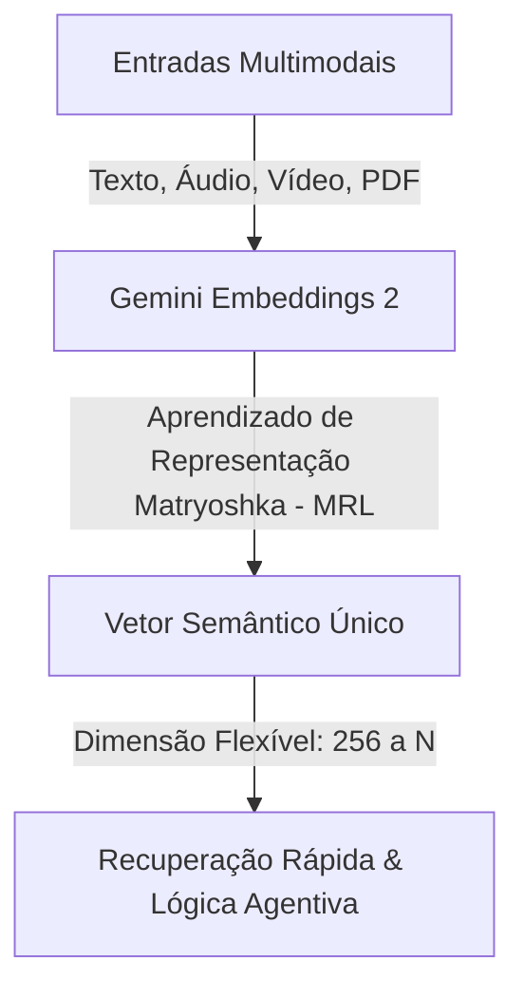
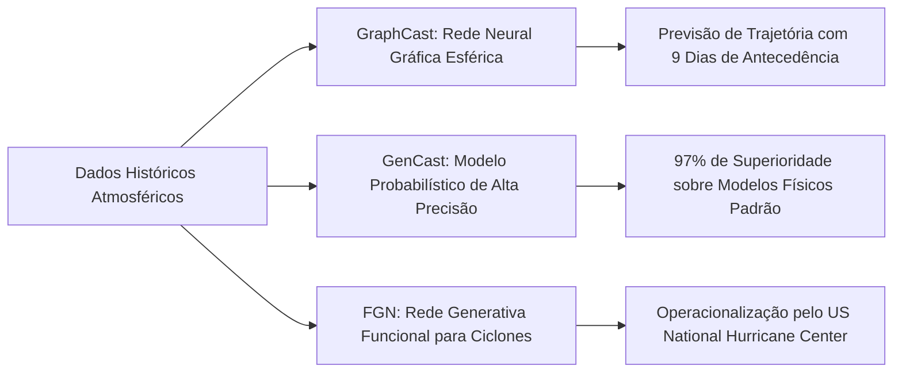
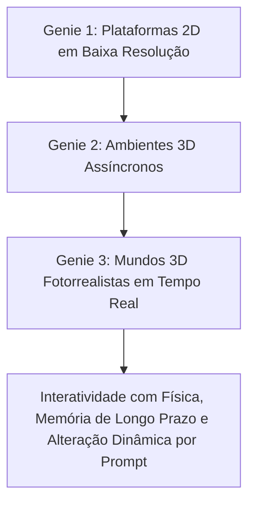

<config_file>
# Fronteiras da Inteligência Artificial: Avanços em Embeddings Omnimodais, Previsão Meteorológica e Modelos de Mundo

A evolução da inteligência artificial de fronteira transcende a arquitetura dos modelos de linguagem generativos tradicionais. Em palestra de abertura da conferência AI Engineer Europe, **Raia Hadsell** (Vice-Presidente de Pesquisa do **Google DeepMind** e Embaixadora de IA do Reino Unido) apresentou os pilares estratégicos da instituição focados na resolução de problemas estruturais profundos. A apresentação detalhou inovações em representações vetoriais omnimodais (**Gemini Embeddings 2**), modelos neurais para física atmosférica (**GraphCast**, **GenCast** e **FGN**) e a criação de ambientes interativos tridimensionais em tempo real (**Genie 3**).

## 1. Modelos Avançados de Embedding: Representações Semânticas Omnimodais

Os modelos de incorporação vetorial (*embeddings*) constituem a base para a recuperação rápida e comparação de conceitos semânticos em grandes volumes de dados.

### A Analogia Neurocientífica: Células da Jennifer Aniston
Na neurociência, o conceito das **células da Jennifer Aniston** descreve conjuntos específicos de neurônios que se ativam para reconhecer um conceito ou pessoa específica, independentemente da forma como a informação é apresentada (imagem, som da voz, texto impresso ou vídeo). O **Gemini Embeddings 2** replica esse princípio no espaço vetorial artificial:
- **Unificação Omnimodal**: O modelo processa simultaneamente até 8.000 tokens de texto, 128 segundos de vídeo, 80 segundos de áudio e arquivos PDF completos em um único vetor denso.
- **Aprendizado de Representação Matryoshka (MRL)**: Permite adaptar a dimensão da representação vetorial (por exemplo, iniciando a busca em 256 dimensões para alta velocidade e expandindo conforme a necessidade de precisão), otimizando a computação sem perder a coerência semântica.

## 2. Redes Neurais Aplicadas à Física Atmosférica

Substituindo as simulações físicas tradicionais — altamente custosas computacionalmente —, o Google DeepMind aplicou aprendizado profundo sobre 40 anos de dados meteorológicos globais, revolucionando a previsão do tempo:

- **GraphCast**: Estruturado como uma rede neural gráfica esférica cobrindo a Terra desde a superfície até a estratosfera. O modelo prevê autorregressivamente 100 variáveis atmosféricas (velocidade do vento, umidade, temperatura) para até 15 dias. Em testes reais (como no Furacão Lee), o GraphCast previu o ponto de impacto na costa com 9 dias de antecedência, superando em 3 dias os supercomputadores de física atmosférica.
- **GenCast**: Modelo probabilístico otimizado para prever eventos extremos nas caudas de distribuição. Em benchmark contra 1.300 previsões padrão da indústria, o GenCast apresentou maior precisão em 97% dos cenários, reduzindo o tempo de inferência para 8 minutos em um único chip acelerador.
- **FGN (Functional Generative Network)**: Modelo treinado especificamente para a detecção direta, categorização e previsão da estrutura do olho de ciclones tropicais, adotado operacionalmente pelo Centro Nacional de Furacões dos EUA (*National Hurricane Center*).

## 3. Modelos de Mundo (_World Models_): A Família Genie

A evolução dos simuladores neurais interativos visa criar ambientes tridimensionais dinâmicos com coerência física e memória temporal:

- **Genie 1 e 2**: Primeiras gerações focadas em jogos 2D e renderizações 3D em ritmo não-real.
- **Genie 3**: Gera mundos 3D fotorrealistas navegáveis a partir de prompts em linguagem natural ou imagens estáticas. O modelo mantém a persistência do ambiente (permitindo que o usuário explore uma cena, se afaste por minutos e retorne encontrando os mesmos objetos no mesmo lugar) e reage em tempo real a modificações dinâmicas de cenário disparadas pelo operador.

## Notas Informativas e Glossário

Os avanços apresentados refletem a transição de modelos estritamente generativos de texto para sistemas de percepção, simulação e representação semântica do mundo real.

### Principais Entidades e Conceitos

- **Raia Hadsell**: Vice-Presidente de Pesquisa no Google DeepMind, pioneira no estudo de redes neurais siamesas e funções de perda contrastiva sob orientação de Yann LeCun.
- **Gemini Embeddings 2**: Modelo de incorporação vetorial omnimodal do Google projetado para busca e recuperação unificada entre diferentes mídias.
- **GraphCast**: Arquitetura de rede neural gráfica utilizada para previsão meteorológica global com alta precisão temporal.
- **Genie 3**: Modelo de mundo generativo capaz de sintetizar ambientes 3D interativos em tempo real com coerência espacial e memória contínua.
- **Matryoshka Representation Learning (MRL)**: Técnica que permite extrair embeddings de dimensões adaptáveis a partir de um mesmo modelo pré-treinado.

## Lacunas e Expansão do Conhecimento

Embora os modelos de mundo como o Genie 3 demonstrem alta coerência visual e persistência espacial em simulações curtas, o alinhamento perfeito de causalidade física complexa e a escalabilidade para interações multiagente em tempo real representam campos em aberto para a próxima geração de pesquisa em inteligência artificial de fronteira.
</config_file>
