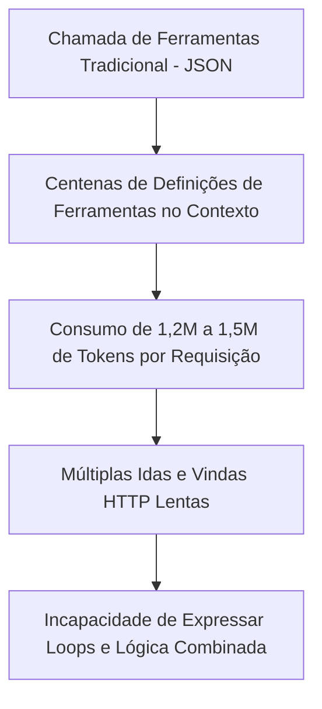
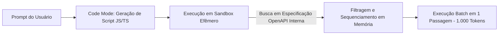
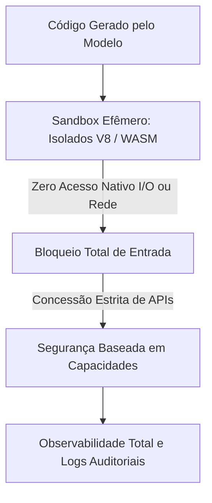

<config_file>
# Code Mode: A Transição da Chamada de Ferramentas via JSON para a Execução Dinâmica de Código

À medida que os ecossistemas de agentes de inteligência artificial se expandem para integrar centenas de APIs e serviços corporativos, o modelo tradicional de chamada de ferramentas baseado em trocas sucessivas de objetos JSON torna-se ineficiente e computacionalmente proibitivo. Em palestra proferida na conferência AI Engineer, **Sunil Pai** (desenvolvedor de agentes na Cloudflare e criador da ferramenta **PartyKit**) apresentou o conceito de **Code Mode** — uma abordagem arquitetural em que os modelos geram scripts de código executáveis (como JavaScript ou TypeScript) executados dentro de ambientes isolados seguros, reduzindo o consumo de tokens em até 99,9% e transformando a interação com modelos em computação com estado.

## 1. Gargalos da Chamada Tradicional de Ferramentas (_Tool Calling_)

O padrão atual de chamada de ferramentas por agentes apresenta limitações severas de escalabilidade:

- **Inchaço da Janela de Contexto**: Em plataformas de grande porte (como a API da Cloudflare, que possui cerca de 2.600 *endpoints*), disponibilizar uma definição de ferramenta para cada ponto de extremidade exige enviar entre 1,2 e 1,5 milhão de tokens na primeira chamada do agente ao servidor MCP.
- **Latência Sequencial**: A execução de fluxos complexos exige que o modelo invoque uma ferramenta, aguarde o retorno da rede, leia a resposta JSON e dispare a próxima chamada sequencialmente.

## 2. O Conceito de Code Mode e a Economia Extrema de Tokens

O *Code Mode* altera essa dinâmica ao instruir o modelo a gerar um bloco único de código executável que condensa a lógica de busca, filtro e execução de chamadas em uma única passagem:

### Mecanismo de Execução em Dois Estágios
1. **Ferramenta de Busca (*Search*)**: O modelo recebe apenas o esquema simplificado da API em formato JSON e gera uma função de consulta rápida para localizar os métodos relevantes.
2. **Ferramenta de Execução (*Execute*)**: O modelo gera o código que encadeia chamadas, filtra resultados e trata exceções localmente dentro do ambiente de execução.

Essa transição reduz a ocupação da janela de contexto de 1,5 milhão de tokens para aproximadamente **1.000 tokens** (uma redução de 99,9%), eliminando a latência de múltiplas requisições de rede externas.

## 3. Habitar a Máquina de Estados: O Exemplo da Tela Kenton

Além de otimizar chamadas de API, o *Code Mode* permite que o agente interaja diretamente com o estado interno dos sistemas em tempo real sem a necessidade de compilar aplicativos inteiros a cada alteração.

### O Experimento Kenton (Jogo da Velha Dinâmico)
Em um ambiente visual (*canvas* vetorial estilo Excalidraw), em vez de instanciar uma aplicação tradicional de Jogo da Velha com interface própria, o modelo foi instruído a inspecionar a lista de traços e coordenadas na memória:
- O agente leu os traços vetoriais no estado do sistema, identificou a presença de um tabuleiro desenhado à mão e a marcação de um "X" no canto superior esquerdo.
- Em resposta, o agente gerou o código que inseriu diretamente as coordenadas de um círculo perfeito no centro do estado do *canvas*.
- O modelo deixou de gerar programas estáticos e passou a **habitar a máquina de estados** do sistema existente, manipulando dados brutos de forma emergente.

## 4. A Nova Arquitetura de Software: Sandboxes com Segurança Baseada em Capacidades

A execução de código gerado por IA exige um novo modelo de infraestrutura que substitui máquinas virtuais tradicionais ou contêineres pesados por ambientes de isolamento leve.

### Atributos do Sandbox de Próxima Geração

1. **Privilégio Zero Inicial**: O ambiente de execução inicia sem acesso a sistema de arquivos, conexões de rede ou variáveis de ambiente.
2. **Segurança Baseada em Capacidades**: As permissões (como acesso a um banco de dados ou a um *endpoint* específico) são injetadas explicitamente no código como funções utilitárias restritas.
3. **Inicialização Ultrarrápida**: Uso de **Isolados V8** (*V8 Isolates*) ou interpretadores **WebAssembly** (WASM) que inicializam em milissegundos sem o custo operacional de subida de contêineres Docker.
4. **Observabilidade Total**: Registro de cada instrução executada para fins de auditoria financeira, operacional e de segurança.

## 5. O Futuro das Interfaces Generativas e a Experiência do Agente

A combinação de *eval* seguro com modelos de código redefine o design de software para usuários humanos e agentes de IA:

- **Interfaces Dinâmicas Personalizadas**: Em vez de interfaces estáticas de comércio eletrônico, o sistema pode sintetizar um componente visual exclusivo ajustado ao histórico e à intenção imediata do usuário (por exemplo, um fluxo direto de devolução de produtos com alternativas de baixo custo).
- **Agentes como Principais Consumidores de API**: Os robôs geradores de código tornam-se os principais clientes dos sistemas de software. A experiência do desenvolvedor (*Developer Experience - DX*) deve ser otimizada para legibilidade por máquinas, com documentação clara em Markdown, mensagens de erro instrutivas e APIs fortemente tipadas.

## Notas Informativas e Glossário

A abordagem *Code Mode* resgata conceitos de segurança orientada a capacidades e avaliação dinâmica de código (*eval*), adaptando-os à era da computação generativa.

### Principais Entidades e Conceitos

- **Sunil Pai**: Engenheiro na Cloudflare, ex-criador da ferramenta open-source *PartyKit* voltada para aplicações multijogador em tempo real.
- **Code Mode**: Padrão arquitetural em que agentes de IA interagem com sistemas gerando e executando scripts de código em vez de trocarem dados estruturados em JSON.
- **Isolados V8 (V8 Isolates)**: Instâncias leves do motor JavaScript V8 do Google que fornecem isolamento de memória extremamente rápido sem a necessidade de virtualização completa.
- **Segurança Baseada em Capacidades (Capability-Based Security)**: Modelo de segurança de software em que os direitos de acesso a recursos são representados por referências ou funções inalienáveis concedidas explicitamente aos componentes.
- **Interfaces de Usuário Generativas (Generative UI)**: Componentes visuais sintetizados dinamicamente por modelos de linguagem no momento da interação do usuário.

## Lacunas e Expansão do Conhecimento

Embora os Isolados V8 garantam contenção de memória e alta velocidade de execução para código JavaScript, a padronização de ambientes de execução *multilinguagem* seguros para tarefas computacionais intensivas em Python ou Rust dentro de bordas de rede efêmeras permanece como uma área em aceleração de desenvolvimento.
</config_file>
