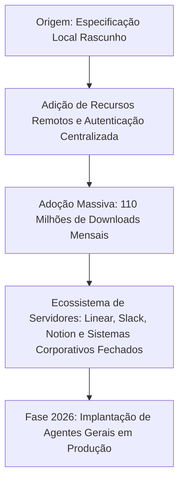
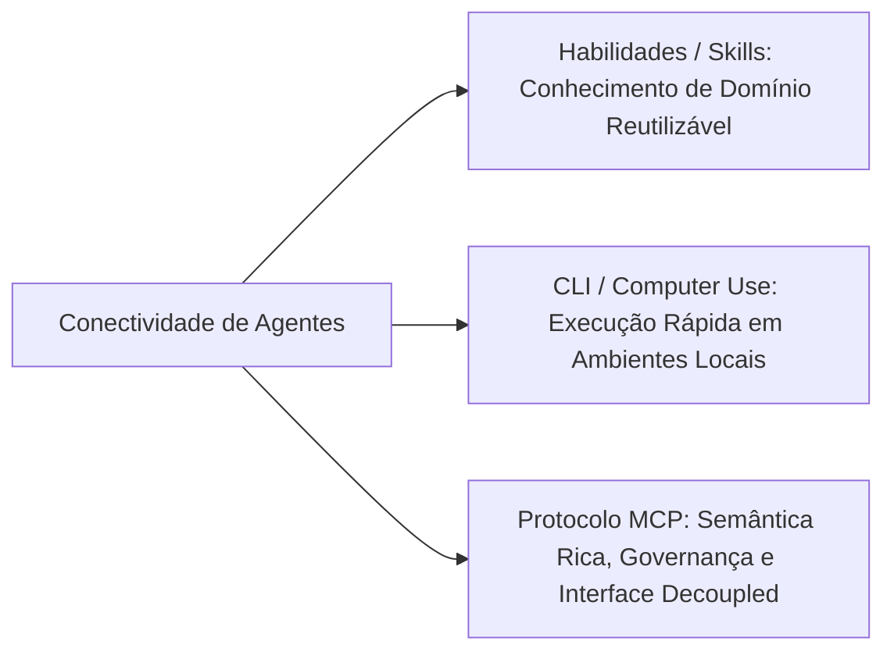
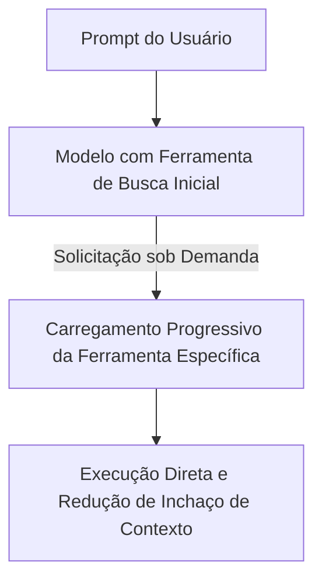

<config_file>
# O Futuro do Protocolo MCP: Conectividade Semântica, Descoberta Progressiva e Aplicações Desacopladas

À medida que a engenharia de IA transita da fase de prototipação para a implantação de agentes em produção, a conectividade entre modelos e sistemas de software torna-se o ativo mais crítico. Em palestra ministrada na conferência AI Engineer, **David Soria Parra** (líder da iniciativa na Anthropic) apresentou o balanço do **Protocolo MCP - Model Context Protocol**, as melhores práticas de otimização de contexto e o roteiro de evolução da infraestrutura de integração que suporta **Aplicativos MCP** nativos em múltiplas plataformas.

## 1. A Evolução do Ecossistema MCP (2024–2026)

Em um período de 18 meses, a infraestrutura MCP evoluiu de um rascunho de especificação técnica voltado para ferramentas locais para um padrão universal de conectividade corporativa:

- **Métrica de Crescimento**: O SDK do protocolo atingiu mais de 110 milhões de downloads mensais — marca alcançada na metade do tempo exigido por projetos consagrados do código aberto, como a biblioteca React. O protocolo foi adotado por frameworks principais como o ADK do Google, o SDK de agentes da OpenAI e o LangChain.
- **Transição para Agentes Gerais**: Se 2025 foi o ano dos agentes de programação (ambientes locais, determinísticos e verificáveis por compiladores), 2026 marca a entrada dos agentes para trabalhadores do conhecimento (analistas financeiros, profissionais de marketing), cuja eficácia depende da conexão simultânea a múltiplos softwares como serviço (*SaaS*) e repositórios de dados corporativos.

## 2. A Tríade de Conectividade de IA para 2026

A integração de agentes com sistemas de software não deve ser tratada como uma solução única. Ela se divide em três pilares complementares:

1. **Habilidades (*Skills*)**: Arquivos estruturados que capturam conhecimento de domínio e diretrizes comportamentais reutilizáveis entre modelos.
2. **Interfaces de Linha de Comando (CLI / *Computer Use*)**: Ideais para agentes locais de programação em ambientes isolados (*sandboxes*), aproveitando comandos pré-treinados (como Git e utilitários de sistema).
3. **Protocolo MCP**: O tecido conectivo indispensável quando a aplicação exige semântica rica, interfaces de usuário dinâmicas, gerenciamento de tarefas de longa duração, autorização centralizada e governança corporativa sem dependência de plataforma.

## 3. Padrões Avançados no Lado do Cliente

O carregamento ingênuo de todas as ferramentas disponíveis no *system prompt* compromete a janela de contexto. O protocolo avança com a implementação de dois padrões fundamentais de otimização:

### 3.1 Descoberta Progressiva (_Progressive Discovery_)
Em vez de expor dezenas de ferramentas simultaneamente, o cliente fornece ao modelo apenas uma ferramenta genérica de busca (*tool search*). Quando o agente identifica a necessidade de interagir com um sistema específico, ele solicita e carrega as ferramentas sob demanda, reduzindo drasticamente o consumo de tokens na janela de trabalho.

### 3.2 Chamada Programática de Ferramentas (_Code Mode_)
Para evitar que o modelo orquestre chamadas sequenciais com alta latência por meio de inferência contínua, o cliente disponibiliza um ambiente de execução leve (como um isolado V8 ou interpretador Lua). O modelo gera um script que executa múltiplas chamadas de ferramentas locais no próprio servidor e retorna apenas o valor compilado final.

## 4. O Roteiro de Evolução do Protocolo MCP

A especificação técnica do protocolo está sendo atualizada para atender a requisitos de escala hiperespacial e governança corporativa:

- **Transporte HTTP Sem Estado (*Stateless HTTP Transport*)**: Proposta desenvolvida em parceria com o Google para permitir que servidores MCP operem sem estado persistente de conexão, facilitando a implantação em clusters de **Kubernetes** ou **Cloud Run**.
- **Comunicação Assíncrona entre Agentes**: Aprimoramento da primitiva de tarefas (*tasks*) para suportar a orquestração e troca de mensagens assíncronas de longa duração entre múltiplos agentes.
- **Acesso Entre Aplicativos (*Cross-App Access*)**: Integração nativa com provedores de identidade corporativa (como Google Workspace e Okta). Após uma única autenticação, o agente navega por múltiplos servidores MCP autorizados sem exigência de reautenticação contínua.
- **Descoberta Automática de Servidores**: Mecanismo que permite a agentes e navegadores descobrirem automaticamente a existência de um servidor MCP associado a uma URL web conhecida.
- **Distribuição de Habilidades via MCP**: Mecanismo de extensão que permite aos autores de servidores empacotar e atualizar continuamente as habilidades e documentações de uso juntamente com as definições de ferramentas do protocolo.

## Notas Informativas e Glossário

O ecossistema MCP consolida-se como o padrão de interoperabilidade que desconecta a lógica do modelo generativo das interfaces de execução nos sistemas finais.

### Principais Entidades e Conceitos

- **David Soria Parra**: Engenheiro e líder da iniciativa de infraestrutura MCP na Anthropic.
- **Protocolo MCP (Model Context Protocol)**: Padrão aberto que define a comunicação bidirecional entre modelos de linguagem e servidores de dados ou ferramentas.
- **Aplicativos MCP**: Servidores capazes de entregar tanto a lógica de execução por ferramentas quanto componentes de interface visual renderizáveis em clientes diversos (VS Code, Cursor, web ou ChatGPT).
- **Descoberta Progressiva (Progressive Discovery)**: Padrão de design que adia o carregamento de ferramentas na janela de contexto até o momento exato em que são requeridas pelo agente.
- **FastMCP**: Biblioteca simplificada desenvolvida para a comunidade Python que abstrai a criação de servidores MCP com alto desempenho.

## Lacunas e Expansão do Conhecimento

Enquanto a especificação do protocolo avança no suporte a chamadas de ferramentas e transporte sem estado, o desafio de padronizar a renderização de componentes de interface visual (*Aplicativos MCP*) em clientes estritamente textuais ou de linha de comando permanece como uma fronteira em desenvolvimento.
</config_file>
