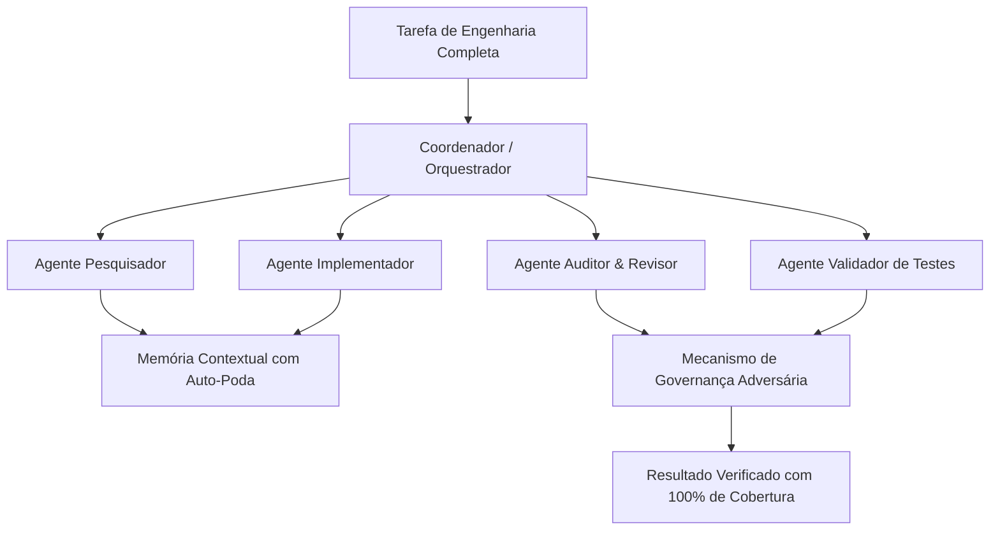
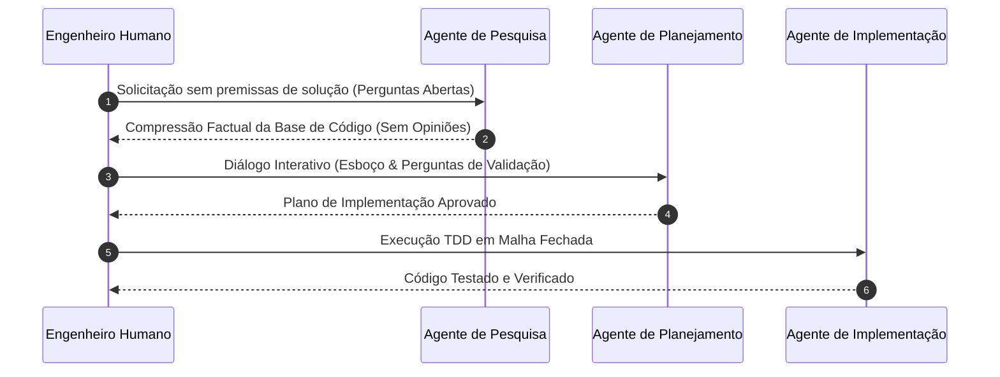
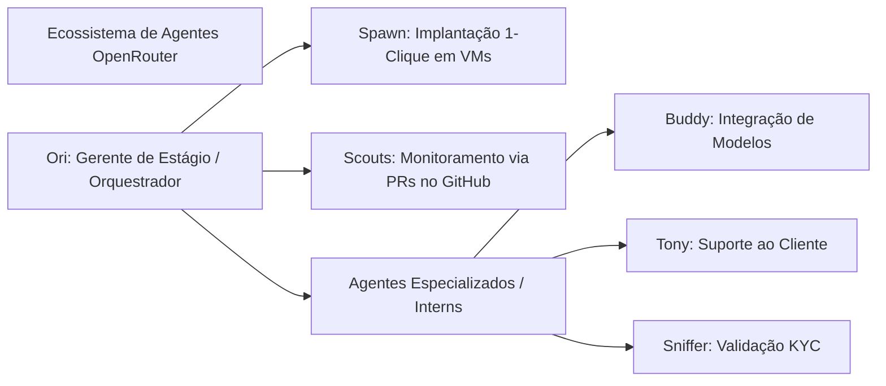
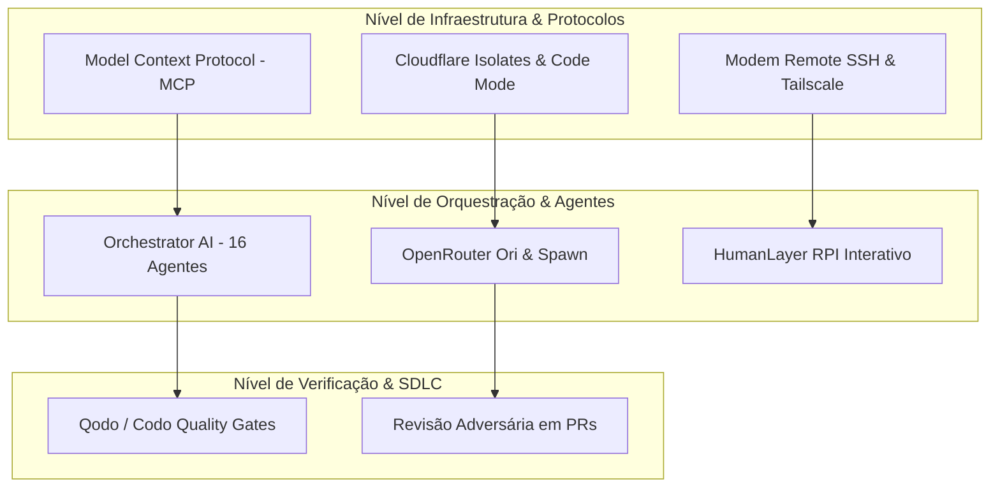

<config_file>
# AIE Miami 2026 Keynotes e Palestras: OpenCode, Google DeepMind, OpenAI, OpenRouter, Qodo, Baseten, Cloudflare e T3

- **Evento**: **AI Engineer Miami 2026** (**AIE Miami 2026**)
- **Data**: 20 de Abril de 2026
- **Arquivo de Origem**: `2026-04-20-6IxSbMhT7v4.txt`
- **Apresentadores e Palestrantes**: **Ethel Zhang** (Google), **Iman Haji** (Google), **Gabe Greenberg** (G2i), **Dax Raad** (OpenCode), **Dexter Horthy** (HumanLayer), **Max Stoiber** (OpenAI), **Ben Vinegar** (Modem), **Shashank Goyal** (OpenRouter), **Nnenna Adekoya** (Qodo / Codo), **Geoffrey Huntley** (Latent Patterns), **Philip Kiely** (Baseten), **Alisa Fortin** & **Guillaume Vernade** (Google DeepMind), **Anna Juchnicki** (Pinterest), **Kent C. Dodds** (Kent C. Dodds Tech LLC), **Rita Kozlov** (Cloudflare), **Ben Davis** (T3).
- **Subdomínios Técnicos**: Engenharia de Agentes de Código, Orquestração Multiagente, Arquitetura de Sistemas de IA, Qualidade de Código e Portas de Verificação no SDLC, Infraestrutura em Escala e Economia da Inferência.

---

## 1. Visão Geral Executiva

O evento **AI Engineer Miami 2026** reuniu os principais líderes de engenharia, pesquisadores e fundadores de ecossistemas de inteligência artificial para debater a transformação do ciclo de vida de desenvolvimento de software (_Software Development Life Cycle_ - _SDLC_) impulsionada por **agentes autônomos de codificação**. A conferência explorou desde os fundamentos econômicos do desenvolvimento — com o custo marginal da geração de código caindo abaixo do salário mínimo por hora — até os desafios arquiteturais de infraestrutura capazes de suportar bilhões de agentes em execução paralela.

Ao longo das sessões, foi evidenciada a transição paradigmática de _prompts_ isolados e simples modelos de perguntas e respostas (_chatbots_) para ecossistemas de **orquestração multiagente**, **chamadas de ferramentas em malha fechada** (_tool calling_) e **camadas independentes de verificação de qualidade de código**. Temas como restrição deliberada de produtos contra o inchaço de código (_software bloat_), governança agêntica em bancos de dados relacionais e em nuvem, quantização de alta fidelidade sem perda de precisão e a integração de _harnesses_ e protocolos padronizados como o **Model Context Protocol** (**MCP**) dominaram os debates técnicos.

---

## 2. Abertura do Evento e Lançamento do Orchestrator AI

A abertura oficial foi conduzida por **Ethel Zhang** e **Iman Haji**, pesquisadoras da **Google**, destacando a participação internacional de engenheiros de 23 países. Em seguida, **Gabe Greenberg**, fundador da **G2i** e coorganizador do evento, compartilhou o histórico da comunidade e apresentou publicamente o **Orchestrator AI** (`orc.ai`), uma plataforma de orquestração multiagente projetada para tarefas complexas de engenharia de software.

### Arquitetura do Orchestrator AI
- **Orquestração Especializada**: O sistema aloca dinamicamente até 16 agentes autônomos em funções segregadas (coordenador, implementador, auditor, revisor, pesquisador e validador), eliminando alucinações e desvios de contexto (_drift_).
- **Governança Adversária Independente**: Um agente de revisão valida continuamente os artefatos gerados pelo agente de implementação antes da mesclagem de código.
- **Gestão de Memória**: Utiliza poda automática de memória contextual para evitar a inflação de _tokens_ e o degradação do raciocínio.
- **Resultados em Benchmarks**: No **SWE-bench Pro**, a arquitetura multiagente obteve um aumento médio de 8,4% na taxa de resolução de tarefas em relação ao modelo base **GPT-5.4**, atingindo 100% de cobertura de caminhos e pontuação semântica ideal em APIs de alta complexidade.

---

## 3. Restrição de Produto e Moderação na Era da IA

**Dax Raad**, cofundador da **Anomaly** e desenvolvedor do **OpenCode**, proferiu uma reflexão crítica sobre os perigos da ausência de moderação e restrição no desenvolvimento assistido por IA.

### O Fenômeno do Inchaço de Software (_Software Bloat_)
- **A Queda dos Filtros Tradicionais**: No modelo pré-IA, a lentidão intrínseca da engenharia funcionava como um filtro de qualidade involuntário. Ideias medíocres morriam durante a fase de prototipagem em _design_ (**Figma**) ou em reuniões de alinhamento entre produto e engenharia.
- **A Ilusão do MVP Instantâneo**: Com agentes de codificação capazes de gerar milhares de linhas em minutos, **Produtos Mínimos Viáveis** (**MVPs**) parecem quase prontos imediatamente. Isso cria um impulso artificial que força o envio de funcionalidades desnecessárias diretamente para produção.
- **Acúmulo de Débito Técnico e Soluções Improvisadas**: A facilidade de delegar correções superficiais a agentes reduz a disciplina dos engenheiros para refatorar sistemas pela raiz, resultando na degradação acelerada de produtos (_enshittification_) em intervalos de poucos meses.
- **Diretiva de Moderação**: Dax Raad defende que o verdadeiro papel do engenheiro de produto na era da IA não é atuar como um roteador de solicitações de usuários para agentes, mas desacelerar, sintetizar múltiplos problemas em abstrações elegantes e aprovar apenas ideias excepcionais.

---

## 4. Evolução do RPI: Do Prompt Estático ao Controle de Fluxo

**Dexter Horthy**, fundador da **HumanLayer**, analisou os erros de implementação e o aprendizado prático decorrentes da metodologia **RPI** (**Research, Plan, Implement** - Pesquisa, Planejamento e Implementação).

### Principais Falhas Identificadas no RPI Tradicional
1. **Pesquisa Viesada**: Fornecer a solução pretendida durante a fase de pesquisa faz com que o agente busque apenas evidências para confirmar a hipótese do usuário, em vez de comprimir a verdade objetiva da base de código.
2. **Ignorar o Diálogo no Planejamento**: _Prompts_ massivos e monolíticos (com mais de 80 instruções) frequentemente têm suas etapas de esclarecimento ignoradas pelo modelo devido ao esgotamento do orçamento de instruções (_instruction budget_).
3. **Solução Arquitetural**: O fluxo de planejamento deve obrigatoriamente exigir uma fase de diálogo interativo (esboço e perguntas abertas) antes da geração do plano final, garantindo que o agente e o engenheiro humano estabeleçam um entendimento compartilhado rigoroso.

---

## 5. Experiência de Desenvolvimento (DX) e Agentes Remotos via SSH

Em uma discussão coordenada por **Max Stoiber** (**OpenAI**), com participações de **Erik Thorelli** (**CodeRabbit**), **Sunil Pai** e **Ben Vinegar** (**Modem**), debateu-se a interface ideal de interação entre humanos e agentes.

### Ambientes Locais vs. Remotos com Modem
- **Ben Vinegar** apresentou o **Modem**, uma ferramenta criada para executar agentes de codificação em servidores remotos via **SSH**, integrando-se nativamente a utilitários de terminal como **tmux** e redes de malha segura como **Tailscale**.
- **Vantagens da Execução Remota**: Evita o consumo excessivo de recursos locais (bateria, CPU e memória), permite a persistência de ambientes de desenvolvimento duradouros e viabiliza a orquestração paralela de múltiplos agentes em instâncias de alto desempenho na nuvem.

---

## 6. Métrica de Uso e Infraestrutura Autônoma: O Caso OpenRouter

**Shashank Goyal**, engenheiro do **OpenRouter**, apresentou estatísticas reais agregadas de milhões de solicitações de modelos de linguagem e fluxos agênticos em sua plataforma.

### Tendências Globais de Consumo de LLMs
- **Explosão das Chamadas de Ferramentas (_Tool Calls_)**: Mais de 40% do volume total de fluxos de trabalho na plataforma correspondem a agentes autônomos utilizando chamadas de ferramentas.
- **Aumento do Contexto e Duração das Sessões**: Enquanto sessões não agênticas utilizam pouca variação de _tokens_ por requisição, sessões agênticas são, em média, **11 vezes mais longas**, atingindo mais de 80 turnos de interação por fluxo.
- **Confiabilidade dos Modelos de Fronteira**: A taxa de sucesso em chamadas de ferramentas evoluiu de 85%-90% (início de 2025) para **99% - 99,5%** nos modelos atuais, destravando o uso confiável de _harnesses_ como **Claude Code**, **OpenHands** e **OpenClaw**.

### Ferramentas Autônomas Internas do OpenRouter
- **OpenRouter Spawn**: Infraestrutura de código aberto 100% escrita, testada e mantida por agentes autônomos (zero _pull requests_ humanos), permitindo a implantação de ambientes de agentes em máquinas virtuais com um clique.
- **Scouts**: Agentes que utilizam _pull requests_ do GitHub como estrutura de memória persistente para monitorar dependências e problemas abertos no ecossistema sem duplicação de tarefas.
- **Ori (OpenRouter Stage Manager)**: Orquestrador central que gerencia "estagiários" agênticos especializados, permitindo que cada agente ajuste seu próprio código-fonte através de autossubmissão de PRs.

---

## 7. Camada de Verificação e Portas de Qualidade no SDLC

**Nnenna (Nana) Adekoya**, líder de relações com desenvolvedores na **Qodo** (**Codo**), abordou a necessidade crítica de instituir uma **camada de verificação independente** no fluxo de desenvolvimento assistido por IA.

### Estrutura da Camada de Verificação Independente
- **O Vício de Confirmação dos LLMs**: Geradores de código otimizam para conclusão rápida (_autocompletar avançado_), apresentando um viés cognitivo inerente que impede a autoavaliação eficaz.
- **Plano de Contexto Centralizado**: Definição de arquivos `agent.md` e regras codificadas de organização (severidade, confiabilidade e correção) sincronizadas entre o ambiente local do desenvolvedor e o pipeline de integração contínua.
- **Revisão Adversária Automatizada no PR**: Execução de agentes de revisão com arquitetura adversária durante a abertura de _pull requests_, inspecionando alterações em relação ao repositório completo para capturar quebras de contrato de API e exceções não tratadas antes da revisão humana.

---

## 8. Transformação Econômica e a Era dos Agentes AFK

**Geoffrey Huntley**, pesquisador da **Latent Patterns**, trouxe uma análise provocativa sobre as mudanças econômicas na engenharia de software.

### A Nova Economia do Desenvolvimento
- **Custo Inferior ao Salário Mínimo**: Executar agentes de codificação em malha aberta (_AFK loop_) operando ferramentas como **Claude Code** ou **Codex** custa aproximadamente **US$ 10,42 por hora** em chamadas de API, tornando a geração de código bruta mais barata do que a mão de obra de salário mínimo.
- **Abundância do Conhecimento**: O conhecimento técnico de sintaxe e implementação deixou de ser um recurso escasso. A vantagem competitiva migrou para a capacidade de julgamento arquitetural, formulação de premissas e design de sistemas.
- **Compressão Organizacional**: Empresas que priorizam a IA estão operando com equipes drasticamente reduzidas (ex.: 20 pessoas produzindo 30 vezes mais do que estruturas anteriores de centenas de funcionários), eliminando camadas intermediárias de gestão burocrática.

---

## 9. Resumo das Demais Apresentações Principais

| Palestrante / Organização | Tópico Principal | Inovação Técnico-Arquitetural Apresentada |
| :--- | :--- | :--- |
| **Philip Kiely** (**Baseten**) | Quantização de Modelos sem Perda de Qualidade | Uso do formato de precisão **NVFP4** nos chips **NVIDIA Blackwell**, permitindo inferência ultrarrápida e redução substancial de VRAM mantendo a fidelidade das respostas do LLM. |
| **Alisa Fortin** & **Guillaume Vernade** (**Google DeepMind**) | Modelos de Mídia Generativa em Produção | Aplicação industrial dos modelos **Veo** (vídeo), **Nano Banana** e **Lyria** (áudio/música), conectando geração multimídia a pipelines automatizados de produção. |
| **Anna Juchnicki** (**Pinterest**) | Agentes de Operações Snowflake Governavos | Orquestração de agentes de infraestrutura para **Snowflake** utilizando **LangGraph** e **MCP**, transformando _tickets_ de suporte em _pull requests_ governados com controle de acesso rigoroso. |
| **Kent C. Dodds** (**Kent C. Dodds Tech**) | Assistentes Pessoais Livres | Construção do **Cody**, um assistente pessoal agêntico e gratuito operando sobre o **Model Context Protocol** (**MCP**) para automação de tarefas locais. |
| **Rita Kozlov** (**Cloudflare**) | Infraestrutura para Bilhões de Agentes | Arquitetura baseada em **V8 Isolates** e modo de execução de código (_Code Mode_), permitindo escalar workloads de agentes com menor latência e custo computacional mínimo. |
| **Ben Davis** (**T3**) | Seleção de AI SDKs e Geração via Markdown | Avaliação crítica da escolha de **SDKs de IA** e demonstração da geração direta de software funcional a partir de especificações escritas em linguagem natural Markdown. |

---

## 10. Tabela Comparativa de Arquiteturas Agênticas Apresentadas

---

## 11. Notas Informativas e Glossário Técnico

- **Model Context Protocol (MCP)**: Padrão aberto de comunicação que permite a agentes de IA conectar de maneira unificada fontes de dados locais e remotas, ferramentas executáveis e ambientes de desenvolvimento.
- **SWE-bench Pro**: _Benchmark_ rigoroso de avaliação de engenharia de software que testa a capacidade de modelos de IA e agentes em resolver problemas reais de bases de código complexas e multiarquivos.
- **RPI (Research, Plan, Implement)**: Metodologia de desenvolvimento agêntico dividida em três fases bem demarcadas: pesquisa factual sem opiniões, planejamento através de diálogo interativo e implementação orientada por testes.
- **Instruction Budget (Orçamento de Instruções)**: Limite prático de capacidade dos modelos de linguagem em seguir instruções complexas em um único _prompt_ sem ignorar regras secundárias.
- **V8 Isolates**: Ambientes leves de execução de JavaScript/WebAssembly fornecidos pelo motor V8, utilizados pela **Cloudflare** para inicializar instâncias de agentes com consumo mínimo de memória e sem o _overhead_ de contêineres tradicionais.
- **NVFP4 (NVIDIA Floating Point 4-bit)**: Formato de quantização de ponto flutuante em 4 bits otimizado para as arquiteturas de GPU NVIDIA Blackwell, oferecendo alta densidade computacional para inferência de modelos de grande porte.
- **Enshittification (Degradação de Produto)**: Termo cunhado por Cory Doctorow que descreve a perda contínua de qualidade de um produto ou serviço digital devido ao acúmulo de compromissos técnicos, decisões precipitadas de produto e busca de métricas de curto prazo.

---

## 12. Lacunas e Expansão do Conhecimento

### Desafios de Engenharia não Resolvidos
1. **Governança de Acesso e Segurança em Ações Agênticas**: A execução autônoma de alterações em ambientes de produção e bancos de dados (como demonstrado pela Pinterest com o Snowflake) exige modelos mais avançados de **Autorização de Triplo Fator** e auditoria em tempo real para impedir vazamento de credenciais ou destruição acidental de dados.
2. **Observabilidade e Tracing de Sessões Longas**: Com sessões de agentes ultrapassando 80 turnos e chamando dezenas de ferramentas encadeadas, ferramentas tradicionais de _tracing_ como OpenTelemetry enfrentam problemas de alta cardinalidade e custo de armazenamento de _logs_.
3. **Gerenciamento do Custo de Tokens em Escala**: Embora a inferência tenha ficado significativamente mais barata, o aumento exponencial no volume de requisições de agentes em malha fechada exige a adoção de estratégias avançadas de **caching de contexto** (_prompt caching_) e roteamento dinâmico para modelos mais leves durante fases secundárias do fluxo.
4. **Resistência Cultural e Mudança de Identidade do Engenheiro**: A transição da escrita manual de código no IDE para o papel de arquiteto de sistemas e revisor rigoroso exige um novo conjunto de competências focado em testes de contrato, especificação de requisitos formais e controle de qualidade rigoroso.

</config_file>
