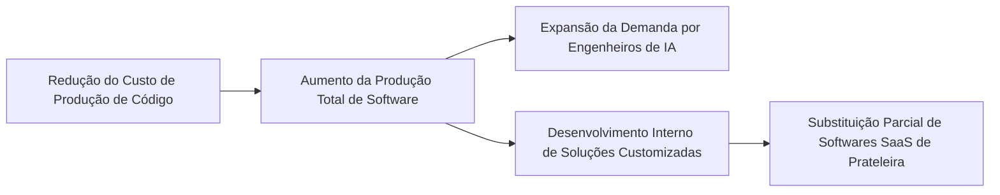
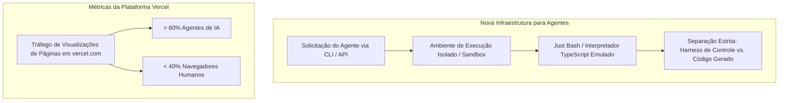

<config_file>
# A Nova Camada de Aplicação: Infraestrutura, Agentes e Comoditização de Modelos

- **Evento**: **AI Engineer Europe 2026** (**AIE Europe 2026**)
- **Data**: 20 de Abril de 2026
- **Palestrante**: **Malte Ubl** (Diretor de Tecnologia - **Vercel**)
- **Arquivo de Origem**: `2026-04-20-XKup1pj-34M.txt`
- **Título da Palestra**: _The New Application Layer_
- **Subdomínios Técnicos**: Engenharia de IA, Arquitetura de Aplicações Agênticas, Infraestrutura de Execução Isolada (_Sandboxing_), Elasticidade da Economia de Software, Comoditização de Modelos de Linguagem.

---

## 1. Visão Geral Executiva

A palestra de abertura da conferência **AI Engineer Europe 2026**, proferida por **Malte Ubl**, **CTO** da **Vercel**, estabeleceu a **engenharia de IA** como a sucessora legítima do desenvolvimento web tradicional para a próxima década. O avanço acelerado dos **agentes de inteligência artificial** impõe uma dupla transformação estrutural: altera-se a forma como o software é construído (ferramentas e agentes autônomos de codificação) e redefine-se a própria natureza do produto final (sistemas onde os agentes atuam simultaneamente como construtores e usuários de infraestrutura).

Diante da comoditização progressiva dos grandes laboratórios de modelos de linguagem (_frontier model labs_), Ubl argumenta que o valor econômico estratégico migrou decisivamente para a **camada de aplicação** (_application layer_). A drástica redução nos custos de produção de código não extingue a demanda por engenheiros de software, mas expande exponencialmente a quantidade de sistemas viáveis, redefinindo as arquiteturas de nuvem, interfaces de linha de comando (_CLIs_) e contêineres de execução isolada (_sandboxes_).

---

## 2. A Engenharia de IA como Sucessora do Desenvolvimento Web

A transição histórica do ecossistema de desenvolvimento web — simbolizada pelo encerramento da **JSConfEU** em 2019 e pelo surgimento da **AIE Europe 2026** em Berlim — marca a consolidação da engenharia de IA como a disciplina técnica central da tecnologia moderna.

### Mudança Generacional e Formação Profissional
- **Adaptação Nativa**: A nova geração de engenheiros juniores é formada nativamente em um ambiente dominado por assistentes e agentes autônomos, desenvolvendo intuição operacional direta com modelos de raciocínio.
- **Automação Viável**: O software tradicional exigia codificação determinística de todas as regras de negócios (`if/else`), tornando inviável a automação de processos secundários devido ao alto custo de engenharia. Os agentes tornam economicamente viável a criação de softwares que anteriormente jamais seriam desenvolvidos.

---

## 3. A Economia da Elasticidade do Software e o "Apocalipse do SaaS"

O impacto econômico dos agentes na indústria de tecnologia reflete a lei da elasticidade da demanda no mercado de desenvolvimento.

### Dinâmica de Mercado
- **Desenvolvimento Próprio vs. Compra**: Empresas estão substituindo a aquisição de produtos **SaaS** (_Software as a Service_) genéricos por soluções proprietárias construídas e mantidas internamente por agentes agilizados.
- **Crescimento da Demanda**: A queda no custo unitário de geração de código não resulta em desemprego estrutural na engenharia, mas em uma curva de expansão na qual o volume de software necessário supera a velocidade de entrega atual.

---

## 4. Arquétipos Eficientes de Agentes na Empresa

Em vez de focar exclusivamente em agentes de codificação complexos e arriscados, as organizações obtêm retornos expressivos ao aplicar arquétipos de agentes focados em otimização de processos existentes.

| Arquétipo | Descrição da Operação | Impacto Prático no Negócio |
| :--- | :--- | :--- |
| **Agente como Serviço** (_Agent-as-a-Service_) | Operação ininterrupta (24 horas por dia, 7 dias por semana) em funções de atendimento e triagem inicial. | Disponibilidade contínua sem interrupções operacionais humanas. |
| **Pesquisa Condensada** | Execução automática da etapa de coleta de dados e contextualização prévia a um evento de negócios. | Redução do tempo de análise de 30 minutos para 5 minutos por caso, mantendo a tomada de decisão sob supervisão humana. |
| **Recuperação de Informações Legadas** | Extração e sincronização automática de dados dispersos (transcrições de reuniões, _logs_ e relatórios) para atualização de sistemas de rastreamento (_issue trackers_). | Eliminação do trabalho braçal de inserção manual de dados e aumento da fidelidade das métricas do projeto. |
| **Eliminação de Tarefas Entediantes** | Automação de solicitações repetitivas de suporte (como erros de cartão de crédito e solicitações de senha). | Elevação da satisfação da equipe de suporte e resolução direta de até 90% dos casos simples. |

---

## 5. Inversão do Paradigma: Agentes como Usuários e Construtores de Infraestrutura

A mudança mais radical nas plataformas de nuvem é a transição dos agentes de meros geradores de código para consumidores primários de tráfego de rede e APIs.

### Redesenho das Interfaces e da Segurança
- **Soberania das CLIs e APIs**: Na plataforma **Vercel**, mais de 60% do tráfego recente de visualização de páginas e consumo de infraestrutura é originado diretamente por agentes de IA. As interfaces gráficas de usuário (_UIs_) tornam-se artefatos secundários em relação às interfaces de linha de comando (_CLIs_).
- **Execução Isolada (_Sandboxing_)**: A concessão de capacidades de terminal aos agentes exige a adoção de máquinas virtuais de inicialização instantânea e interpretadores emulados, como o **Just Bash** (ambiente isolado em **TypeScript** com tempo de inicialização nulo).
- **Isolamento entre Chicote e Execução**: Ubl adverte para a falha arquitetural comum em plataformas de agentes que mesclam o ambiente do chicote de controle (_harness_) com o ambiente de execução do código gerado, recomendando a separação estrita para conter vetores de ataque.

---

## 6. A Comoditização dos Modelos de Linguagem e o Ecossistema Europeu

O mercado de IA caminha para um cenário onde os modelos de linguagem de fronteira tornam-se utilidades básicas altamente comoditizadas, transferindo o poder e a captura de valor para os engenheiros que constroem na camada de aplicação.

### O Papel Central da Camada de Aplicação
- **Competição entre Provedores**: A disputa de preços e a infraestrutura massiva de laboratórios como **Google**, **OpenAI** e **Anthropic** garante inferência cada vez mais acessível.
- **Protagonismo da Europa**: A inovação de ponta em engenharia de aplicação e agentes autônomos tem forte liderança europeia, exemplificada pelo **SDK de IA da Vercel** (liderado a partir de Berlim, processando mais de US$ 10 milhões semanais), pelo agente de codificação **Pi** (desenvolvido na Áustria por Mario Zechner) e pelo projeto **OpenClaw** (criado por Peter Steinberger).

---

## 7. Notas Informativas e Glossário Técnico

- **Just Bash**: Interpretador de comandos _bash_ construído em **TypeScript**, projetado pela Vercel para fornecer um ambiente de execução leve, determinístico e isolado para agentes de IA sem o _overhead_ de inicialização de sistemas operacionais completos.
- **SDK de IA da Vercel**: Biblioteca de código aberto padronizada para integração de modelos de linguagem de múltiplos provedores em aplicações web e ambientes agênticos.
- **Harness (Chicote de Controle)**: Estrutura de software que envolve, monitora e restringe o agente de IA, gerenciando o ciclo de _prompts_, chamadas de ferramentas e tratamento de erros.
- **Apocalipse do SaaS**: Hipótese de mercado que prevê a redução no crescimento de empresas tradicionais de software por assinatura devido à capacidade das organizações de criar soluções internas sob medida com agentes.
- **OpenClaw**: Projeto de agente de automação e orquestração de código aberto que ganhou destaque no ecossistema de desenvolvedores europeus.

---

## 8. Lacunas e Expansão do Conhecimento

### Desafios Críticos de Engenharia e Segurança
1. **Superfície de Ataque e Injeção de Prompt**: A exposição de agentes de IA a dados públicos não confiáveis (como formulários de denúncia de abuso ou mensagens de suporte) introduz o risco severo de **injeção de prompt indireta** (_indirect prompt injection_), em que instruções maliciosas ocultas no texto manipulam as decisões do agente.
2. **Isolamento e Governança de Credenciais**: Agentes que executam chamadas de terminal remotas precisam de mecanismos de autorização granulares e descartáveis (_ephemeral tokens_), impedindo que o agente acesse segredos de produção durante a execução de tarefas secundárias.
3. **Padronização de Interfaces de Agentes**: A ausência de um protocolo universal único para comunicação entre diferentes plataformas de agentes dificulta a interoperabilidade fluida entre sistemas heterogêneos.

</config_file>
