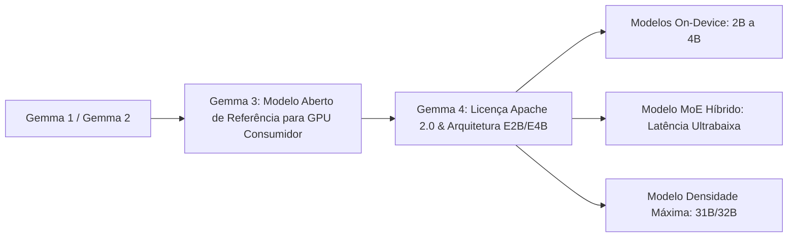
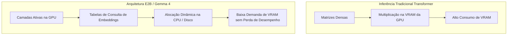
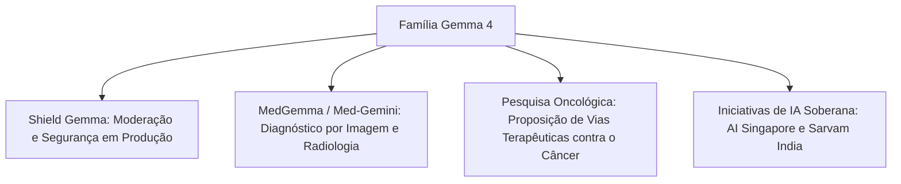

<config_file>
# Gemma: A Família de Modelos Abertos da Google DeepMind

- **Evento**: **AI Engineer Conference 2026** (**AIE 2026**)
- **Data**: 20 de Abril de 2026
- **Palestrante**: **Omar Sanseviero** (**Google DeepMind**)
- **Arquivo de Origem**: `2026-04-20-_gVFUEdhCyI.txt`
- **Título da Palestra**: _Gemma, DeepMind's Family of Open Models_
- **Subdomínios Técnicos**: Modelos de Linguagem Abertos (_Open Models_), Inferência em Dispositivos Móveis (_On-Device AI_), Arquitetura de Incorporação por Camada (_Per-Layer Embeddings_), Processamento Multimodal e Multilíngue, IA Soberana.

---

## 1. Visão Geral Executiva

A apresentação de **Omar Sanseviero**, pesquisador da **Google DeepMind**, marcou a estreia oficial do **Gemma 4**, a nova geração da família de modelos abertos de inteligência artificial da Google. Disponibilizado sob a licença de código aberto **Apache 2.0**, o ecossistema abrange modelos que variam de **2 bilhões a 32 bilhões de parâmetros**, projetados para execução local e privada diretamente em dispositivos finais — como celulares Android, iPhones, laptops, Raspberry Pi e consoles de videogame.

O destaque arquitetural da nova família é a introdução da arquitetura **E2B** (_Embedded 2-Billion_), baseada no conceito de **incorporações por camada** (_per-layer embeddings_). Essa abordagem permite deslocar a maior parte dos parâmetros de memória para a CPU ou disco rígido sem comprometer a latência ou exigir GPUs dedicadas. Além disso, o Gemma 4 avança na capacidade multimodal nativa (visão, áudio e vídeo) e na compreensão de mais de 140 idiomas, ostentando marcas superiores a 500 milhões de downloads agregados e viabilizando iniciativas globais de **IA soberana** e pesquisas de alto impacto na medicina.

---

## 2. A Evolução da Família Gemma: Do Gemma 1 ao Gemma 4

Desde o lançamento do Gemma 1 até a maturidade do Gemma 4, a Google DeepMind concentrou esforços em elevar a inteligência dos modelos sem expandir excessivamente o seu consumo de recursos computacionais.

### Transição de Licenciamento e Tamanhos de Parâmetros
- **Adoção da Licença Apache 2.0**: Respondendo às demandas da comunidade de código aberto, o Gemma 4 abandonou as licenças restritivas anteriores e adotou a licença Apache 2.0, concedendo total flexibilidade comercial, modificação e distribuição de derivados.
- **Gradação de Capacidade**:
  - **Gemma E2B / E4B (2B a 4B)**: Otimizados para smartphones e dispositivos compactos sem conexão com a internet (_offline_).
  - **Gemma MoE (Mixture of Experts)**: Arquitetura esparsa de alta velocidade e latência reduzida para tarefas que exigem respostas instantâneas.
  - **Gemma 31B / 32B**: O modelo de maior capacidade da família, capaz de funcionar em uma única GPU de nível consumidor mantendo o topo da tabela do **LM Arena**.

---

## 3. Inovação Arquitetural: O Sistema E2B e Incorporações por Camada

A principal contribuição técnica do Gemma 4 para a execução em dispositivos móveis reside na reestruturação da inferência por meio de **incorporações por camada** (_per-layer embeddings_).

### Funcionamento Técnico do E2B
- **Tabelas de Consulta vs. Operações de Matriz**: Em vez de submeter todos os 4 ou 5 bilhões de parâmetros a operações matriciais intensivas na VRAM da GPU, a arquitetura E2B transfere os vetores de incorporação para tabelas de consulta rápidas armazenadas na CPU ou no disco.
- **Redução do Consumo de Memória**: O motor de execução aloca apenas cerca de 2 bilhões de parâmetros ativos na memória de vídeo, enquanto a CPU processa a camada de dados auxiliares. Essa técnica pode ser ativada na ferramenta **llama.cpp** por meio de sinalizadores de alocação de tensores.

---

## 4. Capacidades Multimodais, Multilíngues e Execução Local

O Gemma 4 integra suporte a visão computacional, processamento de áudio e compreensão multilíngue aprofundada.

### Recursos Técnicos Principais
- **Processamento de Áudio e Tradução**: Reconhecimento direto de fala e transcrição com tradução simultânea entre múltiplos idiomas (ex.: entrada de voz em espanhol com saída direta em texto em francês).
- **Detecção Visual de Objetos**: Capacidade de apontar coordenadas e delimitar objetos em imagens e quadros de vídeo, identificando detalhes minuciosos e analisando textos em scripts não latinos (como o japonês).
- **Tokenizador Compartilhado com Gemini**: Treinado em mais de 140 idiomas, o tokenizador do Gemma 4 preserva a eficiência em idiomas com baixos recursos digitais (como o quéchua ou variantes linguísticas da Índia).
- **Ambientes Isolados e Paralelismo**: Demonstrações ao vivo comprovaram a execução de 10 instâncias simultâneas do Gemma 4 em um computador portátil rodando llama.cpp, gerando gráficos vetoriais SVG a velocidades superiores a 100 _tokens_ por segundo em modo offline.

---

## 5. Integrações de Produto e Ecossistema de Código Aberto

A estratégia da Google DeepMind visa manter os modelos Gemma compatíveis com os principais ecossistemas de desenvolvimento da comunidade.

| Ferramenta / Plataforma | Tipo de Integração | Aplicação Prática |
| :--- | :--- | :--- |
| **Android Studio** | Modo Agente Offline | Assistente autônomo de codificação integrado à IDE rodando localmente via llama.cpp. |
| **Hugging Face / vLLM** | Suporte Nativo a _Fine-Tuning_ | Ajuste fino e quantização imediata usando pacotes padrão da comunidade. |
| **Unsloth / MLX / C Lang** | Otimização de Inferência | Ambientes acelerados para GPUs da Apple (MLX) e arquiteturas heterogêneas. |

---

## 6. Variantes Oficiais, Pesquisa Médica e IA Soberana

O ecossistema Gemma expandiu-se para além do modelo genérico de linguagem, englobando variantes especializadas para segurança, medicina e soberania nacional.

### Aplicações de Alto Impacto
- **Shield Gemma**: Modelos especializados em avaliar a segurança de _prompts_ e respostas em ambientes de produção, barrando conteúdos tóxicos conforme diretrizes organizacionais.
- **MedGemma**: Modelos orientados a diagnósticos médicos, pré-treinados para interpretar radiografias de tórax e exames de imagem.
- **Pesquisa em Oncologia**: Aplicação do Gemma para propor novas vias de tratamento de combate ao câncer, com hipóteses validadas em testes de laboratório por pesquisadores da DeepMind.
- **Projetos Nacionais de IA Soberana**: Organizações governamentais e startups (como a **AI Singapore** e a **Sarvam** na Índia) utilizam o Gemma 4 como base para treinar modelos nacionais dedicados aos idiomas e culturas locais.

---

## 7. Notas Informativas e Glossário Técnico

- **LM Arena (LMSYS Chatbot Arena)**: Plataforma global de avaliação de modelos de linguagem baseada no sistema de pontuação Elo, onde usuários comparam cega e anonimamente as respostas geradas por diferentes LLMs.
- **On-Device AI**: Paradigma de inteligência artificial em que o modelo é executado inteiramente no processador local da máquina do usuário (NPU, GPU ou CPU), sem envio de dados para servidores na nuvem.
- **Per-Layer Embeddings (Incorporações por Camada)**: Técnica de arquitetura que aloca vetores de representação de cada camada em tabelas de consulta na memória RAM ou disco, liberando a VRAM da GPU para o cálculo das atenções.
- **Shield Gemma**: Variante oficial do Gemma treinada para atuar como filtro de segurança e alinhamento ético em pipelines de IA em produção.
- **IA Soberana (Sovereign AI)**: Iniciativa de nações ou regiões para desenvolver e manter infraestrutura de inteligência artificial proprietária, garantindo a preservação cultural, autonomia linguística e segurança de dados.

---

## 8. Lacunas e Expansão do Conhecimento

### Desafios de Engenharia e Pesquisa
1. **Eficiência Energética em Dispositivos Móveis**: Embora o Gemma 4 funcione em smartphones, a inferência continuada em tarefas de longa duração gera aquecimento térmico e drenagem rápida da bateria, exigindo a evolução de coprocessadores neurais (_NPUs_) dedicados.
2. **Qualidade do Ajuste Fino em Idiomas Minoritários**: Apesar de o tokenizador dar suporte a 140 idiomas, a escassez de dados de alta qualidade para línguas indígenas ou locais exige o desenvolvimento de novas técnicas de alinhamento e dados sintéticos multilíngues.
3. **Sincronização entre Agentes Locais e Nuvem**: A transição entre o processamento offline no dispositivo e o transbordo (_failover_) para modelos em nuvem (como o Gemini) exige protocolos seguros de preservação de estado e privacidade.

</config_file>
