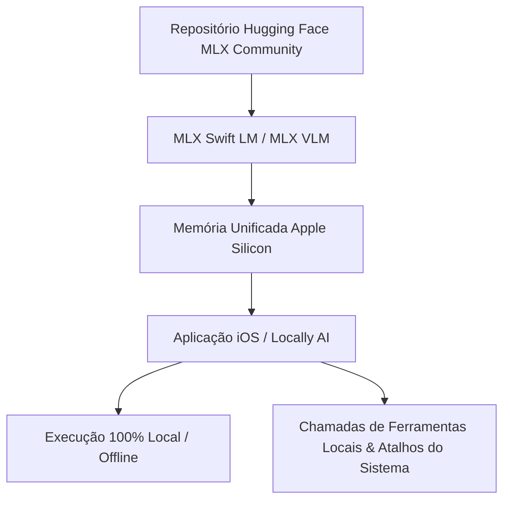
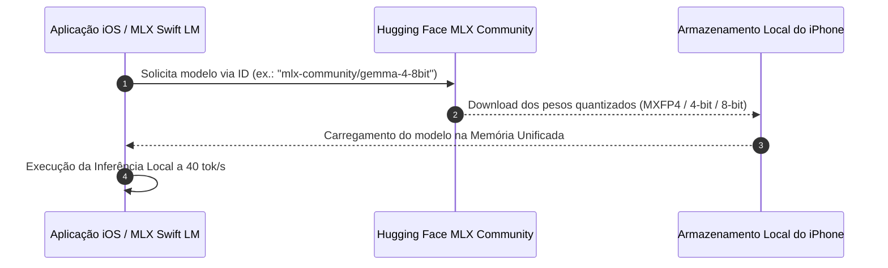

<config_file>
# Execução Local de LLMs no iPhone: Gemma 4 a 40 Tokens por Segundo com MLX

- **Evento**: **AI Engineer Conference 2026** (**AIE 2026**)
- **Data**: 20 de Abril de 2026
- **Palestrante**: **Adrien Grondin** (**Locally AI** / **LM Studio**)
- **Arquivo de Origem**: `2026-04-20-a2muGkT4WD4.txt`
- **Título da Palestra**: _Running LLMs on your iPhone: 40 tok/s Gemma 4 with MLX_
- **Subdomínios Técnicos**: Inteligência Artificial em Dispositivos Móveis (_On-Device AI_), Estrutura MLX Swift LM da Apple, Otimização de Inferência no Apple Silicon, Quantização de Modelos (4 a 8 bits), Execução de Modelos Abertos sem Internet.

---

## 1. Visão Geral Executiva

A apresentação de **Adrien Grondin**, desenvolvedor e criador do aplicativo **Locally AI**, demonstrou como alcançar taxas de inferência de **40 tokens por segundo** executando o modelo aberto **Gemma 4** (da Google DeepMind) de forma totalmente privada e offline diretamente em um **iPhone**. Utilizando o ecossistema **MLX** — a estrutura de código aberto desenvolvida pela **Apple** e otimizada para o ecossistema **Apple Silicon** —, a palestra explicou os métodos práticos para integrar modelos de linguagem em aplicativos **iOS**, **iPadOS** e **macOS**.

O estudo destacou o equilíbrio ideal entre tamanho de arquivo e preservação da inteligência através de estratégias de **quantização em 4 e 8 bits**, eliminando a dependência de servidores na nuvem e reduzindo a latência de resposta. Além disso, Grondin detalhou o suporte nativo a **chamadas de ferramentas** (_tool calling_) no ambiente local, a integração com o repositório **MLX Swift LM** e o recente anúncio de integração da startup Locally AI ao **LM Studio**.

---

## 2. A Arquitetura MLX e o Ecossistema Apple Silicon

O arcabouço **MLX** foi projetado pela **Apple** para maximizar o aproveitamento da arquitetura de memória unificada dos processadores da série A (iPhones) e série M (Macs e iPads).

### Principais Vantagens do MLX
- **Integração Nativa com Swift**: A biblioteca **MLX Swift LM** permite que desenvolvedores instalem o pacote via gerenciador de dependências e inicializem modelos abertos em menos de 10 minutos de desenvolvimento.
- **Multimodalidade Extensível**: O ecossistema abrange suporte a texto (_MLX Swift LM_), visão computacional e processamento de imagem/vídeo (_MLX VLM_ e _MLX Video_) e modelos de processamento de áudio (_MLX Audio_).
- **Compatibilidade com Apple Foundation**: Permite intercalar chamadas de modelos abertos com as estruturas nativas do ecossistema Apple.

---

## 3. Estratégias de Quantização e Desempenho no iPhone

A execução eficiente de LLMs em dispositivos móveis exige a conversão dos pesos originais dos modelos (em 16 bits / BF16) para formatos comprimidos de menor precisão.

| Nível de Quantização | Tamanho Relativo do Arquivo | Velocidade de Inferência | Preservação de Qualidade e Raciocínio |
| :--- | :--- | :--- | :--- |
| **BF16 / 16-bit** | Invável para iPhone (> 6 GB) | Extremamente Lenta | Qualidade Original Sem Perdas |
| **8-bit** | Moderado (~ 2 a 3 GB) | Alta (~ 20 a 30 tok/s) | Excelente Retenção de Precisão |
| **4-bit (Recomendado)** | Compacto (~ 1 a 1,5 GB) | Máxima (**~ 40 tok/s**) | Equilíbrio Ideal para Usabilidade |
| **Abaixo de 4-bit (3-bit)** | Mínimo (< 1 GB) | Ultra-rápida | Degradação Severa na Resposta |

### Recomendações de Engenharia
- **Limite Mínimo de 4 Bits**: A quantização em 4 bits representa o limite de compressão seguro; resoluções inferiores a 3 bits causam perda significativa de coerência sintática e capacidade de raciocínio.
- **Taxa de Transferência**: iPhones de gerações recentes alcançam confortavelmente a marca de 40 _tokens_ por segundo em modo de transmissão contínua (_streaming_), enquanto modelos mais antigos mantêm taxas funcionais entre 15 e 20 _tokens_ por segundo.

---

## 4. Integração Prática via Hugging Face e MLX Community

O repositório comunitário **MLX Community** na plataforma **Hugging Face** disponibiliza milhares de modelos pré-quantizados e prontos para implantação imediata em dispositivos Apple.

### Processo de Carregamento
1. **Identificação do Modelo**: O desenvolvedor seleciona o identificador do modelo quantizado no repositório da comunidade MLX.
2. **Carregamento Automático**: A biblioteca `MLX Swift LM` faz o _download_ e o cache dos arquivos de pesos diretamente na memória do dispositivo.
3. **Execução sem Servidor**: O modelo atua offline em tempo real, sem necessidade de chaves de API ou conexões de rede externas.

---

## 5. Chamadas de Ferramentas Locais e Unificação com LM Studio

Um dos avanços destacados por Grondin é a transição dos modelos locais de meros geradores de texto para agentes funcionais capazes de executar ações no dispositivo.

- **Chamadas de Ferramentas (_Tool Calls_)**: Modelos como o **Gemma 4** evoluíram para interpretar esquemas de funções e invocar rotinas do sistema operacional offline.
- **Automação via Atalhos**: Modelos ultra-compactos (300 a 350 milhões de parâmetros) podem ser integrados aos atalhos do iOS para processamento e filtragem imediata de texto.
- **Aquisição pelo LM Studio**: A integração da equipe da Locally AI ao ecossistema **LM Studio** permite que desenvolvedores comparem diretamente os motores de inferência **llama.cpp** e **MLX**, além de expor servidores locais de API compatíveis com as especificações da **OpenAI** e **Anthropic**.

---

## 6. Notas Informativas e Glossário Técnico

- **MLX**: Estrutura de código aberto desenvolvida pela Apple para pesquisa e implantação de aprendizado de máquina otimizada para os processadores Apple Silicon.
- **MLX Swift LM**: Pacote em linguagem Swift que simplifica o carregamento e a inferência de modelos de linguagem de grande porte em aplicativos para iOS, iPadOS e macOS.
- **Locally AI**: Aplicativo nativo para dispositivos Apple que atua como interface de conversa privada e offline para modelos de linguagem locais.
- **LM Studio**: Plataforma de ambiente de desenvolvimento que permite baixar, gerenciar e executar LLMs locais em sistemas operacionais desktop, disponibilizando um servidor de API local.
- **MXFP4**: Formato de quantização de ponto flutuante em 4 bits com escala em micro-blocos, desenvolvido para otimizar o consumo de memória sem comprometer a estabilidade numérica da rede.

---

## 7. Lacunas e Expansão do Conhecimento

### Desafios de Implantação Móvel
1. **Barreira do Tamanho de Download**: O maior obstáculo para a adoção em massa de LLMs em dispositivos móveis é o tamanho inicial de _download_ dos modelos (entre 1 GB e 3 GB), o que desencoraja usuários sob conexões móveis limitadas.
2. **Gestão de Temperatura e Bateria**: Executar inferências contínuas a 40 _tokens_ por segundo provoca dissipação térmica considerável em dispositivos sem ventilação ativa, o que pode levar ao estrangulamento térmico (_thermal throttling_).
3. **Padronização de Chamadas de Ferramentas Estruturadas**: Embora o MLX Swift LM suporte chamadas de ferramentas básicas, a validação rigorosa de saídas em formato JSON estruturado ainda exige bibliotecas de terceiros para garantir a ausência de falhas sintáticas.

</config_file>
