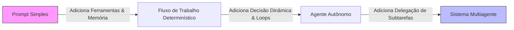
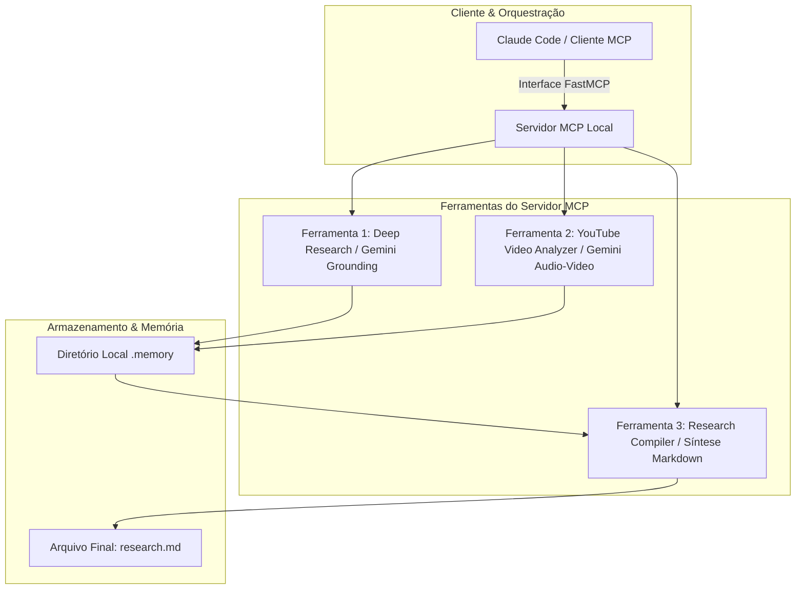
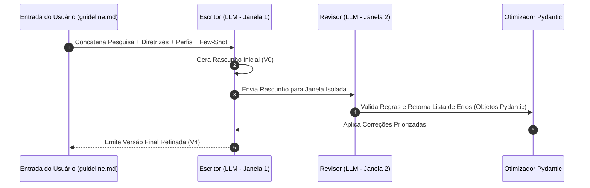

<config_file>
# Workshop Completo: Construção de Agentes de Pesquisa Aprofundada e Fluxos de Redação Técnica

- **Evento**: **AI Engineer Conference 2026** (**AIE 2026**)
- **Data**: 20 de Abril de 2026
- **Palestrantes**: **Louis-François Bouchard** (CTO - **Towards AI**), **Paul Iusztin** (Autor e Engenheiro de Software), **Samridhi** (Engenheira de ML e Consultora).
- **Arquivo de Origem**: `2026-04-20-mYSRn6PC1mc.txt`
- **Título do Workshop**: _Build Your Own Deep Research Agents_
- **Subdomínios Técnicos**: Engenharia de Agentes, Model Context Protocol (**MCP**), Arquitetura de Pesquisa Fundamentada (_Grounded Research_), Padrão Avaliador-Otimizador (_Evaluator-Optimizer_), Observabilidade com **Opik**, Avaliação de LLMs via **F1-Score**.

---

## 1. Visão Geral Executiva

O workshop prático ministrado pela equipe da **Towards AI** abordou a arquitetura e a implementação de ponta a ponta de um **sistema de pesquisa aprofundada** (_deep research agent_) integrado a um **fluxo de trabalho de redação técnica**. O objetivo principal do projeto é erradicar o conteúdo genérico e superficial gerado por IA — frequentemente categorizado como "desleixo de IA" (_AI slop_) — na criação de artigos técnicos e postagens corporativas.

A solução desenvolvida divide o problema em dois subsistemas com filosofias opostas: um **agente de pesquisa dinâmico e exploratório**, orientado por objetivos e baseado no **Model Context Protocol** (**MCP**), e um **fluxo de trabalho de redação determinístico e altamente restringido**, auxiliado pelo padrão **avaliador-otimizador** com validação via objetos **Pydantic**. O pipeline é monitorado por ferramentas de rastreamento (_tracing_) e calibrado por um juiz de IA (_LLM Judge_) avaliado quantitativamente por **F1-Score**.

---

## 2. O Espaço de Problemas: Do "Desleixo de IA" às Restrições de Engenharia

O uso ingênuo de modelos de linguagem para geração de conteúdo no **LinkedIn** ou em blogs técnicos costuma produzir padrões sintáticos repetitivos, alucinações factuais e ausência de embasamento.

### Restrições da Engenharia de IA
- **Controle vs. Autonomia**: O aumento da autonomia agêntica reduz o controle determinístico do engenheiro sobre o sistema e eleva os custos e a latência de execução.
- **Escolha da Arquitetura Adequada**: Tarefas cujas etapas são fixas e sequenciais (como a classificação e encaminhamento de chamados) devem ser implementadas como **fluxos de trabalho** (_workflows_), reservando o uso de **agentes autônomos** apenas para tarefas que exigem tomadas de decisão dinâmicas e exploração de ambiente.

---

## 3. Arquitetura do Agente de Pesquisa Aprofundada com MCP

O agente de pesquisa atua como o componente exploratório do sistema, encarregado de navegar na web, analisar mídias densas e sintetizar evidências citadas.

### Ferramentas e Implementação Técnica
1. **Servidor FastMCP**: Utilização da biblioteca **FastMCP** em Python para expor ferramentas, recursos e _prompts_ sem a necessidade de implementar manualmente protocolos de baixo nível.
2. **Pesquisa Fundamentada (_Grounded Search_)**: Integração com a API do **Gemini 3** via mecanismo de _grounding_ para realizar buscas na web, extraindo respostas com citações explícitas de fontes oficiais.
3. **Análise Multimodal de Vídeos do YouTube**: Envio direto da URL do YouTube como um URI de arquivo para a API do Gemini, permitindo a extração automatizada da transcrição e a geração de resumos temáticos sem a necessidade de _download_ prévio do áudio.
4. **Armazenamento em Pasta de Memória**: Salva os resultados intermediários no diretório `.memory`, permitindo a auditoria isolada das saídas antes da compilação final no arquivo `research.md`.

---

## 4. Agente de Habilidades (_Skills_) vs. Prompts de Servidor

Para otimizar o consumo da janela de contexto (_context budget_) e evitar a degradação de desempenho (_lost in the middle_), o projeto adotou a técnica de **divulgação progressiva** (_progressive disclosure_).

- **Limitação dos Prompts Estáticos**: Incluir longas instruções de fluxo diretamente no _prompt_ do sistema consome o orçamento de _tokens_ continuamente em todas as chamadas.
- **Vantagem das Skills**: As **skills** carregam apenas o seu cabeçalho (_front matter_) e descrição no contexto inicial. O corpo completo das instruções só é injetado dinamicamente quando a consulta do usuário corresponde à descrição da habilidade, sendo limpo da memória assim que a tarefa é concluída.

---

## 5. O Fluxo de Trabalho de Redação Técnica Determinística

Diferente da etapa de pesquisa, a redação de artigos e postagens exige alto nível de restrição estilística e estrutural para evitar vícios de linguagem.

### Estrutura de Controle de Geração
- **Diretriz do Usuário (`guideline.md`)**: Define o tema específico, o ângulo narrativo, o público-alvo e os pontos essenciais a abordar em cada publicação.
- **Perfis Estáticos de Estilo**: Conjunto de arquivos Markdown que estipulam regras ríquidas de estrutura (_structure_), terminologia proibida (_terminology_ - banindo termos como "delve" ou "vibrant") e personalidade do autor (_character_).
- **Exemplos Few-Shot seletivos**: Inclusão de exatamente três exemplos de postagens reais de alto desempenho no _prompt_ para calibrar o tom sem inflar desnecessariamente o contexto.
- **Padrão Avaliador-Otimizador (_Evaluator-Optimizer_)**: Separação estrita entre a janela de contexto do **Escritor** e do **Revisor**. O revisor gera saídas estruturadas em esquemas **Pydantic** detalhando o local, o perfil violado e a crítica específica, permitindo que o escritor aplique iterações fixas de refatoração.

---

## 6. Observabilidade e Avaliação Automatizada via F1-Score

Para garantir a confiabilidade do sistema além da intuição visual (_vibes_), o pipeline utiliza a plataforma **Opik** para monitoramento de chamadas e calibração de juízes de IA.

| Componente de Avaliação | Função no Pipeline | Métrica / Ferramenta Utilizada |
| :--- | :--- | :--- |
| **Monitoramento de Traces** | Rastreamento de latência, custo em _tokens_ e chamadas de ferramentas. | **Opik Threads & Traces** |
| **Conjunto de Dados de Teste** | 20 postagens reais rotuladas com pareceres binários (Aprovado/Reprovado) e críticas. | Repositório YAML de Avaliação |
| **Juiz de IA (_LLM Judge_)** | Classificador binário treinado com exemplos _few-shot_ de validação. | Modelo Gemini / GPT com Esquema Binário |
| **Métrica de Calibração** | Medição de alinhamento entre o juiz de IA e o especialista humano. | **F1-Score** (Média Harmônica entre Precisão e Recall) |

### Processo de Calibração do Juiz de IA
1. **Execução no Conjunto de Desenvolvimento**: O juiz de IA avalia as postagens da amostra de desenvolvimento e calcula o F1-Score inicial.
2. **Refinamento dos Prompts do Juiz**: O _prompt_ do juiz é ajustado até que o F1-Score convirja para o valor máximo na amostra de desenvolvimento.
3. **Validação no Conjunto de Teste**: O juiz é executado na amostra de teste isolada para verificar a ausência de sobreajuste (_overfitting_).

---

## 7. Notas Informativas e Glossário Técnico

- **Model Context Protocol (MCP)**: Padrão aberto criado para permitir que agentes de IA se conectem de forma padronizada a servidores locais e remotos de ferramentas e dados.
- **FastMCP**: Biblioteca em Python projetada para acelerar o desenvolvimento de servidores MCP, reduzindo a complexidade de gerenciamento de protocolos de transporte.
- **Evaluator-Optimizer Pattern**: Arquitetura de LLM em malha fechada onde um modelo gera um artefato e outro modelo (em contexto separado) avalia a saída em relação a um conjunto de regras, retornando críticas para correção iterativa.
- **Pydantic**: Biblioteca de validação de dados em Python que permite impor tipos estritos e esquemas JSON estruturados nas respostas dos modelos de linguagem.
- **Opik**: Plataforma de observabilidade para aplicações baseadas em LLMs, especializada em rastreamento de _prompts_, medição de latência e execução de experimentos de avaliação.
- **AI Slop**: Termo pejorativo utilizado para descrever conteúdos de baixa qualidade gerados por IA, caracterizados por termos repetitivos, falta de substância e ausência de originalidade.

---

## 8. Lacunas e Expansão do Conhecimento

### Considerações Críticas de Engenharia
1. **Custo de Chamadas Repetitivas em Loops de Otimização**: A execução do padrão avaliador-otimizador por 4 iterações consecutivas quadruplica o consumo de _tokens_ por publicação, exigindo uma análise rigorosa de custo-benefício em relação ao valor da postagem gerada.
2. **Manutenção da Lista de Termos Banidos**: A estratégia de banir palavras específicas via _prompting_ exige constante atualização à medida que novos modelos de linguagem adotam novos cacoetes de linguagem.
3. **Escalabilidade do Conjunto de Dados de Avaliação**: O uso de apenas 5 amostras por divisão no workshop serve como demonstração didática; sistemas comerciais em produção exigem conjuntos de validação compostos por centenas de amostras rotuladas para evitar falsos positivos na métrica F1-Score.

</config_file>
