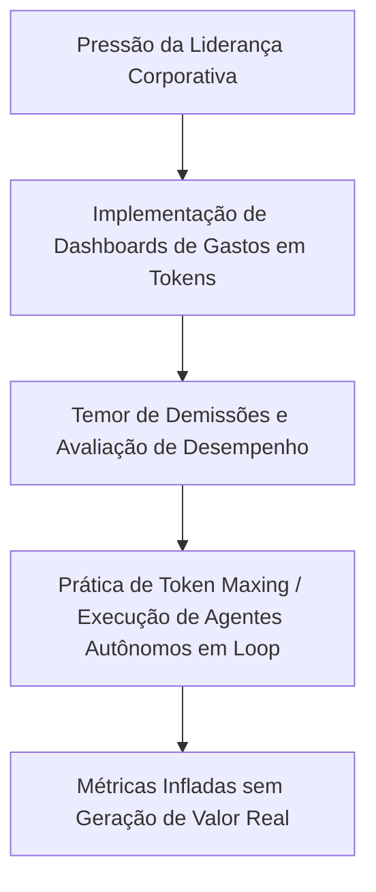
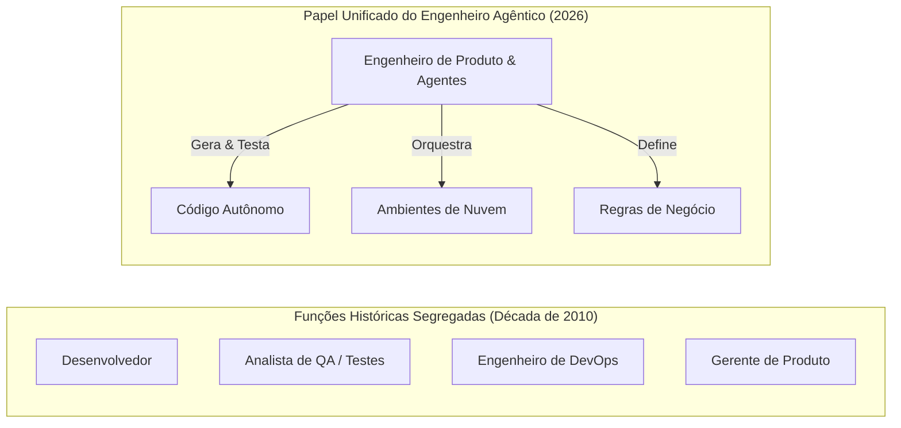

<config_file>
# Como a IA Está Transformando a Engenharia de Software: Uma Conversa com Gergely Orosz

- **Evento**: **AI Engineer Conference 2026** (**AIE 2026**)
- **Data**: 21 de Abril de 2026
- **Entrevistado**: **Gergely Orosz** (Ex-engenheiro do **Uber** e autor da newsletter **The Pragmatic Engineer**)
- **Arquivo de Origem**: `2026-04-21-CS5Cmz5FssI.txt`
- **Título do Painel**: _How AI is changing Software Engineering: A Conversation with Gergely Orosz_
- **Subdomínios Técnicos**: Cultura de Engenharia em Big Techs, Maximização de Tokens (_Token Maxing_), Infraestrutura de IA Interna e **Gateways MCP**, Evolução de Funções do SDLC, Estratégias de Adoção Tecnológica na **Shopify**.

---

## 1. Visão Geral Executiva

Em uma conversa exclusiva no evento **AI Engineer 2026**, **Gergely Orosz**, ex-engenheiro do **Uber** e criador da influente publicação **The Pragmatic Engineer**, analisou os impactos práticos da inteligência artificial na cultura, infraestrutura e papel profissional dos engenheiros de software nas grandes empresas de tecnologia (_Big Techs_) e no ecossistema de startups.

O debate investigou desde comportamentos culturais bizarros provocados pela medição excessiva de uso de LLMs — como a prática de **maximização de tokens** (_token maxing_) estimulada por tabelas de classificação corporativas em organizações como **Meta**, **Microsoft** e **Salesforce** — até a reestruturação silenciosa de infraestruturas internas de TI. Orosz destacou como a IA está acelerando o colapso de funções tradicionais (como DevOps e garantia de qualidade), transformando engenheiros em líderes técnicos capacitados por "armaduras mecânicas" digitais, enquanto empresas como a **Shopify** investem massivamente na absorção antecipada do _churn_ de ferramentas agênticas para garantir liderança de mercado.

---

## 2. O Fenômeno Cultural do "Token Maxing" nas Big Techs

Uma das dinâmicas mais peculiares observadas no setor de tecnologia é o surgimento da cultura de **maximização de tokens** (_token maxing_), na qual desenvolvedores inflam intencionalmente a quantidade de _tokens_ processados em ferramentas de IA.

### Origem e Distorção de Métricas (Lei de Goodhart)
- **Tabelas de Classificação Internas**: Em empresas como **Salesforce**, **Meta** e **Microsoft**, painéis internos de consulta expõem os gastos individuais em dólares ou volume de _tokens_ consumidos por mês.
- **Diferenciais em Avaliações de Desempenho**: Em momentos de reorganizações corporativas, a baixa contagem de _tokens_ passa a ser interpretada por gestores como falta de inovação ou resistência à tecnologia, enquanto altos consumos são premiados como engajamento.
- **Comportamentos Compensatórios**: Para evitar figurar no quartil inferior das métricas, engenheiros relatam pedir resumos repetitivos de documentações para agentes e manter tarefas agênticas em segundo plano com o objetivo exclusivo de atingir cotas mínimas obrigatórias de consumo (como a meta mensal de US$ 175 estipulada na Salesforce).
- **Repetição Histórica**: Orosz compara o _token maxing_ às antigas tentativas falhas de medir produtividade por linhas de código escritas ou número de _pull requests_ submetidos em plataformas como Velocity ou Pluralsight Flow.

---

## 3. Produtividade Real vs. Percepção e a Evolução das Equipes

A relação entre o investimento em ferramentas de IA e os ganhos efetivos de produtividade em nível individual e organizacional apresenta nuances complexas.

### Adoção de Ferramentas e Desbloqueio Organizacional
- **A Resistência dos Seniores**: Em bases de código legadas e de grande porte, as primeiras ferramentas agênticas eram apenas moderadamente úteis, gerando ceticismo entre engenheiros sêniores. A liderança corporativa respondeu impondo prazos rígidos para adoção sob pena de desligamento (como no caso célebre da **Coinbase** sob gestão de Brian Armstrong).
- **Engenheiros de IA vs. Desenvolvedores Não-Técnicos**: Embora testes cegos indiquem que a produtividade de um desenvolvedor individual experiente pode não crescer substancialmente no curto prazo devido ao tempo necessário para dominar a ferramenta, o verdadeiro ganho de escala ocorre ao capacitar colaboradores não técnicos para criarem seus próprios softwares (_desenvolvedores sem servidor_), eliminando gargalos de espera nas equipes de engenharia.

---

## 4. A Transformação do Papel do Engenheiro de Software

A evolução do ciclo de vida de desenvolvimento de software impulsionada por agentes redefiniu as atribuições dos profissionais de tecnologia.

### O Mito do "Gerente de Engenharia de Agentes"
- **Diferença Estrutural**: Orosz refuta a afirmação popular de que a IA transforma todo desenvolvedor em um "gerente de engenharia". O verdadeiro papel do gerente envolve dinâmicas interpessoais, gestão de carreiras e mediação de conflitos humanos.
- **Analogia da Armadura Mecânica**: O trabalho com agentes autônomos assemelha-se mais a vestir uma "armadura mecânica" de infraestrutura (termo cunhado por DHH) ou atuar como um líder técnico sênior, no qual o profissional supervisiona múltiplos agentes paralelos em ciclos de _feedback_ instantâneos, sem a lentidão operacional da gestão tradicional de pessoal.

---

## 5. Infraestrutura de IA em Grandes Empresas e o Caso Shopify

Diferente de pequenas startups que adotam ferramentas prontas imediatamente, grandes corporações estão reconstruindo silenciosamente suas arquiteturas internas para acomodar agentes autônomos em escala.

| Empresa / Caso | Estratégia de Infraestrutura de IA | Motivação Estratégica |
| :--- | :--- | :--- |
| **Uber / Airbnb / Intercom** | Implantação de **Gateways MCP** proprietários, monorepos adaptados e revisão de código automatizada por categorias de risco. | Conter bases de código massivas que excedem janelas de contexto convencionais e qualificar equipes internamente com baixo risco. |
| **Shopify** | Acesso pioneiro ao **GitHub Copilot** (em 2021) e concessão de orçamento ilimitado de ferramentas de IA para todos os engenheiros. | Absorver a rotatividade e falhas de ferramentas em troca de manter 6 meses de vantagem competitiva e atrair talentos de ponta. |

---

## 6. O Caso de Sucesso de The Pragmatic Engineer

Gergely Orosz compartilhou a trajetória de consolidação da **The Pragmatic Engineer**, a publicação de engenharia de software e IA número um na plataforma **Substack**.

- **Origem na Pandemia**: Fundada em 2021 após os desligamentos causados pela crise de locomoção no Uber, a newsletter nasceu com o propósito de explicar os bastidores técnicos de arquitetura de plataformas de grandes empresas em profundidade.
- **Validação Imediata de Mercado**: Em menos de seis semanas após o lançamento, a publicação obteve mil assinantes pagos, superando o salário base que Orosz recebia em Amsterdã e consolidando-se como uma das principais vozes independentes da engenharia europeia.

---

## 7. Notas Informativas e Glossário Técnico

- **Token Maxing**: Prática cultural corporativa na qual engenheiros executam intencionalmente rotinas e agentes de IA redundantes para inflar suas métricas individuais de consumo de _tokens_ em painéis de desempenho.
- **Gateway MCP**: Camada de roteamento e segurança de infraestrutura que gerencia a comunicação e o acesso a ferramentas entre agentes autônomos internos e os servidores de microserviços de uma empresa.
- **Pragmatic Engineer**: Newsletter técnica semanal criada por Gergely Orosz, focada em análise de mercado, arquitetura de sistemas, liderança em engenharia e tendências tecnológicas.
- **Shopify AI Churn**: Estratégia deliberada adotada pela gestão da Shopify para financiar e testar todas as ferramentas agênticas emergentes, aceitando a obsolescência rápida de softwares em troca de liderança operacional.
- **LeetCode**: Plataforma de desafios de programação e algoritmos amplamente utilizada por Big Techs em processos seletivos para filtrar candidatos pelo domínio de estruturas de dados básicas.

---

## 8. Lacunas e Expansão do Conhecimento

### Vulnerabilidades e Riscos Culturais
1. **Desalinhamento entre Métricas e Valor do Produto**: A exigência corporativa por metas cegas de consumo de IA estimula o acúmulo de débito técnico e a geração de código descartável em repositórios centrais.
2. **Dependência de Infraestruturas Proprietárias de IA**: Empresas que constroem gateways MCP altamente personalizados correm o risco de isolamento tecnológico em relação aos padrões abertos e SDKs mantidos pela comunidade internacional.
3. **Desafios na Formação de Engenheiros Juniores**: Com a expectativa de alta senioridade em funções de produto desde o início da carreira, a eliminação de tarefas de entrada reduz as oportunidades tradicionais de aprendizado por prática continuada.

</config_file>
