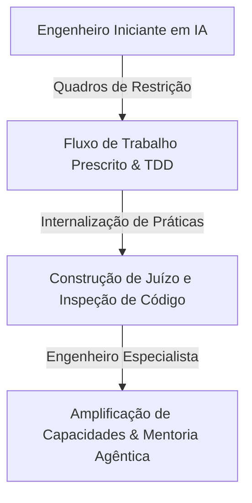
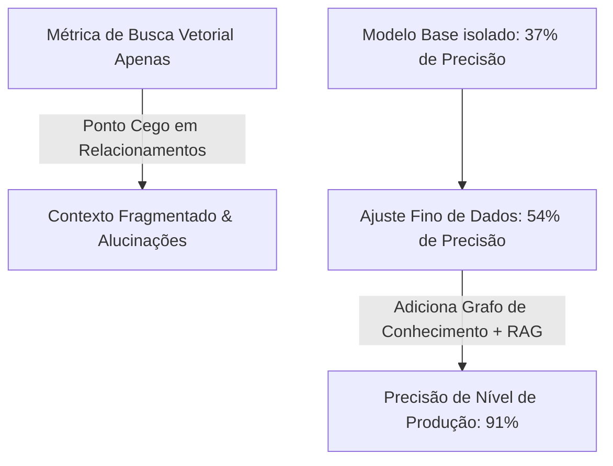
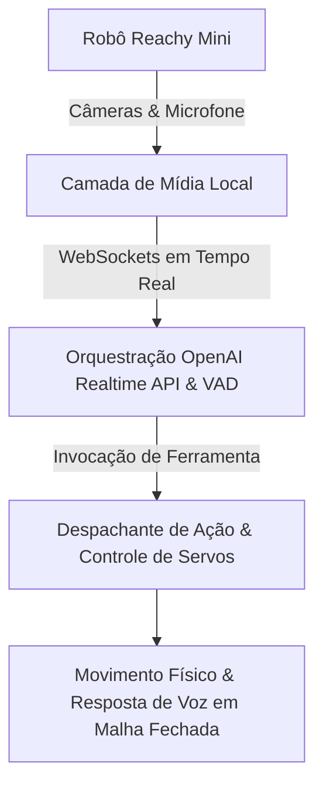

<config_file>
# AIE Miami Dia 2: Cerebras, OpenCode, Cursor, Arize AI, Neo4j, Akamai, CallStack e OutRival

- **Evento**: **AI Engineer Miami 2026** (**AIE Miami 2026 - Dia 2**)
- **Data**: 21 de Abril de 2026
- **Palestrantes**: **Ethel Zhang** (Google), **Iman Haji** (Google), **David House** (G2i), **Sarah Chieng** (Cerebras), **Lech Kalinowski** (CallStack), **Tejas Bhakta** (Morph LLM), **Rick Blalock** (Agentuity), **Nyah Macklin** (Neo4j), **Gabe Greenberg** (G2i), **Lena Hall** (Akamai), **Dave Kiss** (Mux), **Alvin Pane** (OutRival), **Erik Thorelli** (CodeRabbit), **Hassan El Mghari** (Together AI), **Stefan Avram** (OpenCode), **Laurie Voss** (Arize AI), **David Gomes** (Cursor).
- **Arquivo de Origem**: `2026-04-21-DeM_u2Ik0sk.txt`
- **Subdomínios Técnicos**: Inferência de Alta Velocidade (_Wafer-Scale Inference_), Débito de Latência, Grafos de Contexto e Conhecimento (_GraphRAG_), Memória Agêntica de Longo Prazo, Robótica Embodied em Tempo Real, Agentes como Usuários de Primeira Classe em APIs/SaaS, IDEs Orientadas por IA.

---

## 1. Visão Geral Executiva

O segundo dia do evento **AI Engineer Miami 2026** aprofundou as discussões sobre a infraestrutura de computação de nova geração, arquiteturas de memória agêntica e a transformação dos ambientes de desenvolvimento. O evento enfatizou a urgência de eliminar o **débito de latência** na geração de código — com a **Cerebras** apresentando inferências ultrarrápidas de até **1.200 tokens por segundo** em chips de escala de _wafer_ — e a superação dos pipelines ingênuos de **RAG** (_Retrieval-Augmented Generation_) por **memória agêntica viva** e **grafos de contexto** auditáveis (**Neo4j**).

Outros tópicos de alto impacto englobaram a emergência dos agentes de IA como **usuários de primeira classe** de sistemas de infraestrutura SaaS e APIs (**Mux**), exigindo novos modelos de autenticação e tarifação por resultados; a demonstração de robótica _embodied_ com processamento multimodal em tempo real (**Akamai** com o robô **Reachy Mini**); a execução de modelos generativos de difusão offline em processadores neurais móveis (**NPUs** com a **CallStack**); e a evolução dos ambientes de desenvolvimento com o lançamento do **Cursor 3.0**.

---

## 2. Mudança de Mentalidade e Amplificação no Desenvolvimento Agêntico

**David House**, gerente de engenharia da **G2i** com formação em aconselhamento de saúde mental, apresentou estudos de caso reais sobre a transição comportamental de desenvolvedores ao adotarem agentes de codificação.



### Estudos de Caso e Aprendizados da G2i
- **Ava & Dale (Restrição vs. Autonomia)**: Inicialmente relutantes quanto a riscos reputacionais e código de baixa qualidade (_slop_), os engenheiros desenvolveram intuição de delegação ao utilizarem estruturas de planejamento em fases (especificações de produto, especificações técnicas e fases TDD).
- **Lucy & Antoine (Refinamento por Diálogo e Ceticismo)**: A transição de _prompts_ estáticos para conversas iterativas do estilo entrevista permitiu codificar o julgamento do engenheiro no próprio agente, eliminando códigos duplicados e refatorações cegas.
- **Andy (Aceleração de Desenvolvedores Juniores)**: Recém-formado, Andy utilizou artefatos de documentação gerados por agentes para submeter revisões prévias a engenheiros sêniores. Essa dinâmica atuou como uma alavanca de mentoria acelerada, permitindo-lhe atingir o nível de produtividade de profissionais com dez anos de experiência em apenas três meses.

---

## 3. Eliminação do Débito de Latência e Inferência em Escala de Wafer

**Sarah Chieng**, chefe de experiência do desenvolvedor na **Cerebras**, abordou o conceito de **débito de latência** (_latency debt_) — o atraso acumulado à medida que os modelos de linguagem se tornam mais inteligentes e geram mais _tokens_ de raciocínio intermediários.

```mermaid
graph LR
    subgraph "Gargalo da Arquitetura Tradicional (GPU)"
        A[Memória VRAM Fora do Chip] <-->|Transferência de Pesos & Cache KV| B[Núcleos de Processamento]
        B --> C[50% a 80% da Latência Total gasta em Movimentação de Memória]
    end
    
    subgraph "Inferência em Escala de Wafer (Cerebras Engine 3)"
        D[SRAM Distribuída On-Chip] --> E[Acesso Direto Instantâneo de Cada Núcleo]
        E --> F[Velocidade de Geração de Código: 200 a 1200 tok/s (Codex Spark)]
    end
```

### Inovações Arquiteturais na Inferência
- **Desagregação de Inferência**: Separação estrita do hardware de inferência entre a etapa de **pré-preenchimento** (_prefill_ - limitada por computação para processar _tokens_ de entrada) e a etapa de **decodificação** (_decode_ - limitada por largura de banda de memória para gerar _tokens_ sequenciais).
- **Codex Spark**: Desenvolvido em parceria entre a **Cerebras** e a **OpenAI**, o modelo gera código a mais de 200 _tokens_ por segundo, transformando a interação de um modelo de "espera assíncrona" para uma experiência real de programação em dupla (_pair programming_).

---

## 4. IA Generativa Ambiental em NPUs Móveis

**Lech Kalinowski**, pesquisador da **CallStack**, demonstrou a implantação de modelos de difusão latente em **unidades de processamento neural** (**NPUs**) de dispositivos móveis em modo inteiramente offline.

- **Processamento no Dispositivo**: Eliminação completa de chamadas de API em nuvem e restrições de latência de rede.
- **Entradas Estocásticas de Sensores**: Utilização de dados numéricos diretos provenientes de sensores físicos do smartphone (como luminosidade ambiente, temperatura e acelerômetro) para alimentar perturbações estocásticas no pipeline de difusão latente, gerando variações visuais dinâmicas sem a sobrecarga de tokenização de texto.

---

## 5. Grafos de Contexto e Rastreabilidade Explicável em IA

**Nyah Macklin**, engenheira da **Neo4j**, apresentou uma crítica fundamentada ao uso exclusivo de bancos de dados vetoriais em arquiteturas de RAG ingênuo.



### Vantagens do GraphRAG e Grafos de Contexto (_Context Graphs_)
- **Mitigação do Contexto Fragmentado**: A busca vetorial pura opera sobre matrizes de números de ponto flutuante, cegas para as relações causais e hierárquicas reais entre as entidades.
- **Resultados em Produção**: A combinação de grafos de conhecimento com RAG (GraphRAG) elevou a precisão do sistema de 37% (modelo base) e 54% (modelo ajustado) para **91% de precisão auditável**.
- **Grafos de Contexto**: Registram não apenas os dados estáticos, mas a história completa de decisões, políticas corporativas, rastros de causalidade e trocas de mensagens, fornecendo um rastro de auditoria legível por humanos e máquinas.

---

## 6. Robótica Embodied e Processamento Multimodal em Tempo Real

**Lena Hall**, diretora sênior da **Akamai**, apresentou uma demonstração ao vivo de robótica _embodied_ com o robô humanoide **Reachy Mini** (da Pollen Robotics).



### Princípios de Engenharia de Sistemas em Robótica de IA
1. **Separação entre Intenção e Ação**: O modelo de linguagem escolhe a intenção (via chamadas de ferramentas), mas o ambiente de execução local (_runtime_) valida a segurança e traduz a intenção em comandos físicos de motores.
2. **Serialização de Respostas**: Gerenciamento rigoroso de filas de áudio e interrupções ativas. Quando o usuário interrompe o robô, a fila de áudio é limpa e o estado motor é resetado instantaneamente.
3. **Latência como Elemento de Design**: Atrasos no processamento não são apenas métricas de infraestrutura; em robôs físicos, hesitações na resposta transmitem confusão ao usuário humano.

---

## 7. Agentes como Usuários de Primeira Classe na Infraestrutura SaaS

**Dave Kiss**, engenheiro da **Mux**, discutiu o impacto de um mercado onde o consumidor primário de softwares e APIs deixa de ser um navegador humano e passa a ser um agente autônomo.

### Redesenho das Interfaces e Modelos de Negócio
- **Apogeu das CLIs e APIs**: Interfaces gráficas complexas perdem relevância para os agentes. Infraestruturas de tecnologia devem expor suas capacidades diretamente via APIs, **MCP** e interfaces de linha de comando.
- **Fim da Precificação por Assento**: Modelos baseados no número de assentos humanos tornam-se obsoletos quando um único engenheiro orquestra centenas de agentes. A indústria migra para **precificação por uso ou baseada em resultados**.
- **Fluxos de Autenticação para Agentes**: Adoção de especificações como cartões virtuais de uso único e protocolos de autorização temporária (como o **Agent O Protocol**), permitindo que agentes solicitem confirmações pontuais aos humanos.

---

## 8. Memória Agêntica vs. Pipelines Tradicionais de RAG

**Alvin Pane**, engenheiro da **OutRival**, defendeu a substituição de pipelines complexos de RAG por **arquiteturas de memória agêntica de longo prazo**.

- **Navalha de Ockham e Lição Amarga**: Adicionar reclassificadores, separadores de texto e bancos vetoriais estáticos gera pontos de falha acumulados. A solução consiste em permitir que o próprio modelo gerencie o ciclo de memória.
- **Descoberta Dinâmica de Memória (DMD)**: Arquitetura minimalista baseada no sistema de arquivos bruto com arquivos JSON de sessões e ferramentas de navegação recursiva para o agente. Essa abordagem obteve **100% de precisão no benchmark LongMem**, superando anos de pesquisas em pipelines rígidos.

---

## 9. Habilidades dos Agentes e o Ambiente Cursor 3.0

- **Erik Thorelli** (**CodeRabbit**): Abordou os **problemas de habilidades** (_Skills Issues_), demonstrando que a falha de um agente raramente é um problema do modelo subjacente, mas sim da ausência de habilidades padronizadas e instruções claras no ambiente de execução. Demonstrou a geração de partituras musicais e livros de histórias usando a notação **ABC**.
- **Stefan Avram** (**OpenCode**): Discutiu a flexibilidade da arquitetura multi-modelo em ferramentas de codificação abertas, permitindo alternar dinamicamente entre múltiplos provedores conforme o tipo de arquivo ou módulo do projeto.
- **Laurie Voss** (**Arize AI**): Apresentou avaliações empíricas comparando o desempenho de agentes utilizando o padrão **MCP** em relação a integrações diretas via **Linha de Comando (CLI)**, analisando a latência e o consumo de _tokens_.
- **David Gomes** (**Cursor**): Apresentou a visão do **Cursor 3.0**, redefinindo o conceito de ambientes integrados de desenvolvimento (**IDEs**) em direção a fluxos visuais e autônomos impulsionados por agentes.

---

## 10. Resumo Técnico das Apresentações do Dia 2

| Apresentador / Empresa | Tópico Principal | Solução Técnica Apresentada |
| :--- | :--- | :--- |
| **David House** (**G2i**) | Mudança de Mentalidade Agêntica | Estruturas de transferência em fases (PRD -> Spec -> TDD) para mentoria acelerada de juniores. |
| **Sarah Chieng** (**Cerebras**) | Débito de Latência | Processadores Wafer-Scale Engine 3 gerando 200 a 1.200 tok/s com o modelo **Codex Spark**. |
| **Lech Kalinowski** (**CallStack**) | Difusão Latente em NPUs | Implantação local em smartphones usando sensores ambientais como entrada estocástica. |
| **Nyah Macklin** (**Neo4j**) | GraphRAG e Grafos de Contexto | Unificação de dados estruturados/não estruturados atingindo **91% de precisão** auditável. |
| **Lena Hall** (**Akamai**) | Robótica Multimodal em Tempo Real | Separação entre intenção (LLM) e ação (runtime) com o robô **Reachy Mini**. |
| **Dave Kiss** (**Mux**) | Agentes como Usuários SaaS | Substituição de UIs por CLIs/APIs e adoção de precificação por uso e cartões descartáveis. |
| **Alvin Pane** (**OutRival**) | Memória Agêntica (DMD) | Substituição de pipelines de RAG por navegação recursiva no sistema de arquivos (**100% LongMem**). |
| **Erik Thorelli** (**CodeRabbit**) | Evolução de Skills dos Agentes | Síntese de falhas em habilidades reutilizáveis em repositórios de código aberto. |

---

## 11. Notas Informativas e Glossário Técnico

- **Wafer-Scale Engine 3 (WSE-3)**: Terceira geração do processador gigante de IA da Cerebras, fabricado em uma única lâmina de silício (_wafer_) com memória SRAM integrada diretamente no chip, eliminando os gargalos de VRAM externa.
- **GraphRAG**: Abordagem de geração aumentada por recuperação que combina bancos de dados orientados a grafos de conhecimento com busca por similaridade vetorial.
- **Dynamic Memory Discovery (DMD)**: Padrão de memória agêntica que armazena históricos brutos em arquivos e permite que o agente navegue dinamicamente sobre as sessões por meio de chamadas de ferramentas de sistema.
- **LongMem Benchmark**: Conjunto de testes padronizado da indústria para avaliar a precisão de retenção, recuperação e raciocínio de longo prazo em sistemas de memória para agentes.
- **Reachy Mini**: Robô humanoide de código aberto desenvolvido pela Pollen Robotics para pesquisas em IA _embodied_ e interações multimodais.

---

## 12. Lacunas e Expansão do Conhecimento

### Desafios Arquiteturais Emergentes
1. **Gerenciamento Térmico e de Energia em NPUs Móveis**: A execução contínua de modelos de difusão latente em smartphones exige a otimização dos perfis térmicos da NPU para evitar o descarte prematuro da aplicação pelo sistema operacional.
2. **Segurança e Privacidade em Grafos de Contexto**: A centralização de dados de comunicação (e-mails, reuniões e transações) em um grafo de contexto exige controle rigoroso de acesso por nó para evitar o vazamento indireto de dados privilegiados aos agentes.
3. **Resistência a Ataques Econômicos em APIs Expostas a Agentes**: Ambientes SaaS projetados para uso por agentes necessitam de limites de consumo (_rate limits_) e proteção contra loops infinitos de requisições que possam drenar os orçamentos do cliente ou da infraestrutura.

</config_file>
