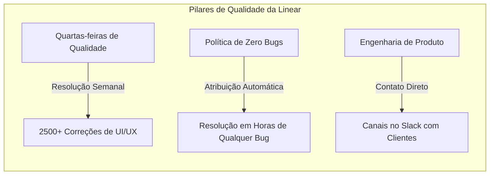

<config_file>
# Bom Gosto e Artesanato no Desenvolvimento de Software: Uma Conversa com Tuomas Artman, CTO da Linear

- **Evento**: **AI Engineer Conference 2026** (**AIE 2026**)
- **Data**: 21 de Abril de 2026
- **Entrevistado**: **Tuomas Artman** (Cofundador e CTO da **Linear**)
- **Entrevistador**: **Gergely Orosz** (Autor de **The Pragmatic Engineer**)
- **Arquivo de Origem**: `2026-04-21-wjk0ulMAkbc.txt`
- **Título do Painel**: _Taste & Craft: A Conversation with Tuomas Artman, CTO Linear & Gergely Orosz_
- **Subdomínios Técnicos**: Design de Produto, Qualidade de Software, Engenharia de Produto (_Product Engineering_), Cultura de Zero Bugs, Ausência de "Bom Gosto" em Agentes de IA.

---

## 1. Visão Geral Executiva

Em um diálogo enriquecedor entre **Tuomas Artman**, CTO e cofundador da **Linear**, e **Gergely Orosz**, o painel explorou o valor estratégico do **bom gosto e artesanato** (_taste and craft_) na engenharia de software diante da proliferação de agentes de codificação autônomos. Artman alertou para a armadilha enfrentada por muitas startups que utilizam ferramentas agênticas (como o **Claude Code** da Anthropic) para implementar impulsivamente todas as solicitações de recursos de clientes, gerando softwares inchados, confusos e de baixa qualidade percebida.

A **Linear** contrapõe essa tendência automatizada através de disciplinas culturais rigorosas, como as **Quartas-feiras de Qualidade** (_Quality Wednesdays_), a **política de zero bugs** (_zero bug policy_) e um processo seletivo prático de uma semana inteira de trabalho remunerado. A empresa defende que, à medida que a escrita bruta de código se comoditiza, todos os desenvolvedores serão forçados a se transformar em **engenheiros de produto**, cuja principal vantagem competitiva residirá na empatia com o usuário, no senso estético e na recusa deliberada a recursos desnecessários.

---

## 2. O Perigo da Velocidade sem Filtro e o Inchaço de Recursos

A facilidade com que ferramentas de IA escrevem código criou um falso incentivo para que equipes aceitem e enviem qualquer funcionalidade solicitada por usuários.

```mermaid
graph TD
    A[Facilidade de Geração de Código por IA] --> B[Aceitação Impulsiva de Solicitações]
    B --> C[Feature Bloat / Inchaço de Código]
    C --> D[Degradação da Experiência do Usuário (UX)]
    D --> E[Vulnerabilidade à Concorrência de Alta Qualidade]
```

### Contradição entre Velocidade e Design
- **A Filosofia do "Não"**: Remetendo à célebre afirmação de Steve Jobs de que grandes produtos nascem da recusa a 999 ideias para aprovar apenas uma, Artman enfatiza que a velocidade de geração de código por agentes não altera a necessidade de sintetizar feedbacks para encontrar a causa raiz do problema do cliente.
- **O Exemplo da Uber**: Revisitando a experiência de ambos na Uber durante a fase de hipercrescimento competitivo, Artman e Orosz apontaram que focar na entrega acelerada de recursos sem critérios estéticos acarreta o acúmulo massivo de débito de qualidade que, eventualmente, degrada a retenção de usuários a longo prazo.

---

## 3. A Ausência de "Bom Gosto" Estético nos Agentes de IA

Apesar da evolução vertiginosa dos modelos de linguagem de grande porte, os agentes de inteligência artificial continuam desprovidos de senso estético e percepção temporal da experiência humana.

### Limitações Estruturais da IA na UI/UX
- **Incapacidade de Sentir Latência e Ritmo**: Agentes de IA operam através de capturas estáticas de tela ou análise de árvores de elementos (**DOM**). Embora consigam calcular teoricamente a diferença entre 1 e 2 segundos, não possuem percepção biológica da frustração de um usuário humano diante de uma interface lenta.
- **Ajustes de Animação e Micro-interações**: Pequenos detalhes decisivos para a sensação de fluidez — como um destaque instantâneo ao passar o mouse sobre um botão seguido por um esmaecimento de saída (_fade-out_) em exatamente 150 milissegundos — exigem intervenção e sensibilidade humanas refinadas, sendo frequentemente ignorados ou mal executados por agentes autônomos.

---

## 4. Práticas Culturais de Qualidade na Linear

A preservação da excelência técnica na Linear fundamenta-se em rituais internos estruturados que engajam toda a equipe de engenharia.



### Rituais de Excelência
1. **Quartas-feiras de Qualidade** (_Quality Wednesdays_): Semanalmente, toda a equipe de engenharia se reúne em uma chamada de 30 minutos para apresentar pequenas melhorias contínuas de interface ou desempenho desenvolvidas individualmente. A prática já resultou na correção de mais de 2.500 pequenos detalhes imperceptíveis em testes automatizados.
2. **Política de Zero Bugs** (_Zero Bug Policy_): Qualquer falha reportada no produto é imediatamente atribuída ao engenheiro responsável e tratada como prioridade máxima, paralisando novos recursos até ser resolvida ou descartada justificadamente. Na Linear, 10% dos bugs simples já são corrigidos e submetidos em _pull requests_ automaticamente por agentes de IA.

---

## 5. Recrutamento Rigoroso e o Futuro do "Engenheiro de Produto"

A cultura de produto da empresa reflete-se diretamente no seu método de atração e avaliação de talentos.

| Dimensão | Abordagem Tradicional do Mercado | Abordagem da Linear |
| :--- | :--- | :--- |
| **Processo Seletivo** | Entrevistas curtas de algoritmos em plataforma (**LeetCode**). | Teste prático remunerado de uma semana inteira desenvolvendo um recurso real do zero. |
| **Foco da Engenharia** | Especialização em infraestrutura ou linguagens específicas. | Atuação holística como **Engenheiro de Produto** próximo dos clientes. |
| **Contato com Clientes** | Intermediado por gerentes de produto e suporte. | Acesso direto a canais de Slack e gravações de reuniões de clientes. |

### A Transição Irreversível da Profissão
Artman prevê que, à medida que os agentes assumam a transferência contínua de dados entre camadas e a codificação bruta, a engenharia de software tradicional convergirá inteiramente para a **engenharia de produto**. Os profissionais de sucesso atuarão como "mini-gerentes de produto", operando com autonomia técnica para desenhar experiências sob medida, orientando-se por diretrizes clássicas como as *Human Interface Guidelines* da Apple.

---

## 6. Notas Informativas e Glossário Técnico

- **Linear**: Plataforma de gerenciamento de projetos e rastreamento de problemas altamente prestigiada na comunidade de software pelo seu desempenho ultrarrápido e apuro estético.
- **Product Engineer (Engenheiro de Produto)**: Perfil profissional de engenharia focado no entendimento aprofundado das necessidades do usuário final, combinando habilidades de codificação, design de interface e visão de negócios.
- **Zero Bug Policy**: Prática de gestão de engenharia na qual bugs relatados em produção têm prioridade de resolução imediata sobre o desenvolvimento de novos recursos, mantendo a fila de pendências (_backlog_) zerada.
- **Quality Wednesdays**: Ritual semanal criado pela Linear em que engenheiros identificam e corrigem de forma autônoma pequenos defeitos visuais e de usabilidade no produto.
- **Human Interface Guidelines (HIG)**: Conjunto de diretrizes de design de interface e experiência de usuário mantido pela Apple, considerado referência padrão na indústria para criação de softwares intuitivos.

---

## 7. Lacunas e Expansão do Conhecimento

### Desafios e Reflexões da Indústria
1. **Viabilidade Econômica de Testes de Contratação Longos**: O modelo de teste seletivo de uma semana remunerada adopted pela Linear garante alinhamento cultural, mas pode afunilar excessivamente o funil de candidatos que não possuem disponibilidade de agenda para se dedicar por cinco dias completos.
2. **Automação de Testes de Regressão Estética**: A dependência do olhar humano nas Quartas-feiras de Qualidade evidencia a carência de ferramentas automatizadas capazes de validar regressões visuais em micro-animações.
3. **Escalabilidade de Canais Diretos com Clientes**: A prática de manter engenheiros diretamente expostos a canais abertos no Slack com grandes clientes corporativos exige gerenciamento cuidadoso para evitar a dispersão de foco e a interrupção constante do fluxo de trabalho concentrado.

</config_file>
