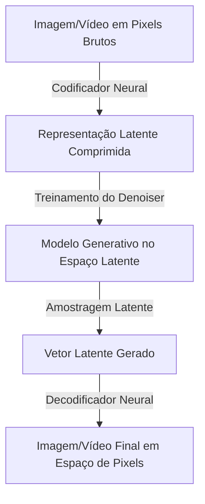
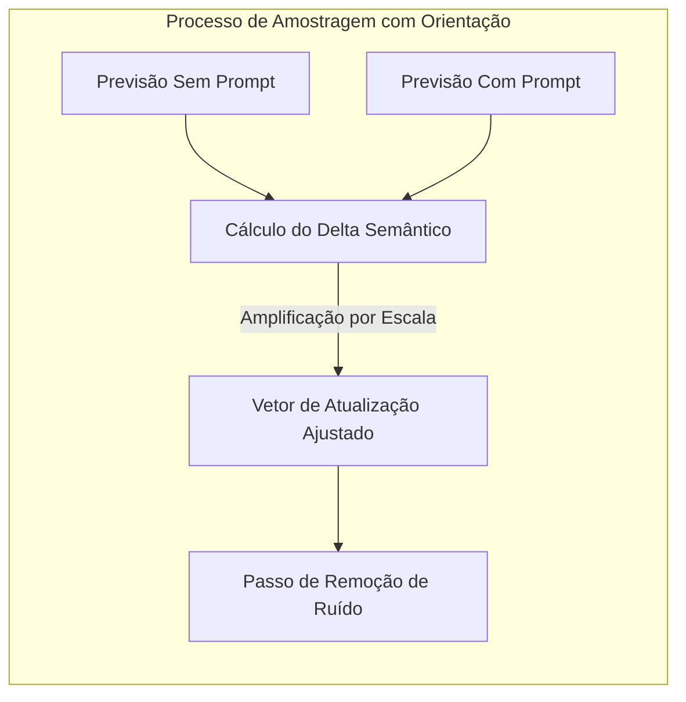

<config_file>
# Construção de Modelos Generativos de Imagem e Vídeo em Escala: Uma Perspectiva do Google DeepMind

- **Evento**: **AI Engineer Conference 2026** (**AIE 2026**)
- **Data**: 21 de Abril de 2026
- **Palestrante**: **Sander Dieleman** (Pesquisador Científico no **Google DeepMind**)
- **Arquivo de Origem**: `2026-04-21-xOP1PM8fwnk.txt`
- **Título da Palestra**: _Building Generative Image & Video models at Scale_
- **Subdomínios Técnicos**: Modelos de Difusão (_Diffusion Models_), Representações Latentes (_Latent Representations_), Autorregressão Espectral, Orientação Sem Guia (_Classifier-Free Guidance_), Destilação de Consistência (_Consistency Models_), Treinamento Distribuído em JAX.

---

## 1. Visão Geral Executiva

Em palestra técnica apresentada na **AI Engineer Conference 2026**, **Sander Dieleman**, pesquisador científico sênior do **Google DeepMind** com mais de uma década de atuação na instituição e contribuições nos modelos **Veo** e **Imagen**, apresentou uma visão aprofundada sobre a construção e o treinamento de modelos generativos de imagem e vídeo em escala de produção. Dieleman detalhou a transição da modelagem de pixels brutos para **espaços latentes comprimidos**, a matemática subjacente ao processo de adição e remoção de ruído, e a interpretação inovadora dos modelos de difusão como formas de **autorregressão espectral** operando sobre o domínio de frequência de Fourier.

Além dos fundamentos teóricos, o pesquisador abordou os bastidores da engenharia de infraestrutura, incluindo o paralelismo de modelos em clusters de **TPUs** com **JAX**, os métodos de amostragem determinística versus estocástica, a importância da **orientação livre de classificador** (_classifier-free guidance_) para elevar a qualidade perceptual das amostras, e as técnicas modernas de destilação rápida em **modelos de consistência** (_consistency models_) e **fluxos retificados** (_rectified flow_).

---

## 2. Curadoria de Dados e Representação Latente

A construção de modelos audiovisuais de alto desempenho exige desaprender convenções acadêmicas e adotar processos rigorosos de engenharia de dados.

### O Desafio da Escala de Memória
- **Gargalo de Pixels Brutos**: Um vídeo típico de 30 segundos em resolução 1080p a 30 quadros por segundo representa múltiplos gigabytes de tensores brutos na memória VRAM, inviabilizando o treinamento direto de redes neurais profundas.
- **Compressão via Autoencoders (EQ-VAE)**: Para contornar esse limite, utiliza-se um codificador neural que comprime os tensores de pixels em uma grade espacial mais grosseira (por exemplo, reduzindo dimensões de 256x256 pixels para 32x32 latentes), compensando a perda de resolução com a adição de canais latentes extras.
- **Preservação da Topologia**: Diferente de codecs comerciais como H.265 ou JPEG, os autoencoders neurais preservam a estrutura topológica bidimensional ou tridimensional original, abstraindo apenas a textura de alta frequência e mantendo a semântica visual.

---

## 3. Mecanismos de Difusão e Autorregressão Espectral

O processo central dos modelos de difusão consiste em definir um mecanismo de corrupção que destrói a informação da imagem através da adição progressiva de ruído gaussiano, seguido pelo aprendizado de uma rede de remoção de ruído (_denoiser_).

### Intuição da Análise de Frequência de Fourier
- **Lei de Potência Visual**: Imagens e vídeos naturais obedecem a uma relação estatística de lei de potência no seu espectro de frequência de Fourier (maior energia concentrada nas baixas frequências e menor energia nas altas frequências).
- **Destruição Hierárquica por Ruído**: Como o ruído gaussiano possui um espectro plano (energia uniforme em todas as frequências), a adição gradual de ruído destrói primeiramente os detalhes finos (altas frequências) e, por fim, a estrutura global (baixas frequências).
- **Autorregressão Espectral**: A amostragem por difusão atua como uma reconstrução iterativa que desenha primeiro a estrutura macro semântica e adiciona progressivamente os detalhes granulares finos, tornando a difusão o paradigma ideal para síntese audiovisual.

---

## 4. Arquiteturas de Rede e Treinamento Distribuído

A evolução das arquiteturas para modelos de difusão acompanhou a transição da indústria em direção aos transformadores.

| Componente Arquitetural | Abordagem Tradicional (U-Net) | Abordagem Moderna (Diffusion Transformer - DiT) |
| :--- | :--- | :--- |
| **Estrutura Base** | Redes Convolucionais com conexões de atalho (_skip connections_). | Blocos de Transformadores com atenção bidirecional total. |
| **Escalabilidade** | Dificuldade de dimensionamento para bilhões de parâmetros. | Reutilização das leis de escala e receitas de paralelismo de LLMs. |
| **Modelagem de Vídeo** | Convoluções 3D ou atenção espacial-temporal separada. | Volumes 3D integrados ou abordagens híbridas autorregressivas no tempo (ex: **Genie**). |

### Infraestrutura em JAX e TPUs
- **Paralelismo de Modelos Automático**: O treinamento desses modelos utiliza o ecossistema **JAX** no Google, aproveitando mecanismos de fragmentação automática de tensores (_sharding_) para minimizar o gargalo de comunicação entre chips em clusters de **TPUs**.

---

## 5. Amostragem, Orientação e Destilação Rápida

Os modelos de difusão oferecem flexibilidade de amostragem superior aos modelos autorregressivos puros.

### Orientação Livre de Classificador (_Classifier-Free Guidance_)
- **Mecanismo**: A orientação amplifica a diferença entre a previsão condicional (com o _prompt_ de texto) e a previsão incondicional (sem o _prompt_).
- **Compromisso**: Aumentar a escala de orientação reduz a diversidade de amostras geradas, mas eleva drasticamente a fidelidade visual e a adesão ao comando textual.

### Destilação para Amostragem em Poucos Passos
- **Modelos de Consistência** (_Consistency Models_): Em vez de realizar 50 a 100 passos iterativos de _denoising_ ao longo de uma trajetória não linear, a destilação de consistência treina a rede para prever diretamente o ponto final limpo, permitindo gerar imagens ou vídeos em apenas 1 a 4 passos.
- **Fluxos Retificados** (_Rectified Flow_): Técnicas de re-treinamento que "desentortam" as trajetórias de amostragem no espaço estocástico, tornando os caminhos retos e facilitando a aproximação linear rápida.

---

## 6. Sinais de Controle Multimodais

A evolução dos modelos generativos exige ultrapassar a dependência exclusiva de comandos de texto.

- **Condicionamento Baseado em Referência**: Permite que usuários insiram imagens ou pequenos clipes de vídeo como sinal de condicionamento (para manter a identidade de um personagem ou estilo visual).
- **Controle de Câmera e Física**: Inserção de sinais estruturados para controlar explicitamente o movimento da câmera, a velocidade da cena e as trajetórias de objetos.
- **Diferença Semântica na Orientação**: Dieleman destacou que a orientação (_guidance_) funciona com máxima eficiência quando existe um fosso de abstração semântica entre o sinal de controle (texto) e os pixels gerados, perdendo eficácia quando aplicada a mapas de baixa abstração (como máscaras de segmentação direta).

---

## 7. Notas Informativas e Glossário Técnico

- **Sander Dieleman**: Pesquisador científico no Google DeepMind, especialista em modelos generativos profundos de áudio, imagem e vídeo, com atuação destacada nos projetos **Veo**, **Imagen** e **WaveNet**.
- **Veo**: Modelo de geração de vídeo de alta fidelidade desenvolvido pelo Google DeepMind, capaz de sintetizar clipes consistentes em alta resolução a partir de descrições textuais e visuais.
- **Classifier-Free Guidance (CFG)**: Técnica de amostragem em modelos de difusão que equilibra a fidelidade ao condicionamento e a qualidade estética ao combinar pontuações condicionais e incondicionais durante a inferência.
- **Consistency Models**: Classe de modelos generativos que mapeiam diretamente qualquer ponto de uma trajetória de ruído para o ponto final limpo, viabilizando a síntese em um único passo ou em poucas etapas.
- **Genie**: Arquitetura generativa do Google DeepMind treinada em vídeos de jogos não rotulados para sintetizar ambientes interativos controláveis.

---

## 8. Lacunas e Expansão do Conhecimento

### Desafios Científicos e Tecnológicos
1. **Dicotomia entre Difusão e Autorregressão em Vídeo**: Embora a difusão sobre volumes 3D produza a maior qualidade estética, aplicações interativas em tempo real (como simulações de jogos ou robótica) exigem abordagens autorregressivas no tempo para gerar quadros sequencialmente sem latência de janela futura.
2. **Compressão Latente Sem Perda Semântica**: O desenvolvimento de autoencoders que alcancem taxas de compressão ainda maiores (três ou mais ordens de magnitude) sem introduzir artefatos visuais ou perder pequenos objetos em segundo plano permanece um problema aberto.
3. **Estabilidade no Treinamento de Diffusion Transformers (DiTs)**: O dimensionamento de modelos DiT para dezenas de bilhões de parâmetros enfrenta desafios de divergência numérica e colapso de atenção em regimes de precisão mFP8/FP16.

</config_file>
