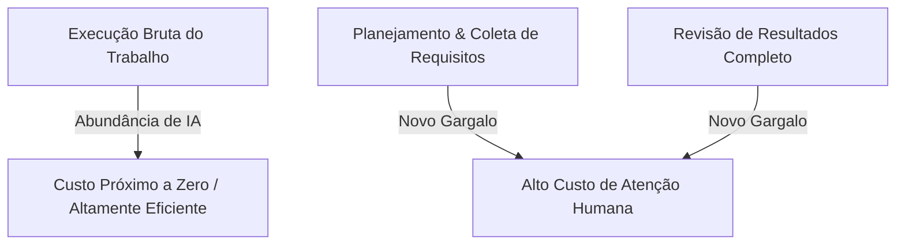
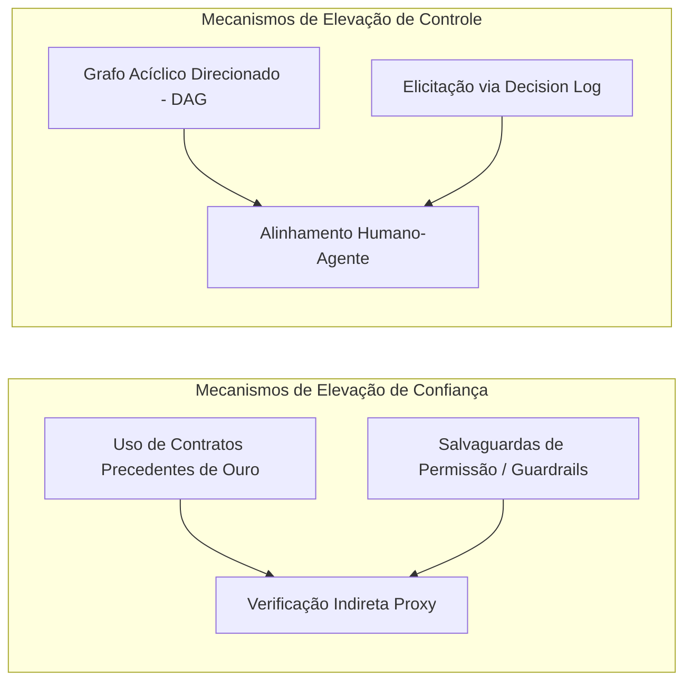

<config_file>
# Agentes Precisam de Mais do que um Chat: Interfaces de Alta Largura de Banda para IA Vertical

- **Evento**: **AI Engineer Conference 2026** (**AIE 2026**)
- **Data**: 22 de Abril de 2026
- **Palestrante**: **Jacob Lauritzen** (CTO da **Legora**)
- **Arquivo de Origem**: `2026-04-22-XNtkiQJ49Ps.txt`
- **Título da Palestra**: _Agents need more than a chat_
- **Subdomínios Técnicos**: IA Vertical (_Vertical AI_), Design de Interface para Agentes (UX/UI), A Regra do Verificador (_The Checker Rule_), Artefatos de Alta Largura de Banda, Automação Jurídica (_LegalTech_).

---

## 1. Visão Geral Executiva

Na palestra de encerramento da **AI Engineer Conference 2026**, **Jacob Lauritzen**, CTO da **Legora** — a *startup* de tecnologia jurídica (*legaltech*) de mais rápido crescimento do setor —, apresentou uma crítica contundente ao uso de caixas de texto conversacionais (*chats*) como interface primária para a orquestração de agentes de inteligência artificial complexos e de longa duração. Lauritzen argumentou que o *chat* é um meio unidimensional e de baixa largura de banda que condensa arbitrariamente árvores de trabalho complexas em fluxos lineares exaustivos, gerando fadiga no usuário e deterioração do contexto do modelo.

Para substituir a interação conversacional ingênua, a Legora propõe o conceito de **artefatos de alta largura de banda** (*high-bandwidth artifacts*), tais como documentos duradouros interativos, visões tabulares de revisão e registros de auditoria de decisões (*decision logs*). A palestra detalhou a **Regra do Verificador** (*The Checker Rule*), a decomposição de tarefas via **grafos acíclicos direcionados** (**DAG**), e estratégias pragmáticas de governança que equilibram o controle humano e a confiança na automação em tarefas de alta complexidade.

---

## 2. A Nova Economia da Produção Agêntica e a Regra do Verificador

A rápida evolução dos modelos de linguagem alterou fundamentalmente o custo das etapas do trabalho de conhecimento.

### A Regra do Verificador (_The Checker Rule_)
Cunhada por Jason Weston, a regra estabelece que: **se uma tarefa pode ser resolvida e é fácil de ser verificada, ela será inteiramente automatizada por IA**.
- **Setores Fáceis de Verificar**: Em programação, a execução de suítes de testes unitários ou ferramentas de _linting_ fornece feedback determinístico imediato. Na área jurídica, a análise de consistência de definições de termos em contratos é facilmente verificável por análise estática.
- **Setores Difíceis de Verificar**: A redação de cláusulas contratuais ambíguas ou o desenho de estratégias de litígio judicial não possuem verdades objetivas prévias. A verificação depende de julgadores humanos (juízes ou árbitros) no futuro, tornando o processo de verificação um gargalo extremamente caro e complexo.

---

## 3. Estratégias para Aumento da Confiança e do Controle

Para permitir que agentes operem sobre tarefas não-verificáveis, Lauritzen apresentou duas dimensões operacionais: a **confiança** (o grau em que o humano pode delegar sem inspecionar cada rastro) e o **controle** (a capacidade do humano de direcionar o conhecimento técnico para o agente).

### Mecanismos de Governança Agêntica
1. **Redução de Complexidade via Proxies**: No setor jurídico, insere-se um serviço de verificação proxy comparando a nova minuta gerada com contratos históricos validados ("contratos de ouro"), calculando a aderência a padrões anteriores.
2. **Salvaguardas Estritas** (_Guardrails_): Restrição do escopo de atuação do agente a diretórios específicos, limitação de edição a arquivos isolados e bloqueio de chamadas externas de API não autorizadas, prevenindo comportamentos destrutivos (como a alteração acidental de bancos de produção).
3. **Elicitação e Registro de Decisões** (_Decision Log_): Quando o agente enfrenta ambiguidades, em vez de bloquear a execução solicitando confirmação contínua no _chat_, ele toma a decisão de menor risco, prossegue o fluxo e registra a escolha em um diário de auditoria para revisão posterior pelo humano.

---

## 4. Superando a Limitação das Caixas de Chat: Artefatos de Alta Largura de Banda

O modelo clássico de interface baseado em _chat_ força o usuário a ler longas sequências de texto linear para entender árvores de execução agênticas complexas.

| Dimensão de Interação | Caixa de Chat Tradicional | Artefato de Alta Largura de Banda |
| :--- | :--- | :--- |
| **Largura de Banda** | Baixa (Texto linear sequencial). | Altíssima (Matrizes tabulares, documentos marcados). |
| **Contexto de Edição** | Global e impreciso ("Reescreva a cláusula três"). | Cirúrgico e direcionado (Seleção direta no texto com _tags_). |
| **Fadiga do Usuário** | Alta (Exige leitura de dezenas de mensagens). | Baixa (Visualização instantânea de diferenças e status). |
| **Colaboração** | Exclusiva entre 1 humano e 1 bot. | Multiusuário (Engenheiros, Advogados e Agentes no mesmo canvas). |

### Exemplos de Interfaces Nativas para Agentes
- **Documentos Duradouros Persistentes**: Ambientes de edição estruturados onde advogados podem marcar parágrafos específicos, direcionar instruções a agentes especializados e visualizar alterações em tempo real.
- **Revisão Tabular de Contratos**: Uma grade interativa gerada automaticamente pelo agente ao analisar múltiplos contratos, destacando discrepâncias de risco e solicitando a validação humana apenas nas células divergentes.

---

## 5. Notas Informativas e Glossário Técnico

- **Legora**: Plaftorma de trabalho colaborativo impulsionada por IA focada no mercado jurídico (*legaltech*), atendendo escritórios de advocacia em dezenas de países.
- **The Checker Rule**: Princípio de design de sistemas de IA que condiciona a taxa de automação bem-sucedida de um problema à facilidade e velocidade de verificação do resultado gerado.
- **DAG (Directed Acyclic Graph / Grafo Acíclico Direcionado)**: Estrutura de dados utilizada em orquestração de agentes para representar etapas de trabalho dependentes sem ciclos de repetição infinitos.
- **High-Bandwidth Artifacts (Artefatos de Alta Largura de Banda)**: Interfaces de usuário ricas (como editores de código, canvas de documentos e tabelas dinâmicas) que permitem a transferência acelerada de contexto entre humanos e agentes de IA sem a prolixidade das conversas por texto.
- **Decision Log**: Mecanismo de auditoria em que agentes registram premissas e decisões tomadas autonomamente durante uma execução longa, permitindo a revisão e reversão humana pontual.

---

## 6. Lacunas e Expansão do Conhecimento

### Reflexões sobre a Próxima Geração de UIs para Agentes
1. **Padronização de Interfaces Não-Textuais para LLMs**: Os modelos de linguagem atuais são treinados predominantemente sobre dados textuais. O avanço para interfaces de alta largura de banda exige que os modelos aprendam a emitir e manipular estruturas de dados de interface (como **JSON Schemas** de componentes visuais) nativamente.
2. **Integração de Controles de Acesso Granulares (RBAC)**: Em artefatos compartilhados por humanos e agentes múltiplos em ambientes jurídicos ou financeiros, o controle de acesso por camada torna-se crítico para evitar que agentes leiam dados confidenciais de clientes sem autorização expressa.
3. **Resistência Cultural à Substituição do Chat**: Embora o _chat_ seja ineficiente para fluxos complexos, sua simplicidade de adoção inicial ainda atua como uma forte barreira cognitiva para a transição de usuários não-técnicos em direção a artefatos visuais avançados.

</config_file>
