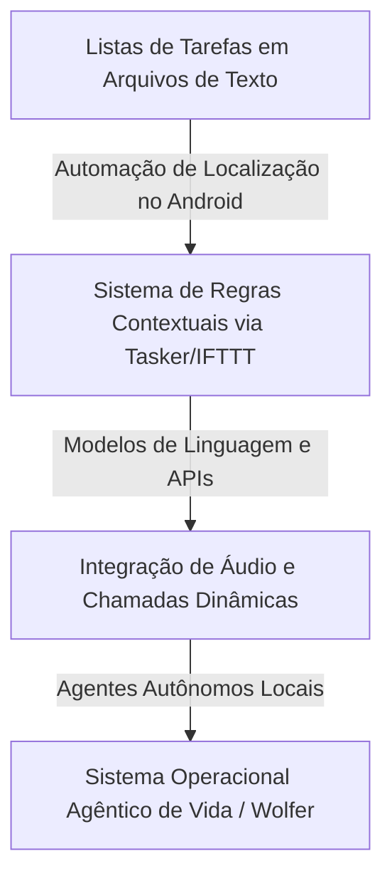

<config_file>
# O Fim dos Aplicativos de Consumo: A Emergência dos Sistemas Operacionais Pessoais Agênticos

- **Evento**: **AI Engineer Conference 2026** (**AIE 2026**)
- **Data**: 23 de Abril de 2026
- **Palestrante**: **Kitze** (Criador do **Sizzy.co** e da comunidade **Tinkerer Club**)
- **Arquivo de Origem**: `2026-04-23-4fntwuOoedA.txt`
- **Título da Palestra**: _The End of Apps_
- **Subdomínios Técnicos**: Agentes Pessoais Autônomos, Sistemas Operacionais de Vida (_Life OS_), Interfaces Geradas Sob Demanda (_Just-In-Time UI_), Infraestrutura Local vs. Nuvem, Injeção de Contexto Hierárquico.

---

## 1. Visão Geral Executiva

Em palestra proferida na **AI Engineer Conference 2026**, o desenvolvedor e empreendedor **Kitze**, criador do navegador para desenvolvedores **Sizzy.co**, apresentou uma análise provocativa sobre o futuro da produtividade pessoal e a inevitável obsolescência dos aplicativos de consumo tradicionais. Kitze relatou sua jornada de 25 anos buscando criar um "Sistema Operacional de Vida" (*Life OS*), desde o uso de arquivos de texto locais automatizados por *scripts* no Android até a adoção e construção de **agentes pessoais autônomos** como o **OpenClaw** e o **Hermes**.

O palestrante criticou severamente as limitações das interfaces conversacionais genéricas baseadas em *chat* (como o Discord ou Telegram adaptados para agentes), apontando a ineficiência das memórias de longo prazo atuais e a falta de personalidade das soluções de nuvem. Como alternativa, apresentou o experimento **Wolfer** — um sistema agêntico local construído sobre **tópicos aninhados** que injetam contexto hierárquico diretamente no modelo —, prevendo que o futuro da computação abandonará as UIs estáticas em favor de **interfaces geradas sob demanda** (*just-in-time UI*) e agentes locais embarcados em dispositivos.

---

## 2. A Evolução da Produtividade Pessoal ao Sistema Operacional de Vida

A busca por um sistema que descarregue a carga cognitiva humana passou por diversas fases tecnológicas nas últimas três décadas.

### Eras da Produtividade Pessoal
- **Era dos Arquivos de Texto e Automação Contextual**: Utilização de ferramentas de automação no Android (**Tasker**) combinadas com integração de serviços de terceiros para disparar lembretes baseados em localização física, conexões Wi-Fi ou atividades de deslocamento.
- **A Promessa dos Plugins de LLMs**: A introdução de capacidades de chamada de ferramentas (*tool calling*) em modelos de linguagem prometia eliminar a necessidade de múltiplos aplicativos SaaS (*Software as a Service*). No entanto, a exigência de preenchimento manual de formulários continuou sendo um gargalo de adesão.
- **Transição para Infraestrutura Totalmente Local**: O receio com a privacidade dos dados pessoais e os custos de APIs levou à substituição de modelos em nuvem por instâncias locais hospedadas em servidores privados (*NAS*) operando com **Nextcloud** e arquivos **Markdown** locais.

---

## 3. As Limitações dos Agentes Conversacionais Atuais

Apesar do entusiasmo inicial com os bots agênticos pessoais integrados a plataformas de comunicação, a experiência prática revelou falhas estruturais de usabilidade.

### Diagnóstico de Ineficiência nos Agentes de Nuvem
1. **Fadiga do Chat e Respostas Genéricas**: Agentes de nuvem genéricos tendem a responder como "caixas de aveia sem personalidade", repetindo confirmações burocráticas sem efetuar ações reais ou esquecendo instruções básicas nas mensagens subsequentes.
2. **Impropriedade das Plataformas de Comunicação**: Utilizar aplicativos como Discord ou Telegram para gerenciar a vida pessoal de forma integral é uma adaptação forçada. Essas ferramentas não foram projetadas para armazenar estados complexos ou gerenciar cronogramas de tarefas de fundo (*cron jobs*).
3. **Infiabilidade dos Sistemas de Memória Agêntica**: As arquiteturas atuais de memória de longo prazo para LLMs falham frequentemente em resgatar o contexto preciso no momento em que o usuário precisa executar uma tarefa imediata.

---

## 4. O Experimento Wolfer: Contexto por Tópicos Aninhados

Para superar as deficiências de memória dos agentes tradicionais, Kitze desenvolveu o **Wolfer**, um ambiente de orquestração agêntica multi-modelo.

### Inovações Arquiteturais do Wolfer
- **Substituição da Memória Mágica por Tópicos Aninhados**: Em vez de confiar em bancos vetoriais estáticos de busca semântica, o sistema concatena automaticamente as descrições dos tópicos pai da árvore de navegação na primeira mensagem enviada ao agente.
- **Espaços de Trabalho e Capacidades Visíveis**: Interface gráfica que permite alternar entre ambientes de trabalho e gerenciar visualmente os módulos e permissões de cada agente de forma previsível.
- **Cron Jobs Transparentes**: Tarefas agendadas leem todo o histórico da conversa associada antes de executar, evitando que o agente aja sem compreender a origem do disparo.

---

## 5. O Fim dos Aplicativos de Consumo e a Inversão da Interação com a IA

A evolução da inteligência artificial transformará radicalmente a relação entre humanos e computadores.

| Dimensão | Paradigma Atual (Centrado em Aplicativos) | Paradigma Futuro (Centrado em Agentes) |
| :--- | :--- | :--- |
| **Papel do Usuário** | Proativo (Abre aplicativos, preenche formulários e executa passos). | Delegador (Aprova decisões, responde a questionários e define metas). |
| **Interface de Usuário** | UIs estáticas pré-desenhadas para cada serviço (SaaS). | UIs geradas sob demanda (*Just-In-Time UI*) destruídas após o uso. |
| **Execução de Tarefas** | Manual através de múltiplos softwares isolados. | Invisível e contínua em segundo plano operada por assistentes locais. |
| **Privacidade e Dados** | Armazenamento centralizado em nuvens corporativas. | Processamento local em processadores neurais (*NPUs*) no dispositivo. |

### A Previsão da Interface Gerada sob Demanda (_Just-In-Time UI_)
Kitze prevê que a grande maioria dos aplicativos de consumo (rastreadores de calorias, gerenciadores de hábitos e listas de tarefas) desaparecerão. Os computadores do futuro cumprimentarão os usuários diretamente com as próximas decisões a tomar, gerando interfaces visuais dinâmicas na tela no exato momento da ação e descartando-as em seguida. Apenas softwares altamente especializados (como estações de trabalho de áudio digital, edição de vídeo profissional e correção de cor) sobreviverão como aplicativos estáticos independentes.

---

## 6. Notas Informativas e Glossário Técnico

- **Kitze**: Desenvolvedor de software, palestrante e empreendedor de origem macedônia sediado na Europa, fundador do navegador de testes **Sizzy.co** e da comunidade **Tinkerer Club**.
- **Life OS (Sistema Operacional de Vida)**: Conceito de design de software que busca unificar calendários, gerenciadores de tarefas, notas, finanças e hábitos em uma única camada de controle automatizada.
- **OpenClaw**: Plataforma de código aberto para a criação e orquestração de agentes pessoais autônomos capazes de executar tarefas no sistema operacional e integrar-se a aplicativos de mensagens.
- **Just-In-Time UI (Interface Sob Demanda)**: Padrão de design no qual a interface gráfica do usuário é sintetizada dinamicamente por modelos generativos apenas durante a execução de uma tarefa específica e destruída logo após sua conclusão.
- **Tasker**: Aplicativo de automação profunda para o sistema operacional Android que permite criar regras condicionais complexas com base em sensores de hardware e eventos do sistema.

---

## 7. Lacunas e Expansão do Conhecimento

### Implicações Práticas e Tecnológicas
1. **O Domínio dos Ecossistemas Fechados (Apple vs. Google)**: O avanço dos assistentes agênticos locais com acesso a notificações e controle de aplicativos favorece plataformas proprietárias (Apple Intelligence e Google Pixel), que possuem integração nativa de hardware e permissões de sistema inacessíveis a softwares de terceiros.
2. **Consumo Energético e Bateria em Dispositivos Móveis**: A execução contínua de modelos de linguagem locais (*SLMs*) e agentes operando em segundo plano no celular impõe um desafio severo à autonomia de bateria dos smartphones modernos.
3. **Padronização de Protocolos de Automação Local**: A ausência de um padrão universal de chamadas de ferramentas locais seguro limita a interoperabilidade entre agentes independentes e aplicativos legados.

</config_file>
