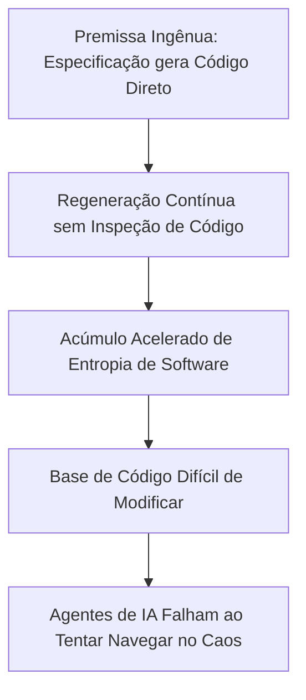
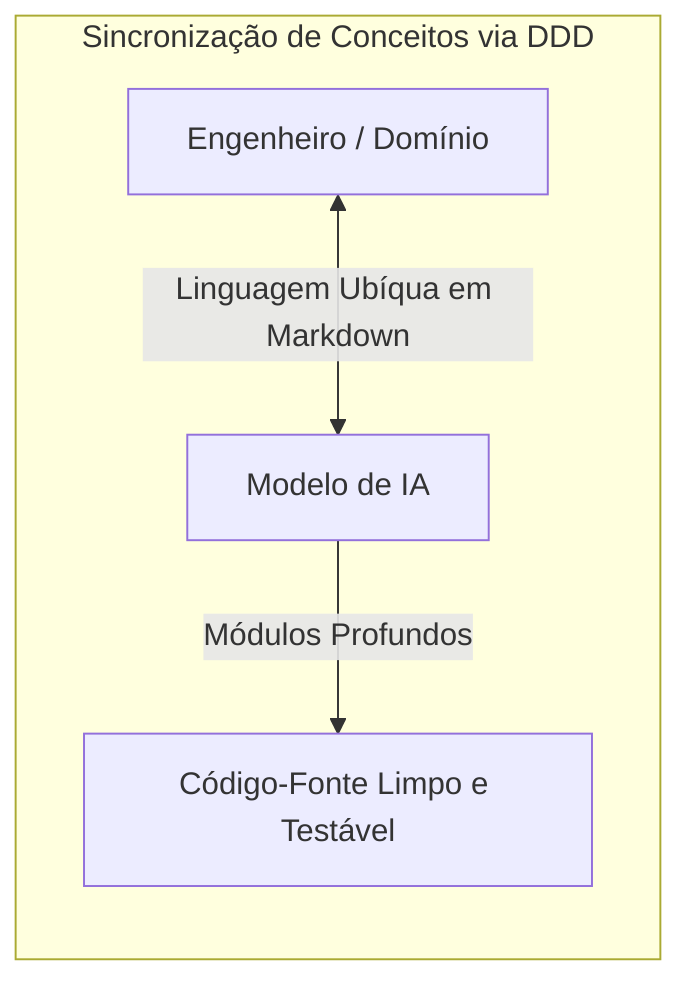

<config_file>
# Os Fundamentos de Software Importam Mais do que Nunca: A Engenharia de Agentes com Base em Princípios Clássicos

- **Evento**: **AI Engineer Conference 2026** (**AIE 2026**)
- **Data**: 23 de Abril de 2026
- **Palestrante**: **Matt Pocock** (Educador de Engenharia de Software e Criador do **aihero.dev**)
- **Arquivo de Origem**: `2026-04-23-v4F1gFy-hqg.txt`
- **Título da Palestra**: _Software Fundamentals Matter More Than Ever_
- **Subdomínios Técnicos**: Arquitetura de Software, Design Orientado a Domínio (_Domain-Driven Design - DDD_), Desenvolvimento Orientado a Testes (_Test-Driven Development - TDD_), Módulos Profundos (_Deep Modules_), Entropia de Software.

---

## 1. Visão Geral Executiva

Em palestra apresentada na **AI Engineer Conference 2026**, o renomado educador de software **Matt Pocock** refutou o mito de que o avanço dos agentes de inteligência artificial tornou as habilidades de engenharia de software tradicionais obsoletas. Pocock demonstrou que o movimento popular de "especificação para código" (*spec-to-code*) — que defende a edição exclusiva de requisitos em linguagem natural sem a inspeção do código-fonte —, quando aplicado de forma ingênua, acelera o acúmulo de **entropia de software** e produz bases de código frágeis e espaguete em velocidade sem precedentes.

Apoiando-se em princípios clássicos de arquitetura expostos por John Ousterhout (*A Philosophy of Software Design*) e Andrew Hunt/David Thomas (*The Pragmatic Programmer*), Pocock sustentou que **código ruim nunca foi tão caro**, pois sistemas desestruturados impedem que os agentes operem com eficiência. Para mitigar esses modos de falha, o palestrante revelou um conjunto de habilidades práticas (*skills*) aplicadas a agentes agênticos, englobando a construção de **linguagens ubíquas**, o uso de **módulos profundos** com limites estritamente testáveis via **TDD**, e a transição do desenvolvedor para o papel de arquiteto estratégico.

---

## 2. O Fracasso do Movimento Spec-to-Code e o Custo do Código Ruim

A premissa de que a IA transformou o código em um bem descartável e "barato" negligencia os custos de manutenção e modificação de sistemas complexos.

### Complexidade e Entropia segundo os Clássicos
- **Definição de Complexidade (John Ousterhout)**: Complexidade é qualquer elemento na estrutura do software que dificulta sua compreensão e modificação. Um sistema ruim é definido pela incapacidade de sofrer alterações sem a introdução de novos erros (*bugs*).
- **Entropia de Software (The Pragmatic Programmer)**: Alterações feitas de forma tática, focando apenas na tarefa imediata sem considerar o design global do sistema, degradam a arquitetura continuamente. Agentes de IA sem direcionamento maximizam a entropia do software.

---

## 3. Alinhamento de Conceitos de Design e Linguagem Ubíqua

A falha primária na geração de código por IA reside na assimetria de comunicação entre o modelo e a intenção oculta do engenheiro.

### Habilidades de Alinhamento (_Skills_)
1. **Interrogatório Estruturado (*Grill Me*)**: Para evitar a geração precipitada de código, ativa-se uma habilidade em que a IA realiza de 40 a 100 perguntas consecutivas ao desenvolvedor, explorando cada ramo da árvore de requisitos até consolidar um **conceito de design** (*design concept*) em comum antes de qualquer implementação.
2. **Linguagem Ubíqua (*Ubiquitous Language*)**: Derivada do Design Orientado a Domínio (**DDD**), essa habilidade mapeia os termos técnicos e de negócios da base de código em uma tabela padronizada. A injeção dessa tabela nos comandos reduz a prolixidade das respostas do modelo e garante convenções de nomenclatura idênticas no código e nas especificações.

---

## 4. Ciclos de Feedback Rápido e a Arquitetura de Módulos Profundos

Agentes de IA frequentemente ultrapassam o "alcance dos faróis" (*overdriving your headlights*), gerando grandes volumes de código antes de executar verificações estáticas ou testes.

### Otimização da Base de Código para Agentes
- **Uso do TDD como Limitador de Velocidade**: O Desenvolvimento Orientado a Testes força o agente a executar passos pequenos e deliberados (criar o teste falho, implementar o mínimo para aprovação e refatorar), utilizando a taxa de feedback como limite de velocidade.
- **Módulos Profundos vs. Módulos Superficiais**:
  - **Módulos Superficiais** (*Shallow Modules*): Expõem interfaces complexas com pouca funcionalidade oculta. Agentes perdem o contexto ao tentar navegar por centenas de pequenos arquivos desconexos.
  - **Módulos Profundos** (*Deep Modules*): Ocultam grande complexidade interna atrás de interfaces extremamente simples e declarativas. Permitem ao desenvolvedor delegar a implementação interna à IA enquanto inspeciona e testa exclusivamente as fronteiras externas.

---

## 5. Comparativo entre Abordagens de Desenvolvimento com IA

| Dimensão de Análise | Abordagem Spec-to-Code Ingênua | Engenharia Orientada a Fundamentos |
| :--- | :--- | :--- |
| **Visão do Código** | Tratado como descarte temporário sem valor. | Tratado como ativo crítico que determina a eficiência da IA. |
| **Papel do Desenvolvedor** | Espectador que apenas altera prompts de texto. | Arquiteto Estratégico que desenha limites e módulos profundos. |
| **Papel da IA** | Geradora autônoma de todo o sistema sem supervisão. | "Sargento Tático" que executa tarefas delimitadas por TDD. |
| **Gerenciamento de Erros** | Regeneração total do código a cada falha. | Refatoração cirúrgica e ajuste de módulos e testes. |
| **Carga Cognitiva** | Alta (Exaustão por ler código desestruturado). | Baixa (Foco no design de interfaces e caixas-pretas testáveis). |

---

## 6. Notas Informativas e Glossário Técnico

- **Matt Pocock**: Educador e especialista em TypeScript e arquitetura de software no Reino Unido, criador da plataforma **aihero.dev** e de repositórios de habilidades para agentes.
- **Grill Me Skill**: Padrão de *prompting* e habilidade agêntica que força a IA a entrevistar o usuário incansavelmente antes de iniciar a escrita de código.
- **Deep Modules (Módulos Profundos)**: Conceito arquitetural formulado por John Ousterhout no qual um módulo oferece funcionalidade potente e complexa através de uma interface de uso simples e enxuta.
- **Ubiquitous Language (Linguagem Ubíqua)**: Prática central do Domain-Driven Design (DDD) que estabelece um vocabulário rigoroso e compartilhado entre especialistas de negócios, desenvolvedores e código-fonte.
- **Software Entropy (Entropia de Software)**: Tendência natural de deterioração da qualidade e estrutura interna de um sistema de software à medida que novas alterações são introduzidas sem cuidado arquitetural.

---

## 7. Lacunas e Expansão do Conhecimento

### Desafios Práticos da Aplicação de Fundamentos com IA
1. **Refatoração Automática de Módulos Superficiais**: A conversão de bases de código legadas repletas de módulos superficiais para arquiteturas de módulos profundos ainda exige supervisão arquitetural humana frequente, visto que agentes tendem a replicar a dívida técnica existente.
2. **Manutenção de Testes Frágeis em TDD Agêntico**: Testes sintéticos gerados por IA sem uma linguagem ubíqua clara frequentemente acoplam-se a detalhes de implementação interna em vez de comportamentos de interface, quebrando facilmente durante refatorações.
3. **Limites da Abstração em Sistemas de Alta Criticidade**: Em módulos financeiros ou de segurança biológica, a delegação cega da implementação interna ("caixa-cinzenta") é inviável, exigindo auditoria linha por linha do código-fonte produzido pelo modelo.

</config_file>
