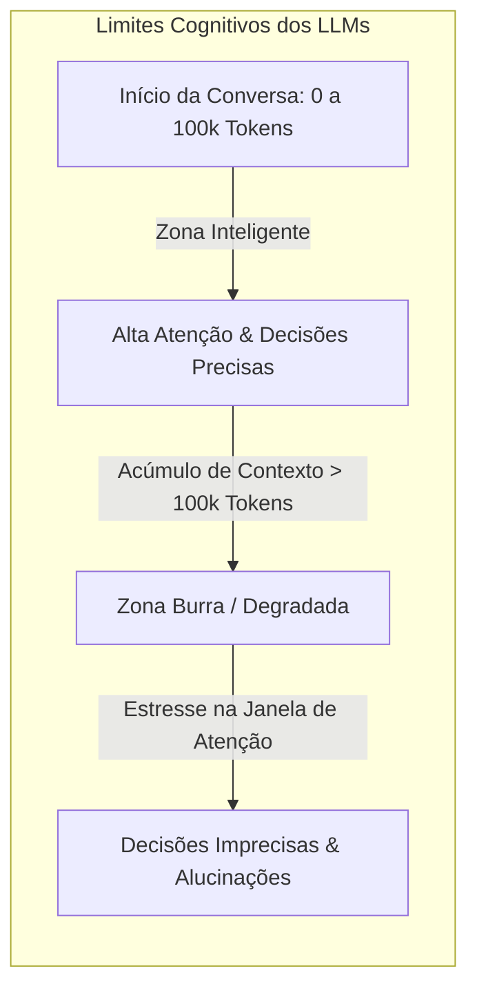
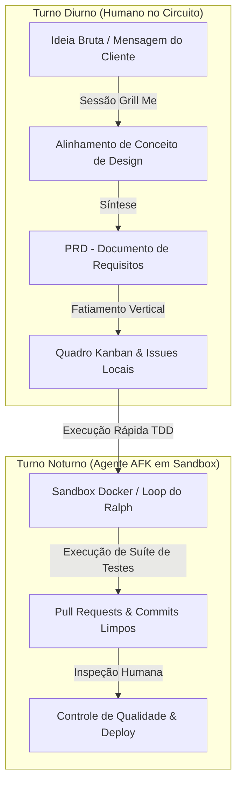
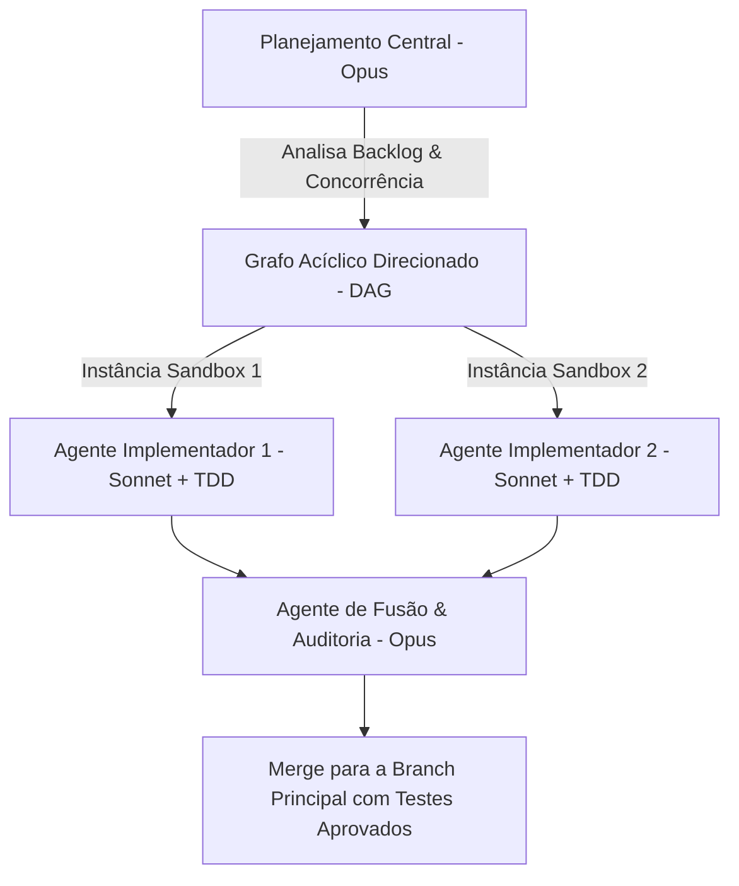

<config_file>
# Guia Prático do Fluxo de Trabalho para Desenvolvimento com Agentes de IA: Do Alinhamento ao Código em Produção

- **Evento**: **AI Engineer Conference 2026** (**AIE 2026**)
- **Data**: 24 de Abril de 2026
- **Palestrante**: **Matt Pocock** (Educador de Engenharia de Software e Criador do **aihero.dev**)
- **Arquivo de Origem**: `2026-04-24--QFHIoCo-Ko.txt`
- **Título do Workshop**: _Full Walkthrough: Workflow for AI Coding — Matt Pocock_
- **Subdomínios Técnicos**: Orquestração Agêntica, Fatiamento Vertical (*Vertical Slicing*), Marcadores Rastreáveis (*Tracer Bullets*), Desenvolvimento Ausente do Teclado (*AFK Mode*), Módulos Profundos (*Deep Modules*), Arquitetura Distribuída em Sandbox (**Sandcastle**).

---

## 1. Visão Geral Executiva

Neste workshop prático conduzido na **AI Engineer Conference 2026**, **Matt Pocock** apresentou o ciclo de vida completo de desenvolvimento de software assistido por agentes autônomos de inteligência artificial. O treinamento refutou a promessa ingênua do movimento de "especificação para código" (*spec-to-code*), demonstrando que a delegação cega da escrita de software sem supervisão arquitetural degrada rapidamente a base de código e exaure os limites operacionais dos modelos de linguagem.

Pocock apresentou uma metodologia sistemática de 7 fases que transforma requisitos ambíguos em **fatias verticais** (*vertical slices*) executáveis por agentes em modo **AFK** (*Away From Keyboard*). O fluxo integra a técnica de interrogatório contínuo (**Grill Me**), a criação de documentos de requisitos de produto (**PRD**), a organização de quadros **Kanban** representados por grafos acíclicos direcionados (**DAG**), o desenvolvimento orientado a testes (**TDD**) em ambientes isolados (*sandboxing* **Docker**) e a orquestração paralela com a biblioteca **Sandcastle**.

---

## 2. Restrições Cognitivas dos Modelos de Linguagem

A construção de um fluxo de trabalho eficiente para agentes de codificação exige compreender duas restrições fundamentais dos modelos de linguagem de grande porte.

### As Duas Restrições Estruturais
1. **A Zona Inteligente vs. Zona Burra**: Independentemente da janela de contexto nominal do modelo (200 mil ou 1 milhão de _tokens_), o desempenho ótimo de raciocínio ocorre nos primeiros 100 mil _tokens_. A partir desse limite, as relações de atenção crescem quadraticamente, degradando a precisão das respostas.
2. **O Efeito "Memento" (Amnésia de Sessão)**: Os agentes de IA comportam-se como o personagem do filme *Memento*, perdendo todo o contexto ao limpar a sessão. Para evitar a contaminação e o custo da compressão contínua de histórico, o ambiente de desenvolvimento deve ser projetado para reiniciar a sessão em estados base limpos e previsíveis.

---

## 3. O Ciclo de Desenvolvimento Agêntico em 7 Fases

O fluxo de trabalho proposto por Matt Pocock divide o ciclo de vida do desenvolvimento em duas jornadas distintas: o **Turno Diurno** (interação e alinhamento humano-IA) e o **Turno Noturno** (execução autônoma em modo AFK).

### Fase 1: Alinhamento de Conceito de Design (*Grill Me*)
Em vez de solicitar imediatamente a geração de um plano de código, o desenvolvedor ativa a habilidade **Grill Me**. O agente faz de 40 a 100 perguntas consecutivas ao humano, explorando cada ramo de decisão técnica até que ambos compartilhem o mesmo **conceito de design** (*design concept*), eliminando premissas ocultas.

### Fase 2 e 3: Síntese de Requisitos no PRD
O resultado do interrogatório é sintetizado em um **PRD** contendo a declaração do problema, os critérios de aceitação, as histórias de usuário, as decisões de arquitetura e a lista estrita do que está fora de escopo.

### Fase 4: Fatiamento Vertical e Marcadores Rastreáveis (*Tracer Bullets*)
O PRD é decomposto em tarefas pequenas representadas em um quadro **Kanban**. 
- **Fatiamento Horizontal (Anti-padrão)**: Desenvolver todas as alterações de banco de dados na Fase 1, a API na Fase 2 e a UI na Fase 3 impede o feedback contínuo.
- **Fatiamento Vertical (Marcadores Rastreáveis)**: Cada tarefa deve ser uma fatia fina que atravessa todas as camadas do sistema (Banco, API e Interface), permitindo validar o fluxo completo e obter feedback instantâneo na primeira iteração.

### Fase 5: Execução Autônoma em Modo AFK com TDD
No turno noturno, o agente executa loops autônomos (Loops do **Ralph**) operando dentro de ambientes **Docker** isolados. O agente aplica **TDD** (escrevendo primeiramente o teste falho em vermelho, implementando a solução em verde e refatorando o código), garantindo que cada tarefa resulte em um _commit_ auditável.

### Fase 6 e 7: Controle de Qualidade e Revisão de Código
O desenvolvedor humano inspeciona os artefatos gerados, impondo seu "gosto e estilo" no controle de qualidade final. Erros encontrados nessa fase não são corrigidos manualmente pelo humano, mas convertidos em novos cartões para o quadro Kanban.

---

## 4. Arquitetura de Módulos Profundos vs. Módulos Superficiais

A eficácia de um agente de IA em uma base de código depende diretamente da estrutura arquitetural do repositório.

| Característica | Módulos Superficiais (*Shallow Modules*) | Módulos Profundos (*Deep Modules*) |
| :--- | :--- | :--- |
| **Estrutura** | Centenas de pequenos arquivos desconexos exportando poucas funções. | Poucos módulos expansivos ocultando grande complexidade interna. |
| **Interface** | Interfaces visíveis complexas com alto acoplamento. | Interface pública simples, minimalista e declarativa. |
| **Navegação pela IA** | Difícil: o agente se perde no grafo de dependências. | Excelente: o agente atua com clareza nos limites do módulo. |
| **Testabilidade** | Ruim: exige mocks excessivos de dependências rasas. | Alta: permite limites de teste integrados na interface pública. |
| **Carga Cognitiva** | Exaustiva para o desenvolvedor e para o LLM. | Preservada: o humano projeta a interface e delega a implementação. |

### Delegação de Implementação ("Caixas Cinzentas")
Ao projetar módulos profundos, o desenvolvedor humano define rigorosamente a **interface pública** e os **contratos de teste**, tratando a implementação interna como uma "caixa cinzenta". Essa abordagem permite que a IA escreva e refatore o código interno sem que o desenvolvedor precise memorizar cada linha da implementação.

---

## 5. Orquestração Avançada com a Biblioteca Sandcastle

Para escalar a execução autônoma além de scripts sequenciais simples, Pocock desenvolveu o **Sandcastle**, uma biblioteca TypeScript para orquestração de agentes em ambientes Docker paralelizados.

### Arquitetura de Papéis Especializados
- **Implementadores (Claude Sonnet)**: Executam tarefas de escrita rápida de código e TDD dentro de contêineres Docker isolados, operando com menor custo e alta velocidade.
- **Revisores e Orquestradores (Claude Opus)**: Analisam o código gerado em ambientes limpos, aplicando verificações de padrões de arquitetura e resolvendo conflitos de fusão (*merges*) antes da integração final.

---

## 6. Notas Informativas e Glossário Técnico

- **Matt Pocock**: Educador de desenvolvimento de software e criador da plataforma **aihero.dev**, reconhecido por suas contribuições na comunidade TypeScript e no ensino de engenharia agêntica.
- **Tracer Bullets (Marcadores Rastreáveis)**: Conceito arquitetural extraído do livro *The Pragmatic Programmer*, referente a fatias verticais de código que atravessam todas as camadas de um sistema para fornecer feedback de execução imediato.
- **AFK Mode (Away From Keyboard)**: Regime de execução autônoma em que agentes de IA resolvem pendências de um quadro Kanban em segundo plano sem necessidade de intervenção humana em tempo real.
- **Sandcastle**: Biblioteca TypeScript de código aberto desenvolvida por Matt Pocock para isolar a execução de agentes de IA em ambientes Docker e orquestrar fluxos paralelos via Git.
- **Ralph Loop**: Padrão de execução agêntica contínua no qual o modelo recebe uma meta final e executa pequenos passos de alteração e validação em loop até a conclusão da tarefa.

---

## 7. Lacunas e Expansão do Conhecimento

### Desafios de Engenharia em Escala
1. **Gargalo da Revisão de Código Humana**: A capacidade dos agentes autônomos de gerar dezenas de *pull requests* em poucas horas transfere o gargalo da engenharia inteiramente para a etapa de revisão de código, exigindo novas métricas e ferramentas de inspeção visual.
2. **Limitações do TDD em Interfaces Gráficas (UI)**: Enquanto o TDD e as fatias verticais funcionam perfeitamente para serviços de back-end e regras de negócios, a validação de layouts complexos e micro-interações de front-end ainda depende da inspecção visual humana.
3. **Deterioração de Documentação em Repositórios Maduros**: O acúmulo de PRDs e arquivos de especificação antigos no repositório pode confundir os agentes durante a navegação. Recomenda-se fechar e arquivar as *issues* no GitHub em vez de manter especificações desatualizadas no diretório raiz do código.

</config_file>
