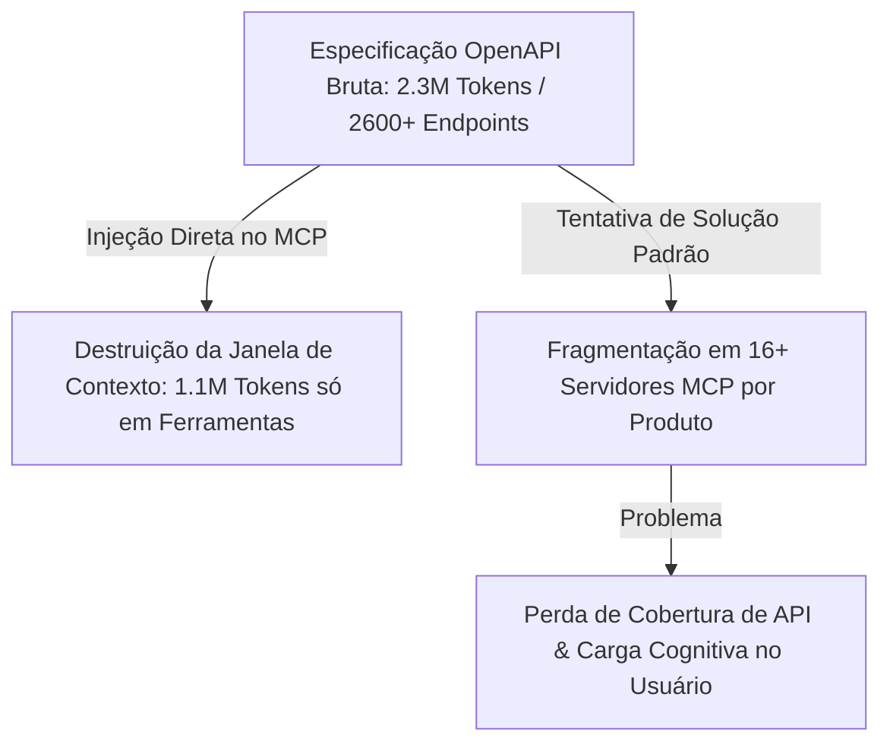
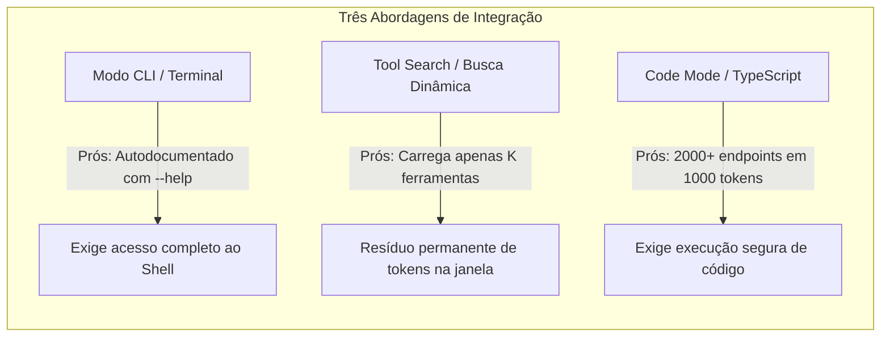
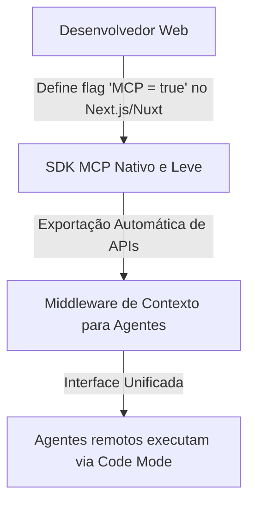

<config_file>
# MCP = Mega Context Problem: Como Conectar Milhares de APIs a Agentes sem Destruir a Janela de Contexto

- **Evento**: **AI Engineer Conference 2026** (**AIE 2026**)
- **Data**: 25 de Abril de 2026
- **Palestrante**: **Matt Carey** (Engenheiro de Sistemas na **Cloudflare**)
- **Arquivo de Origem**: `2026-04-25-YBYUvGOuotE.txt`
- **Título da Palestra**: _MCP = Mega Context Problem_
- **Subdomínios Técnicos**: Protocolo de Contexto de Modelo (*Model Context Protocol - MCP*), Modos de Código (*Code Mode*), Descoberta Progressiva de Ferramentas, Ambientes de Execução Isolados (*WorkerD Sandboxing*), Protocolos para Agentes.

---

## 1. Visão Geral Executiva

Em palestra proferida na **AI Engineer Conference 2026**, **Matt Carey**, engenheiro sênior da **Cloudflare**, apresentou uma crítica fundamentada aos padrões atuais de implementação do **Model Context Protocol** (**MCP**). Carey revelou que a tentativa de converter diretamente grandes especificações de API — como a especificação OpenAPI da Cloudflare, que engloba mais de 2.600 *endpoints* e ultrapassa 2,3 milhões de *tokens* —, em definições estáticas de ferramentas no MCP resulta no **Problema do Mega Contexto** (*Mega Context Problem*), consumindo mais de 1,1 milhão de *tokens* na janela de atenção do agente antes de qualquer interação real.

Para solucionar essa saturação de contexto sem recorrer à fragmentação disfuncional em múltiplos servidores de produto, a Cloudflare desenvolveu o padrão **Modo de Código** (*Code Mode*). A solução substitui a injeção estática de ferramentas pelo fornecimento de tipos **TypeScript** derivados da API, permitindo que os agentes gerem scripts compactos executados em ambientes de isolamento ultra-leves (**WorkerD**). Essa abordagem reduz a pegada de contexto de milhares de *endpoints* para apenas 1.000 *tokens*, redefinindo a infraestrutura de conexão entre agentes e sistemas SaaS.

---

## 2. A Crise do Inchaço de Contexto no MCP

A transição das chamadas de ferramentas isoladas (*tool calling*) para servidores remotos gerou uma explosão incontrolável de definições de interfaces.

### O Fracasso da Fragmentação Tradicional
Ao perceber que não era possível carregar todos os *endpoints* em um único agente, provedores de tecnologia dividiram suas APIs em dezenas de servidores MCP independentes. Essa abordagem transferiu a responsabilidade da seleção de ferramentas para o usuário humano, limitou a cobertura funcional (expondo apenas 6 ferramentas onde existiam 30 *endpoints*) e quebrou o objetivo de tornar qualquer API acessível por agentes autônomos.

---

## 3. Estratégias de Descoberta Progressiva e o Modo de Código

A solução para a crise de contexto exige adotar padrões de **descoberta progressiva** (*progressive discovery*), nos quais o agente obtém acesso aos recursos apenas quando necessário.

### O Modo de Código (*Code Mode*)
Em vez de declarar cada método HTTP da API como uma ferramenta individual no protocolo MCP, o servidor expõe o **SDK tipado em TypeScript** extraído da especificação OpenAPI. O agente de IA lê apenas os arquivos de declaração de tipos (`.d.ts`), escreve um pequeno script de integração utilizando a sintaxe nativa da linguagem e envia o código para execução.

---

## 4. Execução Segura de Código Não Confiável (*Untrusted Code Sandboxing*)

O principal obstáculo para a adoção do *Code Mode* pelos clientes sempre foi o risco de segurança associado à execução de código arbitrário gerado por IA.

| Ameaça de Segurança em Código Gerado | Mecanismo Tradicional de Defesa | Solução Cloudflare (WorkerD Sandbox) |
| :--- | :--- | :--- |
| **Vazamento de Segredos e Chaves** | Análise estática ou bloqueio manual. | Isolados V8 sem acesso a `process.env` ou arquivos locais. |
| **Ataques de Negação de Serviço (DoS)** | Limites de tempo rígidos (*timeouts*). | Desligamento dinâmico de CPU por isolado em milissegundos. |
| **Requisições de Rede Não Autorizadas** | *Firewalls* externos. | Controle de egress de rede programável em nível de servidor. |
| **Loops Infinitos de Recursos** | Limites de memória da VM. | Ambientes leves descartáveis sem estado persistente. |

### Tecnologias Emergentes de Sandboxing
Além do **WorkerD** da Cloudflare (baseado nos isolados V8 que sustentam o Cloudflare Workers), a indústria tem desenvolvido novas infraestruturas de isolamento rápido para agentes, tais como o **Deno** (com permissões nativas de execução) e o **Pydantic Monty** (interpretador Python minimalista e seguro para execução sem máquina virtual).

---

## 5. O Futuro do Protocolo MCP como Middleware Nativo

A evolução dos clientes e servidores MCP aponta para a simplificação e integração profunda nos frameworks de desenvolvimento web.

### Tendências de Longo Prazo
- **MCP como Middleware de Frameworks**: O SDK do MCP tornará o protocolo uma camada de *middleware* transparente. Desenvolvedores ativaram o protocolo via uma simples configuração em seus frameworks *full-stack* (como Next.js), expondo rotas de API para agentes sem manutenção de serviços dedicados.
- **Chamadas de Ferramentas Programáticas** (*Programmatic Tool Calling*): Agentes salvarão os scripts gerados com sucesso para criar automações locais e tarefas agendadas (*cron jobs*), reescrevendo o código autonomamente caso as APIs subjacentes sofram alterações.

---

## 6. Notas Informativas e Glossário Técnico

- **Matt Carey**: Engenheiro de software e pesquisador na Cloudflare, focado no desenvolvimento de ferramentas de infraestrutura para agentes de IA e no aprimoramento do ecossistema MCP.
- **Model Context Protocol (MCP)**: Padrão aberto introduzido para uniformizar como modelos de linguagem interagem com bancos de dados, ferramentas e APIs externas.
- **WorkerD**: Mecanismo de execução de código JavaScript/TypeScript de código aberto desenvolvido pela Cloudflare, baseado no motor V8 do Google, que permite iniciar milhares de ambientes isolados por segundo.
- **Pydantic Monty**: Interpretador Python de alta velocidade projetado pela Pydantic para executar código não confiável de forma segura sem a sobrecarga de contêineres Docker ou máquinas virtuais.
- **OpenAPI Specification**: Padrão de descrição legível por máquina para APIs RESTful, utilizado como fonte da verdade para a geração de tipos no Modo de Código.

---

## 7. Lacunas e Expansão do Conhecimento

### Desafios Arquiteturais do Ecossistema Agêntico
1. **Governança de Limites de Carga em APIs**: À medida que agentes passam a gerar loops de código para consultar APIs em milissegundos, os servidores tradicionais necessitam de novos mecanismos de limitação de taxa (*rate limiting*) específicos para chamadas automatizadas.
2. **Normalização de Autenticação para Agentes**: A transição de sessões persistentes para arquiteturas agênticas sem estado exige que os servidores MCP suportem renovações automáticas de tokens de autorização sem expor credenciais primárias aos modelos.
3. **Compatibilidade Multi-Linguagem em SDKs de Código**: Embora o TypeScript tenha se consolidado como o padrão para manipulação de APIs via *Code Mode*, a integração de ambientes Python em clientes legados exige a padronização de tipos equivalentes em **Pydantic**.

</config_file>
