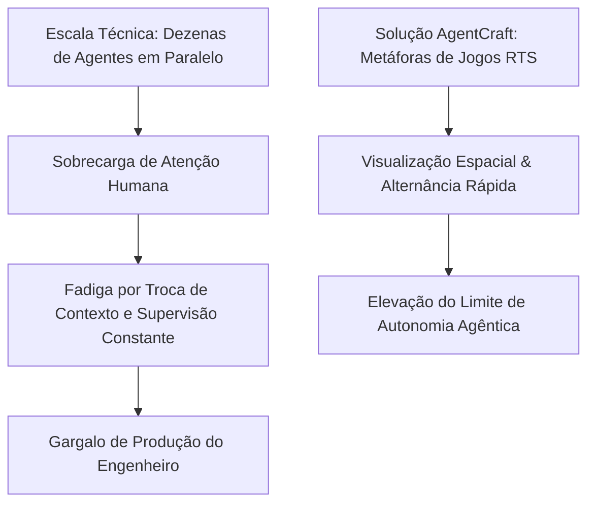
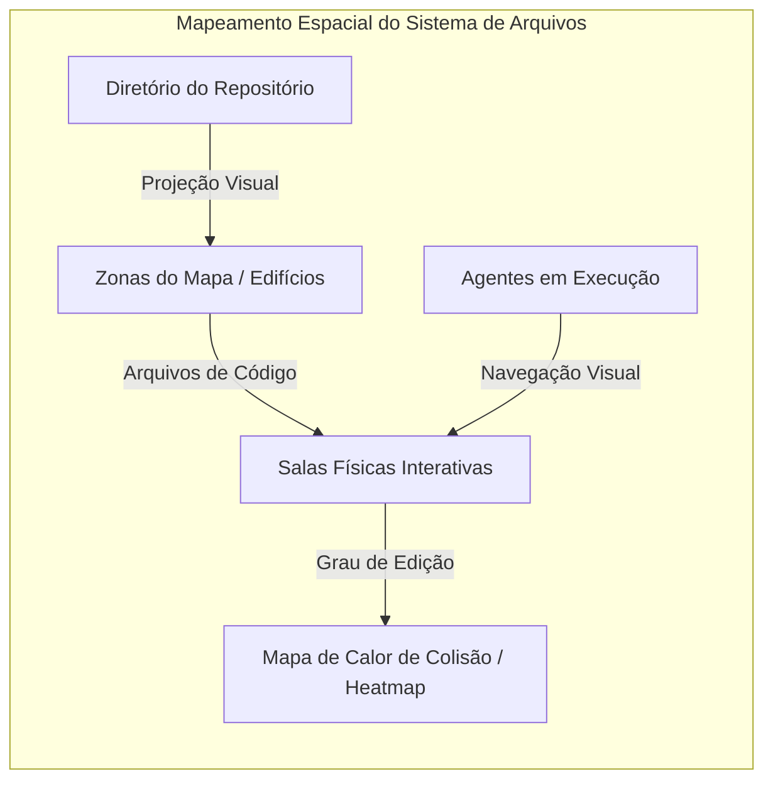

<config_file>
# AgentCraft: Elevando a Orquestração Agêntica Massiva com Metáforas de Jogos de Estratégia

- **Evento**: **AI Engineer Conference 2026** (**AIE 2026**)
- **Data**: 25 de Abril de 2026
- **Palestrante**: **Ido Salomon** (Criador do **AgentCraft** e **MC I**)
- **Arquivo de Origem**: `2026-04-25-kR64LOqBBCU.txt`
- **Título da Palestra**: _AgentCraft: Putting the Orc in Orchestration_
- **Subdomínios Técnicos**: Orquestração Multi-agente, Interfaces Espaciais para Desenvolvedores, Jogos de Estratégia em Tempo Real (*RTS*), Mapas de Calor de Colisão (*Collision Heatmaps*), Colaboração Humano-Agente.

---

## 1. Visão Geral Executiva

Na palestra de encerramento do bloco de arquitetura na **AI Engineer Conference 2026**, **Ido Salomon**, criador do **AgentCraft**, abordou o gargalo crítico provocado pela proliferação de agentes de inteligência artificial operando em paralelo. Salomon sustentou que a limitação atual para executar 10, 20 ou 100 agentes simultâneos não reside na capacidade computacional ou no custo dos modelos, mas no **gargalo cognitivo humano**. Engenheiros de software tradicionais não possuem treinamento para supervisionar dezenas de "trabalhadores autônomos imprudentes" ao mesmo tempo, resultando em sobrecarga e exaustão (*burnout*).

Para resolver essa barreira de gerenciamento, o AgentCraft importa modelos mentais e mecânicas de **jogos de estratégia em tempo real** (**RTS**). A ferramenta projeta o sistema de arquivos do projeto como um mapa espacial interativo onde agentes são representados como unidades físicas navegando por salas de arquivos, utilizando mapas de calor de colisão (*collision heatmaps*), atalhos de memória muscular e orquestradores de campanha autônomos para permitir o gerenciamento massivo de agentes com baixa fricção cognitiva.

---

## 2. O Gargalo Humano na Orquestração Multi-agente

A escalabilidade técnica dos modelos contrasta com a capacidade humana finita de manter contexto e tomar decisões sob pressão.

### O Desafio da Cuidado de Agentes
- **Limitação de Memória de Trabalho**: Tentar acompanhar múltiplos agentes conversando em janelas isoladas de terminal gera fadiga mental rápida.
- **Microgerenciamento vs. Delegação**: A necessidade de aprovar individualmente cada passo de múltiplos agentes reproduz a ineficiência do gerenciamento burocrático de equipes, anulando os ganhos de produtividade da inteligência artificial.

---

## 3. Arquitetura Espacial do AgentCraft e Prevenção de Colisões

O AgentCraft transforma a representação abstrata de um repositório de código em uma projeção geográfica tridimensional.

### Elementos da Interface Espacial
- **Agentes como Unidades Físicas**: Cada agente (seja uma instância do Cursor, Claude Code ou OpenClaw) é representado como um avatar no mapa, operando sobre arquivos de código renderizados como salas.
- **Mapa de Calor de Colisão (*Collision Heatmap*)**: Visualização em tempo real das áreas da base de código que estão sendo alteradas simultaneamente. Se dois agentes ou um humano tentarem modificar o mesmo arquivo, o mapa destaca o risco de conflito de fusão (*merge conflict*), permitindo ajustes proativos.
- **Alternância por Memória Muscular**: Atalhos de teclado herdados de jogos de estratégia permitem alternar instantaneamente para o agente que requer atenção imediata (aprovação de plano ou dúvida técnica).

---

## 4. Campanhas Autônomas e Revisão Multimodal

Para afastar o humano do microgerenciamento de tarefas intermediárias, o AgentCraft introduz o conceito de **campanhas descentralizadas**.

| Componente | Abordagem de Orquestração por Chat | Abordagem por Campanhas no AgentCraft |
| :--- | :--- | :--- |
| **Escopo de Tarefa** | Instrução única em prompt linear. | Ideia macro encapsulada em contêiner de campanha. |
| **Decomposição** | Feita e aprovada passo a passo pelo humano. | Autônoma via agentes orquestradores de campanha. |
| **Supervisão** | Leitura contínua de diffs de código em texto. | Inspeção visual sintética por capturas de tela e vídeos. |
| **Colaboração** | Isolada entre 1 usuário e 1 agente. | Multiusuário e multi-agente em tempo real. |

### Relatórios Sintéticos de Revisão
Em vez de forçar a leitura de milhares de linhas de código modificadas por agentes em segundo plano, o orquestrador de campanha gera evidências visuais automatizadas — incluindo vídeos de navegação, capturas de tela da UI resultante e registros explicativos de motivos das alterações —, permitindo que a revisão humana ocorra em segundos.

---

## 5. Colaboração Híbrida Humano-Humano e Humano-Agente

O AgentCraft estende a visualização espacial para ambientes corporativos compartilhados.

- **Espaços de Trabalho Compartilhados**: Designers, gerentes de produto e engenheiros visualizam os avatares dos agentes uns dos outros no mesmo mapa espacial, acompanhando as ramificações em andamento de forma transparente.
- **Comunicação Informal Inter-Agentes**: Canais de bate-papo em segundo plano onde agentes notificam autonomamente outros agentes e humanos sobre quais módulos e arquivos estão sob sua responsabilidade, prevenindo alterações concorrentes imprevisíveis.

---

## 6. Notas Informativas e Glossário Técnico

- **Ido Salomon**: Engenheiro de software, criador do **AgentCraft** e maintainer de ecossistemas de código aberto para orquestração de inteligência artificial.
- **AgentCraft**: Plataforma de orquestração visual de agentes inspirada em jogos de estratégia em tempo real (RTS), projetada para gerenciar múltiplos agentes de codificação em paralelo.
- **Real-Time Strategy (RTS)**: Gênero de jogos de videogame (como *StarCraft* ou *Warcraft*) focado na gestão rápida e simultânea de recursos e dezenas de unidades operacionais em um mapa dinâmico.
- **Collision Heatmaps (Mapas de Calor de Colisão)**: Recursos visuais no AgentCraft que identificam arquivos do sistema que estão sendo alterados por múltiplos agentes ou humanos simultaneamente para evitar conflitos de código.
- **Campaign Orchestrator**: Subagente responsável por receber um objetivo macro, decompor as tarefas em subagentes menores e gerenciar a execução até a entrega final para revisão humana.

---

## 7. Lacunas e Expansão do Conhecimento

### Desafios Científicos e Práticos da Orquestração Massiva
1. **Limites de Largura de Banda Cognitiva**: Embora as interfaces baseadas em jogos reduzam a fricção, ainda existe um teto biológico para a quantidade de tarefas paralelas que um único cérebro humano consegue acompanhar sem cometer erros de julgamento estratégico.
2. **Consumo de Créditos em Operações de Campanha**: A execução desimpedida de campanhas de subagentes autônomos sem limites claros de tokens pode inflar rapidamente os custos de APIs de LLMs em grandes organizações.
3. **Resolução Automática de Conflitos de Git Complexos**: A edição simultânea do mesmo arquivo por múltiplos agentes exige algoritmos avançados de mesclagem semântica (*semantic merge*) para evitar a corrupção do estado da aplicação.

</config_file>
