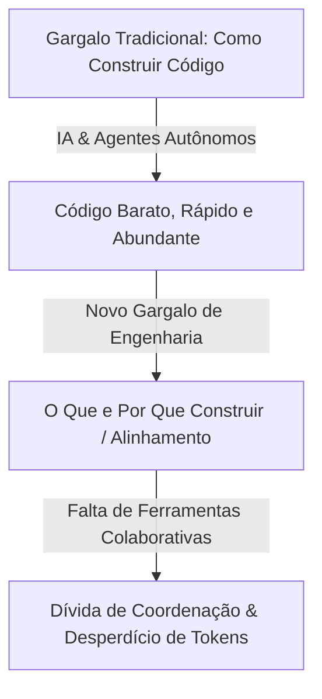
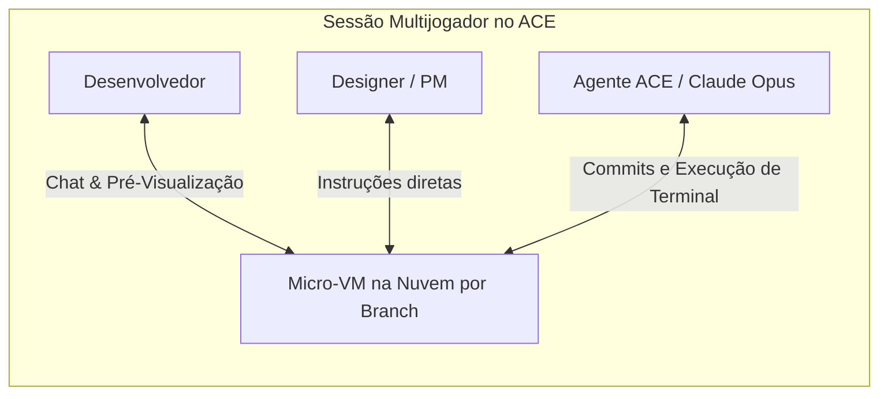

<config_file>
# Engenharia de IA Colaborativa: Da Produtividade Individual ao Alinhamento Agêntico em Equipe

- **Evento**: **AI Engineer Conference 2026** (**AIE 2026**)
- **Data**: 26 de Abril de 2026
- **Palestrante**: **Maggie Appleton** (Engenheira de Pesquisa no **GitHub Next**)
- **Arquivo de Origem**: `2026-04-26-ClWD8OEYgp8.txt`
- **Título da Palestra**: _Collaborative AI Engineering: One Dev, Two Dozen Agents, Zero Alignment_
- **Subdomínios Técnicos**: Engenharia Agêntica Colaborativa, Ambientes Multijogador (*Multiplayer Agent Environments*), Ambientes Virtuais de Nuvem (*Micro VMs*), Alinhamento de Produto, Artesanato de Software (*Craftsmanship*).

---

## 1. Visão Geral Executiva

Na palestra de encerramento da **AI Engineer Conference 2026**, **Maggie Appleton**, pesquisadora sênior da divisão experimental **GitHub Next**, desconstruiu a visão predominante de que a automação agêntica atinge seu ápice na figura de um desenvolvedor solo orquestrando dezenas de agentes isolados por meio de interfaces de linha de comando (*CLIs*). Appleton demonstrou que a velocidade de geração de código desacompanhada de alinhamento entre os membros da equipe resulta no inchaço de recursos desnecessários (*feature bloat*), na sobrecarga de revisões de *pull requests* e no desperdício massivo de computação.

Para resolver essa fragmentação, a equipe do GitHub Next apresentou o **ACE** (*Agent Collaboration Environment*), um protótipo de ambiente agêntico multijogador que integra *chats* colaborativos, **micro máquinas virtuais** (*micro VMs*) isoladas na nuvem por branch e agentes de inteligência artificial proativos. A plataforma desloca a revisão do final do ciclo para a fase de planejamento conjunto, permitindo que desenvolvedores, designers, gerentes de produto e especialistas de suporte definam o direcionamento do código em tempo real.

---

## 2. A Inversão do Gargalo de Desenvolvimento e a Falha das Ferramentas Legadas

A comoditização da escrita de código alterou fundamentalmente o ponto de restrição na criação de software.

### O Custo de Oportunidade como Custo Real
- **A Ilusão da Produtividade Individual**: O desenvolvimento de software é uma atividade coletiva. Aumentar a produção individual de um desenvolvedor isolado não resolve falhas de comunicação, analogamente ao paradoxo de que "nove mulheres não geram um bebê em um mês".
- **A Inadequação das Ferramentas Atuais**: Plataformas como GitHub Issues, Slack, Linear e Jira foram projetadas para ciclos de desenvolvimento manuais e lentos. Tentar canalizar o volume massivo de saídas geradas por agentes em *pull requests* tradicionais sobrecarrega os revisores humanos no final do processo, quando as decisões de arquitetura já foram executadas.

---

## 3. A Arquitetura do Ambiente ACE (Agent Collaboration Environment)

O **ACE** redefiniu a colaboração entre humanos e agentes ao fundir comunicação por texto, servidores de desenvolvimento na nuvem e motores de agentes em uma interface gráfica unificada.

### Principais Inovações do Protótipo
1. **Sessões Isoladas em Micro-VMs**: Cada canal de bate-papo é respaldado por uma máquina virtual dedicada na nuvem rodando sobre uma ramificação (*branch*) específica do Git. Qualquer membro da equipe pode entrar na sessão e interagir com o código sem necessidade de sincronizações locais ou configurações de ambiente.
2. **Ambiente Multijogador Nativo**: Designers e gerentes de produto podem emitir instruções diretamente aos agentes no mesmo canal, visualizando alterações de interface (*UI*) em tempo real através de um navegador integrado.
3. **Agentes Proativos e Contexto Social**: Um painel central analisa todas as conversas da equipe, sintetizando resumos de progresso ao início do dia, sugerindo retomadas de tarefas pendentes e alertando sobre conflitos de funcionalidade entre membros.

---

## 4. Matriz Comparativa entre Paradigmas de Engenharia Agêntica

| Dimensão de Análise | Paradigma Solo (*Single-Player CLI*) | Paradigma Colaborativo (*Multiplayer ACE*) |
| :--- | :--- | :--- |
| **Interface Primária** | Terminal individual por desenvolvedor. | Canais de *chat* com micro-VMs integradas. |
| **Momento de Alinhamento** | Tarde (Na revisão do *Pull Request* final). | Contínuo (Na fase de planejamento e criação). |
| **Público Atendido** | Exclusivamente engenheiros de software. | Equipe completa (Devs, Designers, PMs, Suporte). |
| **Ambiente de Execução** | Local (Dependente da máquina do desenvolvedor). | Nuvem (Instâncias descartáveis compartilhadas). |
| **Foco Estratégico** | Maximizar a quantidade bruta de código gerado. | Maximizar a qualidade e o impacto estético do produto. |

---

## 5. O Artesanato de Software (*Craftsmanship*) na Era da Abundância de Código

Appleton concluiu ressaltando que, em um mercado saturado por software rápido e barato gerado por IA, o **artesanato técnico e o apuro visual** (*craftsmanship*) tornam-se o novo diferencial competitivo das empresas de tecnologia.

- **Reflexão Crítica sobre o Escopo**: O tempo economizado pela automação da escrita de código deve ser reinvestido em pesquisas de experiência do usuário, refinamento de arquitetura e pensamento crítico.
- **Redução Ciente de Escopo**: Fazer menos coisas com maior padrão de qualidade exige alinhamento rigoroso prévio para evitar a prolixidade de funcionalidades e o descarte de trabalho pronto.

---

## 6. Notas Informativas e Glossário Técnico

- **Maggie Appleton**: Designer de interfaces, pesquisadora de antropologia digital e engenheira no **GitHub Next**, conhecida por suas pesquisas em ferramentas de pensamento visual e colaboração em software.
- **GitHub Next**: Divisão de pesquisa e desenvolvimento avançado do GitHub dedicada a criar protótipos de longo prazo para o futuro do desenvolvimento de software.
- **ACE (Agent Collaboration Environment)**: Plataforma experimental desenvolvida pelo GitHub Next que introduz ambientes agênticos multijogador baseados em micro-VMs na nuvem.
- **Micro-VMs**: Ambientes virtuais minimalistas e de inicialização ultrarrápida executados na nuvem para isolar e compartilhar o estado de execução de agentes de IA.
- **Cost of Opportunity (Custo de Oportunidade)**: Valor das alternativas descartadas ao escolher desenvolver uma determinada funcionalidade em detrimento de outras em um cenário de recursos limitados.

---

## 7. Lacunas e Expansão do Conhecimento

### Desafios de Engenharia no Desenvolvimento de Ambientes Agênticos
1. **Gerenciamento Financeiro de Micro-VMs Persistentes**: A manutenção de milhares de ambientes virtuais na nuvem para equipes corporativas exige políticas eficientes de suspensão automática de instâncias inativas para controlar os custos de infraestrutura.
2. **Segurança e Isolamento de Contexto Social**: Permitir que agentes leiam todas as conversas da equipe em busca de contexto exige filtros rígidos de privacidade para evitar que dados confidenciais de reuniões corporativas vazem para modelos externos.
3. **Resolução de Conflitos de CSS e Layout em Tempo Real**: Agentes de IA continuam apresentando limitações em ajustes estéticos finos (como CSS e animações complexas), exigindo que a edição no VS Code e a inspeção manual permaneçam integradas ao fluxo.

</config_file>
