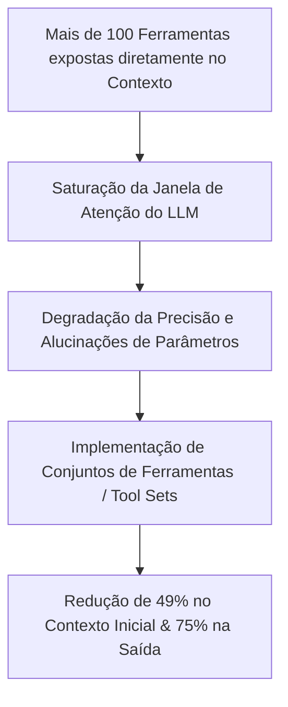
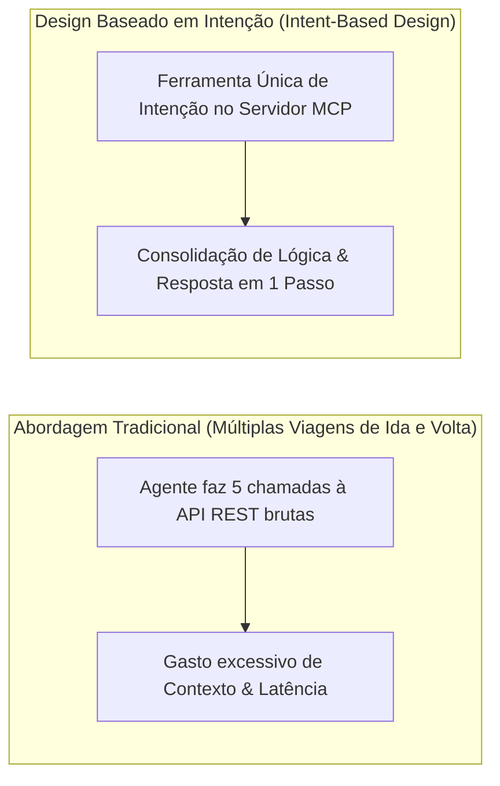
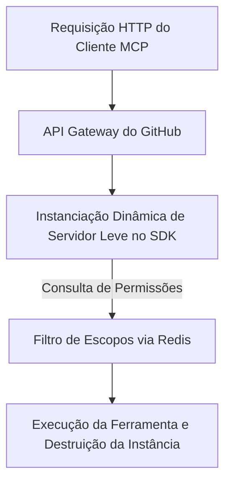

<config_file>
# Escalando o Servidor MCP do GitHub para Milhões de Agentes: Lições Arquiteturais e Segurança em Produção

- **Evento**: **AI Engineer Conference 2026** (**AIE 2026**)
- **Data**: 27 de Abril de 2026
- **Palestrante**: **Sam Morrow** (Líder de Engenharia do Servidor MCP do **GitHub**)
- **Arquivo de Origem**: `2026-04-27-0n3MKk7r60w.txt`
- **Título da Palestra**: _Scaling GitHub for your Agents_
- **Subdomínios Técnicos**: Arquitetura de Servidores Remotos MCP, Descoberta Dinâmica de Ferramentas, Segurança com OAuth 2.1 + PKCE, Injeção de Prompts (*Prompt Injection*), Infraestrutura Sem Estado (*Stateless Architecture*).

---

## 1. Visão Geral Executiva

Em palestra apresentada na **AI Engineer Conference 2026**, **Sam Morrow**, líder da equipe responsável pelo servidor do **Model Context Protocol** (**MCP**) do **GitHub**, detalhou os desafios técnicos, as decisões de arquitetura e os aprendizados práticos acumulados após um ano de operação em escala massiva. O servidor MCP do GitHub tornou-se a implementação mais utilizada do ecossistema mundial, registrando mais de 11 milhões de downloads do servidor `stdio` em Docker, 30.000 estrelas e processando quase **8 milhões de chamadas de ferramentas por semana**.

Morrow explicou como a expansão desordenada de ferramentas — ultrapassando 100 definições individuais de *endpoints* da plataforma — degradou a janela de contexto dos modelos de linguagem, levando a equipe a reformular a superfície da API. O artigo analisa as estratégias empregadas para reduzir em até 75% o consumo de *tokens* de saída, a transição para uma **arquitetura sem estado** (*stateless*) sustentada por **Redis**, a implementação de **OAuth 2.1 com PKCE**, e os mecanismos de mitigação contra ataques de **injeção de prompts** em repositórios corporativos.

---

## 2. A Crise da Inflação de Ferramentas (*Tool Proliferation*)

Após o lançamento público do servidor MCP do GitHub, contribuições da comunidade preencheram rapidamente a cobertura da plataforma, gerando um efeito colateral grave nos agentes de inteligência artificial.

### O Impacto na Eficiência dos Agentes
- **A Pesquisa da LangChain**: Estudos empíricos comprovaram que fornecer um volume excessivo de ferramentas reduz a assertividade dos modelos. Em vez de aumentar a capacidade, o excesso de definições gera confusão e esquecimento de instruções primárias.
- **Conjuntos de Ferramentas (*Tool Sets*)**: O GitHub agrupou suas ferramentas por domínios de produto (Repositórios, Issues, Pull Requests, Actions e Projetos), permitindo que os agentes desativem dinamicamente módulos não utilizados.
- **Modo Somente Leitura (*Read-Only Mode*)**: Adoção de um perfil restrito adotado por 17% dos usuários corporativos que filtra dinamicamente chamadas de escrita, reduzindo riscos e descartando esquemas desnecessários da janela de contexto.

---

## 3. Otimização de Tokens e Design Baseado em Intenção

Para atingir **95% de taxa de sucesso** nas requisições automatizadas, a engenharia do GitHub redesenhou a superfície de suas ferramentas.

### Táticas de Eficiência
1. **Otimização de Payloads de Saída**: O ajuste dos dados retornados na listagem de *Pull Requests* eliminou campos secundários irrelevantes para os LLMs, reduzindo o consumo de *tokens* em mais de 75%.
2. **Ferramentas Orientadas a Intenção** (*Intent-Based Tool Design*): Em vez de expor métodos CRUD atômicos da API, o servidor empacota rotinas complexas no lado do servidor. O agente emite um único comando de intenção e o servidor executa as múltiplas chamadas à API necessárias, economizando viagens de rede e mantendo o histórico de conversa limpo.

---

## 4. Segurança, Autenticação e Prevenção de Injeções de Prompt

A presença de credenciais de acesso persistentes em ambientes de desenvolvimento agêntico introduz riscos severos de exfiltração de dados.

| Desafio de Segurança | Prática Insegura Comum | Solução Implementada no GitHub MCP |
| :--- | :--- | :--- |
| **Armazenamento de Credenciais** | Tokens PAT de longa duração em texto simples. | **OAuth 2.1 com PKCE** sem armazenamento local de segredos. |
| **Escopos Excessivos de Acesso** | Permissões globais concedidas ao agente. | **Autenticação em Etapas** (*Step-Up Auth*) sob demanda. |
| **Injeção de Prompts** (*Prompt Injection*) | Execução cega de comandos encontrados em Issues. | Desativação dinâmica de ferramentas para usuários sem permissão. |
| **Identidade de Clientes MCP** | Cadastro Dinâmico de Clientes não gerenciado. | Metadados rígidos de ID de cliente verificados no servidor. |

### Mitigação da "Trifecta Letal"
Pesquisas publicadas pela Invariant Labs demonstraram que agentes expostos a repositórios públicos podem ler *prompts* maliciosos em *issues* ou *pull requests* não confiáveis, acionando ferramentas do MCP para exfiltrar segredos privados do GitHub. O servidor MCP do GitHub resolve essa vulnerabilidade ao aplicar filtros de permissão de token (*PAT scopes*) na camada do servidor: se o token do usuário não possui permissão de escrita em um repositório, as ferramentas de modificação são omitidas da lista exposta ao modelo.

---

## 5. Arquitetura de Servidor Remoto Sem Estado (*Stateless Architecture*)

Diferente de implementações locais que mantêm um processo persistente em memória para cada usuário, a infraestrutura remota do GitHub opera de forma estritamente sem estado.

### Características da Infraestrutura
- **Instanciação sob Demanda**: Cada requisição de ferramenta instancia um servidor MCP isolado e descartável no SDK TypeScript, montando o catálogo de ferramentas de acordo com as políticas de acesso do token autenticado.
- **Gerenciamento de Identidade via Redis**: Utilização de instâncias **Redis** exclusivamente para rastrear as conexões e mapear a identidade dos clientes (como VS Code, Claude Code ou Cursor), garantindo métricas de uso sem violar a privacidade dos dados.

---

## 6. Recursos Experimentais: Modo Insider e Intervenção Humana

Para equilibrar automação e controle técnico, o GitHub introduziu o **Modo Insider** (*Insider Mode*).

- **Intervenção Humana no Fluxo (*Human-in-the-Loop*)**: O protocolo permite a inclusão de componentes visuais em que o usuário humano inspeciona e edita a descrição de uma *issue* ou *pull request* gerada por IA antes de sua postagem oficial no repositório, evitando a poluição de projetos de código aberto com mensagens sintéticas de baixa qualidade.
- **Ferramentas Composicionais**: Preparação do servidor para suportar encadeamento direto de comandos (*piping*) e integração nativa com o **Modo de Código** (*Code Mode*), onde os agentes sintetizam código TypeScript diretamente contra o servidor MCP.

---

## 7. Notas Informativas e Glossário Técnico

- **Sam Morrow**: Engenheiro de software no GitHub, líder de desenvolvimento e manutenção do servidor remoto e local do Model Context Protocol (**MCP**).
- **PKCE (Proof Key for Code Exchange / Chave de Prova para Troca de Código)**: Extensão do protocolo OAuth 2.0 que previne ataques de interceptação de código de autorização em aplicativos cliente públicos.
- **Step-Up Authentication (Autenticação em Etapas)**: Mecanismo de segurança que solicita permissões ou escopos OAuth adicionais ao usuário interativamente apenas quando uma ferramenta crítica de escrita é acionada.
- **Prompt Injection (Injeção de Prompt)**: Técnica de ataque em que dados não confiáveis lidos por um LLM (como o conteúdo de um comentário em um repositório) alteram as instruções do sistema para executar ações maliciosas.
- **Stateless Server Architecture**: Padrão de design no qual o servidor remoto não retém o estado da conversa entre requisições, permitindo escalabilidade horizontal ilimitada.

---

## 8. Lacunas e Expansão do Conhecimento

### Desafios de Engenharia de Escala Global
1. **Padronização de Registros de Clientes no Ecossistema MCP**: A rejeição do Cadastro Dinâmico de Clientes em grandes provedores expõe a necessidade de um padrão universal leve para verificação de identidade de aplicativos cliente sem inflar bancos de dados relacionais.
2. **Suporte a Ambientes Isolados (GitHub Enterprise Server)**: A implantação do servidor MCP em instâncias locais fechadas (*on-premises*) exige adaptadores específicos para ambientes que não possuem acesso à internet aberta.
3. **Composição Dinâmica via Linha de Comando (CLI)**: O encadeamento de ferramentas do MCP via terminal exige o desenvolvimento de clientes leves capaces de transformar saídas JSON de ferramentas em fluxos de dados (*pipes*) compatíveis com a sintaxe Unix.

</config_file>
