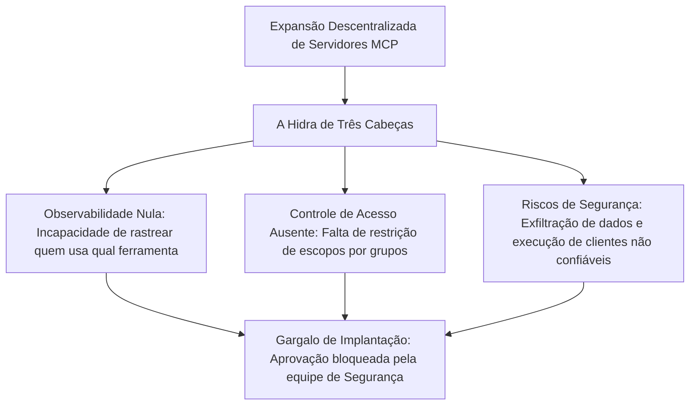
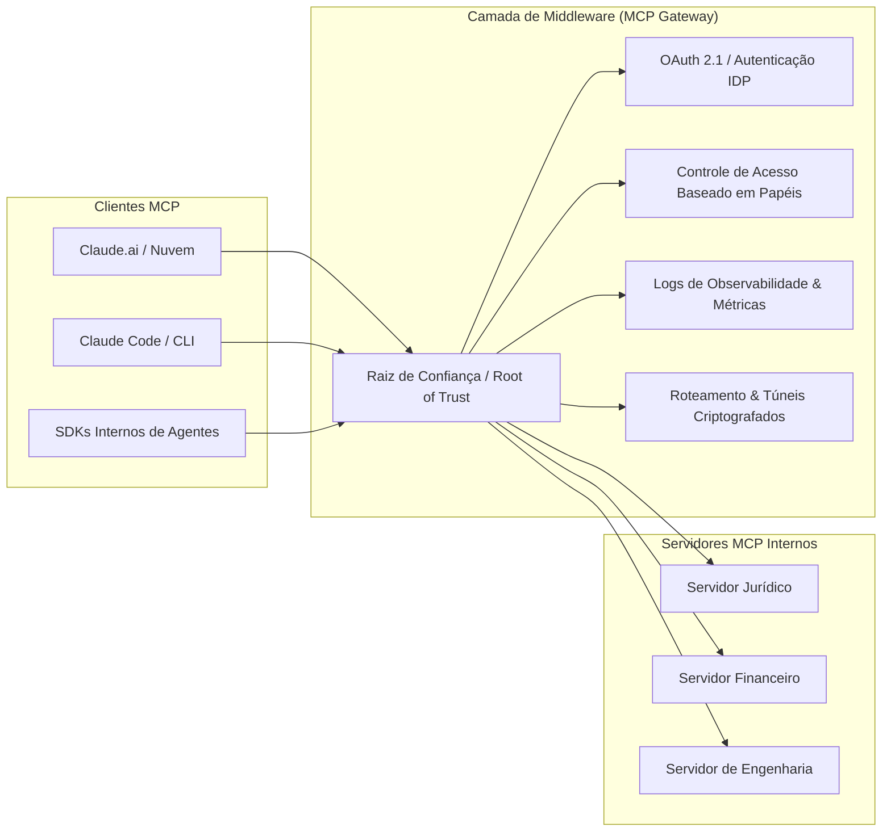
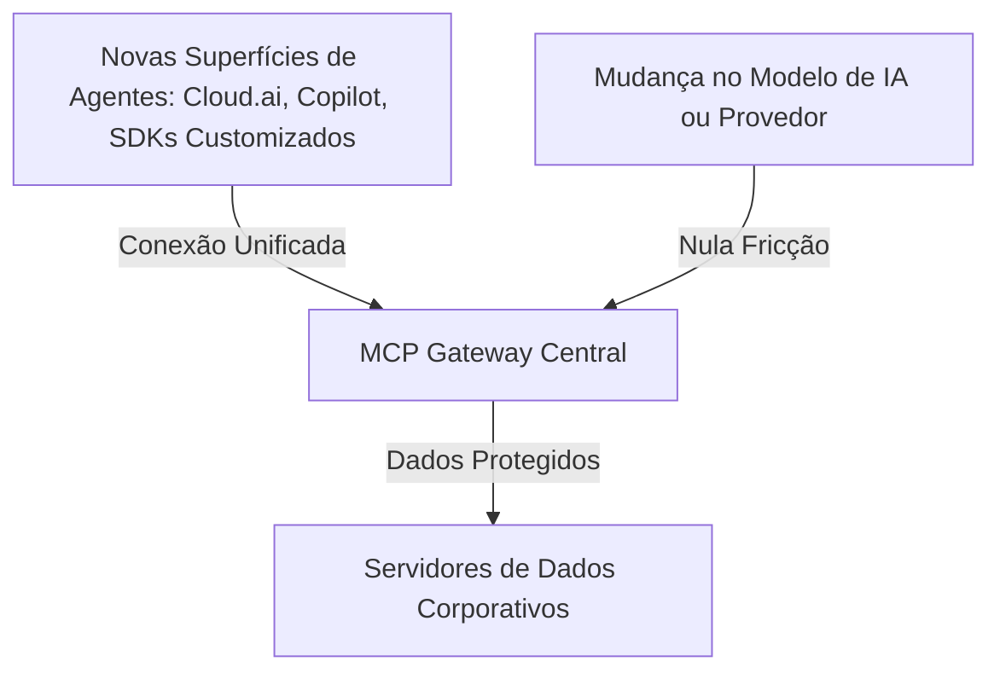

<config_file>
# Gateways São Tudo o que Você Precisa: Viabilizando a Escala de Servidores MCP em Ambientes Corporativos

- **Evento**: **AI Engineer Conference 2026** (**AIE 2026**)
- **Data**: 27 de Abril de 2026
- **Palestrante**: **Karan Sampath** (Engenheiro de Soluções na **Anthropic**)
- **Arquivo de Origem**: `2026-04-27-CD6R4Wf3jnY.txt`
- **Título da Palestra**: _Gateways are All You Need_
- **Subdomínios Técnicos**: Arquitetura Corporativa de IA, Portais de Controle (*MCP Gateways*), Controle de Acesso Baseado em Papéis (*RBAC*), Observabilidade de Ferramentas, Raiz de Confiança (*Root of Trust*).

---

## 1. Visão Geral Executiva

Na palestra técnica da **AI Engineer Conference 2026**, **Karan Sampath**, engenheiro da **Anthropic** especializado na implementação de sistemas agênticos em organizações de grande porte, apresentou a solução para as barreiras de adoção do **Model Context Protocol** (**MCP**) em escala corporativa. Sampath revelou que a maioria das grandes empresas tem dificuldades para operar mais do que um número reduzido de servidores MCP (em geral na casa dos um dígito), bloqueadas por um triplo desafio apelidado de a "hidra de três cabeças": ausência de **observabilidade**, falta de **controle de acesso granular** (*RBAC*) e riscos imprevisíveis de **segurança** e exfiltração de dados.

A Anthropic defende que a solução para desbloquear a adoção massiva de ferramentas agênticas não consiste em restringir a autonomia das equipes de desenvolvimento, mas em introduzir uma arquitetura de **MCP Gateways** (portais de *middleware*). Ao estabelecer uma **raiz de confiança** (*root of trust*) única aprovada pelos times de segurança, os *gateways* centralizam os mecanismos de autenticação (OAuth/IDP), túneis criptografados e auditoria, permitindo que equipes de negócios (como departamentos jurídicos ou financeiros) criem e implantem novos servidores focando estritamente em suas regras operacionais.

---

## 2. A Hidra de Três Cabeças do MCP Corporativo

A expansão de servidores MCP descentralizados em uma organização cria atritos severos entre equipes de inovação e times de governança de TI.

### Por que os Registros Públicos Não Bastam
Embora os registros públicos do MCP contenham milhares de servidores padronizados, eles foram desenhados para cenários de usuário único (*single-player*). Para ambientes corporativos, os registros não resolvem o gerenciamento de credenciais privadas, a atribuição de permissões por perfil profissional nem a integração com provedores de identidade corporativos (*IDPs*).

---

## 3. A Arquitetura do MCP Gateway e a Raiz de Confiança

A introdução de um *gateway* estabelece uma camada intermediária transparente entre qualquer cliente MCP (como o Claude Code, Claude.ai ou SDKs internos) e os servidores operacionais da empresa.

### O Conceito da Raiz de Confiança (*Root of Trust*)
Em vez de exigir que a equipe de segurança avalie e aprove cada novo servidor MCP individualmente, a organização homologa uma **plataforma de gateway única**. A partir do momento em que o *gateway* é validado, qualquer novo servidor MCP implantado em conformidade com as regras do *gateway* herda automaticamente os protocolos de segurança, autenticação e controle da empresa.

---

## 4. Componentes Fundamentais e Benefícios Operacionais

Um *MCP Gateway* completo integra seis primitivas essenciais que desoneram os desenvolvedores da infraestrutura de governança.

| Componente do Gateway | Função na Arquitetura | Benefício Operacional |
| :--- | :--- | :--- |
| **Autenticação Centralizada** | Conexão direta com provedores de identidade corporativos (IDP / SSO). | Elimina o uso de tokens estáticos e chaves em texto simples. |
| **Controle de Acesso (RBAC)** | Atribuição de permissões por grupo de usuários ou tipo de agente. | Restringe a execução de ferramentas críticas a perfis autorizados. |
| **Roteamento Proxy Dinâmico** | Abstração dos endereços reais dos servidores MCP internos. | O cliente enxerga apenas o *gateway*, isolando a rede interna. |
| **Túneis Criptografados** | Comunicação segura fim a fim entre clientes e o *gateway*. | Garante a integridade dos dados e evita ataques de exfiltração. |
| **Painel de Observabilidade** | Métricas de uso, taxa de falha de ferramentas e auditoria. | Identifica ferramentas defeituosas e padrões de uso da empresa. |
| **CLI do Desenvolvedor** | Ferramenta de linha de comando para deploy rápido de servidores. | Permite que qualquer equipe crie e registre servidores em minutos. |

### Desacoplamento da Lógica de Negócios
Com o *gateway* gerenciando a infraestrutura pesada, equipes não-técnicas ou especializadas (como o departamento jurídico) podem utilizar agentes de codificação para construir servidores MCP focados estritamente na regra de negócio (por exemplo, análise e roteamento de contratos), sem a necessidade de reaprender conceitos complexos de segurança e autenticação corporativa.

---

## 5. Invariância de Superfícies e o Futuro Desacoplado dos Agentes

A adoção de *gateways* altera profundamente a relação entre as ferramentas de dados e as arquiteturas de raciocínio de IA.

### Invariância de Superfícies (*Multi-Surface Invariance*)
Como todos os agentes da organização conectam-se ao mesmo *gateway*, a inclusão de uma nova ferramenta no *gateway* torna essa funcionalidade acessível instantaneamente a todas as superfícies autorizadas (interfaces de chat em nuvem, ambientes de desenvolvimento em linha de comando ou SDKs internos). Da mesma forma, a substituição ou atualização dos modelos de linguagem subjacentes não exige a reconfiguração dos servidores MCP de dados da empresa.

---

## 6. Notas Informativas e Glossário Técnico

- **Karan Sampath**: Engenheiro de soluções na **Anthropic**, especializado na arquitetura e implementação de servidores do Model Context Protocol (**MCP**) para grandes clientes corporativos.
- **MCP Gateway**: Camada de infraestrutura intermediária (*middleware*) que gerencia a autenticação, segurança, auditoria e roteamento de tráfego entre clientes e servidores MCP.
- **Root of Trust (Raiz de Confiança)**: Componente de hardware ou software fundamental que é inerentemente confiável no sistema, servindo de base para a validação de segurança de todo o ecossistema.
- **Role-Based Access Control (RBAC)**: Método de restrição de acesso a sistemas e ferramentas com base nas funções desempenhadas por indivíduos ou agentes autônomos em uma organização.
- **Identity Provider (IDP)**: Serviço de gerenciamento de identidades responsável por autenticar a identidade de usuários corporativos e emitir credenciais de acesso seguras (ex: Okta, Entra ID).

---

## 7. Lacunas e Expansão do Conhecimento

### Desafios de Engenharia na Implementação de Gateways
1. **Impacto de Latência nas Chamadas de Ferramentas**: A inserção de uma camada de proxy intermediária adiciona saltos de rede e tempos de processamento para validação de tokens OAuth, exigindo otimizações em linguagem de alto desempenho (como Go ou Rust) para manter a resposta sub-segundo.
2. **Padronização de Contextos de Identidade de Agentes**: Atribuir identidades únicas a agentes autônomos operando em nome de humanos (*delegated identity*) exige novos padrões de autorização temporária que ainda não estão totalmente maduros no OAuth 2.1.
3. **Resiliência a Falhas em Múltiplas Regiões**: A centralização de todo o tráfego de agentes em um único *gateway* exige arquiteturas de alta disponibilidade com réplicas distribuídas geograficamente para evitar que a indisponibilidade do *gateway* parálise os serviços da empresa.

</config_file>
