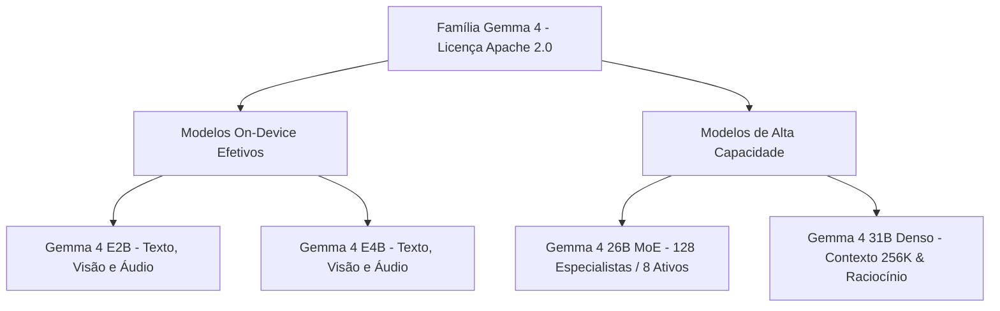
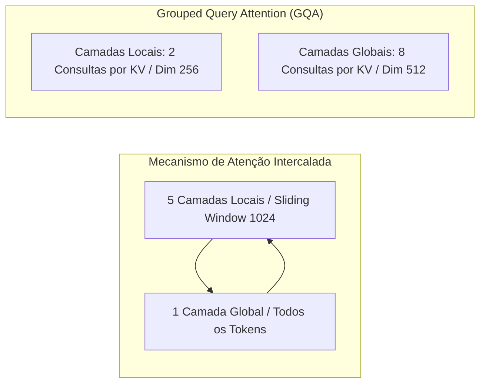
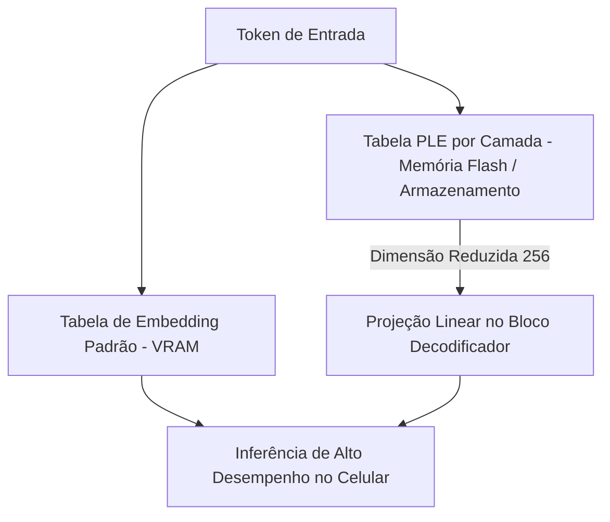

<config_file>
# Arquitetura e Inovações Técnicas do Gemma 4: Modelos Multimodais On-Device e Misturas de Especialistas

- **Evento**: **AI Engineer Conference 2026** (**AIE 2026**)
- **Data**: 27 de Abril de 2026
- **Palestrante**: **Cassidy Hardin** (Pesquisadora no **Google DeepMind**)
- **Arquivo de Origem**: `2026-04-27-_A367W_qvc8.txt`
- **Título da Palestra**: _Gemma 4 Deep Dive_
- **Subdomínios Técnicos**: Arquiteturas de LLM de Código Aberto, Mistura de Especialistas (*Mixture-of-Experts - MoE*), Incorporações por Camada (*Per Layer Embeddings - PLE*), Atenção por Consulta Agrupada (*GQA*), Visão e Áudio Multimodal.

---

## 1. Visão Geral Executiva

Na palestra técnica da **AI Engineer Conference 2026**, **Cassidy Hardin**, pesquisadora do **Google DeepMind**, apresentou uma análise aprofundada dos avanços arquiteturais e de engenharia introduzidos no **Gemma 4**, a nova geração de modelos de inteligência artificial de código aberto da instituição. A grande virada estratégica da família Gemma 4 consiste na transição oficial para a licença **Apache 2.0**, permitindo a adoção comercial irrestrita e a integração direta por desenvolvedores em aplicações móveis e corporativas.

A família Gemma 4 foi dividida em quatro tamanhos estratégicos: dois modelos densos focados no processamento em dispositivos locais (*on-device* **E2B** e **E4B**), um modelo **26B com Mistura de Especialistas** (**MoE**) operando com apenas 3,8 bilhões de parâmetros ativos, e o carro-chefe **31B Denso**, configurado com janela de contexto de 256K e suporte nativo a raciocínio avançado, chamadas de função e saídas JSON estruturadas.

---

## 2. Visão Geral da Família Gemma 4 e Licenciamento

A nova geração estabelece novos marcos de desempenho tanto em inferência em celulares e laptops quanto em tarefas de raciocínio de alta escala em servidores.

### Destaques dos Modelos de Grande Escala
- **Gemma 4 31B Denso**: Posicionado entre os seis melhores modelos de código aberto globais no ranking LM, apresentando desempenho superior a modelos 20 vezes maiores. Desenvolvido para fluxos agênticos complexos com suporte nativo a *function calling* e raciocínio multi-etapa.
- **Gemma 4 26B MoE**: O primeiro modelo da família Gemma a utilizar arquitetura de Mistura de Especialistas (*Mixture-of-Experts*). O sistema utiliza 128 especialistas no total com um especialista compartilhado constante de dimensão triplicada. Durante a inferência, a rede roteia o cálculo para apenas 8 especialistas ativos, consumindo apenas 3,8 bilhões de parâmetros por passagem direta (*forward pass*).

---

## 3. Inovações na Arquitetura de Atenção

Para otimizar o consumo de memória e a velocidade de inferência sem comprometer a captura de contexto distante, a equipe implementou avanços significativos no mecanismo de atenção.

### Padrão de Atenção Intercalada e GQA
1. **Intercalação Local/Global**: Nos modelos maiores, a arquitetura intercala 5 camadas locais (utilizando uma janela deslizante de atenção de 1.024 *tokens*) para cada 1 camada global que atenta a todo o histórico de *tokens*. Nos modelos móveis, a proporção é de 4:1 com janela deslizante de 512 *tokens*.
2. **Atenção por Consulta Agrupada (*Grouped Query Attention*)**: Nas camadas locais, agrupam-se 2 consultas para cada par de Chave-Valor (KV). Nas camadas globais, o agrupamento se expande para 8 consultas por par KV, dobrando a dimensão da cabeça de chave e valor para 512 de modo a preservar a capacidade de representação.

---

## 4. Inferência On-Device com Incorporações por Camada (*Per Layer Embeddings - PLE*)

O grande avanço de engenharia nos modelos **E2B** e **E4B** foi a eliminação do gargalo de memória RAM gráfica (**VRAM**) nos dispositivos móveis através da tecnologia **PLE**.

### Mecanismo de Funcionamento da PLE
- **Parâmetros Efetivos vs. Profundidade Representacional**: O modelo E2B possui 2,3 bilhões de parâmetros ativos, mas atinge uma profundidade representacional equivalente a 5,1 bilhões de parâmetros graças às tabelas por camada.
- **Uso da Memória Flash**: Enquanto as tabelas de *embedding* tradicionais exigem armazenamento contínuo na VRAM (o componente de maior restrição em celulares e laptops), as tabelas de *Per Layer Embeddings* (com dimensão enxuta de 256) são armazenadas diretamente na **memória flash** do dispositivo e consultadas camada por camada via projeção linear, permitindo a execução de modelos densos sem sobrecarregar a memória do sistema.

---

## 5. Avanços Multimodais em Visão e Áudio

A família Gemma 4 foi construída com suporte multimodal nativo para texto, imagem e áudio desde o pré-treinamento inicial.

### Processamento de Visão com Resoluções e Proporções Variáveis
- **Codificadores de Visão Dedicados**: Os modelos 31B e 26B integram um codificador de visão de 550 milhões de parâmetros, enquanto os modelos móveis utilizam uma versão otimizada de 150 milhões de parâmetros.
- **Eliminação do Pan-and-Scan**: Substituindo a abordagem fragmentada do Gemma 3, o Gemma 4 aceita imagens com proporções de tela (*aspect ratios*) e resoluções variáveis diretamente. As imagens são divididas em retalhos (*patches*) de 16x16 pixels e codificadas com informações de posição espacial bi-dimensional, permitindo que os desenvolvedores escolham orçamentos flexíveis de *tokens* (de 280 a 1.120 *tokens* por imagem) para otimizar tarefas de **OCR** ou economizar contexto.

### Processamento de Áudio com Arquitetura Conformer
- **Codificador de Áudio Dedicado**: Os modelos E2B e E4B possuem suporte integrado para entrada de áudio através de um codificador **Conformer** de 305 milhões de parâmetros.
- **Espectrograma Mel e Subamostragem**: O áudio bruto é convertido em espectrogramas Mel, divididos em blocos e subamostrados por duas camadas convolucionais em *tokens* virtuais, permitindo tarefas imediatas de tradução e reconhecimento de fala diretamente no dispositivo.

---

## 6. Matriz Comparativa dos Modelos Gemma 4

| Modelo | Parâmetros Efetivos / Ativos | Modalidades Suportadas | Janela de Contexto / Foco Principal |
| :--- | :--- | :--- | :--- |
| **Gemma 4 E2B** | 2,3B ativos (5,1B representacionais) | Texto, Imagem, Áudio $\rightarrow$ Texto | *On-Device* móvel, consumo ultrabaixo em VRAM com PLE. |
| **Gemma 4 E4B** | 4,1B ativos (8,2B representacionais) | Texto, Imagem, Áudio $\rightarrow$ Texto | *On-Device* avançado em laptops, suporte local a voz. |
| **Gemma 4 26B MoE** | 3,8B ativos (26B totais em 128 especialistas) | Texto, Imagem $\rightarrow$ Texto | Inferência esparsa de alta velocidade e baixo custo por requisição. |
| **Gemma 4 31B Denso**| 31B ativos densos | Texto, Imagem $\rightarrow$ Texto | Raciocínio avançado de ponta, 256K contexto, agência e JSON. |

---

## 7. Notas Informativas e Glossário Técnico

- **Cassidy Hardin**: Pesquisadora em inteligência artificial no Google DeepMind, especializada no desenvolvimento de arquiteturas abertas e eficientes para a família de modelos Gemma.
- **Per Layer Embeddings (PLE)**: Técnica arquitetural que associa tabelas de incorporação compactas a cada camada do modelo, armazenando-as na memória flash para reduzir o consumo de VRAM em dispositivos móveis.
- **Grouped Query Attention (GQA)**: Variante do mecanismo de atenção em que múltiplas cabeças de consulta compartilham um único par de cabeças de Chave e Valor, reduzindo a pegada de memória do cache KV durante a inferência.
- **Conformer**: Arquitetura de rede neural que combina camadas de convolução e transformadores, altamente otimizada para o processamento e reconhecimento de sinais de áudio e fala.
- **Apache 2.0 License**: Licença de software livre altamente permissiva mantida pela Apache Software Foundation, que concede direitos amplos de uso, modificação e redistribuição comercial sem royalties.

---

## 8. Lacunas e Expansão do Conhecimento

### Desafios de Engenharia na Fronteira de Modelos Abertos
1. **Velocidade de Leitura do Barramento Flash**: A viabilidade da arquitetura PLE em smartphones intermediários depende da taxa de transferência (*throughput*) do barramento de memória entre o armazenamento flash e a NPU/GPU do dispositivo.
2. **Quantização de Especialistas Esparsos em MoE**: Aplicar técnicas de quantização agressiva (como INT4 ou FP8) no modelo 26B MoE exige algoritmos de compensação nos roteadores de especialistas para evitar degradação de precisão nas camadas de decisão.
3. **Gerenciamento Dinâmico do Cache KV em Atenção Intercalada**: A alternância entre janelas deslizantes de 1.024 *tokens* e camadas globais exige implementações personalizadas em motores de inferência (como vLLM ou Ollama) para evitar a fragmentação do cache de memória.

</config_file>
