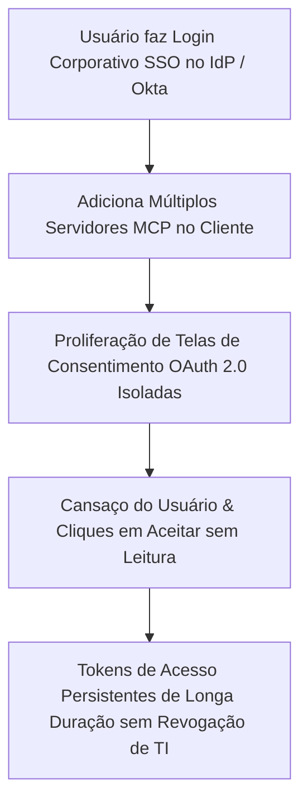
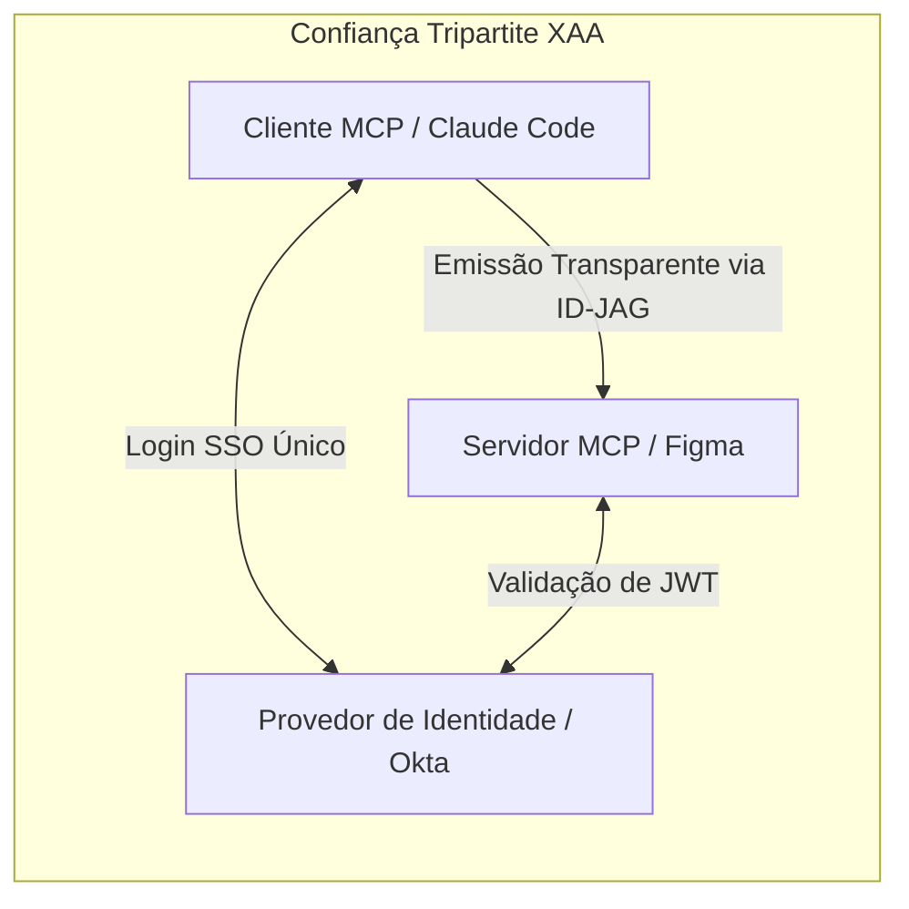
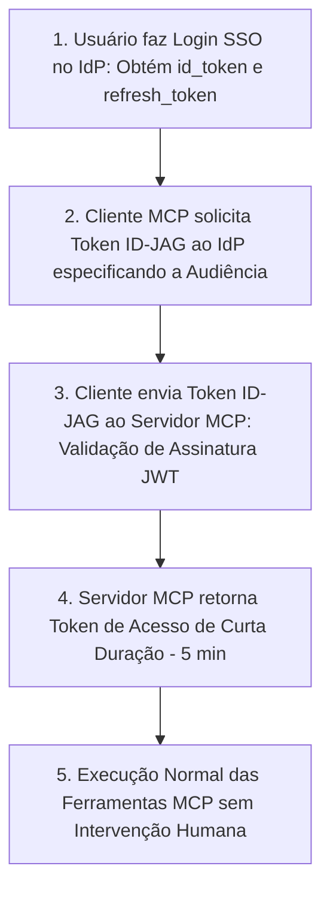

<config_file>
# Um Login para a Todos Governar: Acesso Entre Aplicativos (XAA) para o Model Context Protocol

- **Evento**: **AI Engineer Conference 2026** (**AIE 2026**)
- **Data**: 28 de Abril de 2026
- **Palestrante**: **Garrett Galow** (Líder de Gestão de Produto na **WorkOS**)
- **Arquivo de Origem**: `2026-04-28-EmhRyw6xeT0.txt`
- **Título da Palestra**: _One Login to Rule Them All: Cross-App Access for MCP_
- **Subdomínios Técnicos**: Autenticação de Agentes, Acesso Entre Aplicativos (*Cross-App Access - XAA*), Concessão de Autorização por Asserção de Identidade (*ID-JAG*), Autenticação Única Corporativa (*SSO*), Provedores de Identidade (*IdP*).

---

## 1. Visão Geral Executiva

Na palestra apresentada na **AI Engineer Conference 2026**, **Garrett Galow**, líder de produto da **WorkOS** — provedora de infraestrutura de identidade corporativa para plataformas como Anthropic, Cursor e OpenAI —, apresentou a solução para a grave crise de experiência do usuário e segurança provocada pelos mecanismos de autenticação no **Model Context Protocol** (**MCP**). Atualmente, a conexão de um agente de codificação a múltiplos serviços externos (como Figma, Notion ou GitHub) exige que o usuário aprove dezenas de telas de consentimento **OAuth 2.0** repetitivas, quebrando o paradigma corporativo de **Autenticação Única** (*Single Sign-On - SSO*).

Para solucionar a fadiga de telas de consentimento e eliminar vulnerabilidades de segurança decorrentes de *tokens* de acesso de longa duração não revogáveis pelo departamento de TI, Galow apresentou a arquitetura **Cross-App Access** (**XAA**). A tecnologia utiliza o padrão de concessão por asserção de identidade (**ID-JAG**), estabelecendo uma relação de confiança tripartite entre o cliente MCP, o servidor de recursos e o provedor de identidade da organização (como Okta ou Microsoft Entra ID) para emitir *tokens* de acesso de curta duração de forma totalmente transparente e automática.

---

## 2. A Quebra do Modelo SSO e as Vulnerabilidades de Segurança Corporativa

A adoção acelerada do MCP nas empresas colidiu com os padrões tradicionais de governança e segurança de TI.

### Principais Falhas do Modelo OAuth Tradicional no MCP
1. **Quebra da Experiência SSO**: O protocolo OAuth 2.0 tradicional pressupõe que o cliente (Cursor) e o serviço (Figma) não possuem relações prévias de confiança, exigindo autorização manual do usuário a cada nova ferramenta conectada.
2. **Invisibilidade para a Equipe de TI**: O departamento de segurança da empresa não consegue visualizar quais clientes agênticos estão sendo conectados a quais servidores MCP, impedindo o bloqueio de clientes não homologados.
3. **Persistência Indevida de Credenciais**: Na ocorrência de comprometimentos de máquinas locais ou desligamento de funcionários, os *tokens* de atualização (*refresh tokens*) do OAuth frequentemente continuam ativos por dias ou semanas, visto que o cancelamento do login SSO no provedor de identidade não invalida automaticamente os *tokens* emitidos pelos servidores MCP de terceiros.

---

## 3. A Arquitetura Cross-App Access (XAA) e a Confiança Tripartite

O **Cross-App Access** (**XAA**) reestrutura o fluxo de autenticação estabelecendo o **Provedor de Identidade** (**IdP**) da empresa como a autoridade central de confiança entre todas as aplicações.

### O Conceito da Confiança Tripartite
Como a organização já possui uma relação de confiança pré-configurada no IdP tanto para o cliente (Claude Code ou Cursor) quanto para os serviços de destino (Figma ou Notion), o IdP pode emitir asserções de identidade autorizadas que comprovam que o usuário autenticado no cliente possui permissão para acessar o servidor de recursos.

---

## 4. O Fluxo de Execução do Token ID-JAG em 4 Passos

A tecnologia apoia-se na especificação **ID-JAG** (*Identity Assertion Authorization Grant*), um padrão IETF que transforma a sessão SSO ativa em *tokens* de acesso de curta duração emitidos nos bastidores.

### Detalhamento das Etapas Técnicas
- **Etapa 1 (Login Único)**: O usuário autentica-se uma única vez por dia no provedor de identidade da empresa (ex: Okta), estabelecendo uma sessão SSO válida no cliente MCP.
- **Etapa 2 (Solicitação de ID-JAG)**: Ao conectar-se a um novo servidor MCP, o cliente solicita ao IdP um *token* ID-JAG informando o parâmetro de audiência (`mcp.figma.com`). O IdP valida se as políticas de TI autorizam a conexão entre aquele cliente e aquele servidor.
- **Etapa 3 (Troca de Asserção)**: O cliente envia a asserção JWT assinada ao servidor de autorização do MCP, que valida a autenticidade do *token* junto ao IdP.
- **Etapa 4 (Emissão de Curta Duração)**: O servidor MCP retorna um *token* de acesso com validade de 5 minutos. À medida que o *token* expira, o cliente renova a concessão automaticamente nos bastidores enquanto a sessão SSO no IdP permanecer ativa.

---

## 5. Comparativo dos Fluxos de Autenticação no MCP

| Dimensão de Análise | OAuth 2.0 Tradicional no MCP | Cross-App Access (XAA) com ID-JAG |
| :--- | :--- | :--- |
| **Intervenção Humana** | Exige aprovação em dezenas de telas de consentimento. | Transparente: 0 cliques após o login SSO inicial. |
| **Validade dos Tokens** | *Tokens* de atualização duradouros (dias ou meses). | *Tokens* de acesso de curta duração (ex: 5 minutos). |
| **Revogação por TI** | Dificultada: exige revogação manual em cada serviço. | Instantânea: o bloqueio no IdP encerra todos os acessos. |
| **Governança de Clientes** | Clientes arbitrários podem acessar dados da empresa. | Apenas clientes autorizados nas políticas do IdP conectam-se. |
| **Experiência do Desenvolvedor**| Requer gerenciamento local de arquivos de segredos. | Automação completa de renovação via SDKs de identidade. |

---

## 6. Notas Informativas e Glossário Técnico

- **Garrett Galow**: Engenheiro e diretor de gestão de produto na **WorkOS**, especialista em infraestrutura de identidade corporativa e autorização para plataformas SaaS e agentes de IA.
- **WorkOS**: Plataforma de infraestrutura de software que fornece serviços de Enterprise SSO, Directory Sync (SCIM) e gestão de identidade para aplicativos modernos.
- **Cross-App Access (XAA)**: Padrão de arquitetura de autorização que permite a troca segura de credenciais entre diferentes aplicações confiando em um Provedor de Identidade comum.
- **ID-JAG (Identity Assertion Authorization Grant)**: Especificação IETF que define como asserções de identidade codificadas em JWT podem ser trocadas por *tokens* de acesso OAuth sem exigir intervenção do usuário final.
- **Identity Provider (IdP)**: Sistema central de gestão de identidades (como Okta, Microsoft Entra ID ou Ping Identity) responsável por autenticar usuários e emitir asserções de segurança.

---

## 7. Lacunas e Expansão do Conhecimento

### Desafios de Padronização no Ecossistema
1. **Adopção nos Provedores de Identidade (Okta vs. Microsoft Entra)**: Enquanto o suporte ao XAA via OIDC já está disponível na Okta, a expansão para o ecossistema Microsoft Entra ID ainda depende da padronização final das especificações de escopo e audiência.
2. **Granularidade de Permissões (RBAC vs. XAA)**: O protocolo XAA resolve a camada de autenticação transparente, mas a restrição de escopos granulares (como conceder acesso apenas para leitura de arquivos específicos no Figma) exige extensões futuras no payload do *token* ID-JAG.
3. **Migração do Padrão DCR para CIMD**: O ecossistema MCP está em transição do Cadastro Dinâmico de Clientes (*DCR*) para o modelo de Metadados de Identidade de Cliente (*CIMD*), reduzindo a criação indesejada de aplicativos no IdP durante os fluxos de autorização.

</config_file>
