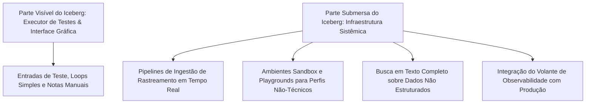
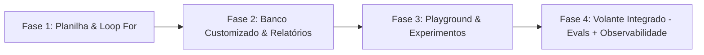
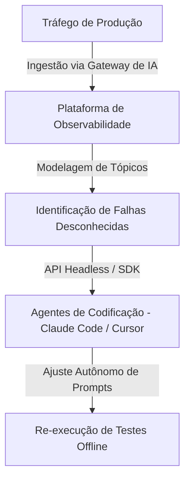

<config_file>
# Por que Construir Plataformas de Avaliação de IA é Difícil: Da Planilha à Infraestrutura de Rastreamento em Escala

- **Evento**: **AI Engineer Conference 2026** (**AIE 2026**)
- **Data**: 28 de Abril de 2026
- **Palestrante**: **Phil Hetzel** (Líder de Engenharia de Soluções na **Braintrust**)
- **Arquivo de Origem**: `2026-04-28-_fQ7Z_Wfouk.txt`
- **Título da Palestra**: _Why building eval platforms is hard_
- **Subdomínios Técnicos**: Avaliação de Agentes de IA (*Evals*), Observabilidade e Rastreamento (*Tracing*), Arquitetura de Dados para LLMs, Ciclos de Feedback (*Flywheel*), Avaliações Sem Interface (*Headless Evals*).

---

## 1. Visão Geral Executiva

Na palestra técnica proferida na **AI Engineer Conference 2026**, **Phil Hetzel**, líder de engenharia de soluções na **Braintrust**, desfez a ilusão de que uma plataforma de avaliação de inteligência artificial (*evals*) é apenas um executor de testes (*test runner*) simples acoplado a um banco de dados. Hetzel demonstrou que a construção de um sistema de avaliação confiável exige a criação de infraestruturas de dados complexas capazes de suportar múltiplos perfis profissionais (engenheiros, designers de produto e especialistas de domínio), além de lidar com a variabilidade inerente dos modelos de linguagem de grande porte.

O especialista detalhou os quatro estágios de maturidade pelos quais as equipes de engenharia passam — desde o uso inicial de loops `for` em planilhas eletrônicas até a implementação do **volante de feedback** (*flywheel*), onde dados de rastreamento de produção (*tracing*) alimentam automaticamente suítes de testes *offline*. Hetzel enfatizou que os desafios centrais das plataformas modernas não são de interface gráfica, mas de engenharia de sistemas de dados preparados para ingerir e consultar *spans* não estruturados de alta frequência contendo até dezenas de megabytes de texto.

---

## 2. O Iceberg da Complexidade nas Avaliações de IA

A maioria dos desenvolvedores inicia sua jornada de testes acreditando que avaliar um agente consiste apenas em executar um prompt com entradas variadas e pontuar os resultados manualmente.

### O Desafio Multi-Persona e Sistêmico
Construir avaliações não é uma atividade isolada de engenharia de software. O processo exige a colaboração contínua de especialistas de domínio (PMEs) que possuem o conhecimento de negócios necessário para definir o que constitui uma resposta "boa". Uma plataforma eficaz precisa oferecer interfaces acessíveis para esses profissionais sem introduzir fricções de código.

---

## 3. As Quatro Fases da Maturidade em Avaliações

A evolução das práticas de testes em uma organização segue uma jornada previsível de amadurecimento técnico.

### Detalhamento das Etapas de Evolução

#### 1. A Planilha e o Loop `for`
Ponto de partida comum e acessível. O desenvolvedor armazena entradas em um arquivo CSV ou Google Sheets e executa um script iterativo. Embora seja útil para reconhecer a existência do problema, a abordagem falha rapidamente devido à incapacidade de comparar experimentos historicamente e à impossibilidade de escalonar avaliações manuais.

#### 2. O Banco de Dados Customizado com Interface de Relatórios
A equipe desenvolve um banco de dados próprio (ex: Postgres no Neon) e uma interface visual simples. O avanço melhora a persistência e a acessibilidade, mas a ferramenta permanece restrita a relatórios passivos sem incentivar a iteração ágil sobre variantes de prompts.

#### 3. O Playground de Experimentação
A plataforma evolui para oferecer um ambiente de testes (*sandbox* ou *playground*) no qual usuários técnicos e não-técnicos alteram instruções do sistema e parâmetros do modelo lado a lado, comparando as pontuações resultantes para identificar falhas funcionais.

#### 4. O Volante Integrado (*The Flywheel*)
Estágio de maturidade máxima. A plataforma unifica a observabilidade em tempo real com as avaliações *offline*. Os rastreamentos de usuários reais em produção são coletados, anonimizados e reinjetados como novos dados de teste no ambiente *offline*, criando um ciclo de melhoria contínua.

---

## 4. A Complexidade de Dados no Rastreamento de Agentes (*Tracing*)

A engenharia subjacente a uma plataforma de avaliação madura enfrenta desafios únicos de armazenamento e consulta.

| Dimensão de Análise | Rastreamento de Aplicações Tradicionais | Rastreamento de Agentes de IA (*LLM Tracing*) |
| :--- | :--- | :--- |
| **Estrutura dos Dados** | Altamente estruturada (JSONs enxutos e códigos HTTP). | Semiestruturada ou não estruturada (Grandes blocos de texto). |
| **Tamanho do Payload** | Poucos kilobytes por *span* de execução. | De 10 a 20 megabytes por *span* contendo contexto e mídias. |
| **Padrões de Leitura** | Consultas métricas simples e agregados de latência. | Busca em texto completo sobre milhões de conversas brutas. |
| **Velocidade de Ingestão** | Latência padrão de logs. | Ingestão com latência ultrabaixa para exibição imediata na UI. |

### O Desafio da Engenharia de Bancos de Dados
Tentar armazenar e consultar rastreamentos de LLMs em bancos de dados relacionais convencionais (como Postgres sem otimizações) gera graves gargalos de desempenho quando a produção atinge milhões de requisições diárias. A Braintrust resolve esse problema utilizando arquiteturas de dados híbridas que combinam ingestão rápida para exibição imediata e armazenamento colunar otimizado para consultas analíticas agregadas.

---

## 5. O Futuro das Plataformas de Avaliação: Avaliações Sem Interface (*Headless Evals*)

O avanço dos agentes de codificação autônomos está alterando a forma como a infraestrutura de testes é consumida.

### Tendências de Longo Prazo
- **Avaliações para Agentes (*Headless Evals*)**: Em vez de humanos inspecionarem painéis visuais para ajustar prompts, os dados de avaliação são expostos via APIs e SDKs diretamente para agentes de codificação autônomos. Os agentes leem as métricas de falha, alteram as instruções do sistema no código e re-executam as suítes de teste de forma independente.
- **Descoberta de Falhas Desconhecidas (*Unknown Unknowns*)**: Utilização de algoritmos de modelagem de tópicos sobre os dados de produção para agrupar e revelar novos modos de falha que os desenvolvedores não haviam previsto na criação das funções de pontuação originais.
- **Rastreamento Automático via Gateways**: Incorporação de rastreamento transparente em nível de *gateway* ou proxy de rede, garantindo que todas as chamadas a LLMs na empresa sejam auditadas por padrão.

---

## 6. Notas Informativas e Glossário Técnico

- **Phil Hetzel**: Engenheiro de software e líder de engenharia de soluções na **Braintrust**, com vasta experiência prévia em consultoria de dados na KPMG e Slalom Consulting.
- **Braintrust**: Plataforma de enterprise AI voltada para avaliação (*evals*), observabilidade (*tracing*) e gerenciamento de prompts para modelos de linguagem e agentes.
- **Tracing Spans**: Unidades individuais de trabalho dentro de uma árvore de execução de um agente, registrando chamadas a modelos, execuções de ferramentas ou passos de raciocínio intermediários.
- **Headless Evals**: Paradigma de avaliação em que as suítes de teste são consumidas e executadas via linhas de comando ou SDKs por agentes autônomos de desenvolvimento, omitindo a necessidade de interfaces visuais.
- **Topic Modeling (Modelagem de Tópicos)**: Técnica de aprendizado de máquina não supervisionado utilizada para agrupar documentos de texto e identificar temas recorrentes em grandes volumes de conversas de usuários.

---

## 7. Lacunas e Expansão do Conhecimento

### Desafios de Governança e Operação em Escala
1. **Gerenciamento de Payloads Multimodais**: O armazenamento de *spans* contendo arquivos pesados de áudio e vídeo exige a integração transparente com serviços de armazenamento de objetos (como Amazon S3 ou Cloudflare R2) para evitar o inchaço dos bancos analíticos.
2. **Privacidade e Mascaramento de Dados (PII)**: A ingestão direta de conversas de usuários de produção em plataformas de avaliação requer mecanismos em tempo real para anonimizar informações pessoalmente identificáveis antes da gravação dos *logs*.
3. **Estabilidade de Avaliadores baseados em LLMs (*LLM-as-a-Judge*)**: O uso de modelos de linguagem como juízes para pontuar saídas de outros agentes exige calibração contínua para evitar viés de posicionamento e variabilidade não determinística nas notas atribuídas.

</config_file>
